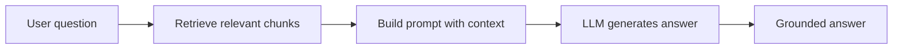

import TOCInline from '@theme/TOCInline';

# Core AI Concepts

<TOCInline toc={toc} minHeadingLevel={2} maxHeadingLevel={2} />

:::tip[In this guide]
A plain-English glossary of the ideas that show up in every later section:
LLMs, tokens, embeddings, context windows, RAG, and what "local-first" means.
:::

## What Is It?

Before wiring anything together, you need a shared vocabulary. This page is a
quick, practical glossary — not deep theory. You'll revisit each idea in depth
later.

## Why Does It Matter?

Almost every design decision in an AI system ("chunk size", "top-k",
"context window", "hallucination") traces back to one of these concepts.

## Core Concepts

### Large Language Model (LLM)

A model trained to predict the next token given previous tokens. Given a
prompt, it generates text one token at a time. Examples you'll run locally:
Llama 3, Mistral, Phi.

### Token

The unit an LLM reads and writes. Roughly ¾ of a word in English. "Tokenization"
splits text into tokens. Costs, limits, and speed are all measured in tokens.

### Context Window

The maximum number of tokens a model can consider at once (prompt + output).
If your documents don't fit, you must **retrieve** only the relevant parts —
this is the core motivation for RAG.

### Embedding

A list of numbers (a vector) that captures the *meaning* of text. Similar
meanings produce nearby vectors. Embeddings power semantic search.

### Vector Database

A store optimized for finding the nearest vectors to a query vector (e.g.
Chroma). It's how you retrieve "the most relevant chunks".

### Retrieval-Augmented Generation (RAG)

Instead of relying only on what the model memorized, you **retrieve** relevant
text from your own data and put it in the prompt. The model then answers using
that context. RAG reduces hallucination and lets you use private/fresh data.

### Hallucination

When a model states something confidently that isn't true. Grounding answers
in retrieved context (RAG) and asking for citations reduces it.

### Prompt

The input text you send to the model. "Prompt engineering" is structuring that
input (instructions + context + question) for reliable output.

## Why "Local-First"?

Running models locally with **Ollama** means:

- **Privacy** — your data never leaves your machine.
- **Cost** — no per-token API bills while learning.
- **Control** — reproducible, offline-capable experiments.

You learn the same patterns used with hosted APIs, but without a credit card.

## Common Mistakes

- Confusing embeddings (meaning vectors) with the LLM (text generator). They're different models.
- Assuming bigger context windows remove the need for retrieval. Retrieval improves relevance and cost even with large windows.
- Treating RAG as a cure-all. Bad chunks in → bad answers out.

## Interview Questions

- What is an embedding, and how is it different from an LLM?
- Why does RAG reduce hallucinations?
- What is a context window and why does it matter?
- RAG vs fine-tuning — when would you choose each?

## Things to Remember

- Tokens are the currency; context windows are the budget.
- Embeddings = meaning; vector DB = fast nearest-neighbor search.
- RAG = retrieve, then generate, grounded in your data.

## Mini Exercise

In one sentence each, define: token, embedding, context window, RAG. Then
sketch the RAG flow from memory.

## Done When

- [ ] You can explain RAG to a non-engineer in two sentences.
- [ ] You can name the two different models a RAG system uses (embedding + LLM).
- [ ] You understand why local-first is useful for learning.
