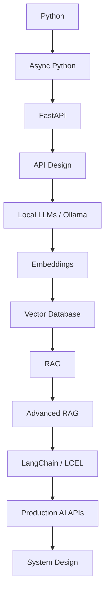

import TOCInline from '@theme/TOCInline';

# 00 · Prerequisites

<ProgressToggle sectionId="00-prerequisites" />

<TOCInline toc={toc} minHeadingLevel={2} maxHeadingLevel={2} />

:::tip[In this guide]
Everything you need before the roadmap proper: the tools you'll install, the
core AI vocabulary you'll keep hearing, and a working Python + FastAPI
environment with a live `/health` endpoint.
:::

## Goal

Get your machine and your mental model ready so that every later section
("Python", "FastAPI", "RAG"...) can assume a working, reproducible environment.

## Estimated Time

2–4 days (mostly setup + reading, not heavy practice).

## Prerequisites

- A computer running macOS, Linux, or Windows (WSL2 recommended on Windows).
- Comfort with a terminal: `cd`, `ls`, running commands.
- Willingness to read errors carefully — it's 80% of the job.

## What You Will Learn

- [Python tooling](./01-python-tooling.mdx) — the editor, Git, and CLI tools you'll use daily.
- [Core AI concepts](./02-core-ai-concepts.mdx) — tokens, embeddings, LLMs, RAG, and why "local-first".
- [Python + FastAPI setup](./03-python-fastapi-setup.mdx) — a reproducible environment with a running API.

## The Learning Path

This roadmap is one connected path, not a pile of notes:

## Every Topic Follows One Pattern

To keep this from feeling like scattered notes, most pages follow the same
rhythm:

1. What is it?
2. Why does it matter?
3. Core concepts
4. Syntax / API
5. Practical example
6. Common mistakes
7. Interview questions
8. Things to remember
9. Mini exercise
10. Done-when checklist

## Done When

You can confirm **all** of the following in a terminal:

- [ ] Python environment configured (`python3 --version` → 3.11+).
- [ ] Virtual environment working (you can activate/deactivate `.venv`).
- [ ] FastAPI installed (`pip show fastapi` prints a version).
- [ ] `uvicorn` working (`uvicorn --version` runs).
- [ ] `/health` endpoint working (returns `{"status": "ok"}`).
- [ ] Swagger UI available at [http://localhost:8000/docs](http://localhost:8000/docs).

Once every box is checked, move on to [01 · Python](../01-python/index.mdx).
