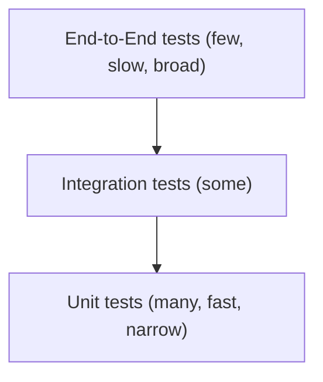

import TOCInline from '@theme/TOCInline';

# Phase 6 — Testing Python Code

<TOCInline toc={toc} minHeadingLevel={2} maxHeadingLevel={2} />

:::tip[In this guide]
A complete tour of testing in Python — every kind of test you'll write and the
tools for each, with runnable examples. We build on the pytest intro from
[Professional Python](./04-professional-python.mdx#testing-with-pytest) and go
wide: unit, integration, end-to-end, property-based, snapshot, benchmark, load,
mutation, and fuzz testing, plus mocking, coverage, TDD/BDD, and CI.
:::

## What Is It?

Testing is writing code that automatically verifies your code behaves as
intended. In Python this ranges from a three-line function check to a full suite
that exercises databases, HTTP APIs, and edge cases you'd never think to try by
hand.

## Why Does It Matter?

Tests are how you change code without fear. They catch regressions before users
do, document expected behavior, make refactoring safe, and are a hard
requirement in professional codebases. Knowing *which kind* of test to write —
and which tool fits — is a core engineering skill.

---

## The Testing Pyramid

Tests come in layers. The pyramid is a guideline for how many of each to write.



| Level | Scope | Speed | Count |
| --- | --- | --- | --- |
| Unit | One function/class in isolation | Fast (ms) | Many |
| Integration | Several components together | Medium | Some |
| End-to-end (E2E) | The whole system, like a user | Slow | Few |

:::info[Theory: why a pyramid, not an ice-cream cone]
Unit tests are cheap, fast, and pinpoint failures precisely, so you want lots of
them. E2E tests catch wiring bugs unit tests miss, but they're slow and brittle,
so you want few. An inverted pyramid (mostly E2E) gives a suite that's slow,
flaky, and vague about *what* broke. Push logic down into unit-testable pieces.
:::

Beyond these three levels, several **test categories** describe *purpose* rather
than scope — smoke, regression, sanity — covered below.

---

## The Frameworks: unittest, pytest, doctest

Python has three testing tools in play. You'll use **pytest** for almost
everything, but you should recognize all three.

### unittest (standard library)

`unittest` is built in, class-based, and modeled on Java's JUnit. No install
needed.

```python
# test_math_unittest.py
import unittest
from myapp.calc import add

class TestAdd(unittest.TestCase):
    def test_positive(self):
        self.assertEqual(add(2, 3), 5)

    def test_negative(self):
        self.assertEqual(add(-1, -1), -2)

    def test_raises(self):
        with self.assertRaises(TypeError):
            add("a", 1)

if __name__ == "__main__":
    unittest.main()
```

```bash
python -m unittest test_math_unittest.py
```

### pytest (the de facto standard)

`pytest` uses plain functions and plain `assert`, with richer failure output. It
can also run `unittest` tests.

```python
# test_math_pytest.py
from myapp.calc import add

def test_positive():
    assert add(2, 3) == 5          # plain assert — pytest rewrites it for detail

def test_negative():
    assert add(-1, -1) == -2
```

```bash
pip install pytest
pytest                 # discovers test_*.py / *_test.py, runs test_* functions
```

### doctest (tests inside docstrings)

`doctest` verifies that the interactive examples in your docstrings actually
produce the shown output — keeping docs and behavior in sync.

```python
def double(n: int) -> int:
    """Return twice n.

    >>> double(4)
    8
    >>> double(-3)
    -6
    """
    return n * 2
```

```bash
python -m doctest -v mymodule.py
# or run doctests via pytest:  pytest --doctest-modules
```

:::note[Highlight: use pytest, know unittest, sprinkle doctest]
Standardize on **pytest** — less boilerplate, better output, huge plugin
ecosystem. Know **unittest** because you'll meet it in older codebases (and
`unittest.mock` is still the mocking tool). Use **doctest** for small, example-
driven documentation, not as your main suite.
:::

---

## Unit Testing

A **unit test** checks one small piece of logic in isolation — a pure function, a
method, a calculation — with no database, network, or filesystem. It's fast and
tells you exactly what broke.

```python
# myapp/pricing.py
def apply_discount(price: float, percent: float) -> float:
    if not 0 <= percent <= 100:
        raise ValueError("percent must be between 0 and 100")
    return round(price * (1 - percent / 100), 2)
```

```python
# tests/test_pricing.py
import pytest
from myapp.pricing import apply_discount

def test_applies_discount():
    assert apply_discount(100.0, 10) == 90.0

def test_zero_discount_is_noop():
    assert apply_discount(50.0, 0) == 50.0

def test_rejects_out_of_range():
    with pytest.raises(ValueError):
        apply_discount(100.0, 150)
```

:::note[Highlight: Arrange, Act, Assert]
Structure each test in three beats: **Arrange** the inputs, **Act** by calling
the code under test, **Assert** on the result. One logical assertion per test
keeps failures unambiguous — when it goes red, you know precisely what broke.
:::

---

## Integration Testing

An **integration test** checks that several components work together — a function
plus a real (test) database, or a service plus its repository. It catches wiring
bugs that unit tests miss: wrong queries, bad serialization, misconfigured glue.

```python
# tests/test_repository_integration.py
import sqlite3
import pytest
from myapp.repository import UserRepository

@pytest.fixture
def repo():
    conn = sqlite3.connect(":memory:")            # real DB, in memory
    conn.execute("CREATE TABLE users (id INTEGER PRIMARY KEY, name TEXT)")
    yield UserRepository(conn)
    conn.close()

def test_create_and_fetch(repo):
    user_id = repo.create(name="Ada")             # exercises real SQL
    fetched = repo.get(user_id)
    assert fetched["name"] == "Ada"
```

:::info[Theory: unit vs integration boundary]
A unit test replaces collaborators (the DB, the HTTP client) with fakes so only
your logic is under test. An integration test lets real collaborators
participate. Both matter: units prove your logic is correct; integrations prove
your logic *talks to the outside world* correctly. A passing unit suite with a
broken query is exactly what integration tests catch.
:::

---

## Functional and End-to-End Testing

A **functional test** verifies a complete feature against its requirements from
the outside — inputs in, expected outputs out — without caring about internals.
An **end-to-end (E2E)** test drives the whole system as a user would.

For a web API, functional/E2E tests hit real endpoints (see FastAPI's
`TestClient` in the FastAPI section):

```python
# tests/test_api_e2e.py
from fastapi.testclient import TestClient
from myapp.main import app

client = TestClient(app)

def test_signup_then_login_flow():
    # a full user journey across multiple endpoints
    signup = client.post("/users", json={"email": "a@x.io", "password": "secret12"})
    assert signup.status_code == 201

    login = client.post("/token", data={"username": "a@x.io", "password": "secret12"})
    assert login.status_code == 200
    assert "access_token" in login.json()
```

For browser apps, E2E tools like **Playwright** or **Selenium** automate a real
browser. These are the slowest, broadest tests — keep them few and focused on
critical paths.

:::caution[E2E tests are powerful but expensive]
End-to-end tests give the most confidence per test but are slow, need real
infrastructure, and break for unrelated reasons (a UI tweak, a network blip).
Cover the handful of critical user journeys with E2E and push everything else
down to integration and unit tests.
:::

---

## Test Categories: Smoke, Regression, Sanity

These describe a test's *purpose*, not its scope — the same pytest test can play
these roles.

- **Smoke test** — a quick "does it even start / basic path work?" check you run
  first. If smoke fails, don't bother running the rest.
- **Regression test** — added when you fix a bug, encoding the bug so it can
  never silently return.
- **Sanity test** — a narrow check that a specific fix or area behaves after a
  change.

```python
import pytest

@pytest.mark.smoke
def test_app_imports_and_health():
    from myapp.main import app          # smoke: the app even loads
    assert app is not None

def test_regression_issue_142_empty_cart_total():
    # bug #142: empty cart raised instead of returning 0.0
    from myapp.cart import Cart
    assert Cart().total() == 0.0        # locks the fix in place forever
```

```bash
pytest -m smoke          # run only smoke tests (see Markers below)
```

:::note[Highlight: every bug fix gets a regression test]
The discipline that keeps software stable: when you fix a bug, first write a
failing test that reproduces it, then fix the code until it passes. The test
stays in the suite forever, guaranteeing that exact bug never comes back.
:::

---

## pytest Essentials

The mechanics you'll use in nearly every test.

```python
def test_assertions():
    assert 2 + 2 == 4                    # plain assert; pytest shows both sides on failure
    assert "ab" in "abc"
    assert [1, 2] == [1, 2]

# floating-point comparisons: never use ==
import pytest

def test_floats():
    assert 0.1 + 0.2 == pytest.approx(0.3)   # tolerant float comparison
```

Run and filter:

```bash
pytest -v                          # verbose: one line per test
pytest tests/test_pricing.py       # a single file
pytest tests/test_pricing.py::test_applies_discount   # a single test
pytest -k "discount and not range" # by name expression
pytest -x                          # stop at first failure
pytest --lf                        # re-run only last-failed
```

:::warning[Compare floats with `pytest.approx`, not `==`]
`0.1 + 0.2 == 0.3` is `False` due to floating-point representation. Use
`pytest.approx(...)` (or `math.isclose`) for any float comparison, or your tests
will fail mysteriously on correct code.
:::

---

## Fixtures

**Fixtures** are reusable setup that pytest injects into a test by parameter
name. Define shared ones in `conftest.py` and every test in that directory can
request them without importing.

```python
# tests/conftest.py
import pytest

@pytest.fixture
def sample_user():
    return {"id": 1, "name": "Ada", "email": "ada@x.io"}
```

```python
def test_uses_fixture(sample_user):       # requested by name
    assert sample_user["name"] == "Ada"
```

### Setup/teardown with yield

A `yield` fixture runs setup before the `yield` and teardown after — guaranteed
even if the test fails.

```python
import pytest

@pytest.fixture
def temp_file(tmp_path):                   # tmp_path is a built-in fixture
    path = tmp_path / "data.txt"
    path.write_text("hello")               # setup
    yield path
    # teardown happens automatically when tmp_path is cleaned up
```

### Fixture scopes

```python
@pytest.fixture(scope="function")   # default: fresh per test
def per_test(): ...

@pytest.fixture(scope="module")     # once per test file
def shared_module(): ...

@pytest.fixture(scope="session")    # once per entire test run
def db_engine(): ...
```

:::note[Highlight: `conftest.py` and built-in fixtures]
Fixtures in `conftest.py` are auto-discovered across the directory tree — no
imports. pytest also ships useful built-ins: `tmp_path` (a temp directory),
`monkeypatch` (patch attrs/env), `capsys` (capture stdout/stderr), and `caplog`
(capture log records). Reach for these before writing your own.
:::

---

## Parametrization

`@pytest.mark.parametrize` runs the same test body over many input/output pairs,
so you cover edge cases without copy-paste.

```python
import pytest
from myapp.pricing import apply_discount

@pytest.mark.parametrize("price, percent, expected", [
    (100.0, 0, 100.0),
    (100.0, 10, 90.0),
    (100.0, 100, 0.0),
    (50.0, 50, 25.0),
])
def test_apply_discount(price, percent, expected):
    assert apply_discount(price, percent) == expected

# parametrize the failure cases too
@pytest.mark.parametrize("bad_percent", [-1, 101, 999])
def test_rejects_bad_percent(bad_percent):
    with pytest.raises(ValueError):
        apply_discount(100.0, bad_percent)
```

Each row is reported as a separate test, so you see exactly which case failed.

:::info[Theory: table-driven testing]
Parametrization turns one test into a *table* of cases. It encourages you to
enumerate boundaries — zero, max, negative, empty — in one place, and each case
fails independently with its inputs shown. It's the highest-leverage pytest
feature for thorough coverage with minimal code.
:::

---

## Testing Exceptions

Use `pytest.raises` to assert that code raises, and inspect the exception.

```python
import pytest

def test_raises_with_message():
    with pytest.raises(ValueError, match="between 0 and 100"):  # match is a regex
        apply_discount(100.0, 200)

def test_capture_exception_object():
    with pytest.raises(ValueError) as exc_info:
        apply_discount(100.0, 200)
    assert "100" in str(exc_info.value)
```

---

## Mocking and Test Doubles

When code touches something slow, external, or nondeterministic (a network call,
the clock, a payment API), replace it with a **test double**. Python's
`unittest.mock` and pytest's `monkeypatch` are the tools.

### The kinds of test doubles

| Double | What it is |
| --- | --- |
| **Dummy** | Passed but never used (fills a parameter) |
| **Stub** | Returns canned answers to calls |
| **Fake** | A working but lightweight implementation (in-memory DB) |
| **Spy** | Records how it was called, for later assertions |
| **Mock** | A spy with pre-programmed expectations you assert on |

### Mock and MagicMock

```python
from unittest.mock import Mock

# a Mock records calls and returns configurable values
service = Mock()
service.fetch.return_value = {"ok": True}

result = service.fetch(42)
assert result == {"ok": True}
service.fetch.assert_called_once_with(42)     # spy: verify the interaction
```

### patch: replace something in place

`patch` temporarily swaps an object during a test. Patch it **where it's used**,
not where it's defined.

```python
from unittest.mock import patch
from myapp.orders import place_order        # place_order calls payments.charge()

def test_place_order_charges_card():
    with patch("myapp.orders.payments.charge") as mock_charge:
        mock_charge.return_value = "txn_123"
        result = place_order(amount=50)
        mock_charge.assert_called_once_with(50)
        assert result["txn"] == "txn_123"

# as a decorator instead of a context manager
@patch("myapp.orders.payments.charge", return_value="txn_123")
def test_with_decorator(mock_charge):
    place_order(amount=50)
    mock_charge.assert_called_once()
```

### monkeypatch: pytest's built-in patcher

```python
def test_reads_env(monkeypatch):
    monkeypatch.setenv("FEATURE_FLAG", "on")     # auto-undone after the test
    assert load_flag() is True

def test_fixes_time(monkeypatch):
    monkeypatch.setattr("myapp.clock.now", lambda: 1_700_000_000)
    assert is_expired() is False
```

:::warning[Patch where it's looked up, not where it's defined]
If `myapp.orders` does `from myapp import payments` and calls `payments.charge`,
patch `"myapp.orders.payments.charge"` — the name as *the code under test sees
it*. Patching `"myapp.payments.charge"` often misses because `orders` already
holds its own reference. This is the number-one mocking gotcha.
:::

:::caution[Mock the boundary, not your own logic]
Replace the external edge — the network, the DB driver, the clock — not the code
you're trying to verify. Over-mocking produces tests that pass while the real
system is broken, because you've stubbed out the very behavior under test.
:::

---

## Testing Async Code

`async def` tests need the `pytest-asyncio` plugin, or they're collected but
never awaited (a silent false pass).

```bash
pip install pytest-asyncio
```

```python
# pyproject.toml:  [tool.pytest.ini_options]  asyncio_mode = "auto"
import pytest

async def fetch_user(uid: int) -> dict:
    # imagine an awaited DB/HTTP call here
    return {"id": uid, "name": "Ada"}

@pytest.mark.asyncio
async def test_fetch_user():
    user = await fetch_user(1)
    assert user["name"] == "Ada"
```

Mock async collaborators with `AsyncMock`:

```python
from unittest.mock import AsyncMock

@pytest.mark.asyncio
async def test_service_awaits_client():
    client = AsyncMock()
    client.get.return_value = {"status": "ok"}
    result = await client.get("/health")     # awaitable mock
    assert result == {"status": "ok"}
    client.get.assert_awaited_once_with("/health")
```

:::warning[Async tests silently pass without the plugin]
Without `pytest-asyncio` (and either `@pytest.mark.asyncio` or
`asyncio_mode = "auto"`), pytest collects an `async def` test but never runs its
body — it reports green while testing nothing. Always confirm the plugin is
active. Async fundamentals are in
[Professional Python](./04-professional-python.mdx#async-python).
:::

---

## Test Coverage

Coverage measures which lines your tests actually execute. `pytest-cov` reports
it and flags untested code.

```bash
pip install pytest-cov
pytest --cov=myapp --cov-report=term-missing
```

```text
Name                 Stmts   Miss  Cover   Missing
--------------------------------------------------
myapp/pricing.py        12      0   100%
myapp/orders.py         40      6    85%   22-27
--------------------------------------------------
TOTAL                   52      6    88%
```

:::caution[Coverage is a floor, not a goal]
100% coverage means every line *ran*, not that behavior is *correct* — you can
execute a line without asserting anything meaningful. Use coverage to find
obviously untested paths, but judge quality by whether tests assert the right
things. Chasing 100% invites hollow tests written just to touch lines.
:::

---

## Property-Based Testing (Hypothesis)

Instead of hand-picking examples, **property-based testing** generates hundreds
of random inputs and checks that a *property* holds for all of them. `hypothesis`
also shrinks any failure to the smallest reproducing input.

```bash
pip install hypothesis
```

```python
from hypothesis import given, strategies as st

def encode(s: str) -> bytes:
    return s.encode("utf-8")

def decode(b: bytes) -> str:
    return b.decode("utf-8")

@given(st.text())                         # feeds many random strings
def test_encode_decode_roundtrip(s):
    # property: decoding an encoding returns the original, for ANY string
    assert decode(encode(s)) == s

@given(st.lists(st.integers()))
def test_sort_is_idempotent(xs):
    assert sorted(sorted(xs)) == sorted(xs)
```

:::info[Theory: examples vs properties]
Example-based tests check the cases *you thought of*; property-based tests attack
the cases you *didn't* — empty strings, huge numbers, unicode, weird orderings.
You assert an invariant ("reverse of reverse is identity", "output is always
sorted") and let Hypothesis hunt for counterexamples, then hand you the minimal
one. It routinely finds edge cases hand-written tests never would.
:::

---

## Snapshot Testing

**Snapshot** (or "golden") testing records a function's output once, then fails
if it ever changes. Great for large structured outputs — rendered templates,
serialized JSON — where writing assertions by hand is tedious.

```bash
pip install syrupy      # a pytest snapshot plugin
```

```python
def render_invoice(order):
    return {"id": order["id"], "total": order["total"], "lines": order["lines"]}

def test_invoice_snapshot(snapshot):
    result = render_invoice({"id": 1, "total": 42.0, "lines": ["item a"]})
    assert result == snapshot        # first run records; later runs compare
```

```bash
pytest --snapshot-update            # intentionally update snapshots after a change
```

:::caution[Review snapshot diffs like code]
Snapshots make it *easy* to bless output — including bugs. When a snapshot test
fails, read the diff carefully before running `--snapshot-update`; only accept it
if the change is intended. A rubber-stamped update defeats the point.
:::

---

## Performance and Benchmark Testing

To measure speed, use `timeit` for quick checks and `pytest-benchmark` for
tracked benchmarks.

```python
import timeit

# quick one-off timing
elapsed = timeit.timeit("sum(range(1000))", number=10000)
print(elapsed)
```

```bash
pip install pytest-benchmark
```

```python
def fib(n):
    return n if n < 2 else fib(n - 1) + fib(n - 2)

def test_fib_performance(benchmark):
    result = benchmark(fib, 20)      # runs fib(20) many times, reports stats
    assert result == 6765
```

:::note[Highlight: benchmark to catch regressions, not to micro-optimize]
Benchmarks are most valuable as a *guardrail* — assert that a hot path stays
within a time budget so a future change doesn't silently make it 10x slower.
Don't obsess over micro-benchmarks; profile first, optimize what actually
matters.
:::

---

## Load Testing

Where benchmarks time a function, **load testing** measures how a *service*
behaves under many concurrent users. `locust` is the common Python tool.

```bash
pip install locust
```

```python
# locustfile.py
from locust import HttpUser, task, between

class ApiUser(HttpUser):
    wait_time = between(1, 3)

    @task
    def get_health(self):
        self.client.get("/health")

    @task(3)                          # 3x more likely than health
    def ask_question(self):
        self.client.post("/ask", json={"question": "What is RAG?"})
```

```bash
locust -f locustfile.py --host http://localhost:8000
```

Watch p50/p95/p99 latency and error rate as concurrency rises; the point where
latency spikes is your capacity ceiling. This is a service-level concern — see
the FastAPI performance material for scaling.

---

## Mutation Testing

**Mutation testing** tests your *tests*. A tool like `mutmut` makes small changes
to your code (a mutant — flip a `>` to `>=`, a `+` to `-`) and checks whether
your suite catches it. Surviving mutants reveal weak or missing assertions.

```bash
pip install mutmut
mutmut run                 # generates mutants, runs the suite against each
mutmut results             # shows which mutants survived (undetected)
```

:::info[Theory: coverage says "ran", mutation says "checked"]
High coverage proves your tests *executed* a line; mutation testing proves they
would *notice if that line were wrong*. A mutant that survives means a real bug
in that spot would slip through your suite. It's the strongest signal of test
quality, at the cost of being slow to run.
:::

---

## Fuzz Testing

**Fuzzing** throws malformed, random, or adversarial input at code to find
crashes and security holes — especially valuable for parsers and anything that
handles untrusted bytes. `atheris` (from Google) is Python's coverage-guided
fuzzer.

```python
# fuzz_parser.py  (run with: python fuzz_parser.py)
import atheris, sys

def test_one_input(data: bytes):
    fdp = atheris.FuzzedDataProvider(data)
    text = fdp.ConsumeUnicodeNoSurrogates(1024)
    my_parser(text)          # should never crash, whatever the input

atheris.Setup(sys.argv, test_one_input)
atheris.Fuzz()
```

:::note[Highlight: fuzzing complements property testing]
Property-based testing (Hypothesis) checks invariants over generated *valid-ish*
inputs; fuzzing hunts for *crashes* on arbitrary bytes. Both generate inputs you
wouldn't; use Hypothesis for correctness properties and a fuzzer for robustness
of code that parses untrusted data.
:::

---

## Contract Testing

**Contract testing** verifies that the agreement between a provider (an API) and
its consumers holds — a renamed field or changed status code fails the build
before it reaches clients. In Python you can validate responses against a schema.

```python
from pydantic import BaseModel

class UserOut(BaseModel):
    id: int
    name: str
    email: str

def test_user_response_matches_contract(client):
    response = client.get("/users/1")
    UserOut.model_validate(response.json())    # raises if the shape drifted
```

Dedicated tools like **Pact** implement consumer-driven contracts across
services.

---

## Test-Driven Development (TDD)

**TDD** inverts the order: write a failing test first, then the minimum code to
pass it, then refactor. The cycle is **Red → Green → Refactor**.

```python
# 1. RED — write the test before the code; it fails (function doesn't exist)
def test_slugify_lowercases_and_hyphenates():
    from myapp.text import slugify
    assert slugify("Hello World") == "hello-world"
```

```python
# 2. GREEN — write the simplest code that passes
def slugify(text: str) -> str:
    return text.lower().replace(" ", "-")
```

```python
# 3. REFACTOR — improve while the test stays green (e.g. handle extra spaces)
import re
def slugify(text: str) -> str:
    return re.sub(r"\s+", "-", text.strip().lower())
```

:::note[Highlight: TDD is a design tool, not just testing]
Writing the test first forces you to define *what the code should do* and how it
will be *called* before you write it — which tends to produce smaller, cleaner
interfaces. Even if you don't do strict TDD everywhere, doing it for tricky logic
clarifies the design.
:::

---

## Behavior-Driven Development (BDD)

**BDD** expresses tests in plain-language `Given/When/Then` scenarios that
non-developers can read. `pytest-bdd` and `behave` are the Python tools.

```text
# features/login.feature  (Gherkin syntax)
Feature: Login
  Scenario: Successful login
    Given a registered user "ada@x.io"
    When she logs in with the correct password
    Then she receives an access token
```

```python
# steps map each line to Python
from pytest_bdd import scenario, given, when, then

@scenario("features/login.feature", "Successful login")
def test_login(): ...

@given('a registered user "ada@x.io"')
def registered_user(): ...
# ...when/then steps implement the behavior
```

:::info[Theory: when BDD earns its keep]
BDD shines when non-technical stakeholders need to read and agree on behavior, or
when acceptance criteria are the source of truth. It adds a layer of indirection
(feature files plus step definitions), so for a purely engineering codebase plain
pytest is usually simpler. Match the tool to the audience.
:::

---

## Running Tests Across Environments (tox / nox)

Your code should pass on every Python version and dependency set you support.
**tox** (config-driven) and **nox** (Python-scripted) create isolated
environments and run your suite in each.

```ini
# tox.ini
[tox]
envlist = py311, py312

[testenv]
deps = pytest
commands = pytest
```

```bash
pip install tox
tox                 # builds each env and runs the suite in all of them
```

:::note[Highlight: catch "works on my machine" before CI does]
`tox`/`nox` reproduce the matrix of Python versions your users have, so a feature
that relies on 3.12 syntax fails locally on the py311 env instead of surprising a
user. It's the local mirror of your CI test matrix.
:::

---

## Continuous Integration

Tests deliver their value when they run **automatically** on every push. A CI
service runs your suite (plus type checks and linters) on each commit and blocks
merges that break it.

```yaml
# .github/workflows/tests.yml (GitHub Actions)
name: tests
on: [push, pull_request]
jobs:
  test:
    runs-on: ubuntu-latest
    strategy:
      matrix:
        python-version: ["3.11", "3.12"]
    steps:
      - uses: actions/checkout@v4
      - uses: actions/setup-python@v5
        with:
          python-version: ${{ matrix.python-version }}
      - run: pip install -e ".[dev]"
      - run: pytest --cov=myapp
      - run: mypy myapp
```

:::note[Highlight: fast feedback is the point]
CI turns your suite into a gate: a red build stops a broken change from merging,
and everyone sees failures within minutes. Keep the suite fast (unit-heavy
pyramid) so CI stays a quick feedback loop, not a bottleneck people learn to
ignore.
:::

---

## Markers, skip, and xfail

pytest **markers** tag tests so you can select or annotate them.

```python
import pytest, sys

@pytest.mark.slow                            # custom marker (register in config)
def test_big_computation(): ...

@pytest.mark.skip(reason="not implemented yet")
def test_future_feature(): ...

@pytest.mark.skipif(sys.platform == "win32", reason="POSIX only")
def test_posix_paths(): ...

@pytest.mark.xfail(reason="known bug #212, fix pending")
def test_known_broken():
    assert buggy() == 1                      # expected to fail; reported as xfail
```

```bash
pytest -m slow          # run only tests marked slow
pytest -m "not slow"    # skip the slow ones
```

Register custom markers in config so pytest doesn't warn:

```toml
# pyproject.toml
[tool.pytest.ini_options]
markers = [
    "slow: long-running tests",
    "smoke: quick sanity checks",
]
```

---

## Best Practices

- **Fast, isolated, deterministic.** Each test passes alone and in any order, with
  no shared mutable state and no reliance on the clock or network.
- **One reason to fail.** Prefer a single logical assertion per test so red is
  unambiguous.
- **Name tests for behavior.** `test_rejects_negative_amount` beats `test_2`.
- **Arrange-Act-Assert** structure, every time.
- **Mock the boundary, not your logic.** Fake the network/DB, test your code.
- **Test behavior, not implementation.** Assert on outputs and effects so
  refactors don't break tests needlessly.
- **A bug fix is a new test.** Reproduce, then fix.
- **Keep the pyramid.** Many unit, some integration, few E2E.

## Common Mistakes

- Writing `async def` tests without `pytest-asyncio` (they silently no-op).
- Patching where a name is *defined* instead of where it's *used*.
- Over-mocking until tests pass while the real system is broken.
- Comparing floats with `==` instead of `pytest.approx`.
- Chasing 100% coverage with assertion-free tests.
- Order-dependent tests that pass alone but fail in the suite.
- Testing private implementation details, so every refactor breaks tests.
- Rubber-stamping snapshot updates without reading the diff.

## Interview Questions

- Explain the testing pyramid and why it's shaped that way.
- Unit vs integration vs end-to-end — what's the boundary?
- pytest vs unittest — why do most projects choose pytest?
- What are fixtures, and what does fixture scope control?
- What's the difference between a stub, a fake, a spy, and a mock?
- Why must you patch where a name is used, not defined?
- What does property-based testing add over example-based tests?
- Coverage vs mutation testing — what does each actually tell you?
- What is TDD's Red-Green-Refactor cycle?

## Things to Remember

- Standardize on **pytest**; know `unittest` and `doctest`.
- Many fast **unit** tests, some **integration**, few **E2E**.
- Fixtures (in `conftest.py`) and `parametrize` are your core tools.
- Mock the boundary with `unittest.mock`/`monkeypatch`; patch where it's used.
- `pytest-asyncio` for async; `pytest-cov` for coverage (a floor, not a goal).
- Hypothesis for properties, snapshots for large outputs, `pytest-benchmark`/locust for speed/load.
- Mutation testing grades your tests; fuzzing hardens parsers.
- Run the suite in CI on every push, across a version matrix with tox/nox.

## Mini Exercise

For a small `slugify(text)` function, write: (1) unit tests with `parametrize`
covering spaces, casing, and punctuation; (2) an exception test for invalid
input; (3) a Hypothesis property test that the result never contains a space; and
(4) a regression test for a bug you invent. Add a `conftest.py` fixture, run
`pytest --cov`, and mark the Hypothesis test as `slow`.

## Done When

- [ ] You can explain and place tests on the testing pyramid.
- [ ] You write unit, integration, and end-to-end tests with pytest.
- [ ] You use fixtures, parametrization, and exception tests fluently.
- [ ] You mock external boundaries and test async code correctly.
- [ ] You measure coverage and know its limits.
- [ ] You can apply property-based, snapshot, benchmark, and (conceptually) mutation/fuzz testing.
- [ ] You run tests in CI across a version matrix.

Next: [02 · FastAPI](../02-fastapi/index.mdx) — apply Python to building real services.
