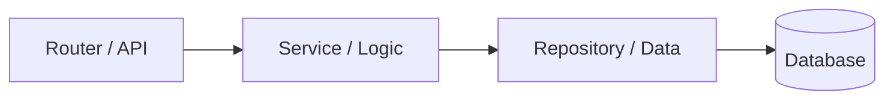

import TOCInline from '@theme/TOCInline';

# Backend Patterns

<TOCInline toc={toc} minHeadingLevel={2} maxHeadingLevel={2} />

:::tip[In this guide]
The patterns that turn scripts into services: layered configuration, structured
logging, a clean project layout, validation, and separation of concerns.
:::

## What Is It?

The recurring, language-agnostic patterns used to build maintainable backend
services in Python.

## Why Does It Matter?

These patterns are exactly what the [FastAPI](../02-fastapi/index.mdx) and
[RAG](../05-rag-fundamentals/index.mdx) sections build on. Learn them once,
reuse everywhere.

## Configuration & Environment Variables

Keep config out of code. Read from the environment, with a typed settings
object (Pydantic Settings is ideal):

```python
# app/config.py
from pydantic_settings import BaseSettings, SettingsConfigDict

class Settings(BaseSettings):
    model_config = SettingsConfigDict(env_file=".env")

    app_name: str = "rag-api"
    log_level: str = "INFO"
    ollama_url: str = "http://localhost:11434"
    chroma_dir: str = "./chroma"

settings = Settings()      # reads env vars / .env once
```

A `.env` file (never committed):

```text
LOG_LEVEL=DEBUG
OLLAMA_URL=http://localhost:11434
```

## Structured Logging

Use the `logging` module, not `print`. Configure once at startup:

```python
import logging

logging.basicConfig(
    level="INFO",
    format="%(asctime)s %(levelname)s %(name)s %(message)s",
)
logger = logging.getLogger(__name__)

logger.info("service starting", extra={"port": 8000})
```

Log **levels**: DEBUG < INFO < WARNING < ERROR < CRITICAL. Ship INFO+ in prod.

## Project Structure

A layered layout that scales (and matches the FastAPI section):

```text
app/
├── main.py            # entrypoint, wires everything
├── config.py          # settings
├── dependencies.py    # shared dependencies
├── routers/           # HTTP layer (thin)
├── services/          # business logic
├── repositories/      # data access
├── schemas/           # request/response models (Pydantic)
└── models/            # domain / DB models
```

## Separation of Concerns (Clean Architecture Basics)

Each layer has one job and depends **inward**:



- **Router**: parse request, call a service, shape response. No business logic.
- **Service**: the actual logic; framework-agnostic and testable.
- **Repository**: reads/writes data; hides the storage details.

This makes the service layer easy to unit-test without HTTP or a real DB.

## Validation & Serialization

Validate at the boundary with Pydantic; keep internal code trusting validated
data:

```python
from pydantic import BaseModel, Field

class CreateUser(BaseModel):
    name: str = Field(min_length=1)
    age: int = Field(ge=0, le=150)

payload = CreateUser(name="Ada", age=36)   # raises if invalid
payload.model_dump()                        # serialize to dict
payload.model_dump_json()                   # serialize to JSON
```

## API Clients

Wrap external services behind a small class so callers don't know the details
(and it's easy to mock in tests):

```python
import httpx

class OllamaClient:
    def __init__(self, base_url: str):
        self._client = httpx.AsyncClient(base_url=base_url, timeout=30)

    async def generate(self, model: str, prompt: str) -> str:
        resp = await self._client.post(
            "/api/generate",
            json={"model": model, "prompt": prompt, "stream": False},
        )
        resp.raise_for_status()
        return resp.json()["response"]
```

## Dependency Management

- One `.venv` per project.
- Pin what you need for reproducibility (`requirements.txt` or a lockfile).
- Separate optional groups (e.g. `ai` extras) so lightweight installs stay light.

## Common Mistakes

- Reading `os.environ` scattered everywhere instead of one settings object.
- Business logic stuffed into route handlers (untestable).
- `print` debugging in production instead of logging.
- Secrets hardcoded or committed.

## Interview Questions

- How do you manage configuration across environments?
- Why separate routers, services, and repositories?
- How do you make external calls testable?
- Where should validation happen?

## Things to Remember

- Config from environment; one typed settings object.
- Thin routers, fat services, isolated data access.
- Validate at the edges; log with levels.

## Mini Exercise

Refactor a single-file script that reads an env var, calls an API, and prints
results into `config.py`, a `client` class, and a `service` function — then
write one unit test for the service with the client mocked.

## Done When

- [ ] You can load typed settings from the environment.
- [ ] You can structure a project into router/service/repository layers.
- [ ] You can wrap an external API and unit-test the logic around it.

Ready to apply all of this: [02 · FastAPI](../02-fastapi/index.mdx).
