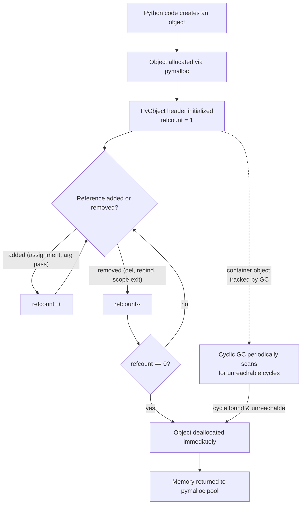
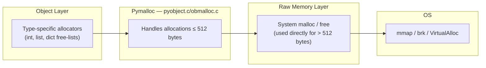
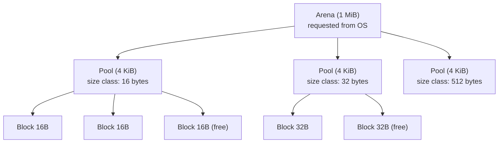
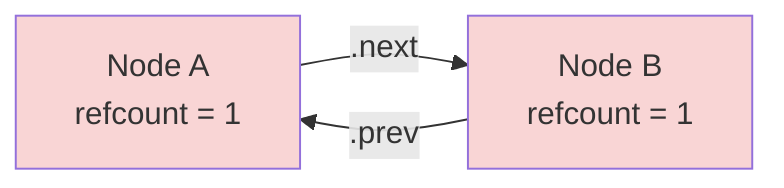
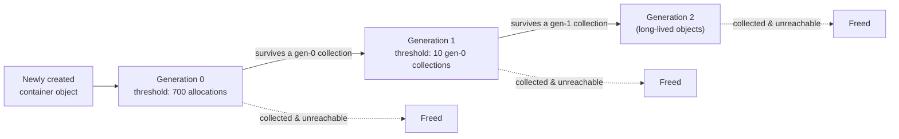
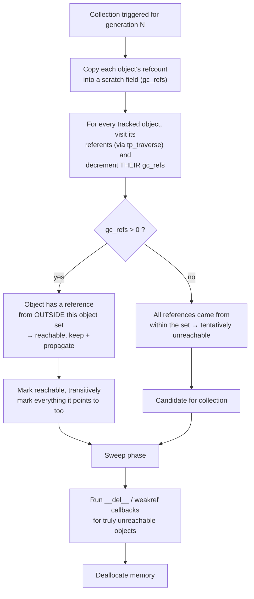

# Python Memory & Garbage Collection

## Table of Contents

- [1. Overview](#1-overview)
- [2. The Python Object Model](#2-the-python-object-model)
  - [2.1 Every Object Is a `PyObject`](#21-every-object-is-a-pyobject)
  - [2.2 Reference Counting](#22-reference-counting)
- [3. Memory Architecture (CPython)](#3-memory-architecture-cpython)
  - [3.1 The Layered Allocator](#31-the-layered-allocator)
  - [3.2 Arenas, Pools, and Blocks (pymalloc)](#32-arenas-pools-and-blocks-pymalloc)
- [4. Reference Counting in Action](#4-reference-counting-in-action)
- [5. The Cyclic Garbage Collector](#5-the-cyclic-garbage-collector)
  - [5.1 Why Refcounting Alone Isn't Enough](#51-why-refcounting-alone-isnt-enough)
  - [5.2 Generational Collection](#52-generational-collection)
  - [5.3 The Mark-and-Sweep Cycle Detection Algorithm](#53-the-mark-and-sweep-cycle-detection-algorithm)
- [6. The `gc` Module in Practice](#6-the-gc-module-in-practice)
- [7. Inspecting Memory: `sys`, `tracemalloc`, `weakref`](#7-inspecting-memory-sys-tracemalloc-weakref)
- [8. Common Pitfalls & Leaks](#8-common-pitfalls--leaks)
- [9. Optimization Techniques](#9-optimization-techniques)
- [10. End-to-End Execution Walkthrough](#10-end-to-end-execution-walkthrough)
- [11. Summary Cheat Sheet](#11-summary-cheat-sheet)

---

## 1. Overview

CPython (the reference implementation most people mean by "Python") manages memory through two cooperating systems:

1. **Reference counting** — an immediate, deterministic mechanism baked into every object.
2. **A generational cyclic garbage collector** — a periodic sweep that catches what reference counting structurally cannot: reference cycles.

On top of these sits **pymalloc**, CPython's own small-object allocator, which sits between the interpreter and the OS's `malloc`/`free` to reduce fragmentation and syscall overhead.



---

## 2. The Python Object Model

### 2.1 Every Object Is a `PyObject`

In CPython, every value — integers, strings, lists, your custom class instances — is a heap-allocated C struct starting with a common header:

```c
typedef struct _object {
    Py_ssize_t ob_refcnt;   // reference count
    PyTypeObject *ob_type;  // pointer to the type object
} PyObject;
```

Container-ish or variable-sized objects (lists, tuples, ints) extend this with `PyVarObject`, which adds `ob_size`. This header is why **everything in Python is "boxed"** — even a small integer carries overhead for its refcount and type pointer (typically 28 bytes for a small `int` on a 64-bit build, versus 8 bytes for a raw C `long`).

```python
import sys

x = 42
print(sys.getsizeof(x))        # 28 bytes on CPython 3.12, 64-bit
print(sys.getsizeof(None))     # 16 bytes
print(sys.getsizeof([]))       # 56 bytes (empty list, pre-3.12 varies)
print(sys.getsizeof("hi"))     # 43 bytes (ASCII, includes header + hash cache)
```

### 2.2 Reference Counting

Every `PyObject` carries `ob_refcnt`. It increments when a reference is created and decrements when a reference goes away. When it hits zero, the object's `tp_dealloc` slot runs immediately — deterministically, not "eventually" like in a tracing-only collector.

```python
import sys

a = object()
print(sys.getrefcount(a))   # 2: 'a' itself + the temporary arg to getrefcount()

b = a
print(sys.getrefcount(a))   # 3: 'a', 'b', and the temp arg

del b
print(sys.getrefcount(a))   # back to 2
```

> `sys.getrefcount()` always reports one extra, because passing `a` into the function creates a temporary reference.

---

## 3. Memory Architecture (CPython)

### 3.1 The Layered Allocator

CPython doesn't call the OS `malloc()` for every small object — that would be slow and fragment memory badly. Instead it layers allocators:



- **Small objects (≤ 512 bytes)** — the vast majority of Python allocations (ints, small strings, tuples) — go through **pymalloc**, which manages memory in big pre-allocated chunks.
- **Large objects** fall through to the system allocator directly.
- Some built-in types (`int`, `list`, `dict`, `frame` objects) additionally keep their own **free lists** — small caches of recently-freed objects reused without touching the allocator at all, since these types churn constantly.

### 3.2 Arenas, Pools, and Blocks (pymalloc)

pymalloc organizes memory in three tiers:

| Unit  | Size            | Purpose                                                 |
|-------|-----------------|----------------------------------------------------------|
| Arena | 1 MiB           | Requested from the OS via `mmap`/`malloc`                |
| Pool  | 4 KiB           | A slice of an arena, dedicated to **one** size class      |
| Block | 8–512 bytes (multiples of 8) | The actual unit handed back to Python code    |



Each pool serves only one **size class**, so allocating a 17-byte object rounds up to the next 8-byte-aligned class (24 bytes) and is served from that pool. This trades a little internal fragmentation for very fast, syscall-free allocation — freeing a block just pushes it back onto that pool's free list.

Arenas that become completely empty are returned to the OS, which is why long-running processes can sometimes shrink their RSS after a big burst of temporary allocations — but only if an *entire* 1 MiB arena empties out, which is why Python's reported memory usage doesn't always drop right after `del`.

---

## 4. Reference Counting in Action

```python
class Node:
    def __init__(self, name):
        self.name = name
        print(f"{self.name} created")

    def __del__(self):
        print(f"{self.name} destroyed")

def demo():
    n1 = Node("A")      # refcount(A) = 1
    n2 = n1              # refcount(A) = 2
    del n1               # refcount(A) = 1
    del n2                # refcount(A) = 0 -> __del__ runs immediately

demo()
# Output:
# A created
# A destroyed
```

Because deallocation is immediate and deterministic, `__del__` runs the instant the last reference disappears — this is what makes context managers (`with`) and `__del__`-based cleanup reliable *for acyclic object graphs*.

---

## 5. The Cyclic Garbage Collector

### 5.1 Why Refcounting Alone Isn't Enough

Reference counting cannot free objects that reference each other in a cycle, because each keeps the other's count above zero forever.



```python
class Node:
    def __init__(self, name):
        self.name = name
        self.other = None
    def __del__(self):
        print(f"{self.name} destroyed")

a = Node("A")
b = Node("B")
a.other = b
b.other = a

del a
del b
# Nothing printed yet! Both refcounts are 1 (pointing at each other),
# never reaching 0 via refcounting alone.
# Only gc.collect() (run automatically or manually) can free this cycle.
```

This is exactly the scenario the **generational cyclic garbage collector** exists to handle. It only concerns itself with **container types** (`list`, `dict`, `set`, class instances, etc. — anything whose `tp_flags` set `Py_TPFLAGS_HAVE_GC`); atomic types like `int`, `str`, and `float` can't participate in cycles and are never tracked by it.

### 5.2 Generational Collection

The GC divides tracked objects into three **generations** based on the weak-generational hypothesis: *most objects die young*.



- New tracked objects start in **generation 0**.
- Gen 0 fills up fast and is collected often (cheap, since most garbage is short-lived).
- Objects that survive a collection get **promoted** to the next generation, which is scanned less frequently.
- Defaults (`gc.get_threshold()`): `(700, 10, 10)` — collect gen 0 every 700 net allocations, gen 1 every 10 gen-0 collections, gen 2 every 10 gen-1 collections.

This mirrors the same intuition behind generational GC in the JVM, V8, and .NET: scanning everything on every collection is wasteful, so pay more attention to young, high-churn objects.

### 5.3 The Mark-and-Sweep Cycle Detection Algorithm

For each generation being collected, CPython roughly does the following:



In short: it temporarily subtracts "internal" references (references coming from other objects in the same candidate set) from each object's refcount. Whatever is left (`gc_refs > 0`) must be referenced from *outside* the set — a local variable, a global, another generation — so it and everything it points to is reachable and spared. Anything left at zero is only kept alive by other garbage, and the whole cluster is freed together.

This is why **objects that define `__del__` inside a cycle used to be a real problem** in Python 2 (the GC didn't know a safe order to finalize them and left them in `gc.garbage` uncollected). Since **Python 3.4 (PEP 442)**, the GC can safely finalize cyclic garbage even when `__del__` is involved.

---

## 6. The `gc` Module in Practice

```python
import gc

# Inspect current generation thresholds
print(gc.get_threshold())        # e.g. (700, 10, 10)

# Inspect live counts per generation
print(gc.get_count())            # e.g. (233, 4, 1)

# Force a full collection (all generations) — returns count of unreachable objects found
gc.collect()

# Force a collection of only generation 0
gc.collect(0)

# Temporarily disable automatic collection (rarely a good idea — see §9)
gc.disable()
gc.enable()

# See what the GC considers garbage right now (should be empty in modern Python
# unless you have __del__ + cycles that raised during finalization)
print(gc.garbage)

# Debug flags — very useful when hunting leaks
gc.set_debug(gc.DEBUG_STATS | gc.DEBUG_COLLECTABLE)

# Find every object currently tracked by the collector
tracked = gc.get_objects()
print(len(tracked))

# Inspect what a specific object is keeping alive / being kept alive by
class Foo: pass
f = Foo()
print(gc.get_referents(f))       # objects f directly points to
print(gc.get_referrers(f))       # objects that point to f
```

---

## 7. Inspecting Memory: `sys`, `tracemalloc`, `weakref`

**`tracemalloc`** — built-in memory profiler, traces every allocation back to a source line:

```python
import tracemalloc

tracemalloc.start()

data = [str(i) * 100 for i in range(10_000)]

snapshot = tracemalloc.take_snapshot()
top_stats = snapshot.statistics("lineno")

for stat in top_stats[:5]:
    print(stat)
```

**`weakref`** — lets you reference an object *without* bumping its refcount, so it can still be collected. Essential for caches and observer patterns that shouldn't keep objects alive artificially:

```python
import weakref

class Cache:
    pass

obj = Cache()
ref = weakref.ref(obj)

print(ref())        # <__main__.Cache object at 0x...>
del obj
print(ref())         # None — the object was actually freed
```

`WeakValueDictionary` / `WeakKeyDictionary` apply this idea to whole dicts — commonly used for memoization caches that shouldn't prevent garbage collection.

---

## 8. Common Pitfalls & Leaks

| Pitfall | Why it leaks | Fix |
|---|---|---|
| Reference cycles with `__del__` pre-3.4 | GC couldn't safely finalize them | Upgrade (fixed since 3.4 / PEP 442), or avoid `__del__` |
| Growing module-level caches/lists | Strong refs never released | Use `weakref`, bounded caches (`functools.lru_cache(maxsize=...)`) |
| Closures capturing large objects | The closure keeps the whole enclosing scope alive | Only capture what you need; pass explicitly |
| Exceptions holding tracebacks | Traceback frames reference local variables, keeping them alive | `del` the exception variable, or use `traceback.clear_frames()` |
| Global caches keyed by object identity | Objects never get garbage collected while cached | Use `WeakKeyDictionary` |
| Circular references in data structures (trees with parent+child pointers) | Classic cycle | Use `weakref` for the "back" pointer (e.g., `child.parent`) |

```python
# Classic parent/child cycle fix
import weakref

class TreeNode:
    def __init__(self, name, parent=None):
        self.name = name
        self._parent = weakref.ref(parent) if parent else None
        self.children = []

    @property
    def parent(self):
        return self._parent() if self._parent else None
```

---

## 9. Optimization Techniques

- **`__slots__`** — skip the per-instance `__dict__`, saving significant memory on classes with many instances:

```python
class PointDict:
    def __init__(self, x, y):
        self.x, self.y = x, y

class PointSlots:
    __slots__ = ("x", "y")
    def __init__(self, x, y):
        self.x, self.y = x, y

import sys
print(sys.getsizeof(PointDict(1, 2).__dict__))  # instance dict overhead
# PointSlots instances skip __dict__ entirely — often ~50% smaller per instance
```

- **Tune GC thresholds** for allocation-heavy, short-lived-object workloads (e.g., web servers, batch jobs) — collecting less often trades a bit of peak memory for throughput:

```python
import gc
gc.set_threshold(50_000, 20, 20)   # collect gen0 far less often
```

- **Disable GC temporarily** during performance-critical, allocation-heavy sections that you know don't create cycles (e.g., bulk data loading), then re-enable:

```python
import gc
gc.disable()
try:
    load_large_dataset()
finally:
    gc.enable()
    gc.collect()
```

- **`gc.freeze()`** (3.7+) — after startup, move all currently-tracked objects (e.g., imported modules) into a permanent generation the collector skips, which is a big win for `fork()`-based server workers (e.g. gunicorn) since it avoids re-scanning static objects in every child process.

- **Use generators/iterators** instead of building large intermediate lists, avoiding peak memory spikes entirely rather than optimizing their cleanup.

---

## 10. End-to-End Execution Walkthrough

Consider this snippet:

```python
def build_graph():
    nodes = {}
    for i in range(3):
        nodes[i] = {"id": i, "links": []}
    nodes[0]["links"].append(nodes[1])
    nodes[1]["links"].append(nodes[0])   # cycle: 0 <-> 1
    return nodes[2]                       # only node 2 escapes

result = build_graph()
```

```mermaid
sequenceDiagram
    participant Code as Python Code
    participant Alloc as pymalloc
    participant Refc as Refcounting
    participant GC as Cyclic GC

    Code->>Alloc: create dict nodes{}
    Alloc-->>Code: block from size-class pool
    Code->>Alloc: create dict node 0, 1, 2
    Alloc-->>Refc: each starts refcnt=1, tracked (GC-enabled type)
    Code->>Refc: nodes[0]["links"].append(nodes[1])
    Refc->>Refc: node1.refcnt++
    Code->>Refc: nodes[1]["links"].append(nodes[0])
    Refc->>Refc: node0.refcnt++
    Code->>Refc: return nodes[2]; local 'nodes' dict goes out of scope
    Refc->>Refc: nodes{}.refcnt-- -> 0, dict freed
    Refc->>Refc: node0.refcnt-- (was held by nodes{}) -> still 1 (held by node1)
    Refc->>Refc: node1.refcnt-- (was held by nodes{}) -> still 1 (held by node0)
    Note over Refc: node0 and node1 form a cycle,<br/>refcount can't reach 0 -> LEAKED (for now)
    Note over Code: node2.refcnt-- (from nodes{}), but +1 from being returned -> still reachable
    GC->>GC: gen-0 threshold reached (700 allocations)
    GC->>GC: trace node0, node1 subgraph
    GC->>GC: no external references found -> unreachable cluster
    GC->>Refc: deallocate node0, node1 together
    Refc-->>Alloc: return blocks to pool free-lists
```

Note that `node2` was never part of the cycle and would already be freed by plain reference counting the moment `result` itself goes out of scope — only `node0` and `node1` needed the cyclic collector.

---

## 11. Summary Cheat Sheet

- **Everything is a `PyObject`**: refcount + type pointer header on every value.
- **Reference counting** frees acyclic garbage *immediately* and deterministically.
- **pymalloc** handles small (≤512B) allocations via arenas → pools → blocks, avoiding OS calls for common cases.
- **The cyclic GC** exists solely to catch reference cycles among container objects; it's generational (gen 0/1/2) based on the "most objects die young" heuristic.
- **`gc` module**: `collect()`, `get_threshold()`, `set_threshold()`, `disable()`/`enable()`, `freeze()`, `get_objects()`.
- **`weakref`** breaks cycles intentionally without preventing collection.
- **`tracemalloc`** is the built-in tool for finding real-world leaks by source line.
- **`__slots__`**, generators, and bounded caches are the biggest easy wins for memory-conscious Python code.
