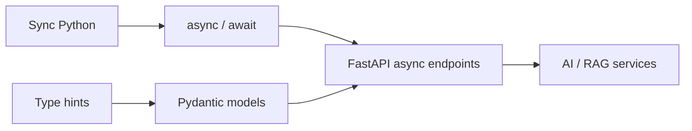

import TOCInline from '@theme/TOCInline';

# 01 · Python

<ProgressToggle sectionId="01-python" />

<TOCInline toc={toc} minHeadingLevel={2} maxHeadingLevel={2} />

:::tip[In this guide]
Python is the foundation of everything that follows. This is a full roadmap —
not a setup page — taking you from syntax to async, typing, testing, and
backend patterns.
:::

## Goal

Become comfortable writing production-quality Python required for FastAPI and
AI engineering.

## Estimated Time

2–3 weeks.

## Prerequisites

- Completed [Prerequisites](../00-prerequisites/index.mdx).
- A working Python 3.11+ environment with an activated virtual environment.

## What You Will Learn

1. [Python Basics](./01-python-basics.mdx) — syntax, variables, types, strings, PEP 8.
2. [Control Flow & Functions](./02-control-flow-functions.mdx) — branching, loops, functions, `*args`/`**kwargs`, closures.
3. [Data Structures](./03-data-structures.mdx) — list, tuple, set, dict, comprehensions, copying.
4. [OOP](./04-oop.mdx) — classes, inheritance, dunder methods, dataclasses, ABCs, protocols.
5. [Modules, Packages & Environments](./05-modules-packages-environments.mdx) — imports, venv, pip, `pyproject.toml`.
6. [Exceptions & File Handling](./06-exceptions-file-handling.mdx) — try/except, custom exceptions, files, JSON, `pathlib`.
7. [Typing & Dataclasses](./07-typing-dataclasses.mdx) — modern type hints, `TypedDict`, `Protocol`, generics, `mypy`.
8. [Iterators, Generators & Decorators](./08-iterators-generators-decorators.mdx) — `yield`, decorators, `functools`, `itertools`.
9. [Async & Concurrency](./09-async-concurrency.mdx) — `async`/`await`, event loop, `asyncio`, threads vs processes.
10. [Testing & Debugging](./10-testing-debugging.mdx) — `pytest`, fixtures, mocking, async tests.
11. [Backend Patterns](./11-python-backend-patterns.mdx) — config, logging, structure, validation, clean architecture.

## Why Python First?

FastAPI is "just Python" — it leans heavily on type hints, async, and clean
structure. Every hour here pays off later.

## Interview Relevance

Python fundamentals are a staple of backend interviews: mutability, `list` vs
`tuple`, generators vs iterators, decorators, the GIL, and async vs threads all
appear repeatedly. Each subpage ends with an interview section.

## Done When

You can build a small Python application using typing, OOP, async/await,
testing, error handling, and package management **without following a
tutorial**.

- [ ] Comfortable with data structures and comprehensions.
- [ ] Can design classes and use dataclasses/protocols.
- [ ] Can annotate code and pass `mypy`.
- [ ] Can write and run `pytest` tests, including async ones.
- [ ] Understand when (and when not) to use `async`.

Next: [02 · FastAPI](../02-fastapi/index.mdx).
