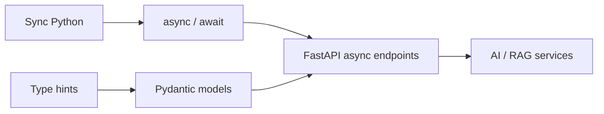

import TOCInline from '@theme/TOCInline';

# 01 · Python

<ProgressToggle sectionId="01-python" />

<TOCInline toc={toc} minHeadingLevel={2} maxHeadingLevel={2} />

:::tip[In this guide]
Python is the foundation of everything that follows. This is a full roadmap —
not a setup page — organized into **five phases** that take you from syntax to
async, typing, testing, clean backend structure, and interview-ready data
structures and algorithms.
:::

## Goal

Become comfortable writing production-quality Python required for FastAPI and
AI engineering.

## Estimated Time

2–3 weeks.

## Prerequisites

- Completed [Prerequisites](../00-prerequisites/index.mdx).
- A working Python 3.11+ environment with an activated virtual environment.

## The Five Phases

1. **[Phase 1 — Python Fundamentals](./01-python-fundamentals.mdx)**
   Setup and execution, variables, data types, strings, numbers, booleans,
   `if/elif/else`, `for` and `while` loops, functions, scope, `*args`/`**kwargs`,
   modules and imports, exceptions, and file handling.
2. **[Phase 2 — Python Data Structures](./02-data-structures.mdx)**
   Lists, tuples, sets, dictionaries, list and dict comprehensions, slicing,
   iterators, generators, and the `collections` module.
3. **[Phase 3 — Object-Oriented Python](./03-oop.mdx)**
   Classes, objects, `__init__`, instance vs class attributes, methods,
   inheritance, polymorphism, encapsulation, abstract classes, magic/dunder
   methods, and dataclasses.
4. **[Phase 4 — Professional Python](./04-professional-python.mdx)**
   Type hints, `mypy`, dataclasses, virtual environments, `pip`,
   `requirements.txt`, `pyproject.toml`, logging, testing with `pytest`, async
   Python, context managers, decorators, and clean backend patterns.
5. **[Phase 5 — DSA with Python](./05-dsa-with-python.mdx)**
   Data structures and algorithms for interviews: arrays, stacks, queues,
   deques, heaps, hash maps/sets, `Counter`, `defaultdict`, linked lists, trees,
   tries, graphs, union-find, plus binary search, two pointers, sliding window,
   prefix sums, recursion, backtracking, dynamic programming, and Python tricks.

## Why Python First?

FastAPI is "just Python" — it leans heavily on type hints, async, and clean
structure. Every hour here pays off later.

## Interview Relevance

Python fundamentals are a staple of backend interviews: mutability, `list` vs
`tuple`, generators vs iterators, decorators, the GIL, and async vs threads all
appear repeatedly. Each phase ends with an interview section.

## Done When

You can build a small Python application using typing, OOP, async/await,
testing, error handling, and package management **without following a
tutorial**.

- [ ] Comfortable with fundamentals: control flow, functions, scope, exceptions.
- [ ] Comfortable with data structures, comprehensions, and generators.
- [ ] Can design classes and use dataclasses/abstract base classes.
- [ ] Can annotate code and pass `mypy`.
- [ ] Can write and run `pytest` tests, including async ones.
- [ ] Understand when (and when not) to use `async`.
- [ ] Can map each DSA structure to its Python built-in and solve with the core patterns.

Next: [02 · FastAPI](../02-fastapi/index.mdx).
