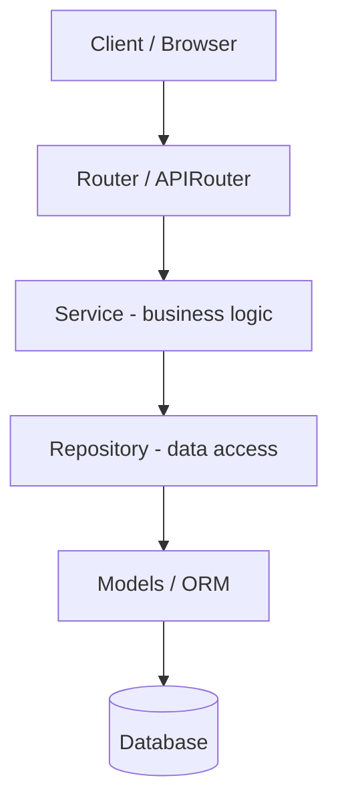

import TOCInline from '@theme/TOCInline';

# Phase 4 — Project Architecture

<TOCInline toc={toc} minHeadingLevel={2} maxHeadingLevel={2} />

:::tip[In this guide]
A single `main.py` is fine for a demo but collapses under a real application.
This phase shows how to structure a FastAPI project into routers, services,
repositories, schemas, and models, wired together with dependencies and a clean
`create_app()` factory — so the codebase stays navigable as it grows.
:::

## What Is It?

Project architecture is how you organize code into layers with clear
responsibilities. In a well-structured FastAPI app, an HTTP request flows through
a **router** (handles HTTP), into a **service** (business logic), down to a
**repository** (data access), which talks to the database via **models**, while
**schemas** define the data shapes crossing the HTTP boundary.

## Why Does It Matter?

Structure is what lets a team move fast without breaking things. When each layer
has one job, you can change the database without touching HTTP code, test
business logic without a running server, and onboard new developers who can find
things by convention. Poor structure turns every change into a risky
archaeology expedition.

---

## Target Layout

Here is the layout this phase builds toward. Each top-level folder maps to a
layer with a single responsibility.

```text
app/
├── main.py
├── api/
│   ├── routes/
│   │   ├── users.py
│   │   ├── auth.py
│   │   └── products.py
│   └── dependencies.py
├── models/
│   ├── user.py
│   └── product.py
├── schemas/
│   ├── user.py
│   └── product.py
├── services/
│   ├── user_service.py
│   └── auth_service.py
├── repositories/
│   └── user_repository.py
├── core/
│   ├── config.py
│   └── security.py
└── db/
    ├── database.py
    └── session.py
```

:::note[Highlight: folders mirror layers]
`api/` handles HTTP, `services/` holds business rules, `repositories/` handles
persistence, `models/` are ORM tables, `schemas/` are Pydantic request/response
shapes, `core/` holds config and security, and `db/` wires up the engine and
sessions. When you know the layer, you know the folder.
:::

---

## Routers / `APIRouter`

`APIRouter` lets you split routes across many files instead of hanging everything
off one `app`. Each router groups related endpoints and gets mounted with a
prefix and tags.

```python
# app/api/routes/users.py
from typing import Annotated
from fastapi import APIRouter, Depends
from app.schemas.user import UserCreate, UserOut
from app.services.user_service import UserService
from app.api.dependencies import get_user_service

router = APIRouter(prefix="/users", tags=["users"])

@router.post("", response_model=UserOut, status_code=201)
def create_user(
    payload: UserCreate,
    service: Annotated[UserService, Depends(get_user_service)],
):
    return service.register(payload)

@router.get("/{user_id}", response_model=UserOut)
def get_user(
    user_id: int,
    service: Annotated[UserService, Depends(get_user_service)],
):
    return service.get(user_id)
```

The router is then included by the app (see the factory below). Routers keep each
domain (users, auth, products) in its own file.

---

## Services

A service holds **business logic** — the rules that make your application yours.
It orchestrates repositories, enforces invariants, and knows nothing about HTTP
(no `Request`, no status codes). That keeps it reusable and testable.

```python
# app/services/user_service.py
from fastapi import HTTPException
from app.repositories.user_repository import UserRepository
from app.schemas.user import UserCreate
from app.core.security import hash_password

class UserService:
    def __init__(self, repo: UserRepository):
        self.repo = repo

    def register(self, payload: UserCreate):
        if self.repo.get_by_email(payload.email):
            raise HTTPException(status_code=409, detail="Email already registered")
        data = payload.model_dump()
        data["password"] = hash_password(data.pop("password"))
        return self.repo.create(data)

    def get(self, user_id: int):
        user = self.repo.get(user_id)
        if user is None:
            raise HTTPException(status_code=404, detail="User not found")
        return user
```

:::info[Theory: keep HTTP out of services]
A service should be callable from an HTTP route, a background job, or a CLI
command without change. If it imports `Request` or returns `JSONResponse`, it's
coupled to the web layer and can't be reused. Let routers translate HTTP to
service calls and back; let services speak plain Python.
:::

---

## Repositories

A repository is the only layer that knows how data is stored. It exposes methods
like `get`, `create`, and `list`, hiding SQL and ORM details behind a plain
interface. Swap the storage engine and only the repository changes.

```python
# app/repositories/user_repository.py
from sqlalchemy.orm import Session
from app.models.user import User

class UserRepository:
    def __init__(self, db: Session):
        self.db = db

    def get(self, user_id: int) -> User | None:
        return self.db.get(User, user_id)

    def get_by_email(self, email: str) -> User | None:
        return self.db.query(User).filter(User.email == email).first()

    def create(self, data: dict) -> User:
        user = User(**data)
        self.db.add(user)
        self.db.commit()
        self.db.refresh(user)
        return user
```

:::note[Highlight: the repository pattern]
Repositories give you a single place to change queries, add caching, or optimize
performance. Services depend on the repository's *interface*, not its
implementation, so you can hand a service a fake repository in tests and never
touch a real database.
:::

---

## Schemas

Schemas are the Pydantic models that define what crosses the HTTP boundary —
request bodies and response bodies. They live apart from ORM models so the API
contract and the database can evolve independently.

```python
# app/schemas/user.py
from pydantic import BaseModel, EmailStr, Field

class UserCreate(BaseModel):
    name: str = Field(min_length=1, max_length=80)
    email: EmailStr
    password: str = Field(min_length=8)

class UserOut(BaseModel):
    id: int
    name: str
    email: EmailStr
    model_config = {"from_attributes": True}   # allow building from an ORM object
```

`from_attributes=True` lets a `UserOut` be created directly from a SQLAlchemy
`User` row. Schemas are covered in depth in
[Phase 2 — Pydantic & Data Validation](./02-pydantic-validation.mdx).

---

## Models

Models are your ORM classes — the mapping between Python objects and database
tables. They belong to the persistence layer and should not leak into your API
responses directly (that's what schemas are for).

```python
# app/models/user.py
from sqlalchemy.orm import Mapped, mapped_column
from app.db.database import Base

class User(Base):
    __tablename__ = "users"

    id: Mapped[int] = mapped_column(primary_key=True)
    name: Mapped[str] = mapped_column()
    email: Mapped[str] = mapped_column(unique=True, index=True)
    password: Mapped[str] = mapped_column()
```

The SQLAlchemy details (`Base`, `Mapped`, `mapped_column`, relationships) are
covered in [Phase 5 — Database](./05-database.mdx).

---

## Dependencies

A shared `dependencies.py` wires the layers together. It builds a repository from
a database session, then a service from that repository — one place that
expresses how the object graph is assembled.

```python
# app/api/dependencies.py
from typing import Annotated
from fastapi import Depends
from sqlalchemy.orm import Session
from app.db.session import get_db
from app.repositories.user_repository import UserRepository
from app.services.user_service import UserService

def get_user_repository(db: Annotated[Session, Depends(get_db)]) -> UserRepository:
    return UserRepository(db)

def get_user_service(
    repo: Annotated[UserRepository, Depends(get_user_repository)],
) -> UserService:
    return UserService(repo)
```

This chain — `get_db` to `UserRepository` to `UserService` — is dependency
injection at work. See [Phase 3 — Dependency Injection](./03-dependency-injection.mdx).

---

## Configuration

Configuration lives in `core/config.py`, typically as a `BaseSettings` object
loaded from environment variables. Centralizing it means secrets and tunables
have exactly one source of truth.

```python
# app/core/config.py
from functools import lru_cache
from pydantic_settings import BaseSettings, SettingsConfigDict

class Settings(BaseSettings):
    app_name: str = "RAG API"
    database_url: str
    secret_key: str
    debug: bool = False

    model_config = SettingsConfigDict(env_file=".env")

@lru_cache
def get_settings() -> Settings:
    return Settings()      # cached so the .env is read once
```

:::caution[Cache settings, don't re-read env every call]
Wrapping `get_settings()` in `lru_cache` means the environment and `.env` file
are parsed once and the same `Settings` object is reused. Configuration is
covered fully in [Phase 17 — Configuration & Environment](./17-configuration-environment.mdx).
:::

---

## Separation of Concerns

Each layer depends only on the layer directly beneath it. HTTP concerns stay in
routers, business rules in services, persistence in repositories. This is the
whole point of the structure.



:::info[Theory: why layering pays off]
Layering trades a little upfront boilerplate for large downstream wins: changes
stay local (a new query touches only the repository), tests get cheap (mock the
layer below), and reasoning is easier (each file has one job). The rule of thumb
is that dependencies point inward and downward — routers know about services,
services know about repositories, never the reverse.
:::

---

## Application Factory Pattern (a `create_app()` function)

Rather than creating the `app` at import time, a factory function builds and
configures it. This makes testing easier (each test can build a fresh app),
supports multiple configurations, and keeps startup wiring in one place.

```python
# app/main.py
from fastapi import FastAPI
from app.api.routes import users, auth, products
from app.core.config import get_settings

def create_app() -> FastAPI:
    settings = get_settings()
    app = FastAPI(title=settings.app_name, debug=settings.debug)

    # include routers
    app.include_router(users.router)
    app.include_router(auth.router)
    app.include_router(products.router)

    @app.get("/health")
    def health():
        return {"status": "ok"}

    return app

app = create_app()      # uvicorn app.main:app
```

:::note[Highlight: why a factory beats a module-level app]
A module-level `app = FastAPI()` is created the moment the module is imported,
with whatever configuration happens to exist then. A `create_app()` factory lets
you inject different settings per environment and build isolated app instances in
tests. It's the pattern most production FastAPI codebases converge on.
:::

---

## Common Mistakes

- Putting business logic in route handlers, making it impossible to reuse or test.
- Returning ORM models directly instead of mapping through response schemas.
- Importing `Request` or HTTP types into services, coupling logic to the web layer.
- Circular imports from layers reaching sideways or upward instead of downward.
- Creating the app and reading config at import time instead of in a factory.
- One giant `routes.py` instead of a router per domain.

## Interview Questions

- Describe the request-to-router-to-service-to-repository flow and why each layer exists.
- Why separate ORM models from Pydantic schemas?
- What problem does the repository pattern solve?
- What are the benefits of an application factory over a module-level app?
- How do dependencies wire the layers together?
- Where does business logic belong, and why not in the router?

## Things to Remember

- Routers handle HTTP; services hold logic; repositories handle data.
- Keep schemas (API shapes) separate from models (database tables).
- Dependencies assemble the object graph: db → repository → service.
- Use `create_app()` so configuration and tests stay flexible.
- Dependencies point downward; never let a lower layer import an upper one.

## Mini Exercise

Refactor a single-file app into the layout above. Create a `users` router, a
`UserService`, a `UserRepository`, `UserCreate`/`UserOut` schemas, a `User`
model, a `dependencies.py` that wires them, and a `create_app()` factory. Confirm
`POST /users` and `GET /users/{id}` still work and that no business logic remains
in the router.

## Done When

- [ ] Your project is split into routers, services, repositories, schemas, and models.
- [ ] Route handlers contain no business logic.
- [ ] Dependencies assemble services from repositories from sessions.
- [ ] Configuration is centralized and cached.
- [ ] The app is built by a `create_app()` factory.

Next: [Phase 5 — Database](./05-database.mdx).
