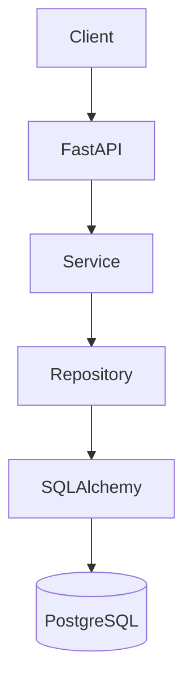

import TOCInline from '@theme/TOCInline';

# Phase 6 — Database Migrations

<TOCInline toc={toc} minHeadingLevel={2} maxHeadingLevel={2} />

:::tip[In this guide]
Your models will change — new columns, new tables, dropped fields. Migrations are
how you evolve a database schema safely and repeatably across every environment.
This phase covers Alembic, the standard migration tool for SQLAlchemy, from first
`init` to a production-grade zero-downtime strategy.
:::

## What Is It?

A migration is a versioned, executable description of a schema change. Alembic is
the migration tool built by SQLAlchemy's author. It records each change as a
Python file with a unique revision id, tracks which revisions a database has
applied, and can move a database forward (`upgrade`) or backward (`downgrade`)
between versions.

## Why Does It Matter?

Without migrations, keeping schemas in sync across your laptop, a teammate's
machine, staging, and production is manual and error-prone. Migrations make
schema changes part of your codebase and your deploy pipeline: reviewable in pull
requests, reproducible in every environment, and reversible when something goes
wrong. This is table stakes for any production backend.

---

## Alembic Setup (`alembic init`)

Install Alembic and initialize it. `alembic init` scaffolds a migrations
directory and a config file.

```bash
pip install alembic
alembic init alembic
```

This creates:

```text
alembic.ini              # config: DB URL, logging
alembic/
├── env.py               # runtime config; point it at your models' metadata
├── script.py.mako       # template for new migration files
└── versions/            # your migration files live here
```

Wire `env.py` to your models so autogenerate knows your schema, and feed it the
database URL from your settings rather than hardcoding it.

```python
# alembic/env.py (key edits)
from app.db.database import Base           # your DeclarativeBase
from app.core.config import get_settings

target_metadata = Base.metadata            # so Alembic can diff models vs DB
config.set_main_option("sqlalchemy.url", get_settings().database_url)
```

:::caution[Import all models before autogenerate]
Alembic only sees tables that are imported and registered on `Base.metadata` when
`env.py` runs. If a model file is never imported, autogenerate silently misses
its table. Import your models (or a module that imports them all) in `env.py`.
:::

---

## Migration Files (structure, `revision`/`down_revision`)

Each migration is a Python file in `versions/` with a `revision` id, a
`down_revision` pointer to its parent, and two functions: `upgrade()` and
`downgrade()`. Together the `down_revision` links form a chain (a directed
history) that Alembic walks.

```python
"""add users table

Revision ID: a1b2c3d4e5f6
Revises: 
Create Date: 2024-01-01 10:00:00
"""
from alembic import op
import sqlalchemy as sa

revision = "a1b2c3d4e5f6"
down_revision = None            # this is the first migration
branch_labels = None
depends_on = None

def upgrade() -> None:
    op.create_table(
        "users",
        sa.Column("id", sa.Integer, primary_key=True),
        sa.Column("email", sa.String(255), nullable=False, unique=True),
    )

def downgrade() -> None:
    op.drop_table("users")
```

:::info[Theory: migrations form a version graph]
`down_revision` turns migrations into a linked history — each points at the one
before it. Alembic stores the current revision in a small `alembic_version` table
in your database, so it knows exactly where each environment sits and which
migrations to run to reach a target. Understanding this graph is the key to
reasoning about migrations confidently.
:::

---

## `upgrade`

`upgrade()` applies the change. Run all pending migrations up to the latest with
`alembic upgrade head`, or move one step with `+1`.

```bash
alembic upgrade head        # apply everything not yet applied
alembic upgrade +1          # apply the next single migration
alembic current             # show the database's current revision
alembic history             # show the full revision chain
```

---

## `downgrade`

`downgrade()` reverses the change. Move back one step or to a specific revision.
A migration is only reversible if its `downgrade()` is written correctly.

```bash
alembic downgrade -1                # undo the most recent migration
alembic downgrade a1b2c3d4e5f6      # go back to a specific revision
alembic downgrade base              # undo everything
```

:::warning[Downgrades can lose data]
`upgrade()` adding a column is reversible; `downgrade()` dropping it destroys
whatever was stored there. Downgrades are useful in development, but in
production prefer rolling **forward** with a new corrective migration over
downgrading. Treat downgrade as a safety net, not a routine deploy step.
:::

---

## Auto-generated Migrations (`alembic revision --autogenerate`)

Alembic can compare your models against the current database and generate a
migration for the difference. This saves enormous time — but you must review the
result.

```bash
alembic revision --autogenerate -m "add age column to users"
# inspect the generated file in versions/, edit if needed, then:
alembic upgrade head
```

:::caution[Autogenerate has real limits — always review]
Autogenerate reliably detects new/dropped tables and columns, but it often
**misses or mishandles**: column type changes, renamed columns (it sees a drop +
add, losing data), server defaults, check constraints, and index/naming
differences. Never apply an autogenerated migration unread. Treat it as a first
draft you verify and correct.
:::

---

## Schema Changes (adding columns, indexes, data migrations)

Common schema changes each have a safe pattern. Adding a nullable column is easy;
adding a non-nullable one needs a default or a backfill.

```python
def upgrade() -> None:
    # add a nullable column (safe, instant)
    op.add_column("users", sa.Column("age", sa.Integer(), nullable=True))

    # add an index concurrently is a PostgreSQL-specific optimization
    op.create_index("idx_users_age", "users", ["age"])

def downgrade() -> None:
    op.drop_index("idx_users_age", table_name="users")
    op.drop_column("users", "age")
```

A **data migration** transforms existing rows, not just structure. Use
`op.execute` or a bound connection.

```python
def upgrade() -> None:
    op.add_column("users", sa.Column("status", sa.String(), nullable=True))
    # backfill existing rows before enforcing NOT NULL
    op.execute("UPDATE users SET status = 'active' WHERE status IS NULL")
    op.alter_column("users", "status", nullable=False)
```

:::note[Highlight: add non-nullable columns in steps]
You can't add a `NOT NULL` column to a populated table without a value for
existing rows. The safe sequence is: add it nullable, backfill with a data
migration, then alter it to `NOT NULL`. Doing this in one step fails or locks the
table. See the PostgreSQL data types in [Phase 5 — Database](./05-database.mdx).
:::

---

## Production Migration Strategy

In production, a migration runs against a live database serving traffic, often
while old and new application versions run side by side during a rolling deploy.
The strategy below keeps deploys safe and zero-downtime.



The migration changes the PostgreSQL schema at the bottom of that stack, so every
layer above must tolerate both the old and new schema during the transition.

**Expand-contract (backward-compatible) migrations.** Split a breaking change
into steps that are each safe on their own:

```text
1. Expand:   add the new column/table (nullable, no removals). Old code ignores it.
2. Migrate:  deploy code that writes to both old and new; backfill existing rows.
3. Contract: once all code uses the new shape, drop the old column in a later deploy.
```

:::info[Theory: why zero-downtime needs backward compatibility]
During a rolling deploy, old and new app instances hit the same database at the
same time. If a migration removes a column the old code still reads, those
instances crash. The expand-contract pattern guarantees each deployed step works
with both the previous and next version of the code, so you never have to take
the service down. Deployment pipelines are covered in
[Phase 19 — Docker & Deployment](./19-docker-deployment.mdx).
:::

Additional production practices:

- **Run migrations in CI/CD**, as a discrete step before (or as part of) the
  deploy, not manually from a laptop.
- **Back up first.** Snapshot the database before applying migrations so you can
  recover from a bad change.
- **Test on a copy.** Run new migrations against a staging clone of production
  data to catch lock and performance surprises.
- **Beware long locks.** Some `ALTER TABLE` operations lock the table; on large
  tables use techniques like adding indexes concurrently and batching backfills.
- **Keep migrations forward-only in practice.** Fix problems with a new
  migration rather than downgrading production.

---

## Common Mistakes

- Applying an autogenerated migration without reading it.
- Adding a `NOT NULL` column to a populated table in one step.
- Renaming a column via autogenerate (it becomes drop + add, losing data).
- Forgetting to import models in `env.py`, so autogenerate misses tables.
- Making breaking schema changes in a single deploy instead of expand-contract.
- Running migrations manually instead of through CI/CD, with no backup.

## Interview Questions

- What problem do database migrations solve?
- How does Alembic track which migrations a database has applied?
- What do `revision` and `down_revision` represent?
- What are the limitations of `--autogenerate`?
- How do you add a non-nullable column to a table with existing rows?
- Explain the expand-contract pattern and why it enables zero-downtime deploys.

## Things to Remember

- Alembic versions schema changes as reviewable, reversible Python files.
- `upgrade`/`downgrade` move along a chain linked by `down_revision`.
- Autogenerate is a draft — always review, especially for renames and type changes.
- Add non-nullable columns in three steps: nullable, backfill, then NOT NULL.
- In production use expand-contract, back up first, and run migrations in CI/CD.

## Mini Exercise

Initialize Alembic on the blog schema from Phase 5. Create an initial migration
for `users`, `posts`, and `tags`, apply it with `upgrade head`, then autogenerate
a second migration that adds a nullable `status` column to `posts`, backfills it
to `'draft'`, and makes it `NOT NULL`. Review the generated file, apply it, then
practice a `downgrade -1` and `upgrade head` round trip.

## Done When

- [ ] You can initialize Alembic and point `env.py` at your models.
- [ ] You can write and read migration files, including `upgrade`/`downgrade`.
- [ ] You can autogenerate a migration and explain what to check before applying.
- [ ] You can add a non-nullable column safely with a data migration.
- [ ] You can describe an expand-contract, zero-downtime production strategy.

Next: [Phase 7 — Authentication & Authorization](./07-authentication-authorization.mdx).
