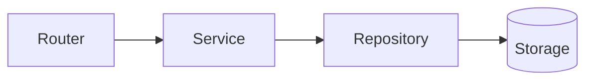

import TOCInline from '@theme/TOCInline';

# API Design & Production

<TOCInline toc={toc} minHeadingLevel={2} maxHeadingLevel={2} />

:::tip[In this guide]
The structure and conventions that make a FastAPI service production-ready:
layered layout, health/readiness checks, versioning, pagination, rate limiting,
and containerization.
:::

## What Is It?

The practices that turn a working prototype into a maintainable, deployable
service.

## Why Does It Matter?

The [RAG project](../05-rag-fundamentals/03-first-project.mdx) is built on this
exact structure. Getting it right once means every AI feature slots in cleanly.

## Production Project Structure

```text
app/
├── main.py            # create app, include routers, middleware
├── config.py          # typed settings (env-driven)
├── dependencies.py    # shared dependencies (db, auth, clients)
├── routers/
│   ├── health.py
│   ├── ingest.py
│   └── query.py
├── services/          # business logic (framework-agnostic)
│   ├── ingestion.py
│   ├── retrieval.py
│   └── llm.py
├── repositories/      # data access
├── schemas/           # Pydantic request/response models
└── models/            # domain / DB models
```

**Why separate?** Routers stay thin (HTTP concerns), services hold logic (easy
to unit-test), repositories hide storage. Each layer changes independently.



## Wiring It Together

```python
# app/main.py
from fastapi import FastAPI
from app.routers import health, ingest, query

app = FastAPI(title="RAG API", version="1.0.0")
app.include_router(health.router)
app.include_router(ingest.router, prefix="/api/v1")
app.include_router(query.router, prefix="/api/v1")
```

## Health and Readiness Checks

- **Liveness / health**: is the process up?
- **Readiness**: are dependencies (DB, vector store) reachable so it can serve traffic?

```python
@router.get("/health")
def health():
    return {"status": "ok"}

@router.get("/ready")
def ready():
    checks = {"db": db_ok(), "vector_db": chroma_ok()}
    ready = all(checks.values())
    return JSONResponse(status_code=200 if ready else 503,
                        content={"ready": ready, "checks": checks})
```

## API Versioning

Prefix routes (`/api/v1`) so you can evolve without breaking existing clients.
Introduce `/api/v2` alongside v1 during migrations.

## Pagination, Filtering, Sorting

```python
@router.get("/items")
def list_items(
    skip: int = 0,
    limit: int = Query(default=20, le=100),   # cap page size
    sort: str = "created_at",
    q: str | None = None,
):
    ...
    return {"items": items, "total": total, "skip": skip, "limit": limit}
```

Return total counts and echo paging params so clients can build controls.

## Rate Limiting (Concept)

Protect the service from abuse and runaway cost (LLM calls are expensive).
Options: a reverse proxy (NGINX), an API gateway, or middleware like
`slowapi`. Limit per API key/IP, e.g. "60 requests/minute".

## Configuration and Security Recap

- Config from environment via a typed settings object.
- Secrets from a secret manager, never in code.
- CORS restricted to known origins.
- Validate all inputs (Pydantic) and constrain outputs (`response_model`).

## Docker (Deployment Basics)

```dockerfile
FROM python:3.12-slim

WORKDIR /app
COPY requirements.txt .
RUN pip install --no-cache-dir -r requirements.txt

COPY app ./app
EXPOSE 8000
CMD ["uvicorn", "app.main:app", "--host", "0.0.0.0", "--port", "8000"]
```

Run it:

```bash
docker build -t rag-api .
docker run -p 8000:8000 --env-file .env rag-api
```

In production, run Uvicorn workers behind a process manager/reverse proxy, and
externalize config via environment variables.

## Common Mistakes

- Business logic in routers (untestable, tangled).
- No readiness check → traffic routed before dependencies are up.
- Unbounded page sizes (a client asks for `limit=1000000`).
- No versioning, so any change breaks clients.

## Interview Questions

- How do you structure a production FastAPI app?
- Liveness vs readiness checks?
- How do you version an API?
- How would you paginate and cap page size?
- Where does rate limiting belong?

## Things to Remember

- Thin routers, fat services, isolated repositories.
- `/health` and `/ready` are different.
- Version from day one; cap pagination.

## Mini Exercise

Restructure your app into `routers/`, `services/`, and `schemas/`, add
`/health` and `/ready`, and write a Dockerfile that runs it.

## Done When

- [ ] Your app uses a layered structure with `APIRouter`.
- [ ] You expose health + readiness checks and version your routes.
- [ ] You can containerize and run the app with Docker.
