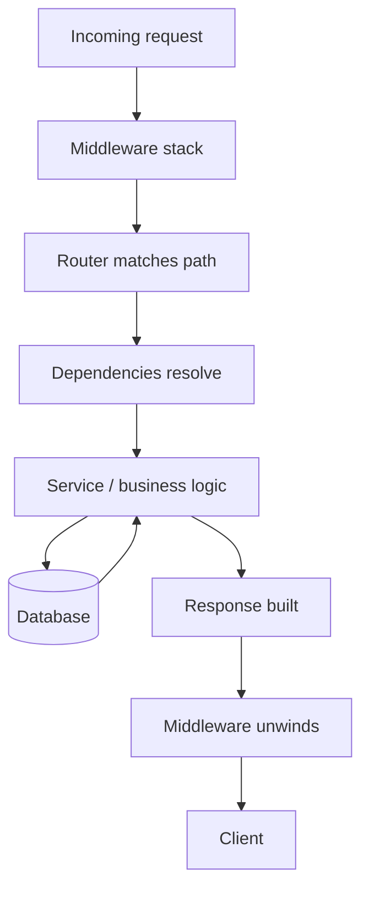

import TOCInline from '@theme/TOCInline';

# Phase 10 — Middleware & Request Lifecycle

<TOCInline toc={toc} minHeadingLevel={2} maxHeadingLevel={2} />

:::tip[In this guide]
Middleware wraps every request and response — the perfect place for CORS, request
ids, timing, and logging. You'll trace a request through the full lifecycle,
write custom middleware, understand the onion model and why order matters, and
learn when a dependency beats middleware.
:::

## What Is It?

**Middleware** is code that runs on *every* request before it reaches your route
and on *every* response before it goes back to the client. It's ideal for
cross-cutting concerns — things every endpoint needs but none should re-implement:
CORS headers, correlation ids, request timing, and logging.

## Why Does It Matter?

Cross-cutting behavior belongs in one place. Without middleware you'd copy the
same logging or header code into every handler. Understanding the request
lifecycle also explains *where* things happen — why a middleware can't see a
route's path parameters, or why CORS must run early — which is a frequent source
of confusion and interview questions.

---

## Middleware

At its core, middleware is a function that receives the request, optionally does
work, calls the next layer (`call_next`), and can modify the response on the way
out.

```python
from fastapi import FastAPI, Request

app = FastAPI()

@app.middleware("http")
async def simple_middleware(request: Request, call_next):
    # before: runs on the way in
    response = await call_next(request)     # hand off to the rest of the app
    # after: runs on the way out
    return response
```

:::info[Theory: middleware sees bytes, dependencies see parsed data]
Middleware operates at the raw HTTP layer — it has the request path and headers
but not the parsed body or resolved path/query parameters, and it runs before
routing picks a handler. Dependencies run *inside* a route, after parsing, so
they see typed inputs. That difference decides which tool fits a given job.
:::

---

## Custom Middleware

Register custom logic with `@app.middleware("http")`. Here's middleware that
attaches a header to every response:

```python
@app.middleware("http")
async def add_powered_by(request: Request, call_next):
    response = await call_next(request)
    response.headers["X-Powered-By"] = "RAG-API"
    return response
```

You can also short-circuit — return a response *without* calling `call_next` — to
block a request (e.g. maintenance mode):

```python
from fastapi.responses import JSONResponse

@app.middleware("http")
async def maintenance_gate(request: Request, call_next):
    if MAINTENANCE_MODE:
        return JSONResponse(status_code=503, content={"detail": "Down for maintenance"})
    return await call_next(request)
```

:::warning[Always call or return]
Every middleware must either `await call_next(request)` or return a response
itself. Forgetting both hangs the request. And any exception before `call_next`
escapes the normal handler chain, so keep pre-processing defensive.
:::

---

## Request Lifecycle

A request flows inward through middleware and routing to your service and
database, then the response flows back outward through the same layers.



The key insight: middleware runs **twice** per request conceptually — once on the
way in (before `call_next`) and once on the way out (after `call_next`).

---

## Response Lifecycle

On the way out, each middleware layer can inspect or mutate the response: add
headers, log the status code, record timing. Because the layers unwind in reverse
order, the *first* middleware registered wraps the response *last*.

```python
@app.middleware("http")
async def stamp_status(request: Request, call_next):
    response = await call_next(request)
    print(f"{request.method} {request.url.path} -> {response.status_code}")
    return response
```

---

## CORS

Browsers block cross-origin requests unless the server opts in with **CORS**
headers. Use `CORSMiddleware` to declare which origins, methods, and headers are
allowed.

```python
from fastapi.middleware.cors import CORSMiddleware

app.add_middleware(
    CORSMiddleware,
    allow_origins=["https://app.example.com"],   # explicit origins
    allow_credentials=True,
    allow_methods=["*"],
    allow_headers=["*"],
)
```

:::warning[Don't ship `allow_origins=["*"]` with credentials]
A wildcard origin combined with `allow_credentials=True` is rejected by browsers
and is a security risk — it would let any site make authenticated requests. List
your real frontend origins explicitly. CORS is part of the broader hardening in
[Phase 16 — Security](./16-security.mdx).
:::

---

## Request IDs

Attach a unique **correlation id** to every request so you can trace one request
across logs and services. Generate one (or reuse an incoming header) and add it
to the response.

```python
import uuid

@app.middleware("http")
async def correlation_id(request: Request, call_next):
    request_id = request.headers.get("X-Request-ID", str(uuid.uuid4()))
    request.state.request_id = request_id        # available to handlers
    response = await call_next(request)
    response.headers["X-Request-ID"] = request_id
    return response
```

:::note[Highlight: `request.state` is per-request scratch space]
`request.state` is a place to stash data (like the request id) for the lifetime
of one request. Handlers and dependencies can read it, and your logging can
include it so every log line for a request shares the same id.
:::

---

## Logging Middleware

Log one structured line per request with method, path, status, and the
correlation id. Pair this with the timing middleware below for latency.

```python
import logging
logger = logging.getLogger("app.access")

@app.middleware("http")
async def access_log(request: Request, call_next):
    response = await call_next(request)
    logger.info(
        "request",
        extra={
            "method": request.method,
            "path": request.url.path,
            "status": response.status_code,
            "request_id": getattr(request.state, "request_id", None),
        },
    )
    return response
```

Structured logging and shipping logs to a backend are covered in
[Phase 18 — Logging & Observability](./18-logging-observability.mdx).

---

## Authentication Middleware

You *can* authenticate in middleware, but for FastAPI it's usually better to use
a dependency. Middleware runs before routing, so it can't easily apply "protect
these routes, leave those public" rules or produce clean OpenAPI security docs.

```python
# Middleware approach — global, blunt:
@app.middleware("http")
async def auth_middleware(request: Request, call_next):
    if request.url.path.startswith("/public"):
        return await call_next(request)
    token = request.headers.get("Authorization")
    if not token:
        return JSONResponse(status_code=401, content={"detail": "Missing token"})
    return await call_next(request)
```

:::info[Theory: prefer dependencies for auth]
A `get_current_user` dependency (see
[Phase 7 — Authentication & Authorization](./07-authentication-authorization.mdx))
attaches auth to exactly the routes that need it, appears in the Swagger docs,
returns a typed user object, and is trivially testable. Middleware auth is
coarse, path-string-based, and invisible to the schema. Use middleware for truly
global concerns (CORS, request ids); use dependencies for auth and per-route
rules. Dependency injection is covered in
[Phase 3 — Dependency Injection](./03-dependency-injection.mdx).
:::

---

## Timing Middleware

Measure how long each request takes and expose it as a response header. This adds
the `X-Process-Time` header.

```python
import time

@app.middleware("http")
async def add_process_time(request: Request, call_next):
    start = time.perf_counter()
    response = await call_next(request)
    elapsed = time.perf_counter() - start
    response.headers["X-Process-Time"] = f"{elapsed:.4f}"
    return response
```

:::note[Highlight: use a monotonic clock]
`time.perf_counter()` is monotonic and high-resolution — the right tool for
measuring durations. `time.time()` can jump backward if the system clock is
adjusted, producing negative or wrong timings.
:::

---

## Trusted Hosts

`TrustedHostMiddleware` rejects requests whose `Host` header isn't in an allow
list, defending against host-header attacks and cache poisoning.

```python
from starlette.middleware.trustedhost import TrustedHostMiddleware

app.add_middleware(
    TrustedHostMiddleware,
    allowed_hosts=["example.com", "*.example.com"],
)
```

---

## Middleware Order and the Onion Model

Middleware nests like an **onion**: each layer wraps the next. A request passes
*inward* through every layer to the route, then the response passes *outward*
through them in reverse.


The order you *add* middleware matters. In FastAPI, middleware added **last**
runs **first** on the way in (outermost layer).

```python
app.add_middleware(CORSMiddleware, ...)     # added first -> inner
app.add_middleware(TrustedHostMiddleware, ...)  # added last -> outermost, runs first
```

:::caution[Order affects correctness, not just style]
Put `TrustedHostMiddleware` outermost so bad hosts are rejected before anything
else runs. Put timing middleware outer so it measures the full stack. Put CORS
where it can add headers even to error responses. Getting the order wrong can
mean headers are missing on some responses or checks run too late to matter.
:::

---

## Common Mistakes

- Forgetting to `await call_next` (or return a response), hanging the request.
- Using `allow_origins=["*"]` with `allow_credentials=True`.
- Doing authentication in middleware when a dependency is cleaner and documented.
- Expecting middleware to see parsed body or path/query params (it runs pre-routing).
- Adding middleware in the wrong order so timing/CORS/host checks misbehave.
- Using `time.time()` instead of `time.perf_counter()` for durations.

## Interview Questions

- What is middleware and what's it good for?
- Walk through the request lifecycle from arrival to response.
- Explain the onion model — what runs first, added first or added last?
- Why prefer a dependency over middleware for authentication?
- How do you add CORS, and what's dangerous about a wildcard origin with credentials?
- How would you implement request-id correlation across logs?
- Where does middleware sit relative to routing and dependencies?

## Things to Remember

- Middleware wraps every request/response; ideal for cross-cutting concerns.
- It runs before routing and sees raw HTTP, not parsed params or body.
- The stack is an onion; added-last runs first on the way in.
- Use `CORSMiddleware`, `TrustedHostMiddleware`, request-id, timing, and logging middleware.
- Prefer dependencies over middleware for auth and per-route rules.
- Store per-request data on `request.state`; measure with `time.perf_counter()`.

## Mini Exercise

Add four middlewares to an app: a correlation-id middleware that sets and returns
`X-Request-ID`, a timing middleware that adds `X-Process-Time`, an access-log
middleware that logs method/path/status/request-id, and `CORSMiddleware` scoped
to one origin. Confirm the ordering by logging entry/exit and observe the onion
unwinding.

## Done When

- [ ] You can write custom middleware and explain the request/response lifecycle.
- [ ] You configured CORS and trusted hosts correctly.
- [ ] You added request-id, timing, and logging middleware.
- [ ] You can explain the onion model and why dependencies often beat auth middleware.

Next: [Phase 11 — Background Processing](./11-background-processing.mdx).
