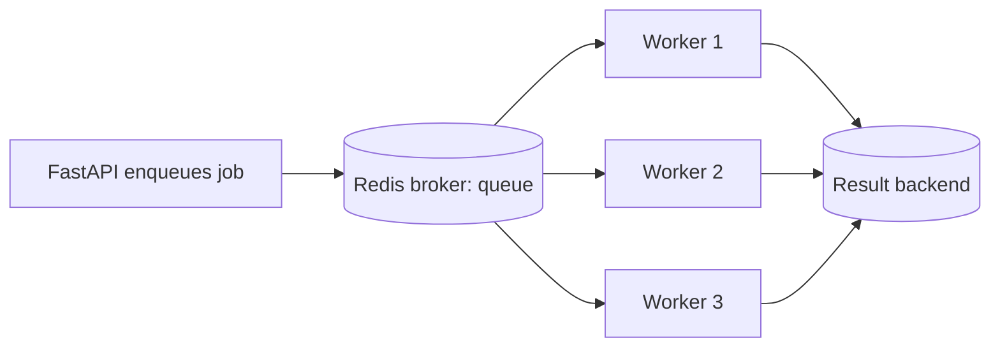

import TOCInline from '@theme/TOCInline';

# Phase 11 — Background Processing

<TOCInline toc={toc} minHeadingLevel={2} maxHeadingLevel={2} />

:::tip[In this guide]
Work that shouldn't block the response — sending email, generating reports,
running an AI pipeline — belongs in the background. You'll start with FastAPI's
built-in `BackgroundTasks`, learn its hard limits, then graduate to Celery +
Redis for durable, retriable, distributed jobs.
:::

## What Is It?

Background processing runs work *outside* the request/response cycle so the client
gets a fast answer while slow work happens elsewhere. That "elsewhere" ranges from
the same process (`BackgroundTasks`) to a fleet of separate worker machines
pulling jobs off a queue (Celery).

## Why Does It Matter?

Users shouldn't wait 30 seconds for an email to send or a video to transcode.
Offloading work keeps endpoints snappy and lets you scale slow work independently
of your web tier. Choosing the *right* mechanism — in-process vs a real queue — is
a common design question, because picking wrong means lost jobs or a frozen API.

---

## FastAPI `BackgroundTasks`

For quick fire-and-forget work that runs *after* the response is sent, FastAPI's
`BackgroundTasks` is the simplest option. It runs in the same process.

```python
from fastapi import BackgroundTasks, FastAPI

app = FastAPI()

def send_welcome_email(email: str):
    # imagine an SMTP call here
    print(f"sending welcome to {email}")

@app.post("/signup")
async def signup(email: str, background_tasks: BackgroundTasks):
    # ... create the user ...
    background_tasks.add_task(send_welcome_email, email)
    return {"status": "registered"}     # returns now; email sends after
```

The response goes out immediately; `send_welcome_email` runs afterward on the same
server.

---

## When Background Tasks Are Appropriate

`BackgroundTasks` is the right tool only when the work is:

- **Fire-and-forget** — you don't need the result in the response.
- **Short** — seconds, not minutes; it shares the worker's resources.
- **In-process-safe** — losing it on a crash/restart is acceptable.
- **Low-stakes** — no retries or delivery guarantees needed.

Good fits: sending a notification email, writing an audit log, invalidating a
cache entry, firing an analytics event.

:::warning[The hard limits of `BackgroundTasks`]
It runs *in the same process* as your web server, so it competes for the same CPU
and event loop. If the server restarts or crashes before the task finishes, the
task is **lost** — there's no persistence, no retries, no visibility, and no way
to scale it separately. For anything important or slow, use a real task queue.
:::

---

## Celery

**Celery** is a distributed task queue: your API enqueues a job, and separate
**worker** processes (possibly on other machines) pick it up and run it. Jobs
survive restarts, can be retried, and scale independently.

```bash
pip install "celery[redis]"
```

```python
# celery_app.py
from celery import Celery

celery_app = Celery(
    "worker",
    broker="redis://localhost:6379/0",       # where jobs are queued
    backend="redis://localhost:6379/1",      # where results are stored
)

@celery_app.task
def generate_report(user_id: int) -> str:
    # heavy, slow work runs in a worker process
    return f"report-for-{user_id}.pdf"
```

Enqueue from a FastAPI endpoint with `.delay(...)`:

```python
from celery_app import generate_report

@app.post("/reports")
def request_report(user_id: int):
    task = generate_report.delay(user_id)     # returns immediately
    return {"task_id": task.id, "status": "queued"}
```

Run a worker in a separate process:

```bash
celery -A celery_app worker --loglevel=info
```

:::info[Theory: BackgroundTasks vs Celery]
`BackgroundTasks` is a convenience for trivial after-response work in the same
process. Celery is infrastructure: a durable broker holds jobs, workers run them
elsewhere, and results/retries are tracked. If losing the job would matter, or the
work is heavy or long, you need Celery (or a similar queue), not `BackgroundTasks`.
:::

| | FastAPI `BackgroundTasks` | Celery + Redis/RabbitMQ |
| --- | --- | --- |
| Runs where | Same web process | Separate worker processes/machines |
| Survives restart/crash | No (lost) | Yes (persisted in broker) |
| Retries | No | Yes, configurable |
| Scaling | Tied to web workers | Scale workers independently |
| Scheduling | No | Yes (Celery Beat) |
| Best for | Short fire-and-forget | Heavy, important, long, or scheduled work |

---

## Redis

**Redis** commonly plays two roles for Celery: the **broker** (the queue that
holds pending jobs) and the **result backend** (where task results and states are
stored). It's fast, simple to run, and often already present for caching.

```python
celery_app = Celery(
    "worker",
    broker="redis://localhost:6379/0",     # broker: pending task queue
    backend="redis://localhost:6379/1",    # result backend: task states/results
)
```

:::note[Highlight: broker vs backend]
The **broker** transports jobs from producers (your API) to consumers (workers).
The **result backend** stores the outcome and status so you can poll a task's
result later. They're separate concerns — you can even use different systems for
each (RabbitMQ broker + Redis backend). Redis also powers caching in
[Phase 14 — Caching](./14-caching.mdx).
:::

:::caution[RabbitMQ vs Redis as broker]
Redis is simple and fast but was designed as a datastore, not a message broker —
it's fine for many workloads. RabbitMQ is a purpose-built broker with stronger
delivery guarantees and routing. For high-reliability messaging, teams often
choose RabbitMQ as the broker and keep Redis for results/caching.
:::

---

## Task Queues

The queue is the buffer between producers and consumers. Producers (API requests)
push jobs; workers pull and execute them at their own pace. This decouples request
rate from processing rate — a spike in requests just lengthens the queue instead
of overwhelming the workers.



You can route different job types to different **named queues** (e.g. `emails`,
`reports`) and dedicate workers to each, so slow report jobs never delay quick
emails.

---

## Retries

Transient failures (a flaky API, a brief network blip) should be retried
automatically with **backoff** so you don't hammer a struggling dependency.

```python
@celery_app.task(
    bind=True,
    autoretry_for=(ConnectionError,),      # retry on these exceptions
    retry_backoff=True,                    # exponential backoff between tries
    retry_kwargs={"max_retries": 5},
)
def call_flaky_api(self, payload: dict):
    return external_api_call(payload)
```

:::info[Theory: exponential backoff and idempotency]
`retry_backoff` waits longer after each failure (2s, 4s, 8s, ...) to give a
struggling service room to recover instead of stampeding it. Because a task may
run more than once, tasks should be **idempotent** — running twice must not double
a charge or send two emails. Design tasks so a retry is safe.
:::

---

## Dead-Letter Queues

When a job keeps failing past its retry limit, it shouldn't vanish or loop
forever. A **dead-letter queue** (DLQ) collects exhausted jobs so you can inspect,
alert on, and reprocess them later.

```python
@celery_app.task(bind=True, max_retries=3)
def process(self, data: dict):
    try:
        do_work(data)
    except Exception as exc:
        try:
            raise self.retry(exc=exc, countdown=10)
        except self.MaxRetriesExceededError:
            send_to_dead_letter(data)      # park it for manual review
```

:::note[Highlight: don't silently drop failed work]
A DLQ turns "we lost some jobs" into "here are the jobs that failed and why."
That's the difference between a debuggable system and a mystery. Monitor DLQ depth
and alert when it grows.
:::

---

## Scheduled Jobs

For recurring work — nightly cleanups, hourly syncs, daily digests — use **Celery
Beat**, a scheduler that enqueues tasks on a timetable (interval or cron-style).

```python
from celery.schedules import crontab

celery_app.conf.beat_schedule = {
    "nightly-cleanup": {
        "task": "tasks.cleanup",
        "schedule": crontab(hour=3, minute=0),   # every day at 03:00
    },
    "every-15-min-sync": {
        "task": "tasks.sync",
        "schedule": 900.0,                        # seconds
    },
}
```

```bash
celery -A celery_app beat --loglevel=info      # run the scheduler process
```

:::caution[Beat enqueues, workers execute]
Celery Beat only *schedules* — it pushes the task onto the queue at the right
time; a worker still has to be running to execute it. Run exactly one Beat process
to avoid duplicate scheduling. A system `cron` calling a script is a simpler
alternative when you don't already run Celery.
:::

---

## Distributed Workers

Because workers are separate processes talking to a shared broker, you scale
throughput by **adding more workers** — on the same box or across many machines.
No web-server changes needed.

```bash
# more processes on one machine:
celery -A celery_app worker --concurrency=8

# or run workers on additional machines pointed at the same broker
celery -A celery_app worker --hostname=worker@%h
```

:::info[Theory: scale the slow part independently]
Splitting web and workers lets each scale to its own bottleneck — add web workers
for request volume, add task workers for processing volume. This is the backbone
of AI backends where a fast API accepts jobs and a pool of GPU/CPU workers runs
embeddings or inference. Broader scaling patterns are in
[Phase 20 — Performance & Scalability](./20-performance-scalability.mdx).
:::

---

## Common Mistakes

- Using `BackgroundTasks` for important or long work, then losing jobs on restart.
- Blocking the event loop with heavy work instead of offloading to a worker.
- Non-idempotent tasks that double-charge or double-send when retried.
- No retry/backoff, so a transient failure permanently drops the job.
- No dead-letter queue, so failed jobs disappear silently.
- Running multiple Celery Beat processes, causing duplicate scheduled jobs.
- Forgetting to actually run a worker (Beat schedules but nothing executes).

## Interview Questions

- When do you use `BackgroundTasks` vs Celery?
- What are the limitations of FastAPI background tasks?
- What roles does Redis play in a Celery setup (broker vs backend)?
- How do task queues decouple producers from consumers?
- How would you implement retries with backoff, and why must tasks be idempotent?
- What's a dead-letter queue and why is it useful?
- How do you schedule recurring jobs, and how do you scale workers?

## Things to Remember

- `BackgroundTasks` = in-process, short, fire-and-forget, no persistence or retries.
- Celery = durable, distributed, retriable jobs run by separate workers.
- Redis serves as broker (queue) and/or result backend; RabbitMQ for stronger guarantees.
- Use `autoretry_for` + `retry_backoff`; keep tasks idempotent.
- Park exhausted jobs in a dead-letter queue instead of dropping them.
- Celery Beat schedules recurring tasks; scale by adding workers.

## Mini Exercise

Implement the same "generate report" job two ways: first with `BackgroundTasks`,
then with a Celery task enqueued via `.delay()` backed by Redis. Add
`autoretry_for` with backoff to a task that calls a flaky function, route it to a
named queue, and add a Celery Beat entry that runs a cleanup task nightly. Kill and
restart the process mid-job to see why the queue-backed version survives.

## Done When

- [ ] You can offload work with `BackgroundTasks` and state its limits.
- [ ] You set up a Celery task with Redis as broker and backend and enqueue it.
- [ ] You configured retries with backoff and understand idempotency and DLQs.
- [ ] You can schedule recurring jobs and scale with distributed workers.

Next: [Phase 12 — File Uploads](./12-file-uploads.mdx).
