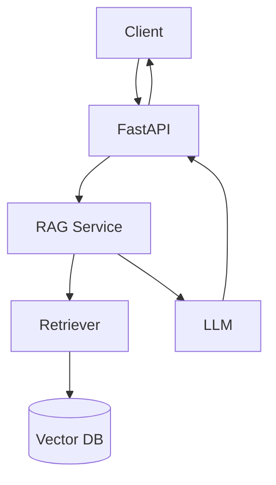

import TOCInline from '@theme/TOCInline';

# FastAPI + AI Integration

<TOCInline toc={toc} minHeadingLevel={2} maxHeadingLevel={2} />

:::tip[In this guide]
The bridge between backend and AI: the three endpoints your RAG service exposes,
the layered architecture behind them, and why async matters here.
:::

## What Is It?

Exposing an AI/RAG pipeline through a clean HTTP API — the same FastAPI patterns
you've learned, now serving a retriever + LLM.

## Why Does It Matter?

This is the shape of most real LLM applications: a thin API in front of an
ingestion pipeline and a retrieval+generation pipeline. Everything from the
[RAG sections](../05-rag-fundamentals/index.mdx) onward builds on this.

## The Three Endpoints

```text
GET  /health   → service is up
POST /ingest   → add documents to the knowledge base
POST /ask      → answer a question using retrieved context
```

## The Architecture



Mapped onto the [production structure](./10-api-design-production.mdx):

- `routers/ingest.py`, `routers/query.py`, `routers/health.py` — HTTP layer.
- `services/ingestion.py` — chunk + embed + store.
- `services/retrieval.py` — embed query, search vector DB.
- `services/llm.py` — call the local model (Ollama).

## Request/Response Schemas

```python
from pydantic import BaseModel

class IngestRequest(BaseModel):
    documents: list[str]

class IngestResponse(BaseModel):
    chunks_added: int

class AskRequest(BaseModel):
    question: str
    top_k: int = 4

class Source(BaseModel):
    text: str
    score: float

class AskResponse(BaseModel):
    answer: str
    sources: list[Source]
```

## The Endpoints (Skeleton)

```python
from fastapi import APIRouter, Depends

router = APIRouter(tags=["rag"])

@router.post("/ingest", response_model=IngestResponse)
async def ingest(req: IngestRequest, svc=Depends(get_ingestion_service)):
    count = await svc.ingest(req.documents)
    return IngestResponse(chunks_added=count)

@router.post("/ask", response_model=AskResponse)
async def ask(req: AskRequest, svc=Depends(get_rag_service)):
    result = await svc.answer(req.question, top_k=req.top_k)
    return AskResponse(answer=result.answer, sources=result.sources)
```

## Why Async Here

Notice the connection back to [Python async](../01-python/09-async-concurrency.mdx)
and [FastAPI async](./05-async-background-tasks.mdx):

```text
Python async/await
   ↓
FastAPI async endpoints
   ↓
/ingest  → embed + store (I/O)
/ask     → embed query → search vector DB → call LLM (all I/O)
```

Every step waits on I/O (disk, vector DB, the model). Async endpoints let one
worker handle many concurrent questions while those waits happen.

## The Data Flow, End to End

```text
/ingest:  documents → chunk → embed → store in Chroma
/ask:     question → embed → retrieve top-k chunks → build prompt → LLM → answer + sources
```

## Common Mistakes

- Blocking the event loop with a sync model/DB call inside `async def`.
- No `/health` (and later `/ready`) → hard to deploy/monitor.
- Returning the answer with no `sources` — you lose traceability.
- Putting chunking/embedding logic directly in the router.

## Interview Questions

- Sketch the architecture of a RAG API. What are the endpoints?
- Why is async a good fit for an LLM-serving API?
- Where does chunking/embedding live in your layers?
- Why return sources with the answer?

## Things to Remember

- Three endpoints: `/health`, `/ingest`, `/ask`.
- Thin routers → services (ingestion, retrieval, llm).
- Async because every step is I/O-bound.

## Mini Exercise

Create the `/ingest` and `/ask` route stubs with the Pydantic schemas above,
returning mocked data. Confirm they appear in `/docs`. You'll fill in the
services in the [RAG sections](../05-rag-fundamentals/index.mdx).

## Done When

- [ ] You can describe the RAG API architecture from memory.
- [ ] You have `/health`, `/ingest`, `/ask` stubs with typed schemas.
- [ ] You understand why each step benefits from async.

Next: [03 · Local LLMs / Ollama](../03-local-llms-ollama/index.mdx).
