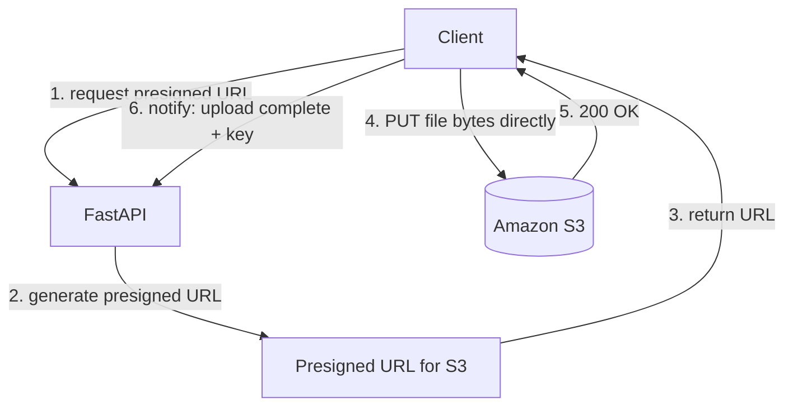

import TOCInline from '@theme/TOCInline';

# Phase 12 — File Uploads

<TOCInline toc={toc} minHeadingLevel={2} maxHeadingLevel={2} />

:::tip[In this guide]
How to receive files safely: reading `UploadFile`, declaring `File` metadata,
handling multipart forms and multiple files, validating type and size without
trusting the client, streaming large uploads in chunks, and pushing the heavy
lifting to S3 with presigned URLs.
:::

## What Is It?

File upload handling is how your API accepts binary payloads — images,
documents, audio, PDFs for a RAG pipeline — over `multipart/form-data`. FastAPI
exposes uploads through `UploadFile`, which streams data to a spooled temporary
file instead of loading everything into memory.

## Why Does It Matter?

File uploads are very useful for real applications. Almost every product needs
them: profile pictures, CSV imports, document ingestion for AI, attachments. Do
it naively and you get memory exhaustion, malicious files, and a slow API. Do it
well and large uploads never touch your Python workers at all.

---

## UploadFile

`UploadFile` is FastAPI's wrapper around an uploaded file. It streams the bytes
to a `SpooledTemporaryFile`: small files stay in memory, and once they cross a
threshold they spill to disk. That keeps memory usage bounded even for large
uploads.

```python
from fastapi import FastAPI, UploadFile

app = FastAPI()

@app.post("/upload")
async def upload(file: UploadFile):
    contents = await file.read()          # read the whole file into bytes
    return {
        "filename": file.filename,
        "content_type": file.content_type,
        "size": len(contents),
    }
```

Key attributes and async methods:

| Member | What it gives you |
| --- | --- |
| `file.filename` | Original client-supplied name (untrusted) |
| `file.content_type` | Client-supplied MIME type (untrusted) |
| `file.file` | The underlying file-like object |
| `await file.read(size)` | Read `size` bytes (or all if omitted) |
| `await file.seek(offset)` | Move the read cursor |
| `await file.close()` | Release the temp file |

:::info[Theory: why `UploadFile` instead of `bytes`]
You *can* declare a parameter as `bytes`, but that forces FastAPI to read the
entire body into RAM before your function runs. A 2 GB upload becomes 2 GB of
memory. `UploadFile` streams to a spooled temp file, so you control when and how
much you read. Prefer `UploadFile` for anything larger than a few kilobytes.
:::

---

## File

`File` declares upload-specific metadata and marks a parameter as part of the
multipart body. You typically pair it with `Annotated`. Use it when you need a
description, when accepting raw `bytes`, or when accepting a list of files.

```python
from typing import Annotated
from fastapi import File, UploadFile

@app.post("/avatar")
async def avatar(
    file: Annotated[UploadFile, File(description="A square PNG or JPEG")],
):
    return {"filename": file.filename}

@app.post("/raw")
async def raw(data: Annotated[bytes, File()]):
    # small files only — this reads everything into memory
    return {"size": len(data)}
```

:::note[Highlight: `UploadFile` vs `bytes` with `File()`]
`UploadFile` streams and exposes metadata; `bytes` with `File()` reads the whole
body into memory and gives you only the raw content. Reach for `UploadFile`
unless the payload is tiny and you genuinely want the bytes directly.
:::

---

## Multipart / form-data

Browsers send files using the `multipart/form-data` content type. FastAPI parses
it through the `python-multipart` library, which you must install separately.

```bash
pip install python-multipart
```

:::warning[Missing `python-multipart`]
If `python-multipart` is not installed, any endpoint using `File()` or `Form()`
raises a runtime error the moment a request arrives (or at startup with newer
versions). It is an easy dependency to forget in a fresh environment or a slim
Docker image.
:::

You can mix regular form fields with files in the same multipart request:

```python
from typing import Annotated
from fastapi import File, Form, UploadFile

@app.post("/documents")
async def create_document(
    title: Annotated[str, Form()],
    tags: Annotated[str, Form()],
    file: Annotated[UploadFile, File()],
):
    return {"title": title, "tags": tags, "filename": file.filename}
```

:::caution[No JSON body alongside files]
A multipart endpoint cannot also accept a JSON request body. If you need
structured metadata, send it as `Form` fields (a JSON string field you parse
yourself works too). See the form-data notes in
[Phase 1 — FastAPI Fundamentals](./01-fastapi-fundamentals.mdx).
:::

---

## Multiple Files

Accept several files at once by typing the parameter as `list[UploadFile]`.

```python
from typing import Annotated
from fastapi import File, UploadFile

@app.post("/gallery")
async def gallery(files: list[UploadFile]):
    return {"count": len(files), "names": [f.filename for f in files]}

@app.post("/gallery-described")
async def gallery_described(
    files: Annotated[list[UploadFile], File(description="One or more images")],
):
    sizes = []
    for f in files:
        content = await f.read()
        sizes.append(len(content))
        await f.close()
    return {"sizes": sizes}
```

The HTML form uses the same field name repeated, and the browser sends each file
as its own part:

```text
POST /gallery
Content-Type: multipart/form-data; boundary=...

--...
Content-Disposition: form-data; name="files"; filename="a.png"
--...
Content-Disposition: form-data; name="files"; filename="b.png"
```

---

## File Validation

Never trust an upload. Validate the extension, declared MIME type, and — most
importantly — the actual content. Reject anything that fails before you store it.

```python
from fastapi import HTTPException, UploadFile

ALLOWED_EXTENSIONS = {".png", ".jpg", ".jpeg", ".pdf"}

def check_extension(filename: str) -> None:
    import os
    _, ext = os.path.splitext(filename.lower())
    if ext not in ALLOWED_EXTENSIONS:
        raise HTTPException(status_code=400, detail=f"Extension {ext} not allowed")

@app.post("/validated")
async def validated(file: UploadFile):
    check_extension(file.filename or "")
    return {"ok": True}
```

:::warning[Sanitize the filename]
`file.filename` comes straight from the client and may contain path traversal
sequences like `../../etc/passwd`. Never join it directly onto a storage path.
Strip the directory, generate your own name (a UUID), and keep only a safe
extension. More attack surface in [Phase 16 — Security](./16-security.mdx).
:::

---

## File Size Limits

The single most important limit. A client can lie about `Content-Length`, so
enforce a hard cap while you stream, and abort as soon as you exceed it.

```python
from fastapi import HTTPException, UploadFile

MAX_BYTES = 10 * 1024 * 1024        # 10 MB
CHUNK = 1024 * 1024                 # 1 MB per read

@app.post("/limited")
async def limited(file: UploadFile):
    total = 0
    while chunk := await file.read(CHUNK):
        total += len(chunk)
        if total > MAX_BYTES:
            raise HTTPException(status_code=413, detail="File too large")
    return {"size": total}
```

:::info[Theory: why not just read then check the length]
Calling `await file.read()` with no argument buffers the entire upload first. An
attacker sends a 5 GB file, your worker spools 5 GB to disk, and *then* you
reject it — the damage is done. Checking the running total as you stream lets
you bail out after the first `max` bytes are exceeded. Status `413 Payload Too
Large` is the correct response.
:::

Set a coarse limit at the edge too (Nginx `client_max_body_size`, or an API
gateway) so most oversized requests never reach Python at all.

---

## MIME Validation

The `content_type` header is client-supplied and trivially spoofed. Use it as a
first cheap filter, then confirm the real type by inspecting the file's **magic
bytes** (the signature at the start of the file).

```python
from fastapi import HTTPException, UploadFile

ALLOWED_MIME = {"image/png", "image/jpeg", "application/pdf"}

# magic byte signatures
SIGNATURES = {
    b"\x89PNG\r\n\x1a\n": "image/png",
    b"\xff\xd8\xff": "image/jpeg",
    b"%PDF": "application/pdf",
}

def sniff_mime(header: bytes) -> str | None:
    for sig, mime in SIGNATURES.items():
        if header.startswith(sig):
            return mime
    return None

@app.post("/strict-upload")
async def strict_upload(file: UploadFile):
    # cheap first check on the declared type
    if file.content_type not in ALLOWED_MIME:
        raise HTTPException(status_code=400, detail="Declared type not allowed")

    header = await file.read(8)              # read just enough for the signature
    await file.seek(0)                       # rewind so later reads see the whole file

    real_mime = sniff_mime(header)
    if real_mime not in ALLOWED_MIME:
        raise HTTPException(status_code=400, detail="File content does not match an allowed type")

    return {"declared": file.content_type, "real": real_mime}
```

:::caution[Don't trust the client — verify magic bytes]
A `.exe` renamed to `photo.png` with `Content-Type: image/png` passes every
header-only check. Reading the leading bytes and matching a known signature is
what actually confirms the file is what it claims to be. For richer detection,
libraries like `python-magic` wrap `libmagic`. Always `seek(0)` afterward.
:::

---

## Streaming Uploads

For large files, stream from the request straight to the destination in fixed
chunks. This keeps memory flat regardless of file size.

```python
import uuid
from pathlib import Path
from fastapi import UploadFile

STORAGE = Path("uploads")
STORAGE.mkdir(exist_ok=True)
CHUNK = 1024 * 1024

@app.post("/stream")
async def stream_to_disk(file: UploadFile):
    safe_name = f"{uuid.uuid4().hex}"        # never reuse client filename
    dest = STORAGE / safe_name
    total = 0
    with dest.open("wb") as out:
        while chunk := await file.read(CHUNK):
            out.write(chunk)
            total += len(chunk)
    return {"stored_as": safe_name, "size": total}
```

:::info[Theory: chunked I/O keeps memory bounded]
Reading a fixed `CHUNK` at a time means peak memory is one chunk, not the whole
file. Combine chunked reads with the running size check from the limits section
and you can accept large uploads safely on a small worker. For truly large
payloads, skip your API entirely with presigned URLs below.
:::

---

## S3 Uploads (boto3)

To offload storage and serving, push files to object storage such as Amazon S3
using `boto3`. Stream the `UploadFile` object directly with `upload_fileobj`,
which handles multipart transfer internally.

```python
import boto3
from fastapi import UploadFile

s3 = boto3.client("s3")
BUCKET = "my-app-uploads"

@app.post("/s3-upload")
async def s3_upload(file: UploadFile):
    key = f"documents/{file.filename}"
    # upload_fileobj streams in parts; it does not buffer the whole file
    s3.upload_fileobj(
        file.file,
        BUCKET,
        key,
        ExtraArgs={"ContentType": file.content_type or "application/octet-stream"},
    )
    return {"bucket": BUCKET, "key": key}
```

:::note[Highlight: boto3 is synchronous]
`boto3` calls are blocking. Inside an `async def` endpoint, offload them with
`await run_in_threadpool(...)` (or `asyncio.to_thread`) so they don't stall the
event loop, or use an async client like `aioboto3`. Async fundamentals are in
[Phase 8 — Async FastAPI](./08-async-fastapi.mdx).
:::

---

## Presigned URLs

The production pattern: don't pipe large uploads through your API at all. Your
API generates a short-lived **presigned URL**, and the client uploads directly
to S3 using it.

```python
import boto3
from fastapi import FastAPI

s3 = boto3.client("s3")
BUCKET = "my-app-uploads"

@app.post("/uploads/presign")
def presign(filename: str, content_type: str):
    key = f"incoming/{filename}"
    url = s3.generate_presigned_url(
        ClientMethod="put_object",
        Params={"Bucket": BUCKET, "Key": key, "ContentType": content_type},
        ExpiresIn=300,                       # valid for 5 minutes
    )
    return {"upload_url": url, "key": key}
```

The client then does a plain `PUT` to `upload_url` with the file bytes — S3
receives the data, not your server.



:::info[Theory: why presigned URLs offload large uploads]
When the client uploads through your API, every byte crosses your network,
consumes worker memory and connection time, and blocks a request slot — a
handful of concurrent 1 GB uploads can starve your whole service. A presigned
URL moves the transfer directly between the client and S3. Your API only issues
a signed, expiring, scoped permission (specific bucket, key, and method). You get
unlimited upload throughput, tiny API load, and no large payloads in your Python
process. The client just tells you the key when it's done.
:::

:::caution[Scope and expire presigned URLs tightly]
Presigned URLs are bearer credentials — anyone with the link can use it until it
expires. Keep `ExpiresIn` short, pin the exact `Key` and `ContentType`, and
consider a max-size condition (presigned POST policies support this). Validate
the stored object server-side afterward. Deeper coverage in
[Phase 16 — Security](./16-security.mdx).
:::

---

## Common Mistakes

- Forgetting to install `python-multipart`, breaking every `File`/`Form` route.
- Calling `await file.read()` with no size, buffering huge files into memory.
- Trusting `filename` or `content_type` from the client without verification.
- Never checking magic bytes, so a renamed executable sails through.
- Joining the raw client filename onto a path (traversal / overwrite risk).
- Piping multi-gigabyte uploads through the API instead of using presigned URLs.
- Calling blocking `boto3` in `async def` without offloading to a thread.

## Interview Questions

- Why prefer `UploadFile` over a `bytes` parameter for large files?
- How do you enforce a maximum upload size safely while streaming?
- Why is `content_type` insufficient, and what are magic bytes?
- What problem do presigned URLs solve, and how does the flow work?
- Why can't a multipart endpoint also accept a JSON body?
- How do you avoid blocking the event loop when calling `boto3`?

## Things to Remember

- `UploadFile` streams to a spooled temp file; `File()` adds metadata.
- `multipart/form-data` needs `python-multipart` installed.
- Validate extension, declared MIME, and real content (magic bytes).
- Enforce a size cap while streaming; return `413` when exceeded.
- Never store the client filename directly; generate your own.
- Presigned URLs let clients upload straight to S3, offloading your API.

## Mini Exercise

Build a `POST /documents` endpoint that accepts a single `UploadFile`, rejects
anything that is not a PNG, JPEG, or PDF (verified by magic bytes, not just the
header), enforces a 5 MB limit while streaming, and stores the file under a
generated UUID name. Then add a `POST /documents/presign` endpoint that returns a
5-minute presigned S3 PUT URL and compare the two approaches.

## Done When

- [ ] You can accept single and multiple files with `UploadFile`.
- [ ] You validate type by content, not just the client-supplied header.
- [ ] You enforce a streaming size limit and return the right status code.
- [ ] You can generate a presigned URL and explain why it offloads your API.

Next: [Phase 13 — API Design](./13-api-design.mdx).
