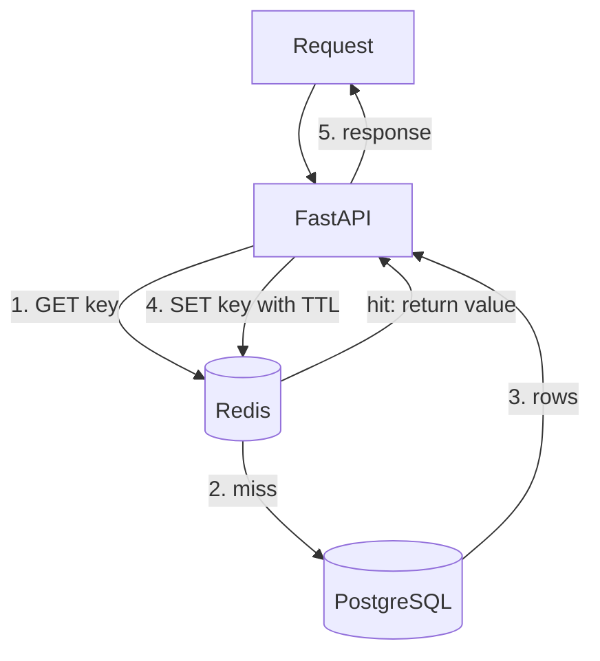
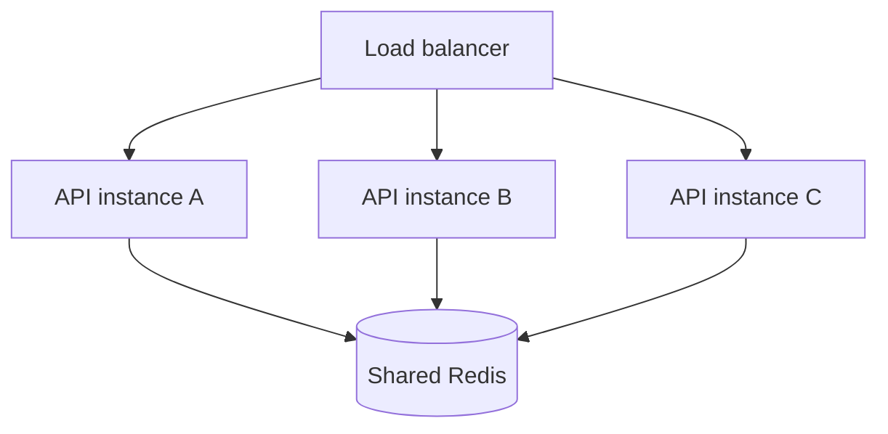

import TOCInline from '@theme/TOCInline';

# Phase 14 — Caching

<TOCInline toc={toc} minHeadingLevel={2} maxHeadingLevel={2} />

:::tip[In this guide]
How to make your API fast and resilient with Redis: storing key/value data with
expirations, the cache-aside pattern and how to invalidate correctly, wiring
`redis.asyncio` into FastAPI, and using Redis for rate limiting, sessions, and
distributed locks.
:::

## What Is It?

Caching stores the result of an expensive operation so future requests can reuse
it instead of recomputing. **Redis** is an in-memory data store commonly used as
the cache: it holds key/value pairs in RAM, serves reads in microseconds, and
can expire keys automatically.

## Why Does It Matter?

Databases and downstream APIs (including LLMs and embedding services) are slow
and costly compared to memory. A cache absorbs repeated reads, cuts latency by
orders of magnitude, and protects your database from load spikes. Done wrong,
though, caching serves stale or wrong data — so invalidation is the hard part.

---

## Redis Fundamentals

Redis is a single-threaded, in-memory key/value store that also supports rich
data types (strings, hashes, lists, sets, sorted sets). Because it lives in RAM
and runs commands one at a time, individual operations are extremely fast and
atomic.

```bash
# run Redis locally with Docker
docker run -p 6379:6379 redis:7
```

```python
import redis

r = redis.Redis(host="localhost", port=6379, decode_responses=True)
r.set("greeting", "hello")
print(r.get("greeting"))          # "hello"
```

:::info[Theory: why in-memory changes everything]
A disk-backed database read can take milliseconds and contend for I/O. A Redis
lookup is a memory access plus a network round trip — typically well under a
millisecond. Moving hot reads to Redis turns a database-bound endpoint into a
memory-bound one, which is why caches sit in front of nearly every high-traffic
service.
:::

---

## Key/Value

Everything in Redis is addressed by a **key**. Design keys as structured,
namespaced strings so they're easy to reason about and invalidate.

```python
# namespaced keys: <entity>:<id> or <entity>:<id>:<field>
r.set("user:42", '{"id": 42, "name": "Ada"}')
r.set("user:42:profile", "...")

# grouping by prefix makes bulk operations possible
r.mset({"product:1": "Widget", "product:2": "Gadget"})
values = r.mget("product:1", "product:2")
```

:::note[Highlight: key naming is a design decision]
A consistent scheme like `user:{id}` or `orders:list:page:{n}` lets you find and
invalidate related keys predictably. Avoid opaque keys — future-you needs to know
what `x9f2` caches. Colons are the conventional separator.
:::

---

## TTL (`EX` / `SETEX`)

A **TTL** (time to live) makes a key expire automatically after N seconds. TTLs
are your safety net: even if invalidation logic misses a case, stale data
disappears on its own.

```python
# set value and expiry together
r.set("session:abc", "user-42", ex=3600)      # expires in 1 hour
r.setex("otp:555", 300, "123456")              # SETEX: 5-minute one-time code

# inspect / change expiry
r.ttl("session:abc")     # seconds remaining, -1 if no expiry, -2 if missing
r.expire("session:abc", 1800)                  # reset to 30 minutes
r.persist("session:abc")                       # remove expiry entirely
```

:::caution[Always set a TTL on cache entries]
A cache key with no expiry lives until you explicitly delete it. Forget one
invalidation path and it serves stale data forever, while unbounded keys slowly
exhaust memory. Give every cache entry a TTL sized to how stale the data may
acceptably be.
:::

---

## Cache-Aside (Read-Through Pattern)

The most common pattern: the application checks the cache first, and on a
**miss** loads from the database and populates the cache. The cache sits *aside*
the database; the app orchestrates both.

```python
import json

def get_user(user_id: int) -> dict:
    key = f"user:{user_id}"
    cached = r.get(key)
    if cached:                                 # cache hit
        return json.loads(cached)

    user = db.query(User).get(user_id)         # cache miss -> load from DB
    r.set(key, json.dumps(user.to_dict()), ex=300)   # populate cache
    return user.to_dict()
```



:::info[Theory: cache-aside vs read-through]
In pure **cache-aside**, the application owns both the cache and the DB read
(the code above). In a **read-through** cache, the cache library itself fetches
from the DB on a miss, and the app only ever talks to the cache. Cache-aside is
the most common in FastAPI because it's explicit and needs no special cache
layer — you just add a `get`/`set` around your query.
:::

---

## Cache Invalidation

The hard problem. When the underlying data changes, the cache must reflect it.
Three strategies, often combined:

**Write-through** — update the cache whenever you write the DB:

```python
def update_user(user_id: int, data: dict) -> None:
    db.update(User, user_id, data)
    r.set(f"user:{user_id}", json.dumps(data), ex=300)   # keep cache in sync
```

**Delete-on-write (invalidation)** — delete the key on write; the next read
repopulates it. Simpler and safer than write-through:

```python
def update_user(user_id: int, data: dict) -> None:
    db.update(User, user_id, data)
    r.delete(f"user:{user_id}")             # next GET repopulates from DB
```

**TTL-based** — let entries expire on their own; accept bounded staleness.

:::warning[Cache invalidation is where bugs hide]
The classic failure: you update a row but forget one of the keys that cached it
(a list view, a search result, a computed aggregate). Prefer **delete-on-write**
for its simplicity, keep a **TTL** on everything as a backstop, and keep key
schemes tight so you know exactly which keys a write touches.
:::

---

## Redis with FastAPI (`redis.asyncio`)

In an async app, use the async client so cache calls don't block the event loop.
Create one connection pool at startup and reuse it.

```python
from contextlib import asynccontextmanager
import redis.asyncio as redis
from fastapi import FastAPI

@asynccontextmanager
async def lifespan(app: FastAPI):
    app.state.redis = redis.from_url(
        "redis://localhost:6379", decode_responses=True
    )
    yield
    await app.state.redis.aclose()

app = FastAPI(lifespan=lifespan)

@app.get("/users/{user_id}")
async def get_user(user_id: int):
    r = app.state.redis
    key = f"user:{user_id}"
    cached = await r.get(key)
    if cached:
        return json.loads(cached)
    user = await load_user_from_db(user_id)
    await r.set(key, json.dumps(user), ex=300)
    return user
```

:::note[Highlight: one pool, injected as a dependency]
Create the client once (in `lifespan`) and share it — opening a connection per
request is wasteful. Exposing it via a dependency keeps handlers testable; see
[Phase 3 — Dependency Injection](./03-dependency-injection.mdx). Async details
are in [Phase 8 — Async FastAPI](./08-async-fastapi.mdx).
:::

---

## Distributed Caching

When you run multiple API instances behind a load balancer, an in-process
(local) cache diverges — each worker has its own copy. A shared Redis gives every
instance one consistent view.



:::info[Theory: local cache vs distributed cache]
A local dict cache is fastest but per-process: instance A caches a value,
instance B never sees it, and invalidating one leaves the others stale. A
distributed cache (Redis) is a single source of truth all instances share — a
write invalidates it for everyone at once. The tradeoff is a network hop per
lookup, which is still far cheaper than a database query.
:::

---

## Rate Limiting

Redis is the natural home for rate limiting because counters are shared across
all instances and operations are atomic.

**Fixed window** — count requests per key per time window:

```python
async def allow_request(client_id: str, limit: int = 100, window: int = 60) -> bool:
    key = f"rate:{client_id}:{int(time.time()) // window}"
    count = await r.incr(key)
    if count == 1:
        await r.expire(key, window)          # set TTL on first hit
    return count <= limit
```

**Token bucket** — allow bursts while capping the sustained rate. Tokens refill
over time and each request consumes one; when the bucket is empty, requests are
rejected. It smooths traffic better than a hard fixed window.

```text
bucket capacity = 10 tokens
refill = 1 token/second
each request removes 1 token; empty bucket -> 429
```

:::caution[Fixed window has edge bursts]
A fixed window lets a client send `limit` requests at the very end of one window
and `limit` again at the start of the next — up to double the intended rate for a
moment. Token bucket or sliding-window counters avoid this. Return `429 Too Many
Requests` with a `Retry-After` header when limiting.
:::

---

## Session Storage

Because REST is stateless, session data (when you need it) lives in a shared
store, not in worker memory. Redis with a TTL is ideal.

```python
import json, uuid

async def create_session(user_id: int) -> str:
    session_id = uuid.uuid4().hex
    await r.set(f"session:{session_id}", json.dumps({"user_id": user_id}), ex=3600)
    return session_id

async def read_session(session_id: str) -> dict | None:
    raw = await r.get(f"session:{session_id}")
    return json.loads(raw) if raw else None
```

:::note[Highlight: shared sessions enable horizontal scaling]
If sessions lived in a worker's memory, a user would have to hit the same worker
every request. Storing them in Redis means any instance can serve any request —
the same statelessness that lets you scale out. Token-based auth avoids
server-side sessions entirely; see
[Phase 7 — Authentication & Authorization](./07-authentication-authorization.mdx).
:::

---

## Distributed Locks

Sometimes only one worker should perform an action at a time (a scheduled job, a
non-idempotent operation). A distributed lock in Redis coordinates across
instances using `SET` with `NX` (set only if not exists) and `PX` (expiry in
milliseconds).

```python
import uuid

async def with_lock(name: str, ttl_ms: int = 5000):
    token = uuid.uuid4().hex
    # NX: only set if absent; PX: auto-release after ttl_ms
    acquired = await r.set(f"lock:{name}", token, nx=True, px=ttl_ms)
    return token if acquired else None

async def release_lock(name: str, token: str) -> None:
    # only release if we still own it (compare token) — done atomically via Lua
    lua = "if redis.call('get', KEYS[1]) == ARGV[1] then return redis.call('del', KEYS[1]) else return 0 end"
    await r.eval(lua, 1, f"lock:{name}", token)
```

:::warning[Redlock caveat]
`SET NX PX` gives a good-enough lock for many jobs, but it is not a bulletproof
distributed lock. The **Redlock** algorithm (locking across multiple independent
Redis nodes) exists for stronger guarantees, yet it is debated and still can't
fully protect against clock drift and process pauses. Always set a TTL so a
crashed holder can't deadlock forever, and design the protected operation to be
idempotent where possible.
:::

---

## Common Mistakes

- Caching without a TTL, so stale data lives forever and memory leaks.
- Forgetting to invalidate every key a write affects (lists, aggregates).
- Using a local in-process cache across multiple instances (divergence).
- Blocking the event loop with a synchronous Redis client in async code.
- Opening a new Redis connection per request instead of pooling.
- Relying on a fixed-window rate limiter and getting edge-of-window bursts.
- Treating `SET NX PX` as a perfect lock without a TTL or idempotent operation.

## Interview Questions

- Explain the cache-aside pattern and draw the request flow.
- What are the main cache invalidation strategies and their tradeoffs?
- Why does every cache entry need a TTL?
- How would you implement rate limiting with Redis? Fixed window vs token bucket?
- Why is a distributed cache necessary when running multiple instances?
- What is the Redlock caveat with Redis locks?

## Things to Remember

- Redis is in-memory, atomic, and microsecond-fast — ideal for hot reads.
- Cache-aside: check cache, miss loads DB and populates cache.
- Prefer delete-on-write invalidation, always backed by a TTL.
- Use `redis.asyncio` with one shared connection pool in async apps.
- Redis powers rate limiting, sessions, and distributed locks across instances.
- `SET NX PX` locks need a TTL; Redlock has known caveats.

## Mini Exercise

Add cache-aside to a `GET /products/{id}` endpoint using `redis.asyncio`: cache
misses load from the DB and populate Redis with a 5-minute TTL. Implement
delete-on-write in the corresponding `PATCH`. Then add a fixed-window rate
limiter (100 requests/minute per client) that returns `429` with `Retry-After`
when exceeded. Verify hits are served from cache and updates invalidate correctly.

## Done When

- [ ] You can implement cache-aside with `redis.asyncio` and TTLs.
- [ ] You can explain and apply the main invalidation strategies.
- [ ] You built a Redis-backed rate limiter and know its edge cases.
- [ ] You understand distributed caching, sessions, and lock caveats.

Next: [Phase 15 — Testing](./15-testing.mdx).
