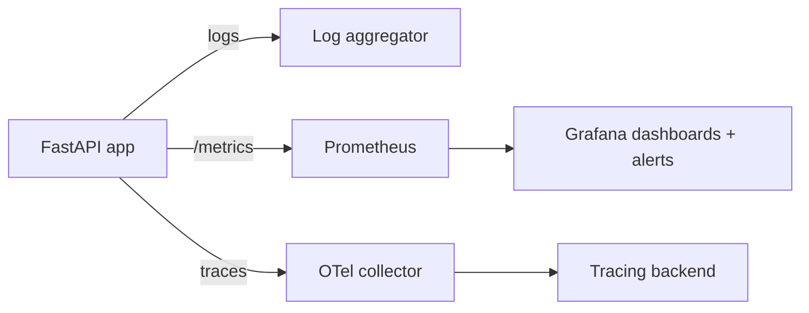

import TOCInline from '@theme/TOCInline';

# Phase 18 — Logging & Observability

<TOCInline toc={toc} minHeadingLevel={2} maxHeadingLevel={2} />

:::tip[In this guide]
How to see inside a running service. You'll move from `print` to real Python
logging, make logs machine-readable with structured JSON, tie every log line to
a request with correlation IDs, catch exceptions with Sentry, and expose the
three pillars of observability — logs, metrics, and traces — so you can answer
"what is my app doing right now?" in production.
:::

## What Is It?

**Logging** records discrete events. **Observability** is the broader ability to
understand a system's internal state from its outputs, built on three pillars:

- **Logs** — timestamped records of individual events.
- **Metrics** — numeric measurements aggregated over time (request rate, latency).
- **Traces** — the path of a single request across functions and services.

## Why Does It Matter?

You cannot fix what you cannot see. In production there is no debugger — logs,
metrics, and traces are your only window. Structured, correlated telemetry turns
"the API is slow sometimes" into "the `/ask` endpoint's vector search p99 jumped
to 2s after 14:00 for tenant X."

:::info[Theory: the three pillars]
Logs tell you **what happened** (an event). Metrics tell you **how much / how
often** (aggregate trends and alerts). Traces tell you **where the time went**
(the request's journey). You need all three: metrics alert you, traces localize
the slow span, logs explain the specific failure.
:::

---

## Python Logging

Use the standard `logging` module, never `print`. Get a named logger per module
and configure handlers/formatters once at startup.

```python
import logging

logging.basicConfig(
    level=logging.INFO,
    format="%(asctime)s %(levelname)s %(name)s %(message)s",
)

logger = logging.getLogger(__name__)   # module-scoped logger

logger.info("service started")
logger.error("something failed", exc_info=True)   # include traceback
```

:::warning[`print` is not logging]
`print` has no levels, no timestamps, no structure, and no way to route or
silence it. It also buffers unpredictably in containers. Use `logging` so you can
filter by level, format consistently, and ship logs anywhere.
:::

---

## Log Levels

Levels let you emit detail during development and stay quiet in production by
raising the threshold.

| Level | Use for | Example |
| --- | --- | --- |
| `DEBUG` | Fine-grained diagnostics | "cache miss for key user:42" |
| `INFO` | Normal, expected events | "user 42 logged in" |
| `WARNING` | Unexpected but handled | "retrying upstream call (2/3)" |
| `ERROR` | A request/operation failed | "failed to write order" |
| `CRITICAL` | The app itself is in danger | "database pool exhausted" |

```python
logger.setLevel(logging.INFO)   # DEBUG lines are dropped
```

Wire the level to configuration from
[Phase 17 — Configuration & Environment](./17-configuration-environment.mdx) so
you set `LOG_LEVEL=DEBUG` locally and `INFO` in production.

---

## Structured Logging

Human-readable text is fine on your laptop; log aggregators (Datadog,
CloudWatch, Loki) want **structured** logs — one JSON object per line with
queryable fields. `structlog` makes this ergonomic.

```bash
pip install structlog
```

```python
import structlog

structlog.configure(
    processors=[
        structlog.processors.add_log_level,
        structlog.processors.TimeStamper(fmt="iso"),
        structlog.processors.JSONRenderer(),   # emit JSON
    ]
)

log = structlog.get_logger()

# key/value context becomes JSON fields, not string interpolation
log.info("order_created", order_id=123, user_id=42, amount=59.99)
```

That emits a line you can filter on directly:

```json
{"event": "order_created", "order_id": 123, "user_id": 42, "amount": 59.99, "level": "info", "timestamp": "2024-01-01T12:00:00Z"}
```

:::note[Highlight: log data, not sentences]
`log.info("order_created", order_id=123)` beats
`log.info(f"order 123 created")` because you can query `order_id:123` across
millions of lines. Structured fields are searchable; interpolated strings are not.
:::

---

## Request Logging

Log the start/end of each request with method, path, status, and duration —
ideally from middleware so every route is covered automatically. Middleware and
the request lifecycle are covered in
[Phase 10 — Middleware & Request Lifecycle](./10-middleware-request-lifecycle.mdx).

```python
import time
import structlog
from fastapi import FastAPI, Request

app = FastAPI()
log = structlog.get_logger()

@app.middleware("http")
async def log_requests(request: Request, call_next):
    start = time.perf_counter()
    response = await call_next(request)
    duration_ms = (time.perf_counter() - start) * 1000
    log.info(
        "http_request",
        method=request.method,
        path=request.url.path,
        status=response.status_code,
        duration_ms=round(duration_ms, 2),
    )
    return response
```

---

## Correlation IDs

A **correlation ID** (aka request ID) is a unique token attached to one request
and included in every log line it produces — so you can filter the logs for a
single request even across services. Generate or accept it in the request-id
middleware from
[Phase 10 — Middleware & Request Lifecycle](./10-middleware-request-lifecycle.mdx).

```python
import uuid
import structlog
from fastapi import FastAPI, Request

app = FastAPI()

@app.middleware("http")
async def correlation_id(request: Request, call_next):
    # reuse an inbound ID if the client/proxy sent one, else create one
    request_id = request.headers.get("X-Request-ID", str(uuid.uuid4()))

    # bind it so every log line in this request carries request_id
    structlog.contextvars.bind_contextvars(request_id=request_id)
    response = await call_next(request)
    response.headers["X-Request-ID"] = request_id
    structlog.contextvars.clear_contextvars()
    return response
```

:::info[Theory: why correlation IDs are non-negotiable in distributed systems]
When a request fans out to auth, a vector DB, and an LLM, its log lines are
interleaved with thousands of others across multiple services. A shared
correlation ID, propagated in a header, is what lets you reconstruct the story of
one request end to end. It is the poor-man's trace and the backbone of the real
one.
:::

---

## Error Tracking

Logs scroll away; an error tracker like **Sentry** captures each exception once,
deduplicates it, groups occurrences, and attaches the stack trace, request data,
and release version.

```bash
pip install "sentry-sdk[fastapi]"
```

```python
import sentry_sdk

sentry_sdk.init(
    dsn="https://examplePublicKey@o0.ingest.sentry.io/0",
    traces_sample_rate=0.1,      # also sample performance traces
    environment="production",
)
# unhandled exceptions in FastAPI routes are now reported automatically
```

Error tracking complements — does not replace — the global exception handlers
from [Phase 9 — Error Handling](./09-error-handling.mdx): handlers shape the
client response, Sentry alerts your team.

---

## Metrics

Metrics are cheap numeric time series you aggregate and alert on. The common
types:

- **Counter** — only goes up (total requests, total errors).
- **Gauge** — goes up and down (in-flight requests, queue depth).
- **Histogram** — distribution of values (request latency, bucketed).

The classic golden signals to track: **latency, traffic, errors, saturation**.

---

## Health Checks

A **liveness** probe answers "is the process up?" It must be cheap and must
**not** touch dependencies — a slow database should not make the app look dead
and get killed.

```python
@app.get("/health")
def health():
    return {"status": "ok"}      # fast, no external calls
```

---

## Readiness Checks

A **readiness** probe answers "can this instance serve traffic right now?" It
**does** check dependencies (database, Redis) and returns `503` when they're
unavailable, so the load balancer stops routing to it until it recovers.

```python
from fastapi import FastAPI, Response, status

app = FastAPI()

@app.get("/ready")
async def ready(response: Response):
    checks = {"database": await ping_db(), "redis": await ping_redis()}
    if not all(checks.values()):
        response.status_code = status.HTTP_503_SERVICE_UNAVAILABLE
    return {"ready": all(checks.values()), "checks": checks}
```

:::warning[Liveness vs readiness are different questions]
Confusing them causes outages. If liveness checks the database, a brief DB blip
makes the orchestrator **kill and restart** healthy app instances. Keep liveness
trivial; put dependency checks only in readiness.
:::

---

## Prometheus

Prometheus scrapes a `/metrics` endpoint on an interval and stores the time
series. `prometheus-fastapi-instrumentator` exposes standard request metrics
with one line.

```bash
pip install prometheus-fastapi-instrumentator
```

```python
from fastapi import FastAPI
from prometheus_fastapi_instrumentator import Instrumentator

app = FastAPI()

# adds request count, latency histograms, in-progress gauge, and a /metrics route
Instrumentator().instrument(app).expose(app)
# GET /metrics -> Prometheus text format that Prometheus scrapes
```

Prometheus then evaluates alert rules (for example, error rate over five minutes
above a threshold) and dashboards (usually via Grafana) render the histograms.

---

## OpenTelemetry

**OpenTelemetry** (OTel) is the vendor-neutral standard for traces (and metrics
and logs). A **trace** is a tree of **spans**; each span is a timed unit of work
(an HTTP handler, a DB query, an LLM call), so you can see exactly where a
request spent its time.

```bash
pip install opentelemetry-distro opentelemetry-instrumentation-fastapi
```

```python
from fastapi import FastAPI
from opentelemetry.instrumentation.fastapi import FastAPIInstrumentor

app = FastAPI()

# auto-instrumentation: creates a span per request with route, status, duration
FastAPIInstrumentor.instrument_app(app)
```

Auto-instrumentation covers the framework; add manual spans around the parts you
care about (embedding, retrieval, the LLM call — see
[Phase 22 — AI Backend](./22-ai-backend.mdx)):

```python
from opentelemetry import trace

tracer = trace.get_tracer(__name__)

async def answer(question: str):
    with tracer.start_as_current_span("rag.retrieve"):
        docs = await retrieve(question)
    with tracer.start_as_current_span("rag.generate"):
        return await generate(question, docs)
```



:::info[Theory: instrument once, export anywhere]
Because OpenTelemetry is a standard, you instrument your code against the OTel
API and choose the backend (Jaeger, Tempo, Datadog, Honeycomb) at deploy time.
Swap vendors without touching application code — the same reason typed config and
dependency injection pay off elsewhere in the roadmap.
:::

---

## Common Mistakes

- Using `print` instead of `logging`, losing levels, structure, and routing.
- Emitting interpolated strings instead of structured key/value fields.
- Checking dependencies in the liveness probe, causing restart storms.
- No correlation ID, so you can't isolate a single request's log lines.
- Logging secrets or full request bodies (passwords, tokens, PII).
- Treating error tracking as optional and drowning in raw log noise.
- Adding tracing but never instrumenting the slow parts (DB, LLM) with spans.

## Interview Questions

- What are the three pillars of observability and what does each answer?
- Why prefer structured (JSON) logs over plain text in production?
- What is a correlation ID and why does it matter in distributed systems?
- Liveness vs readiness — what does each check and why keep them separate?
- What are counters, gauges, and histograms, and when do you use each?
- What is a span, and how does a trace help you debug latency?

## Things to Remember

- Use the `logging` module; never `print`. Set the level from config.
- Structured JSON logs are queryable; bind a correlation ID to every line.
- Liveness is cheap and dependency-free; readiness checks the dependencies.
- Prometheus scrapes `/metrics`; alert on latency, traffic, errors, saturation.
- OpenTelemetry gives vendor-neutral traces; add spans around slow work.

## Mini Exercise

Add `structlog` JSON logging, a correlation-ID middleware that binds
`request_id` to every log line and echoes `X-Request-ID`, a `/health` liveness
route, a `/ready` route that checks the database and Redis (returning `503` when
either is down), and `prometheus-fastapi-instrumentator` exposing `/metrics`.
Hit an endpoint and confirm all its log lines share one `request_id`.

## Done When

- [ ] All logging goes through `logging`/`structlog` with appropriate levels.
- [ ] Logs are structured JSON with a correlation ID on every request line.
- [ ] `/health` (liveness) and `/ready` (readiness) behave correctly.
- [ ] Metrics are exposed on `/metrics` for Prometheus to scrape.
- [ ] Exceptions are captured by an error tracker, and traces show span timings.

Next: [Phase 19 — Docker & Deployment](./19-docker-deployment.mdx).
