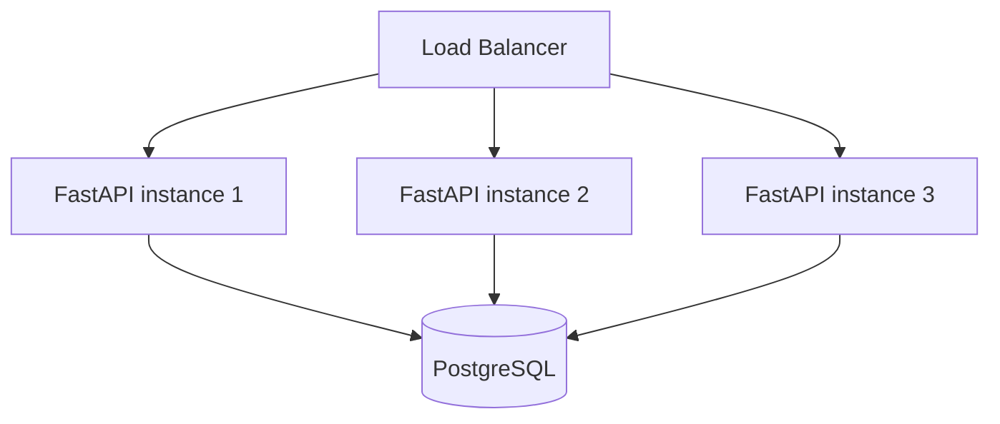
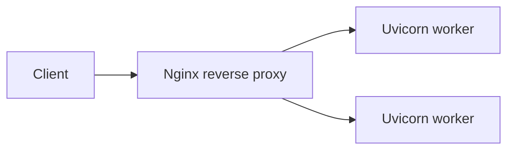

import TOCInline from '@theme/TOCInline';

# Phase 20 — Performance & Scalability

<TOCInline toc={toc} minHeadingLevel={2} maxHeadingLevel={2} />

:::tip[In this guide]
How to make one instance fast and then make many instances share the load.
You'll tune workers, pool connections, index queries, kill the notorious N+1
problem with eager loading, cache hot paths, load-test to find limits, and scale
out horizontally behind a load balancer with a reverse proxy, rate limits, and a
CDN.
:::

## What Is It?

**Performance** is how fast and efficiently a single instance handles work.
**Scalability** is how well the system keeps up as load grows — usually by adding
more instances (**horizontal scaling**) rather than a bigger machine (**vertical
scaling**).

## Why Does It Matter?

An AI backend spends most of its time waiting on I/O — databases, caches,
embedding and LLM APIs. Squeezing the single instance (async, pooling, indexes,
caching) and then scaling out cleanly is the difference between an API that holds
up under real traffic and one that falls over at the first spike.

:::info[Theory: measure before you optimize]
Every technique here has a cost — complexity, memory, or infrastructure. Add a
worker, an index, or a cache **because a measurement told you to**, not on a
hunch. Load testing (below) and the observability from
[Phase 18 — Logging & Observability](./18-logging-observability.mdx) tell you
where the real bottleneck is.
:::

---

## Uvicorn Workers

Uvicorn runs your ASGI app. A single Uvicorn process uses one CPU core, so to use
a multi-core box you run multiple workers. Each worker is a separate process with
its own event loop.

```bash
uvicorn app.main:app --workers 4 --host 0.0.0.0 --port 8000
```

:::note[Highlight: workers vs async concurrency]
These stack. **Async** lets one worker juggle many I/O-bound requests
concurrently on one core; **workers** spread across cores. You want both: enough
workers to use every core, and async handlers so each worker stays busy while
waiting on I/O.
:::

---

## Gunicorn

For production, **Gunicorn** is a battle-tested process manager that supervises
Uvicorn **workers** — it restarts crashed workers and handles graceful reloads.

```bash
gunicorn app.main:app \
  -k uvicorn.workers.UvicornWorker \
  --workers 4 \
  --bind 0.0.0.0:8000
```

A common starting point for the worker count is `(2 x CPU cores) + 1`, then tune
with load tests. Too many workers wastes memory and can thrash; too few leaves
cores idle.

---

## Connection Pooling

Opening a new database connection per request is slow (TCP + auth handshake). A
**connection pool** keeps a set of open connections and hands them out, returning
them when done.

```python
from sqlalchemy.ext.asyncio import create_async_engine

engine = create_async_engine(
    settings.database_url,
    pool_size=10,          # persistent connections kept open
    max_overflow=20,       # extra connections allowed under burst
    pool_pre_ping=True,    # check a connection is alive before using it
)
```

:::warning[Pool size x workers must fit the database]
Each worker has its own pool. With 4 workers and `pool_size=10` you can open up
to `4 x (10 + 20) = 120` connections. PostgreSQL has a hard `max_connections`
limit (often ~100). Exceed it and new connections are rejected. Size pools with
worker count in mind, or put a pooler like PgBouncer in front.
:::

---

## Database Indexes

An index is a sorted lookup structure that turns a full table scan (O(n)) into a
fast seek (O(log n)) for the columns you filter, join, or sort on.

```python
from sqlalchemy import Index

class Order(Base):
    __tablename__ = "orders"
    id: Mapped[int] = mapped_column(primary_key=True)
    user_id: Mapped[int] = mapped_column(index=True)     # frequently filtered
    status: Mapped[str]

    __table_args__ = (
        Index("ix_orders_user_status", "user_id", "status"),   # composite
    )
```

- Index columns used in `WHERE`, `JOIN`, and `ORDER BY`.
- Don't over-index: every index slows writes and uses space.
- Use `EXPLAIN ANALYZE` to confirm a query actually uses the index. Schema
  changes ship via migrations, see
  [Phase 6 — Database Migrations](./06-database-migrations.mdx).

---

## N+1 Queries

The single most common ORM performance bug: you fetch N rows, then trigger one
extra query per row to load a relationship — 1 + N queries instead of a
constant number.

### Bad: lazy loading in a loop

```python
# 1 query for the users...
users = (await session.execute(select(User))).scalars().all()

for user in users:
    # ...then 1 query PER user to load orders  ->  1 + N queries
    print(user.name, len(user.orders))
```

### Good: eager loading

Tell the ORM to load the relationship up front. SQLAlchemy offers `selectinload`
(a second batched `IN` query — great for async and one-to-many) and `joinedload`
(a single `JOIN` — good for many-to-one).

```python
from sqlalchemy.orm import selectinload

# 2 queries total, regardless of how many users
users = (
    await session.execute(
        select(User).options(selectinload(User.orders))
    )
).scalars().all()

for user in users:
    print(user.name, len(user.orders))   # no extra queries
```

:::info[Theory: why N+1 hides until production]
With 10 rows in your dev database, 11 queries feel instant. With 10,000 rows in
production it's 10,001 round trips and the endpoint times out. N+1 scales with
your data, so it's invisible locally and catastrophic at scale — which is why you
detect it by logging query counts and load testing, not by eyeballing code.
:::

---

## Caching

Serve repeated, expensive results from a fast store (Redis) instead of
recomputing them. Cache read-heavy, slow-changing data — query results,
embeddings, rendered responses — with a sensible TTL and an invalidation
strategy. Full patterns (cache-aside, TTLs, stampede protection) are in
[Phase 14 — Caching](./14-caching.mdx).

---

## Async I/O

Because AI backends are I/O-bound, `async` is the biggest single-instance win:
one worker handles many in-flight waits (DB, LLM, HTTP) concurrently instead of
blocking a thread each. Use `async def` handlers with async drivers throughout.
The full model — event loop, `await`, `asyncio.gather` — is covered in
[Professional Python: async](../01-python/04-professional-python.mdx#async-python).

```python
import asyncio

# run independent I/O concurrently instead of sequentially
async def dashboard(user_id: int):
    profile, orders, recs = await asyncio.gather(
        fetch_profile(user_id),
        fetch_orders(user_id),
        fetch_recommendations(user_id),
    )
    return {"profile": profile, "orders": orders, "recs": recs}
```

:::warning[One blocking call poisons the whole worker]
A synchronous call (`time.sleep`, `requests.get`, a sync DB driver) inside an
`async def` blocks the entire event loop — every concurrent request on that
worker stalls. Use async libraries, or offload blocking work with
`run_in_executor` / a background worker.
:::

---

## Load Testing

You can't tune what you don't measure. Load-test to find throughput and latency
limits before users do. **Locust** (Python) and **k6** (JavaScript) are common.

```python
# locustfile.py
from locust import HttpUser, task, between

class ApiUser(HttpUser):
    wait_time = between(1, 3)

    @task
    def ask(self):
        self.client.post("/ask", json={"question": "What is RAG?"})
```

```bash
locust -f locustfile.py --host http://localhost:8000
```

Watch p50/p95/p99 latency and error rate as concurrency rises; the point where
latency spikes or errors appear is your current ceiling.

---

## Horizontal Scaling

Run many identical instances and split traffic across them. This requires
**stateless** instances — no session or data stored in a worker's memory or local
disk; push shared state to PostgreSQL and Redis. Then adding capacity is just
adding replicas.



:::info[Theory: stateless is what makes scaling easy]
If any instance can serve any request, the load balancer routes freely and you
add or remove instances at will. State in process memory breaks this — a user's
next request might hit a different instance that never saw their session. Keep
instances stateless and the shared state in a database or cache.
:::

---

## Rate Limiting

Protect the service (and control cost on paid LLM APIs) by capping requests per
client over a window. Store counters in Redis so the limit is shared across all
instances.

```python
# conceptual: fixed-window limit backed by Redis
async def check_rate_limit(client_id: str, limit: int = 100):
    key = f"rate:{client_id}"
    count = await redis.incr(key)
    if count == 1:
        await redis.expire(key, 60)     # 60-second window
    if count > limit:
        raise HTTPException(status_code=429, detail="Too Many Requests")
```

---

## Message Queues

Offload slow or spiky work (sending email, generating embeddings, processing
uploads) to a queue so the request returns immediately and workers process jobs
asynchronously. This smooths load spikes and decouples producers from consumers.
Background workers are covered in
[Phase 11 — Background Processing](./11-background-processing.mdx).

---

## CDN

A **Content Delivery Network** caches static assets (JS, CSS, images) at edge
locations near users, cutting latency and offloading traffic from your origin.
Serve your frontend build and media through a CDN so Python workers handle only
dynamic requests.

---

## Reverse Proxy

A reverse proxy like **Nginx** sits in front of your app servers and handles TLS
termination, compression, static files, and buffering of slow clients — freeing
Uvicorn workers to do application work.



---

## Load Balancer

A **load balancer** distributes requests across instances and stops routing to
unhealthy ones using the readiness probe (`/ready`) from
[Phase 18 — Logging & Observability](./18-logging-observability.mdx). It's the
entry point that makes horizontal scaling transparent to clients.

:::note[Highlight: proxy vs balancer]
A reverse proxy focuses on offloading work (TLS, compression, static) in front of
your app; a load balancer focuses on spreading traffic across many instances and
health-checking them. In practice one component (Nginx, an ALB, an ingress
controller) often plays both roles.
:::

---

## Common Mistakes

- Running one Uvicorn process on a multi-core machine, wasting cores.
- Sizing pools without multiplying by worker count, exhausting the database.
- Shipping N+1 queries that look fine on tiny dev data.
- A blocking call inside `async def` that stalls the whole event loop.
- Storing session/state in process memory, breaking horizontal scaling.
- Optimizing by guesswork instead of load testing and profiling.
- No rate limiting, so one client (or a runaway loop) exhausts capacity/budget.

## Interview Questions

- Vertical vs horizontal scaling — tradeoffs of each?
- Why run multiple workers, and how does that combine with async?
- What is an N+1 query and how do `selectinload`/`joinedload` fix it?
- Why must instances be stateless to scale horizontally?
- What's the difference between a reverse proxy and a load balancer?
- Where does a connection pool help, and how can it hurt the database?

## Things to Remember

- Use every core with workers; use async so each worker stays busy on I/O.
- Pool connections, and size pools against the database's connection limit.
- Index what you filter/join/sort on; fix N+1 with eager loading.
- Cache hot reads; offload slow work to a queue; rate-limit clients.
- Scale out stateless instances behind a load balancer, with a CDN for assets.

## Mini Exercise

Take an endpoint that lists users with their orders, prove it's N+1 by logging
the query count, then fix it with `selectinload`. Add an index on a filtered
column, run Gunicorn with 4 Uvicorn workers, add a Redis-backed rate limit, and
load-test with Locust to compare p95 latency and error rate before and after.

## Done When

- [ ] The app runs multiple workers and uses async handlers with async drivers.
- [ ] Connections are pooled and sized against the database's limit.
- [ ] Hot queries are indexed and N+1 patterns are eliminated.
- [ ] Instances are stateless and scale horizontally behind a load balancer.
- [ ] You've load-tested and can point to a measured bottleneck.

Next: [Phase 21 — Production Architecture](./21-production-architecture.mdx).
