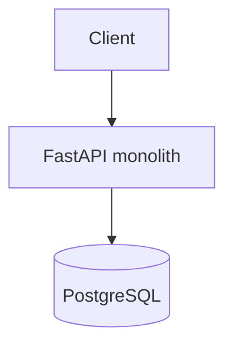
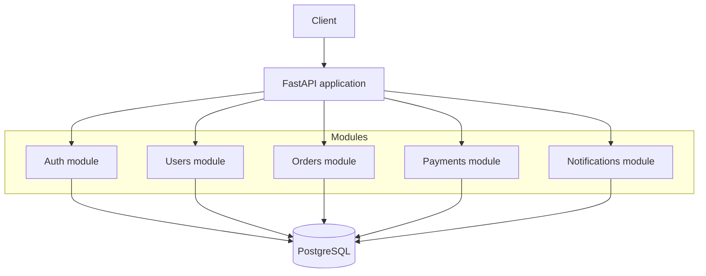
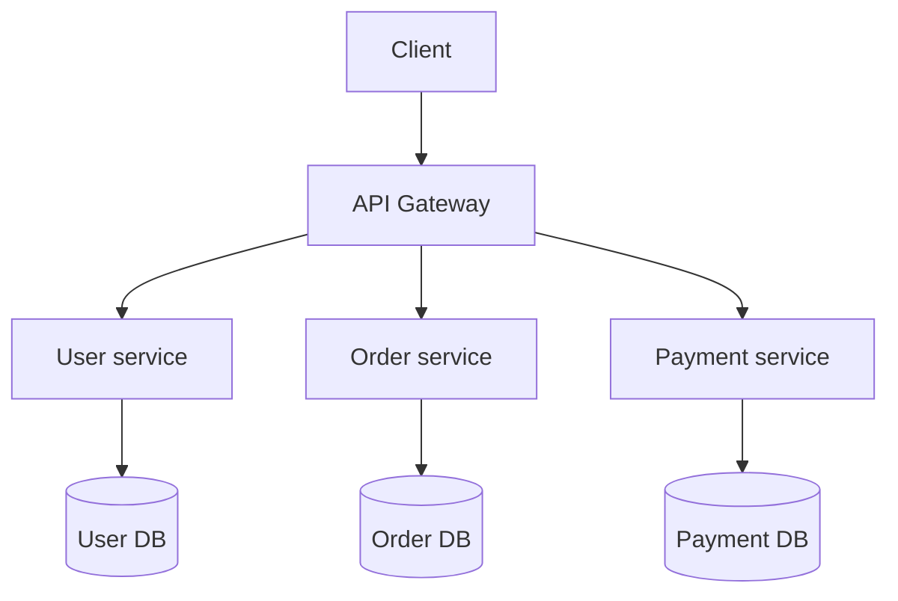
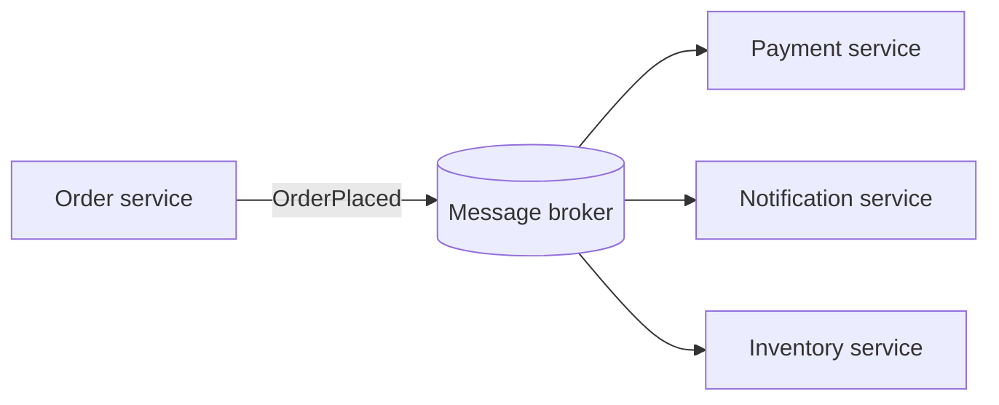
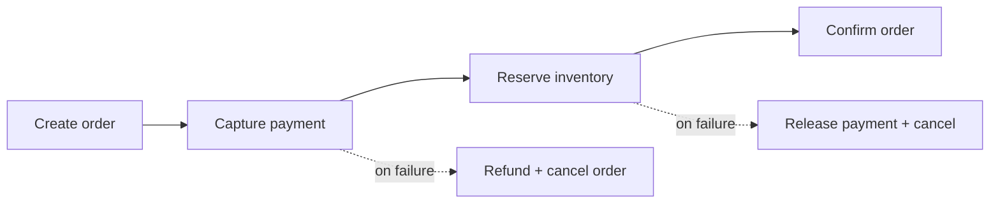

import TOCInline from '@theme/TOCInline';

# Phase 21 — Production Architecture

<TOCInline toc={toc} minHeadingLevel={2} maxHeadingLevel={2} />

:::tip[In this guide]
The big-picture shapes a FastAPI system can take as it grows: from a single
monolith, to a modular monolith, to distributed microservices communicating over
message brokers. You'll see the diagrams for each, meet Kafka and RabbitMQ, and
learn why distributed systems trade strong consistency for sagas and eventual
consistency — plus when each shape is actually worth it.
:::

## What Is It?

Production architecture is how you divide a system into deployable pieces and how
those pieces talk. The spectrum runs from **one process that does everything** to
**many small services that each own one capability** and coordinate over the
network.

## Why Does It Matter?

Architecture decisions are the expensive ones to reverse. Picking the wrong shape
too early adds network calls, operational burden, and distributed-systems bugs
you didn't need; picking it too late leaves you with a tangle no one can deploy
safely. Knowing the tradeoffs lets you start simple and split deliberately.

:::info[Theory: architecture follows constraints, not fashion]
Microservices solve **organizational and scaling** problems — independent teams,
independent deploys, independently scaling hot paths. They do **not** make code
cleaner; a well-structured monolith does that for far less cost. Choose based on
team size, deploy cadence, and scaling needs, not on what's trendy.
:::

---

## Monolith

A single deployable application containing all features, talking to one database.
This is where almost every system should start.



- **Pros** — simplest to build, test, deploy, and debug; one codebase, one
  database, no network between components; transactions are trivial (one DB).
- **Cons** — all features scale together; a single deploy pipeline; the codebase
  can turn into a "big ball of mud" without discipline.

:::note[Highlight: a monolith is not the same as messy]
"Monolith" describes **deployment** (one unit), not **quality**. A monolith with
clean module boundaries is excellent. Sprawl comes from lack of internal
structure — which the modular monolith below addresses directly.
:::

---

## Modular Monolith

Still one deployable unit and (usually) one database, but the code is split into
well-bounded modules with explicit interfaces — the structure from
[Phase 4 — Project Architecture](./04-project-architecture.mdx) taken to its
logical end.



Each module owns its routes, services, and data access, and communicates with
other modules only through defined interfaces — never by reaching into another
module's tables.

:::note[Highlight: the modular monolith is the sweet spot]
You get most of the clarity of microservices (clear ownership, decoupled modules)
with none of the network cost or distributed-systems pain. And if a module later
needs to become its own service, its clean boundary makes extraction
straightforward. Most teams should stop here.
:::

---

## Distributed System / Microservices

Independent services, each owning one capability **and its own database**,
reached through an **API gateway**. Services deploy and scale independently.



- **Pros** — independent deploys and scaling; team autonomy; fault isolation;
  polyglot (each service can pick its own stack).
- **Cons** — network latency and partial failures; no cross-service
  transactions; operational complexity (service discovery, tracing, deployment);
  data spread across many databases.

:::warning[Database-per-service is the hard part]
The rule that each service owns its data — no shared database, no cross-service
`JOIN` — is what makes services independent, and also what forces you into
message brokers, sagas, and eventual consistency below. If services share a
database, you have a distributed monolith: all the cost, none of the benefit.
:::

---

## Message Brokers

Once data is split across services, they coordinate by passing **messages**
through a broker instead of calling each other synchronously. The broker
decouples producers from consumers: the sender doesn't wait for or even know the
receivers.



This turns a fragile chain of synchronous calls into resilient, asynchronous
fan-out — if the notification service is briefly down, its messages wait in the
broker.

---

## Event-Driven Architecture

Services emit **events** ("OrderPlaced", "PaymentCaptured") describing facts that
already happened; other services react. Producers don't know who consumes, so you
add new reactions (analytics, fraud checks) without touching the producer.

```python
# order service publishes a fact — it doesn't call anyone directly
await broker.publish("order.placed", {
    "order_id": order.id,
    "user_id": order.user_id,
    "total": order.total,
})
# payment, notification, inventory services each subscribe and react
```

:::info[Theory: commands vs events]
A **command** tells a specific service to do something ("CapturePayment") and
expects it to happen. An **event** announces something that already happened
("PaymentCaptured") to whoever cares. Event-driven systems favor events, which is
what enables loose coupling — the emitter doesn't depend on the reactors.
:::

---

## Kafka

Apache **Kafka** is a distributed, durable **event log**. Messages are appended to
partitioned topics and **retained** so consumers read at their own pace and can
replay history.

- **Model** — durable log; consumers track their own offset.
- **Strengths** — very high throughput, event replay, event sourcing, streaming
  analytics.
- **Use when** — you need a durable record of events, multiple independent
  consumer groups, or stream processing.

---

## RabbitMQ

**RabbitMQ** is a traditional **message broker** that routes messages to queues
and typically deletes them once acknowledged.

- **Model** — queues with flexible routing; messages consumed and removed.
- **Strengths** — rich routing, per-message acknowledgement, priorities, mature
  task-queue support.
- **Use when** — you need work distribution / task queues and complex routing
  rather than a replayable event log.

:::note[Highlight: Kafka vs RabbitMQ in one line]
Kafka is a **durable log you read from** (great for events and replay); RabbitMQ
is a **queue you pull tasks off** (great for job distribution). Pick by whether
you want to retain and replay a stream of facts or hand out units of work.
:::

---

## Microservices (Revisited): the operational reality

Adopting microservices means adopting their whole support system: an API gateway,
service discovery, centralized logging and distributed tracing (the correlation
IDs and OpenTelemetry from
[Phase 18 — Logging & Observability](./18-logging-observability.mdx)),
per-service CI/CD, and container orchestration from
[Phase 19 — Docker & Deployment](./19-docker-deployment.mdx). That's real,
ongoing cost — budget for it before you split.

---

## Distributed Transactions

In a monolith, "create order + charge payment + decrement inventory" is one
database transaction — all or nothing. Across services with separate databases,
there is no shared transaction; a classic two-phase commit is slow and fragile at
scale. So distributed systems avoid distributed transactions and reach for the
saga pattern instead.

:::warning[There is no `BEGIN` across services]
The moment your data lives in multiple databases, you lose atomic multi-entity
writes. Any operation spanning services can partially fail — payment succeeds but
inventory update doesn't. You must design for that explicitly, not hope it won't
happen.
:::

---

## Saga Pattern

A **saga** models a cross-service operation as a sequence of local transactions,
each publishing an event that triggers the next. If a step fails, the saga runs
**compensating** actions to undo the previous steps.



Instead of one atomic transaction you get eventual correctness: either all steps
complete, or compensations return the system to a consistent state.

---

## Eventual Consistency

Because updates propagate through events asynchronously, different services are
briefly out of sync — the order exists before the inventory count reflects it.
The system becomes **eventually consistent**: given no new updates, all services
converge to the same state.

:::info[Theory: strong vs eventual consistency]
A single database gives **strong** consistency — every read sees the latest
write. Distributed, event-driven systems usually accept **eventual** consistency
to gain availability and scale (the CAP tradeoff). The design question shifts from
"how do I prevent inconsistency?" to "what temporary inconsistency is acceptable,
and how do I converge?"
:::

---

## Choosing an Architecture

The through-line of this phase: don't buy complexity you don't need yet.

| Concern | Monolith | Modular monolith | Microservices |
| --- | --- | --- | --- |
| Deploy | One unit | One unit | Many units |
| Database | One | One | One per service |
| Transactions | Simple (one DB) | Simple (one DB) | Sagas / eventual |
| Team fit | Small | Small–medium | Multiple teams |
| Ops cost | Low | Low | High |
| Best for | Starting out | Growing cleanly | Scale + org needs |

:::note[Highlight: start monolith, extract when it hurts]
Begin as a well-structured (modular) monolith. Extract a service only when a
concrete pain — a hot path that must scale alone, a team that needs to deploy
independently — justifies the network and operational cost. Let real constraints,
not speculation, drive the split.
:::

---

## Common Mistakes

- Starting with microservices before there's a team or scaling need for them.
- A "distributed monolith": services sharing one database, coupled but remote.
- Expecting cross-service atomic transactions instead of designing sagas.
- Ignoring eventual consistency in the UX (showing stale data as if it's final).
- No distributed tracing, so debugging a cross-service request is guesswork.
- Choosing Kafka vs RabbitMQ by hype rather than by log-vs-queue needs.

## Interview Questions

- Monolith vs modular monolith vs microservices — tradeoffs and when to use each?
- Why does database-per-service matter, and what does it force you to change?
- Command vs event; what makes event-driven architecture loosely coupled?
- Kafka vs RabbitMQ — what's the core difference and when do you pick each?
- What is a saga and how does it replace a distributed transaction?
- What is eventual consistency and what do you trade to get it?

## Things to Remember

- Start with a (modular) monolith; extract services only when pain justifies it.
- Microservices own their own data — no shared database, no cross-service JOIN.
- Coordinate services with events through a broker; producers don't know consumers.
- Kafka is a durable, replayable log; RabbitMQ is a task queue with routing.
- Distributed transactions become sagas with compensations and eventual consistency.

## Mini Exercise

Take a "place order" flow and design it three ways: (1) as a monolith with one DB
transaction, (2) as modules in a modular monolith with defined interfaces, and
(3) as order/payment/inventory microservices coordinated by a saga over a broker.
For version 3, list the events, the compensating actions, and the window of
eventual consistency a user might observe.

## Done When

- [ ] You can draw and explain monolith, modular monolith, and microservices.
- [ ] You can justify database-per-service and its consequences.
- [ ] You can explain event-driven coordination and choose Kafka vs RabbitMQ.
- [ ] You can design a saga with compensations for a cross-service operation.
- [ ] You can articulate when extracting a service is (and isn't) worth it.

Next: [Phase 22 — AI Backend with FastAPI](./22-ai-backend.mdx).
