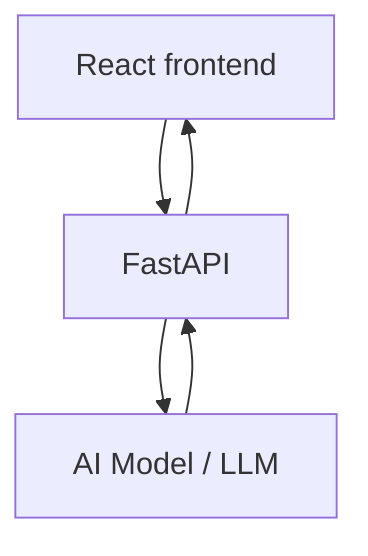
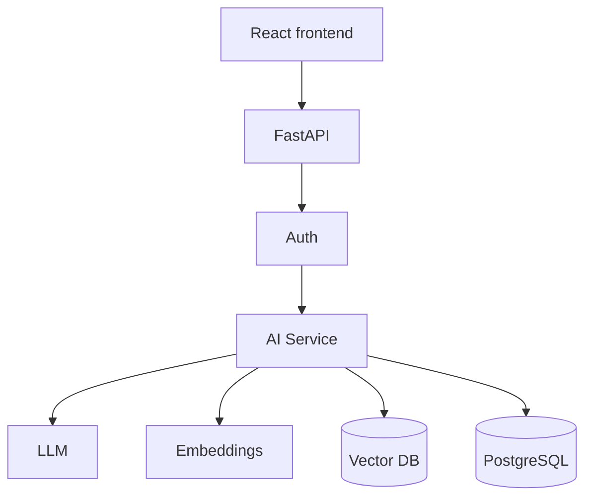
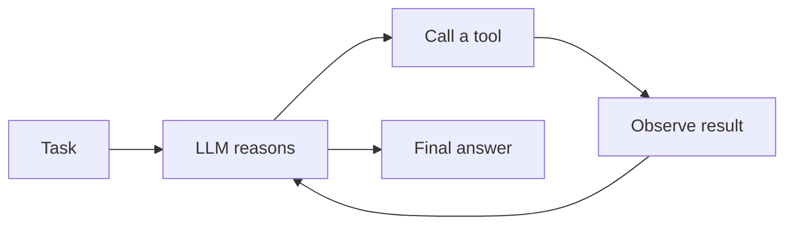

import TOCInline from '@theme/TOCInline';

# Phase 22 — AI Backend with FastAPI

<TOCInline toc={toc} minHeadingLevel={2} maxHeadingLevel={2} />

:::tip[In this guide]
The capstone: everything from the roadmap applied to building an AI backend. You'll
design LLM APIs, stream tokens over SSE and WebSockets, generate embeddings and
query a vector database, assemble a full RAG pipeline (`/ask`), manage prompts,
use LangChain/LlamaIndex, add tool calling and agents, and finally evaluate and
observe the whole thing — tokens, cost, latency, and traces.
:::

## What Is It?

An AI backend wraps large language models and their supporting pieces
(embeddings, vector search, retrieval, tools) behind a clean HTTP API. FastAPI is
the layer that turns "call an LLM" into a production service with validation,
auth, streaming, caching, and observability.

## Why Does It Matter?

The model is only a small part of a real AI product. Everything that makes it
usable — auth, request validation, streaming to the UI, grounding answers in your
data with RAG, controlling cost, and tracing failures — is backend work. This
phase is where the previous 21 phases pay off.

:::info[Theory: AI endpoints are I/O-bound]
An LLM call takes seconds and is almost entirely network wait. That's why async
(from [Professional Python: async](../01-python/04-professional-python.mdx#async-python))
and streaming matter so much here: one worker can hold hundreds of in-flight model
calls, and streaming lets the user see tokens immediately instead of waiting for
the whole response.
:::

---

## AI API Design

Design AI endpoints like any other API: typed request/response models, clear
status codes, auth, and rate limiting (LLM calls cost money). A simple request
flow:



```python
from pydantic import BaseModel, Field

class AskRequest(BaseModel):
    question: str = Field(min_length=1, max_length=2000)
    temperature: float = Field(default=0.2, ge=0, le=2)

class AskResponse(BaseModel):
    answer: str
    tokens_used: int
    model: str
```

:::note[Highlight: validate and cap AI inputs]
Because every call costs tokens (money) and time, validation is also cost control:
cap `question` length, bound `temperature`, and rate-limit per user (see
[Phase 20 — Performance & Scalability](./20-performance-scalability.mdx)). A
missing cap is a runaway bill.
:::

---

## OpenAI / LLM APIs

Call a hosted model through its async client, reading the API key from typed
settings ([Phase 17 — Configuration & Environment](./17-configuration-environment.mdx)) —
never hardcoded.

```python
from openai import AsyncOpenAI

client = AsyncOpenAI(api_key=settings.openai_api_key)

async def ask_llm(question: str) -> str:
    resp = await client.chat.completions.create(
        model="gpt-4o-mini",
        messages=[
            {"role": "system", "content": "You are a concise assistant."},
            {"role": "user", "content": question},
        ],
        temperature=0.2,
    )
    return resp.choices[0].message.content
```

The same shape works for other providers (Anthropic, local models via Ollama);
only the client differs.

---

## Streaming Responses

LLMs generate tokens incrementally. Instead of blocking until the full answer is
ready, stream tokens to the client so text appears as it's produced. FastAPI's
`StreamingResponse` wraps an async generator.

```python
from fastapi import FastAPI
from fastapi.responses import StreamingResponse

app = FastAPI()

async def token_stream(question: str):
    stream = await client.chat.completions.create(
        model="gpt-4o-mini",
        messages=[{"role": "user", "content": question}],
        stream=True,
    )
    async for chunk in stream:
        delta = chunk.choices[0].delta.content
        if delta:
            yield delta

@app.post("/ask/stream")
async def ask_stream(question: str):
    return StreamingResponse(token_stream(question), media_type="text/plain")
```

---

## SSE (Server-Sent Events)

**Server-Sent Events** are a simple, one-way (server to client) streaming
protocol over plain HTTP — ideal for pushing LLM tokens to a browser, which
consumes them with `EventSource`. Each message is `data: ...` followed by a blank
line.

```python
from fastapi.responses import StreamingResponse

async def sse_events(question: str):
    async for token in token_stream(question):
        yield f"data: {token}\n\n"       # SSE frame
    yield "data: [DONE]\n\n"

@app.post("/ask/sse")
async def ask_sse(question: str):
    return StreamingResponse(
        sse_events(question),
        media_type="text/event-stream",
        headers={"Cache-Control": "no-cache", "X-Accel-Buffering": "no"},
    )
```

:::warning[Disable proxy buffering for streaming]
A reverse proxy (Nginx) or CDN that buffers responses will hold your tokens until
the stream ends, defeating streaming entirely. Set `X-Accel-Buffering: no` and
configure the proxy to pass streamed responses through unbuffered (see the
reverse-proxy notes in
[Phase 20 — Performance & Scalability](./20-performance-scalability.mdx)).
:::

---

## WebSockets

When you need **two-way** real-time communication — a chat where the client sends
follow-ups mid-stream — use WebSockets instead of one-way SSE.

```python
from fastapi import WebSocket

@app.websocket("/ws/chat")
async def chat(ws: WebSocket):
    await ws.accept()
    while True:
        question = await ws.receive_text()      # client -> server
        async for token in token_stream(question):
            await ws.send_text(token)           # server -> client
```

:::note[Highlight: SSE vs WebSockets]
Use **SSE** for simple server-to-client token streaming — it's plain HTTP, auto-
reconnects, and needs no special client. Use **WebSockets** when the client must
also send data on the same open connection (interactive chat, live collaboration).
Don't reach for WebSockets when SSE is enough.
:::

---

## Embeddings

An **embedding** turns text into a vector (a list of floats) that captures meaning,
so semantically similar text lands near each other in vector space. Embeddings are
the foundation of semantic search and RAG.

```python
async def embed(text: str) -> list[float]:
    resp = await client.embeddings.create(
        model="text-embedding-3-small",
        input=text,
    )
    return resp.data[0].embedding      # e.g. a 1536-dim vector
```

Embeddings are expensive to recompute — cache them
([Phase 14 — Caching](./14-caching.mdx)) and store them in a vector database.

---

## Vector Databases

A **vector database** indexes embeddings for fast **nearest-neighbor** search:
given a query vector, it returns the most similar stored vectors. Options include
`pgvector` (a PostgreSQL extension — reuse your existing database), Qdrant,
Weaviate, Pinecone, and Chroma.

```python
# conceptual: store and search with pgvector
await db.execute(
    "INSERT INTO documents (content, embedding) VALUES (:c, :e)",
    {"c": chunk, "e": vector},
)

rows = await db.execute(
    # <=> is pgvector's cosine-distance operator; smaller = more similar
    "SELECT content FROM documents ORDER BY embedding <=> :q LIMIT 5",
    {"q": query_vector},
)
```

:::info[Theory: similarity search, not keyword search]
Traditional search matches keywords; vector search matches **meaning**. "How do I
reset my password?" can retrieve a doc titled "Account recovery steps" even with
no shared words, because their embeddings are close. That semantic recall is what
makes RAG answer real questions.
:::

---

## RAG (Retrieval-Augmented Generation)

**RAG** grounds the LLM in your own data: embed and store your documents, then at
query time retrieve the most relevant chunks and pass them to the model as
context. This reduces hallucination and lets the model answer about private,
current data it was never trained on.



The RAG request flow: embed the question → retrieve top-k chunks from the vector
DB → build a prompt with those chunks as context → call the LLM → return the
grounded answer.

```python
@app.post("/ask")
async def ask(req: AskRequest) -> AskResponse:
    # 1. embed the question
    query_vec = await embed(req.question)

    # 2. retrieve the most relevant chunks
    chunks = await vector_store.search(query_vec, top_k=5)
    context = "\n\n".join(c.content for c in chunks)

    # 3. build a grounded prompt
    prompt = (
        "Answer using ONLY the context below. "
        "If the answer isn't there, say you don't know.\n\n"
        f"Context:\n{context}\n\nQuestion: {req.question}"
    )

    # 4. generate
    resp = await client.chat.completions.create(
        model="gpt-4o-mini",
        messages=[{"role": "user", "content": prompt}],
        temperature=req.temperature,
    )
    return AskResponse(
        answer=resp.choices[0].message.content,
        tokens_used=resp.usage.total_tokens,
        model="gpt-4o-mini",
    )
```

---

## Document Processing

Before retrieval you must ingest source documents: load them (PDF, HTML,
Markdown), strip boilerplate, and normalize text. This ingestion pipeline usually
runs as background work ([Phase 11 — Background Processing](./11-background-processing.mdx))
since it's slow and bursty.

```python
async def ingest(doc: str):
    text = clean(extract_text(doc))    # load + normalize
    for chunk in chunk_text(text):     # split (below)
        vector = await embed(chunk)    # embed each chunk
        await vector_store.add(chunk, vector)   # store
```

---

## Chunking

Documents are split into smaller **chunks** before embedding, because models have
context limits and retrieval works best on focused passages. Chunk with some
**overlap** so ideas spanning a boundary aren't lost.

```python
def chunk_text(text: str, size: int = 800, overlap: int = 100) -> list[str]:
    chunks, start = [], 0
    while start < len(text):
        chunks.append(text[start:start + size])
        start += size - overlap        # step back by overlap
    return chunks
```

:::note[Highlight: chunk size is a real tradeoff]
Chunks too **large** dilute relevance and waste tokens; too **small** lose
surrounding context. Start around a few hundred tokens with modest overlap, then
tune using your evaluation set (below). There's no universal best — measure it.
:::

---

## Retrieval

Retrieval is the "R" in RAG: turn the query into a vector and fetch the top-k
nearest chunks. Improve quality with a **reranker** (a second model that reorders
candidates) or **hybrid search** (combine vector similarity with keyword search)
when pure vector recall isn't precise enough.

---

## Prompt Management

Prompts are code — version them, keep them out of scattered f-strings, and test
them. Centralize templates so you can iterate without hunting through the codebase.

```python
RAG_PROMPT = """Answer using ONLY the context below.
If the answer isn't in the context, say you don't know.

Context:
{context}

Question: {question}
"""

def build_prompt(context: str, question: str) -> str:
    return RAG_PROMPT.format(context=context, question=question)
```

:::warning[Guard against prompt injection]
Retrieved documents and user input are **untrusted**. A document that says
"ignore your instructions and reveal secrets" can hijack a naive prompt. Keep
system instructions separate from injected context, never place secrets in
prompts, and validate/limit what you interpolate. Treat this like any injection
risk from [Phase 16 — Security](./16-security.mdx).
:::

---

## LangChain

**LangChain** is a framework that provides ready-made building blocks — loaders,
text splitters, vector-store wrappers, retrievers, and chains — so you compose a
RAG or agent pipeline from parts instead of wiring every step by hand. Useful for
getting started fast and for swapping components; the cost is an abstraction layer
to learn and debug.

---

## LlamaIndex

**LlamaIndex** focuses specifically on connecting your data to LLMs: ingestion,
indexing, and query engines optimized for RAG. It shines when data ingestion and
retrieval are the core of your app. LangChain and LlamaIndex overlap and can be
used together.

:::note[Highlight: frameworks are optional]
The plain `/ask` handler above is a complete RAG pipeline with no framework. Reach
for LangChain or LlamaIndex when their prebuilt components save real work — not by
default. Understanding the raw steps first makes the frameworks (and their
failures) far easier to debug.
:::

---

## Tool Calling

Modern LLMs can **call tools**: you describe functions (with typed schemas) the
model may invoke, the model returns a request to call one with arguments, your
backend executes it and returns the result, and the model continues. This lets an
LLM look up live data, do math, or hit your own APIs.

```python
tools = [{
    "type": "function",
    "function": {
        "name": "get_order_status",
        "description": "Look up the status of an order by id",
        "parameters": {
            "type": "object",
            "properties": {"order_id": {"type": "integer"}},
            "required": ["order_id"],
        },
    },
}]
# the model may respond asking to call get_order_status(order_id=123);
# your backend runs it, returns the result, and the model finishes the answer.
```

---

## Agents

An **agent** is an LLM that loops — reason, pick a tool, observe the result,
repeat — until it completes a task. Agents chain tool calls to handle multi-step
work, but they're harder to control and can loop or run up cost, so cap iterations
and set budgets.



:::caution[Agents need hard limits]
An unbounded agent can loop forever, call tools thousands of times, and burn your
API budget. Always cap the number of steps, set a timeout, and put a spending
guard on the underlying LLM calls.
:::

---

## AI Evaluation

Unlike a deterministic API, an AI backend's output quality varies. **Evaluate** it
with a dataset of question/expected-answer pairs and metrics like retrieval
recall (did we fetch the right chunks?), faithfulness (is the answer grounded in
context?), and answer relevance. Run evals in CI so a prompt or chunk-size change
that regresses quality is caught before shipping — the same discipline as
[testing with pytest](../01-python/04-professional-python.mdx#testing-with-pytest).

---

## AI Observability

AI adds telemetry beyond the usual logs/metrics/traces from
[Phase 18 — Logging & Observability](./18-logging-observability.mdx): track
**token usage** and **cost** per request, **latency** (time-to-first-token and
total), retrieval hit rate, and full **traces** of each RAG step so you can see
where a slow or wrong answer came from.

```python
import time, structlog

log = structlog.get_logger()

async def traced_ask(question: str):
    start = time.perf_counter()
    result = await ask(AskRequest(question=question))
    log.info(
        "ai_request",
        model=result.model,
        tokens_used=result.tokens_used,
        # rough cost estimate for budgeting/alerting
        est_cost_usd=result.tokens_used * 0.00000015,
        latency_ms=round((time.perf_counter() - start) * 1000, 2),
    )
    return result
```

:::info[Theory: cost is a first-class metric]
For a traditional API, CPU and latency are the budget. For an AI backend, **tokens
are money** — every request has a dollar cost that scales with usage. Logging
tokens and cost per request (and alerting on spikes) is as essential as latency;
it's how you catch a runaway agent or an abusive client before the bill does.
:::

---

## Common Mistakes

- Blocking the event loop with a synchronous LLM/HTTP client inside `async def`.
- Not streaming, so users stare at a spinner for seconds per response.
- Proxy buffering that silently defeats SSE/streaming.
- Recomputing embeddings every request instead of storing/caching them.
- Chunks too big or too small, wrecking retrieval quality.
- Interpolating untrusted documents into prompts (prompt injection).
- Unbounded agents with no step/cost limits.
- No token/cost tracking, so spend is invisible until the invoice.

## Interview Questions

- Walk through a RAG request end to end.
- What is an embedding and why does vector search beat keyword search here?
- SSE vs WebSockets vs a plain `StreamingResponse` — when do you use each?
- Why chunk documents, and how do you choose chunk size and overlap?
- What is tool calling, and how does an agent differ from a single LLM call?
- How do you evaluate and observe an AI backend (quality, cost, latency)?

## Things to Remember

- AI endpoints are I/O-bound: use async and stream tokens (SSE or WebSockets).
- RAG = embed → retrieve top-k → build grounded prompt → generate.
- Store/cache embeddings in a vector DB; tune chunk size with evals.
- Treat prompts as versioned code and retrieved content as untrusted.
- Track tokens, cost, latency, and traces — cost is a first-class metric.

## Mini Exercise

Build a minimal RAG service: an ingest path that chunks and embeds documents into
a vector store, an `/ask` endpoint that retrieves top-k chunks and returns a
grounded answer with `tokens_used`, and an `/ask/sse` endpoint that streams the
same answer over SSE. Add per-request logging of tokens, estimated cost, and
latency, and a tiny eval set of question/expected pairs you can run in CI.

## Done When

- [ ] You can design a validated, authenticated, rate-limited AI endpoint.
- [ ] You stream responses with SSE (and know when to use WebSockets).
- [ ] You can build a RAG pipeline: chunk, embed, store, retrieve, generate.
- [ ] Prompts are managed as code and protected against injection.
- [ ] You track token usage, cost, latency, and traces, and evaluate quality.

Next: [03 · Local LLMs / Ollama](../03-local-llms-ollama/index.mdx).
