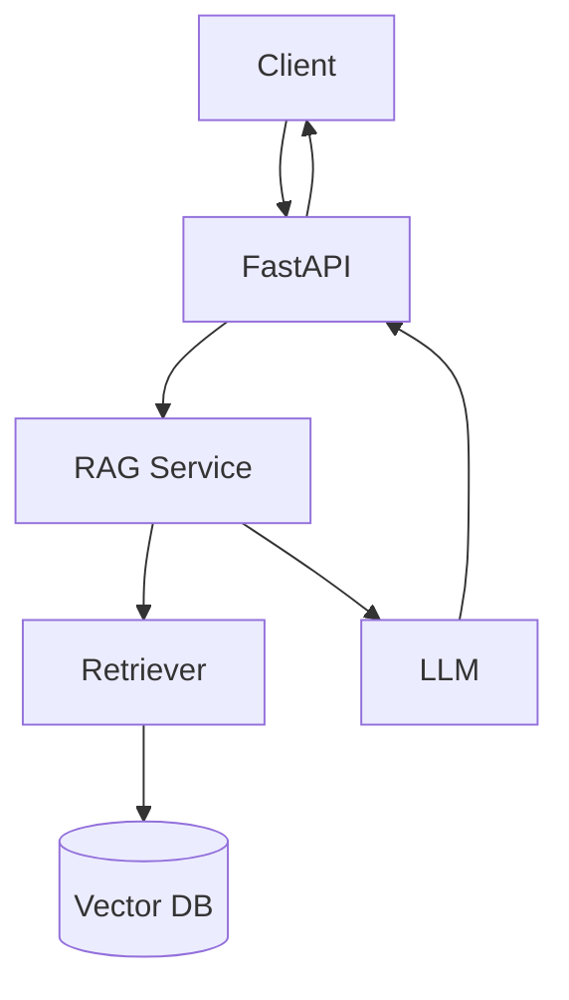

import TOCInline from '@theme/TOCInline';

# 02 · FastAPI

<ProgressToggle sectionId="02-fastapi" />

<TOCInline toc={toc} minHeadingLevel={2} maxHeadingLevel={2} />

:::tip[In this guide]
FastAPI end to end: routing, validation, dependency injection, async, auth,
databases, testing, production structure, and the bridge into AI/RAG.
:::

## Goal

Build production-ready APIs with FastAPI: validated inputs, clean structure,
auth, databases, tests, and an AI endpoint.

## Estimated Time

2–3 weeks.

## Prerequisites

- [01 · Python](../01-python/index.mdx), especially [typing](../01-python/07-typing-dataclasses.mdx) and [async](../01-python/09-async-concurrency.mdx).
- A working environment from [Prerequisites](../00-prerequisites/03-python-fastapi-setup.mdx) with a live `/health` endpoint and Swagger UI at `/docs`.

## What You Will Learn

1. [FastAPI Basics](./01-fastapi-basics.mdx) — ASGI, Uvicorn, app instance, path operations, docs.
2. [Routing, Request & Response](./02-routing-request-response.mdx) — methods, params, body, response models, `APIRouter`.
3. [Pydantic Validation](./03-pydantic-validation.mdx) — models, `Field`, nested models, v2 concepts.
4. [Dependency Injection](./04-dependency-injection.mdx) — `Depends`, reusable deps, test overrides.
5. [Async & Background Tasks](./05-async-background-tasks.mdx) — async endpoints, background work, threadpools.
6. [Error Handling & Middleware](./06-error-handling-middleware.mdx) — `HTTPException`, handlers, CORS, request IDs.
7. [Authentication & Authorization](./07-authentication-authorization.mdx) — OAuth2, JWT, hashing, roles.
8. [Database Integration](./08-database-integration.mdx) — SQLAlchemy, sessions, Alembic, sync vs async drivers.
9. [Testing FastAPI](./09-testing-fastapi.mdx) — `TestClient`, dependency overrides, DB and auth tests.
10. [API Design & Production](./10-api-design-production.mdx) — structure, versioning, pagination, health checks, Docker.
11. [FastAPI + AI Integration](./11-fastapi-ai-integration.mdx) — `/ingest`, `/ask`, and the RAG architecture.

## The Bridge to AI

Everything here culminates in a real AI API you keep improving through the
later sections.

## Interview Relevance

FastAPI, ASGI vs WSGI, dependency injection, Pydantic validation, JWT auth, and
"how would you structure a production service?" are common backend-with-AI
interview topics. Each page ends with an interview section.

## Done When

- [ ] You can build CRUD endpoints with validated request/response models.
- [ ] You can use dependencies for shared logic and tests.
- [ ] You can protect routes with JWT auth.
- [ ] You can integrate a database with sessions and migrations.
- [ ] You can expose `/health`, `/ingest`, and `/ask`.

Next: [03 · Local LLMs / Ollama](../03-local-llms-ollama/index.mdx).
