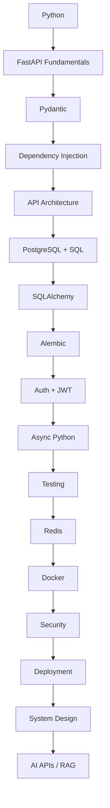

import TOCInline from '@theme/TOCInline';

# 02 · FastAPI

<ProgressToggle sectionId="02-fastapi" />

<TOCInline toc={toc} minHeadingLevel={2} maxHeadingLevel={2} />

:::tip[In this guide]
FastAPI end to end, in **22 phases**: fundamentals, Pydantic validation,
dependency injection, project architecture, databases, migrations, auth, async,
error handling, middleware, background jobs, uploads, API design, caching,
testing, security, config, observability, Docker, performance, production
architecture, and the AI backend layer on top.
:::

## Goal

Build production-ready APIs with FastAPI: validated inputs, clean structure,
auth, databases, tests, deployment — and an AI/RAG endpoint on top.

## Estimated Time

4–6 weeks (this is a deep roadmap; pace yourself with the priorities below).

## Prerequisites

- [01 · Python](../01-python/index.mdx), especially [typing](../01-python/04-professional-python.mdx#type-hints) and [async](../01-python/04-professional-python.mdx#async-python).
- A working environment from [Prerequisites](../00-prerequisites/03-python-fastapi-setup.mdx) with a live `/health` endpoint and Swagger UI at `/docs`.

## The 22 Phases

### Core API skills

1. [Phase 1 — FastAPI Fundamentals](./01-fastapi-fundamentals.mdx) — ASGI/Uvicorn, routes, methods, params, bodies, responses, status codes, docs, forms, uploads, static files.
2. [Phase 2 — Pydantic & Data Validation](./02-pydantic-validation.mdx) — `BaseModel`, fields, validators, nested models, serialization, settings, v2.
3. [Phase 3 — Dependency Injection](./03-dependency-injection.mdx) — `Depends`, dependency functions/classes, nesting, overrides, testing.
4. [Phase 4 — Project Architecture](./04-project-architecture.mdx) — routers, services, repositories, schemas, config, the application-factory pattern.

### Data layer

5. [Phase 5 — Database](./05-database.mdx) — SQL fundamentals, PostgreSQL, SQLAlchemy 2.x ORM, relationships, async.
6. [Phase 6 — Database Migrations](./06-database-migrations.mdx) — Alembic setup, autogenerate, upgrade/downgrade, production strategy.

### Auth & concurrency

7. [Phase 7 — Authentication & Authorization](./07-authentication-authorization.mdx) — password hashing, JWT, OAuth2, RBAC, permissions.
8. [Phase 8 — Async Python + FastAPI](./08-async-fastapi.mdx) — coroutines, the event loop, `httpx`, async DB, when *not* to use async.

### Robustness

9. [Phase 9 — Error Handling](./09-error-handling.mdx) — `HTTPException`, custom exceptions, handlers, error schemas.
10. [Phase 10 — Middleware & Request Lifecycle](./10-middleware-request-lifecycle.mdx) — middleware, CORS, request IDs, timing.
11. [Phase 11 — Background Processing](./11-background-processing.mdx) — `BackgroundTasks` vs Celery + Redis, queues, retries.
12. [Phase 12 — File Uploads](./12-file-uploads.mdx) — `UploadFile`, validation, streaming, S3 presigned URLs.

### Design & performance

13. [Phase 13 — API Design](./13-api-design.mdx) — REST, naming, status codes, pagination, versioning, idempotency.
14. [Phase 14 — Caching](./14-caching.mdx) — Redis, cache-aside, invalidation, rate limiting, distributed locks.
15. [Phase 15 — Testing](./15-testing.mdx) — `TestClient`, fixtures, mocking, dependency overrides, async tests.
16. [Phase 16 — Security](./16-security.mdx) — OWASP Top 10, injection, XSS/CSRF/SSRF, secrets, secure headers.

### Operations

17. [Phase 17 — Configuration & Environment](./17-configuration-environment.mdx) — env vars, `.env`, Pydantic Settings, secrets.
18. [Phase 18 — Logging & Observability](./18-logging-observability.mdx) — structured logs, correlation IDs, metrics, health/readiness, Prometheus, OpenTelemetry.
19. [Phase 19 — Docker & Deployment](./19-docker-deployment.mdx) — Dockerfile, multi-stage builds, Compose, cloud deploys.
20. [Phase 20 — Performance & Scalability](./20-performance-scalability.mdx) — workers, pooling, N+1, load testing, horizontal scaling.

### Architecture & AI

21. [Phase 21 — Production Architecture](./21-production-architecture.mdx) — monolith, modular monolith, microservices, events, sagas.
22. [Phase 22 — AI Backend with FastAPI](./22-ai-backend.mdx) — LLM APIs, streaming/SSE/WebSockets, embeddings, vector DBs, RAG, agents.

## Suggested Learning Order

## What "Job Ready" Looks Like

You don't need to master all 22 phases before applying. The core target:

> Python → FastAPI → Pydantic → REST → PostgreSQL → SQLAlchemy → Alembic → JWT →
> Redis → Async → pytest → Docker → deployment

Then add AI/RAG on top if you're targeting AI-backend roles. Given a
React/TypeScript background, a strong combination is:

> React + TypeScript + FastAPI + PostgreSQL + Redis + Docker + AI/RAG

## Interview Relevance

FastAPI, ASGI vs WSGI, dependency injection, Pydantic validation, JWT auth, N+1
queries, caching strategy, and "how would you structure and scale a production
service?" are common backend-with-AI interview topics. Each phase ends with an
interview section.

## Done When

- [ ] You can build CRUD endpoints with validated request/response models.
- [ ] You can use dependencies for shared logic and tests.
- [ ] You can protect routes with JWT auth and role-based permissions.
- [ ] You can integrate PostgreSQL with SQLAlchemy and Alembic migrations.
- [ ] You can cache with Redis, test with pytest, and containerize with Docker.
- [ ] You can expose an AI endpoint (`/ask`) backed by retrieval.

Next: [03 · Local LLMs / Ollama](../03-local-llms-ollama/index.mdx).
