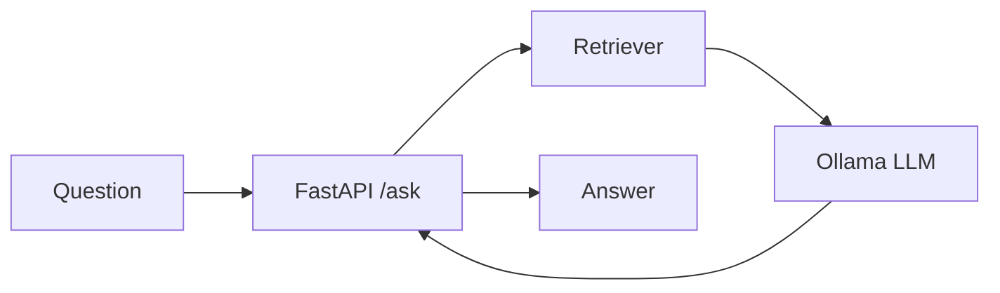

import TOCInline from '@theme/TOCInline';

# 03 · Local LLMs / Ollama

<ProgressToggle sectionId="03-local-llms-ollama" />

<TOCInline toc={toc} minHeadingLevel={2} maxHeadingLevel={2} />

:::tip[In this guide]
Run real models on your own machine with Ollama — no API keys, no bills — and
call them from Python, the way your FastAPI `/ask` endpoint will.
:::

## Goal

Run a local model with Ollama and call it from Python for both single-shot
generation and chat.

## Estimated Time

3–5 days.

## Prerequisites

- [FastAPI](../02-fastapi/index.mdx) basics and [Python async](../01-python/09-async-concurrency.mdx).
- ~8GB free RAM (small models); more helps.

## What You Will Learn

1. [Install & Basics](./01-install-basics.mdx) — install Ollama, pull a model, chat in the terminal.
2. [Ollama API Usage](./02-ollama-api-usage.mdx) — the HTTP API, generate vs chat, streaming, from Python.

## Where This Fits

Ollama is the **LLM** box in your RAG architecture. Later, retrieval feeds it
context; here you learn to talk to it directly.

## Interview Relevance

"Local vs hosted models", cost/privacy tradeoffs, and streaming responses are
common discussion points for AI application roles.

## Done When

- [ ] Ollama is installed and running.
- [ ] You can pull and chat with a model in the terminal.
- [ ] You can call the model from Python (generate + chat).
- [ ] You can stream tokens.

Next: [04 · Embeddings / Vector DB](../04-embeddings-vector-db/index.mdx).
