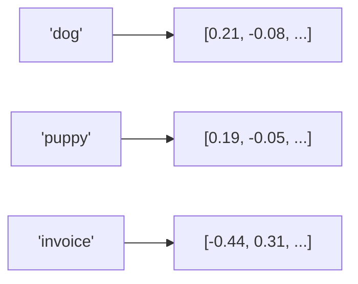

import TOCInline from '@theme/TOCInline';

# Embeddings

<TOCInline toc={toc} minHeadingLevel={2} maxHeadingLevel={2} />

:::tip[In this guide]
How text becomes a vector that captures meaning, how we measure similarity
between vectors, and how to generate embeddings in Python.
:::

## What Is It?

An **embedding** is a fixed-length vector of floats that represents the meaning
of a piece of text. Similar meanings → nearby vectors.

## Why Does It Matter?

Embeddings turn "find text about X" into "find the nearest vectors to X's
vector" — fast, semantic search that keyword matching can't do.

## What They Capture

"car", "automobile", and "vehicle" land close together even without shared
letters, because an embedding model was trained so that related meanings
produce nearby vectors.



`dog` and `puppy` are close; `invoice` is far away.

## Cosine Similarity

We compare vectors by the **angle** between them, not their length. Cosine
similarity ranges from -1 (opposite) to 1 (identical direction):

```python
import numpy as np

def cosine_similarity(a, b):
    a, b = np.array(a), np.array(b)
    return float(a @ b / (np.linalg.norm(a) * np.linalg.norm(b)))

cosine_similarity([1, 0], [1, 0])     # 1.0  (same)
cosine_similarity([1, 0], [0, 1])     # 0.0  (unrelated)
```

Higher score = more semantically similar. Retrieval returns the highest-scoring
chunks.

## Generating Embeddings

### Option A — sentence-transformers (local, popular)

```bash
pip install sentence-transformers
```

```python
from sentence_transformers import SentenceTransformer

model = SentenceTransformer("all-MiniLM-L6-v2")   # 384-dim, fast
vectors = model.encode([
    "RAG retrieves context before generating.",
    "A vector database stores embeddings.",
])
vectors.shape                                       # (2, 384)
```

### Option B — Ollama embeddings

```python
import requests

def embed(text: str, model: str = "nomic-embed-text") -> list[float]:
    resp = requests.post(
        "http://localhost:11434/api/embeddings",
        json={"model": model, "prompt": text},
        timeout=60,
    )
    resp.raise_for_status()
    return resp.json()["embedding"]
```

Pull the model first: `ollama pull nomic-embed-text`.

## Choosing an Embedding Model

| Concern | Guidance |
| --- | --- |
| Dimensions | Smaller (384) = faster/cheaper; larger = more nuance |
| Speed | `all-MiniLM-L6-v2` is a strong, fast default |
| Consistency | **Use the same model for documents and queries** |
| Domain | Specialized models exist for code, legal, etc. |

:::warning
Never mix embedding models between ingestion and querying. Vectors from
different models aren't comparable.
:::

## Common Mistakes

- Embedding documents with one model and queries with another.
- Comparing raw Euclidean distance when cosine is expected (normalize!).
- Embedding huge blocks of text instead of well-sized chunks (see [chunking](../06-advanced-rag/01-chunking-experiments.mdx)).
- Re-embedding unchanged documents every run (cache them).

## Interview Questions

- What is an embedding and what does it capture?
- Why cosine similarity rather than raw distance?
- Why must query and document embeddings share a model?
- How does embedding dimensionality affect cost/quality?

## Things to Remember

- Embedding = meaning as a vector.
- Cosine similarity = angle-based closeness.
- Same model for docs and queries, always.

## Mini Exercise

Embed five short sentences (three related, two unrelated), compute pairwise
cosine similarity, and confirm the related ones score highest.

## Done When

- [ ] You can generate embeddings with sentence-transformers or Ollama.
- [ ] You can compute and interpret cosine similarity.
- [ ] You can explain why the embedding model must match.
