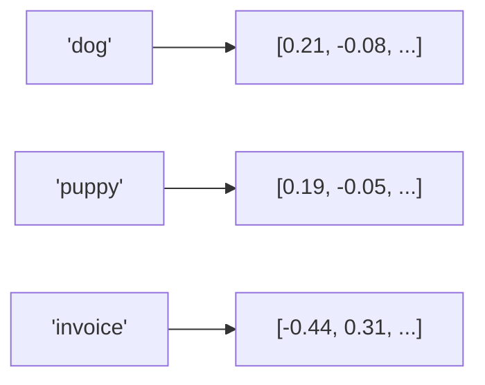

import TOCInline from '@theme/TOCInline';

# Embeddings

<TOCInline toc={toc} minHeadingLevel={2} maxHeadingLevel={2} />

:::tip[In this guide]
How text becomes a vector that captures meaning, how we measure similarity
between vectors, how to generate embeddings in Python, how to pick a model,
and how to sanity-check that retrieval is actually working.
:::

## What Is It?

An **embedding** is a fixed-length vector of floats that represents the meaning
of a piece of text (or image, audio, code — anything a model can be trained
on). Similar meanings → nearby vectors, dissimilar meanings → distant vectors.

A model like `all-MiniLM-L6-v2` always outputs a vector of the same length —
384 numbers in this case — no matter whether you feed it one word or a full
paragraph. That fixed length is what makes embeddings easy to store and
compare: every piece of text becomes a point in the same 384-dimensional
space.

```python
"dog"                                  -> [0.021, -0.183, ..., 0.077]   # 384 numbers
"a very good boy who chases squirrels" -> [0.019, -0.171, ..., 0.081]   # also 384 numbers
```

## Why Does It Matter?

Embeddings turn "find text about X" into "find the nearest vectors to X's
vector" — fast, semantic search that keyword matching can't do. This is the
foundation of RAG (retrieval-augmented generation), semantic search,
deduplication, clustering, recommendation, and classification without
labeled data.

**Concretely, what keyword search misses that embeddings catch:**

| Query | Document | Keyword match? | Embedding match? |
| --- | --- | --- | --- |
| "How do I cancel my subscription?" | "Steps to terminate your membership" | No shared words | Yes — close vectors |
| "python list comprehension" | "iterating and filtering a list in Python" | Partial | Yes |
| "jaguar speed" | "Jaguar F-Type top speed" | Yes | Yes |
| "jaguar speed" | "how fast can a jaguar run" (the animal) | Yes | Correctly ranks lower — context disambiguates |

That last row is the key insight: embeddings capture *context*, not just
tokens. The word "jaguar" alone is ambiguous, but the surrounding words shift
the vector toward "car" or "animal" meaning.

## What They Capture

"car", "automobile", and "vehicle" land close together even without shared
letters, because an embedding model was trained so that related meanings
produce nearby vectors. This happens because the model was trained (via
contrastive learning) on pairs of text known to be related — e.g. a question
and its answer, or two paraphrases — and pushed apart on pairs known to be
unrelated.



`dog` and `puppy` are close; `invoice` is far away.

**What embeddings are good at:**
- Synonyms and paraphrases ("cheap" ↔ "inexpensive")
- Topic/domain similarity ("stock market" ↔ "NASDAQ")
- Cross-lingual matching, if the model was trained multilingually
- Loose semantic relationships even with zero shared vocabulary

**What embeddings are bad at (and keyword/BM25 search still wins):**
- Exact identifiers: SKUs, error codes, part numbers, ticket IDs (`ERR_504`)
- Negation: "not recommended" often embeds *close to* "recommended"
- Numbers and dates: "under $50" vs "under $500" can look deceptively similar
- Rare acronyms the model never saw in training

This is why production RAG systems often combine embeddings with keyword
search (**hybrid search**, e.g. BM25 + vector, merged with reciprocal rank
fusion) rather than relying on embeddings alone.

## Cosine Similarity

We compare vectors by the **angle** between them, not their length. Cosine
similarity ranges from -1 (opposite) to 1 (identical direction):

```python
import numpy as np

def cosine_similarity(a, b):
    a, b = np.array(a), np.array(b)
    return float(a @ b / (np.linalg.norm(a) * np.linalg.norm(b)))

cosine_similarity([1, 0], [1, 0])     # 1.0  (same)
cosine_similarity([1, 0], [0, 1])     # 0.0  (unrelated)
cosine_similarity([1, 0], [-1, 0])    # -1.0 (opposite)
```

Higher score = more semantically similar. Retrieval returns the highest-scoring
chunks.

### Why angle, not distance?

Length (magnitude) often reflects things like text length or word frequency
rather than meaning, so two vectors can point in almost the same direction
but have very different magnitudes. Cosine similarity ignores magnitude and
only asks "do these two vectors point the same way?" — which lines up much
better with "do these two texts mean the same thing?"

### Cosine similarity vs. dot product vs. Euclidean distance

| Metric | What it measures | When to use |
| --- | --- | --- |
| Cosine similarity | Angle only, ignores magnitude | Default choice; works regardless of vector length |
| Dot product | Angle **and** magnitude | Fine (and faster) if embeddings are already normalized to unit length — then it's mathematically identical to cosine |
| Euclidean (L2) distance | Straight-line distance | Rarely used for text; sensitive to magnitude, which is usually noise |

Most vector databases let you pick the metric when you create an index
(`cosine`, `dotproduct`, `euclidean`). If your embeddings are L2-normalized
(unit length), cosine and dot product give identical rankings — dot product
is just cheaper to compute, which is why many vector DBs normalize vectors
on ingest and use dot product internally.

```python
# Normalizing a vector to unit length so dot product == cosine similarity
def normalize(v):
    v = np.array(v)
    return v / np.linalg.norm(v)
```

## Generating Embeddings

### Option A — sentence-transformers (local, popular)

```bash
pip install sentence-transformers
```

```python
from sentence_transformers import SentenceTransformer

model = SentenceTransformer("all-MiniLM-L6-v2")   # 384-dim, fast
vectors = model.encode([
    "RAG retrieves context before generating.",
    "A vector database stores embeddings.",
])
vectors.shape                                       # (2, 384)
```

Runs on CPU fine for small workloads; add `device="cuda"` if you have a GPU
and are embedding a large corpus.

### Option B — Ollama embeddings

```python
import requests

def embed(text: str, model: str = "nomic-embed-text") -> list[float]:
    resp = requests.post(
        "http://localhost:11434/api/embeddings",
        json={"model": model, "prompt": text},
        timeout=60,
    )
    resp.raise_for_status()
    return resp.json()["embedding"]
```

Pull the model first: `ollama pull nomic-embed-text`.

### Option C — Hosted APIs (OpenAI, Cohere, Voyage)

Useful when you don't want to manage local inference, or need higher-quality
embeddings than local models typically offer:

```python
from openai import OpenAI

client = OpenAI()

def embed(text: str) -> list[float]:
    resp = client.embeddings.create(
        model="text-embedding-3-small",
        input=text,
    )
    return resp.data[0].embedding
```

Trade-off: network latency and per-token cost, in exchange for not running
your own inference and often better retrieval quality.

### End-to-end example: tiny semantic search

Putting cosine similarity and embedding generation together — this is the
core loop every RAG system runs:

```python
from sentence_transformers import SentenceTransformer
import numpy as np

model = SentenceTransformer("all-MiniLM-L6-v2")

docs = [
    "The cat sat on the mat.",
    "Stock prices fell sharply today.",
    "Kittens are baby cats.",
    "The Federal Reserve raised interest rates.",
]
doc_vectors = model.encode(docs)

query = "young feline animals"
query_vector = model.encode(query)

scores = doc_vectors @ query_vector / (
    np.linalg.norm(doc_vectors, axis=1) * np.linalg.norm(query_vector)
)
ranked = sorted(zip(docs, scores), key=lambda x: x[1], reverse=True)
for doc, score in ranked:
    print(f"{score:.3f}  {doc}")

# 0.612  Kittens are baby cats.
# 0.301  The cat sat on the mat.
# 0.041  The Federal Reserve raised interest rates.
# 0.018  Stock prices fell sharply today.
```

Note "young feline animals" shares zero words with "Kittens are baby cats."
and still ranks it first — that's the whole point of embeddings.

## Choosing an Embedding Model

| Concern | Guidance |
| --- | --- |
| Dimensions | Smaller (384) = faster/cheaper storage and search; larger (1024–3072) = more nuance, more storage |
| Speed | `all-MiniLM-L6-v2` is a strong, fast local default |
| Consistency | **Use the same model for documents and queries** |
| Domain | Specialized models exist for code (`code-search-net`), legal, biomedical (`BioBERT`-derived), etc. |
| Language | `all-MiniLM-L6-v2` is English-centric; use `paraphrase-multilingual-*` or a multilingual API model for non-English corpora |
| Context window | Check the model's max input tokens — text beyond that limit gets silently truncated, not embedded |
| License / hosting | Local (sentence-transformers, Ollama) = free, private, no network dependency; hosted (OpenAI, Cohere, Voyage) = usually higher quality, costs money, sends data off-machine |

### A rough model comparison

| Model | Dimensions | Where it runs | Notes |
| --- | --- | --- | --- |
| `all-MiniLM-L6-v2` | 384 | Local | Fast, small, great default for prototyping |
| `all-mpnet-base-v2` | 768 | Local | Slower, noticeably better quality than MiniLM |
| `nomic-embed-text` | 768 | Local (Ollama) | Long context window (8k tokens), good general quality |
| `text-embedding-3-small` | 1536 (truncatable) | OpenAI API | Cheap, strong quality, supports dimension reduction |
| `text-embedding-3-large` | 3072 (truncatable) | OpenAI API | Best OpenAI quality, higher cost |
| `voyage-2` / `voyage-large-2` | 1024 / 1536 | Voyage API | Strong on retrieval benchmarks, has domain-specific variants |

Benchmark numbers move fast — check the [MTEB leaderboard](https://huggingface.co/spaces/mteb/leaderboard)
for current rankings across retrieval, clustering, and classification tasks
rather than trusting any static table (including this one) for long.

### Matryoshka / truncatable embeddings

Some newer models (OpenAI's `text-embedding-3-*`, some open models trained
with Matryoshka Representation Learning) let you truncate the vector to a
shorter length and still get reasonable similarity — e.g. take only the
first 256 of 1536 dimensions to save storage, trading a small amount of
accuracy for a large space/speed win:

```python
resp = client.embeddings.create(
    model="text-embedding-3-small",
    input="some text",
    dimensions=256,   # instead of the default 1536
)
```

Only do this if the model explicitly supports it — truncating a normal
embedding model's output is not safe and will degrade quality unpredictably.

:::warning
Never mix embedding models between ingestion and querying. Vectors from
different models — or even different versions/checkpoints of the "same"
model — aren't comparable, since each model learns its own arbitrary
geometry for the vector space. If you switch embedding models, you must
**re-embed your entire corpus**, not just new documents going forward.
:::

## Common Mistakes

- Embedding documents with one model and queries with another.
- Comparing raw Euclidean distance when cosine is expected (normalize!).
- Embedding huge blocks of text instead of well-sized chunks (see [chunking](../06-advanced-rag/01-chunking-experiments.mdx)).
- Re-embedding unchanged documents every run (cache them, keyed by content hash).
- Silently truncating text longer than the model's max token window and not noticing.
- Assuming a higher similarity score always means "more relevant" — it means "more semantically similar," which isn't the same as answering the question well (a paraphrase of the query can outscore the actual answer).
- Storing embeddings without also storing which model/version produced them, making a future migration painful to detect and fix.
- Using cosine similarity thresholds as hard cutoffs ("only keep results above 0.8") without validating the threshold empirically — good thresholds vary a lot by model and domain.

## How to Sanity-Check Retrieval Quality

Before trusting a RAG pipeline, run a quick eval rather than assuming
similarity scores translate to good answers:

- **Recall@k** — for a set of test queries with known correct chunks, what
  fraction of the time is the correct chunk in the top *k* results?
- **MRR (Mean Reciprocal Rank)** — averages `1 / rank_of_first_correct_result`
  across test queries; rewards correct results appearing near the top, not
  just somewhere in the top k.
- **Eyeball test** — embed 5–10 real user queries and manually check whether
  the top 3 results are actually useful, not just topically related.

```python
def recall_at_k(results_by_query, correct_ids, k=5):
    hits = 0
    for query_id, ranked_ids in results_by_query.items():
        if correct_ids[query_id] in ranked_ids[:k]:
            hits += 1
    return hits / len(results_by_query)
```

## Interview Questions

- What is an embedding and what does it capture?
- Why cosine similarity rather than raw distance?
- Why must query and document embeddings share a model?
- How does embedding dimensionality affect cost/quality?
- When is dot product equivalent to cosine similarity, and why do vector DBs often prefer it?
- What kinds of queries do embeddings handle worse than keyword search, and why?
- What's the difference between recall@k and MRR, and when would you prefer one over the other?
- What happens if you re-embed only new documents after switching models, instead of the whole corpus?

## Things to Remember

- Embedding = meaning as a vector.
- Cosine similarity = angle-based closeness, magnitude-independent.
- Same model, same version, for docs and queries — always.
- Embeddings excel at semantic/paraphrase matching, but struggle with exact IDs, negation, and precise numbers — hybrid search covers the gap.
- A high similarity score means "similar meaning," not "correct answer" — validate retrieval quality with recall@k or manual review, don't just trust the number.

## Mini Exercise

Embed five short sentences (three related, two unrelated), compute pairwise
cosine similarity, and confirm the related ones score highest. Then try one
adversarial pair — e.g. "recommended" vs. "not recommended" — and see how
close the model puts them. That gap is a useful, concrete reminder of what
embeddings do and don't capture.

## Done When

- [ ] You can generate embeddings with sentence-transformers or Ollama.
- [ ] You can compute and interpret cosine similarity.
- [ ] You can explain why the embedding model must match.
- [ ] You can name at least two things embeddings are bad at, and why hybrid search helps.
- [ ] You can describe one way to check retrieval quality beyond "the score looked high."
