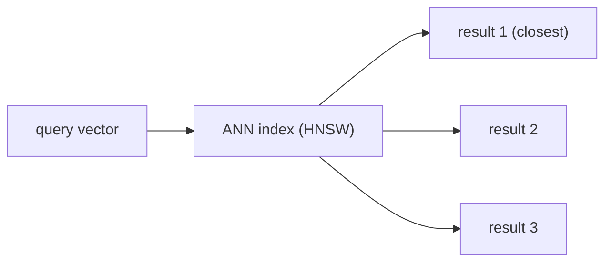

import TOCInline from '@theme/TOCInline';

# Vector DB with Chroma

<TOCInline toc={toc} minHeadingLevel={2} maxHeadingLevel={2} />

:::tip[In this guide]
Store embeddings and search them fast with Chroma: collections, documents +
metadata, querying by similarity, filtering, persistence, distance metrics,
updates/deletes, and how Chroma fits into a larger vector DB landscape.
:::

## What Is It?

A **vector database** stores embeddings and finds the nearest ones to a query
vector quickly, even across millions of items. **Chroma** is a simple,
local-first option perfect for learning — no server to stand up, no cloud
account, just `pip install` and go.

Under the hood, a vector DB is really three things bolted together:

1. A place to store the vectors themselves (plus the original text and metadata)
2. An **ANN index** that makes similarity search fast (see below)
3. A query layer that supports filtering, top-k retrieval, and updates

## Why Does It Matter?

Comparing a query against every stored vector — a **brute-force / exact
search** — is O(n): with a million documents, every single query means a
million dot products. That's fine for a demo, too slow for production.

Vector DBs use **approximate nearest neighbor (ANN)** indexes to return the
top matches in milliseconds, by trading a small amount of accuracy for a huge
speed win.



### Brute force vs. ANN — a rough intuition

| Approach | How it works | Speed at scale | Accuracy |
| --- | --- | --- | --- |
| Brute force (exact) | Compare query to every stored vector | O(n) — slow past ~100k–1M vectors | 100% correct — always finds the true nearest neighbors |
| ANN (e.g. HNSW) | Navigate a graph/index structure toward likely-close vectors, skipping most comparisons | Sub-linear — fast even at 100M+ vectors | ~95–99.9% — occasionally misses the true top result, in exchange for speed |

For small collections (a few thousand docs), brute force and ANN feel
identical. The difference only shows up at scale — which is exactly why it's
easy to not notice a bug until your data grows.

## Install

```bash
pip install chromadb
```

## Collections

A collection groups related vectors (like a table in a relational database —
one collection per corpus, e.g. `docs`, `support_tickets`, `product_catalog`).
Chroma can embed text for you or accept precomputed vectors.

```python
import chromadb

client = chromadb.Client()                       # in-memory, gone when process exits
collection = client.create_collection("docs")
```

By default, Chroma embeds text with a built-in `all-MiniLM-L6-v2` sentence-
transformers model running locally — you don't need to call an embedding
function yourself unless you want a different model (see
[Custom Embedding Functions](#custom-embedding-functions) below).

## Adding Documents

Let Chroma embed the text (uses a default embedder), storing text + metadata +
ids:

```python
collection.add(
    ids=["doc1", "doc2", "doc3"],
    documents=[
        "RAG retrieves relevant context before generating an answer.",
        "Chroma is a local-first vector database.",
        "FastAPI builds typed Python APIs.",
    ],
    metadatas=[
        {"source": "rag.md", "topic": "rag"},
        {"source": "chroma.md", "topic": "vectordb"},
        {"source": "fastapi.md", "topic": "backend"},
    ],
)
```

`ids` must be unique strings you choose — Chroma doesn't auto-generate them.
A common pattern is a hash of the source + chunk index, e.g.
`f"{filename}-{chunk_i}"`, so re-running ingestion on the same file produces
the same ids instead of duplicating documents.

To supply your own embeddings (e.g. from [sentence-transformers](./01-embeddings.mdx)),
pass `embeddings=[...]` alongside `documents`:

```python
from sentence_transformers import SentenceTransformer

model = SentenceTransformer("all-mpnet-base-v2")
texts = ["RAG retrieves relevant context before generating an answer."]
vectors = model.encode(texts).tolist()

collection.add(ids=["doc1"], documents=texts, embeddings=vectors)
```

### Custom Embedding Functions

Instead of passing precomputed vectors every time, you can register an
embedding function on the collection so `add`/`query` embed automatically
with the model you want:

```python
from chromadb.utils import embedding_functions

ef = embedding_functions.SentenceTransformerEmbeddingFunction(
    model_name="all-mpnet-base-v2"
)
collection = client.create_collection("docs", embedding_function=ef)
```

:::warning
The embedding function is bound to the collection when it's created. If you
later query the same collection with a different embedding function (or a
different default), you'll get inconsistent, low-quality results — the same
"never mix embedding models" rule from the [embeddings guide](./01-embeddings.mdx)
applies here too.
:::

## Querying by Similarity

```python
results = collection.query(
    query_texts=["What is retrieval augmented generation?"],
    n_results=2,
)
for doc, meta, dist in zip(
    results["documents"][0], results["metadatas"][0], results["distances"][0]
):
    print(round(dist, 3), meta["source"], "→", doc)
```

`n_results` is your **top-k**. Lower distance = more similar (this is
distance, the inverse of similarity — see [Distance Metrics](#distance-metrics)).

### Querying with multiple query texts at once

`query_texts` accepts a list, so you can batch several queries in a single
call — the results come back as parallel lists, one per query:

```python
results = collection.query(
    query_texts=["what is RAG?", "how do I persist data?"],
    n_results=2,
)
# results["documents"][0] -> top 2 for "what is RAG?"
# results["documents"][1] -> top 2 for "how do I persist data?"
```

### The shape of a query result

It's easy to assume `results` is a flat list — it isn't. Every field is a
list of lists, outer-indexed by query, inner-indexed by rank:

```python
{
    "ids":       [["doc2", "doc1"]],       # one inner list per query
    "documents": [["Chroma is a...", "RAG retrieves..."]],
    "metadatas": [[{"source": "chroma.md", ...}, {"source": "rag.md", ...}]],
    "distances": [[0.42, 0.61]],
}
```

## Metadata Filtering

Combine semantic search with structured filters:

```python
results = collection.query(
    query_texts=["how do I build an API?"],
    n_results=3,
    where={"topic": "backend"},        # only backend docs
)
```

Metadata (source, page, date, author) also powers **citations** later.

### Filter operators

`where` supports comparison and logical operators beyond exact match:

```python
# Numeric / date range
collection.query(
    query_texts=["quarterly earnings"],
    where={"year": {"$gte": 2023}},
)

# Multiple conditions (implicit AND when using $and)
collection.query(
    query_texts=["outage postmortem"],
    where={"$and": [{"topic": "backend"}, {"year": {"$gte": 2024}}]},
)

# Match against one of several values
collection.query(
    query_texts=["deployment steps"],
    where={"topic": {"$in": ["backend", "devops"]}},
)
```

There's also `where_document`, which filters on the raw document text (e.g.
`{"$contains": "error"}`) rather than metadata fields — useful for a coarse
keyword pre-filter layered on top of semantic search.

## Persistence

Keep data across restarts by writing to disk:

```python
import chromadb

client = chromadb.PersistentClient(path="./chroma")   # saved to ./chroma
collection = client.get_or_create_collection("docs")
```

`get_or_create_collection` (rather than `create_collection`) is important for
persistence — `create_collection` throws if the collection already exists,
which will crash a script the second time you run it against the same path.
Use `get_or_create_collection` in any script you expect to re-run.

### Client types at a glance

| Client | Data location | Use case |
| --- | --- | --- |
| `chromadb.Client()` | In-memory only | Quick experiments, tests — data disappears on exit |
| `chromadb.PersistentClient(path=...)` | Local disk | Single-machine apps, prototypes, small production use |
| `chromadb.HttpClient(host=..., port=...)` | Remote Chroma server | Multiple processes/services sharing one vector store |

## Distance Metrics

Chroma collections default to a distance metric (e.g. L2/Euclidean). You can
configure cosine, which pairs naturally with normalized embeddings:

```python
collection = client.create_collection(
    "docs",
    metadata={"hnsw:space": "cosine"},
)
```

`hnsw` refers to the ANN index (Hierarchical Navigable Small World) Chroma
uses. Available spaces are `"l2"` (squared Euclidean, the default), `"ip"`
(inner product / dot product), and `"cosine"`. The metric is set **once, at
collection creation** — you can't change it afterward without recreating the
collection and re-adding everything, so decide upfront (cosine is a safe
default for text embeddings; see the [embeddings guide](./01-embeddings.mdx)
for why).

Because Chroma returns *distance*, not similarity, remember the sign flips
depending on metric:

| Metric | Returned as | Lower = more similar? |
| --- | --- | --- |
| `l2` | Squared Euclidean distance | Yes |
| `cosine` | `1 - cosine_similarity` | Yes |
| `ip` | Negative inner product | Yes |

So across all three, "lower distance = more similar" holds — Chroma
normalizes the sign for you, but it's worth knowing distance isn't the same
number as the similarity score itself.

## Updating and Deleting

Collections aren't append-only — you'll usually need to keep them in sync
with a changing corpus:

```python
# Update an existing id's text/embedding/metadata
collection.update(
    ids=["doc1"],
    documents=["RAG retrieves relevant, up-to-date context before generating."],
)

# Upsert: update if the id exists, insert if it doesn't
collection.upsert(
    ids=["doc1", "doc4"],
    documents=["updated text for doc1", "brand new doc4"],
)

# Delete by id
collection.delete(ids=["doc3"])

# Delete by metadata filter
collection.delete(where={"source": "old_file.md"})
```

`upsert` is usually what you want for ingestion pipelines that re-run on a
changing set of source files — it avoids the "delete everything, re-add
everything" pattern, which is slow and briefly leaves the collection empty.

## Inspecting a Collection

Useful when debugging why a collection seems empty or wrong:

```python
collection.count()                          # how many items are stored
collection.peek(limit=3)                    # sample a few items
collection.get(ids=["doc1"])                # fetch specific items by id, no similarity search
client.list_collections()                   # see all collections on this client
```

`get` is worth calling out specifically: it's a direct lookup by id or
metadata filter, with **no embedding or similarity math involved** — use it
when you know exactly which record you want, and save `query` for when you
need semantic search.

## Common Mistakes

- Recreating the collection each run and losing data (use `PersistentClient` + `get_or_create_collection`).
- Mixing embedding models between `add` and `query` — including accidentally using Chroma's default embedder for `add` while querying with a different custom embedding function.
- Ignoring metadata — you'll want it for filtering and citations.
- Setting `n_results` too high (irrelevant chunks dilute the prompt).
- Calling `create_collection` on every run instead of `get_or_create_collection`, causing a crash the second time the script runs.
- Reading `distances` as similarity scores without accounting for which metric is configured (e.g. treating a small L2 distance the same way as a high cosine similarity).
- Forgetting that changing `hnsw:space` requires a brand-new collection — it can't be altered on an existing one.
- Using non-unique or auto-incrementing ids across re-runs, silently duplicating documents instead of updating them.
- Deleting and re-adding a document instead of using `upsert`, causing brief windows where the document is missing from search results.

## Chroma vs. Other Vector Databases

Chroma is a great starting point, but it's worth knowing where it sits
relative to other common options, since production requirements sometimes
outgrow it:

| Database | Deployment | Good fit for |
| --- | --- | --- |
| Chroma | Embedded (in-process) or self-hosted server | Learning, prototyping, single-machine apps |
| FAISS | Library, not a database | Maximum control/performance, no metadata filtering or persistence built in |
| Pinecone | Managed cloud service | Production apps that don't want to run infrastructure |
| Weaviate | Self-hosted or managed | Production apps needing hybrid search, GraphQL API |
| pgvector | Postgres extension | Teams already on Postgres who want vectors alongside relational data |
| Qdrant | Self-hosted or managed | Production apps needing advanced filtering + good performance |

None of these are strictly "better" — the right choice depends on scale,
whether you want managed infrastructure, and whether vectors need to live
alongside other relational data.

## Interview Questions

- Why use a vector DB instead of scanning all vectors?
- What is approximate nearest neighbor search, and what's the accuracy/speed trade-off vs. brute force?
- What is a collection, and what is top-k?
- How does metadata support filtering and citations?
- What's the difference between `create_collection` and `get_or_create_collection`, and why does it matter for persistence?
- Why can't you change a collection's distance metric after creation?
- What's the difference between `upsert` and delete-then-add, operationally?
- When would you reach for `get` instead of `query`?

## Things to Remember

- Vector DB = fast ANN search over embeddings, trading a little accuracy for a lot of speed at scale.
- Store text + metadata + ids together; ids should be stable and unique across re-runs.
- Persist to disk with `PersistentClient` + `get_or_create_collection`; keep the embedding model and distance metric consistent for a collection's lifetime.
- `distances` in results are distance, not similarity — lower is always better, but the underlying number depends on the configured metric.
- Prefer `upsert` over delete-then-add when syncing a changing corpus.

## Mini Exercise

Create a persistent Chroma collection, add five documents with `source`
metadata, and query it — print the top-2 results with their sources and
distances. Then update one document's text with `collection.update`, re-run
the same query, and confirm the result reflects the new text.

## Done When

- [ ] You can create (persistent) collections.
- [ ] You can add documents with metadata and query top-k.
- [ ] You can filter by metadata (including range and `$in` filters) and explain ANN search.
- [ ] You can explain the difference between `create_collection` and `get_or_create_collection`.
- [ ] You can update/upsert/delete documents and know when to use each.
