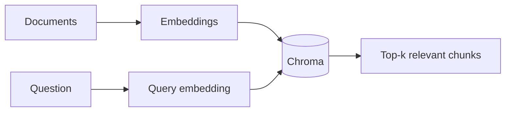

import TOCInline from '@theme/TOCInline';

# 04 · Embeddings / Vector DB

<ProgressToggle sectionId="04-embeddings-vector-db" />

<TOCInline toc={toc} minHeadingLevel={2} maxHeadingLevel={2} />

:::tip[In this guide]
The two ideas that make retrieval possible: embeddings (meaning as vectors)
and a vector database (fast nearest-neighbor search). This is the heart of RAG.
:::

## Goal

Generate embeddings for text and store/query them in Chroma to find the most
relevant chunks for a question.

## Estimated Time

4–6 days.

## Prerequisites

- [Core AI concepts](../00-prerequisites/02-core-ai-concepts.mdx).
- [Local LLMs / Ollama](../03-local-llms-ollama/index.mdx) (we can embed with Ollama or `sentence-transformers`).

## What You Will Learn

1. [Embeddings](./01-embeddings.mdx) — what vectors capture, cosine similarity, generating them.
2. [Vector DB with Chroma](./02-vector-db-chroma.mdx) — collections, adding documents, querying, metadata.

## Where This Fits

## Interview Relevance

Embeddings, cosine similarity, and "how does a vector DB find neighbors?" are
core AI-engineering interview questions.

## Done When

- [ ] You can generate embeddings for text.
- [ ] You understand cosine similarity intuitively.
- [ ] You can add and query documents in Chroma with metadata.

Next: [05 · RAG Fundamentals](../05-rag-fundamentals/index.mdx).
