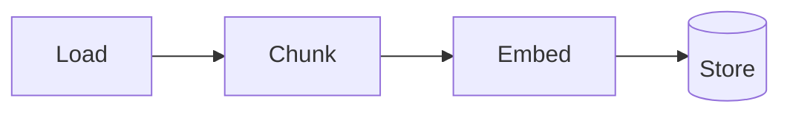

import TOCInline from '@theme/TOCInline';

# Ingestion Pipeline

<TOCInline toc={toc} minHeadingLevel={2} maxHeadingLevel={2} />

:::tip[In this guide]
The "write path" of RAG: turning raw documents into searchable, embedded
chunks with metadata — the work behind your `/ingest` endpoint.
:::

## What Is It?

Ingestion is the offline pipeline that prepares your knowledge base:
**load → chunk → embed → store**.

## Why Does It Matter?

Retrieval quality is capped by ingestion quality. Bad chunks or missing
metadata mean the LLM never sees the right context, no matter how good the model
is.

## The Four Steps



### 1. Load

Read your sources (text, Markdown, PDFs) into strings. Keep useful metadata
(source path, title, page).

```python
from pathlib import Path

def load_texts(folder: str) -> list[dict]:
    docs = []
    for path in Path(folder).glob("*.md"):
        docs.append({"text": path.read_text(encoding="utf-8"),
                     "source": path.name})
    return docs
```

### 2. Chunk

LLMs and embeddings work best on bounded pieces. Split long text into
overlapping chunks so context isn't cut mid-idea:

```python
def chunk_text(text: str, size: int = 800, overlap: int = 100) -> list[str]:
    chunks, start = [], 0
    while start < len(text):
        end = start + size
        chunks.append(text[start:end])
        start = end - overlap        # overlap preserves context across boundaries
    return chunks
```

- **Chunk size**: too small loses context; too big dilutes relevance. ~500–1000 characters (or ~100–250 tokens) is a common start.
- **Overlap**: ~10–20% keeps ideas that straddle boundaries retrievable.

You'll experiment with strategies in [Advanced RAG chunking](../06-advanced-rag/01-chunking-experiments.mdx).

### 3. Embed

Convert each chunk into a vector with your chosen [embedding model](../04-embeddings-vector-db/01-embeddings.mdx).
Use the **same** model at query time.

### 4. Store

Persist chunk text + embedding + metadata in [Chroma](../04-embeddings-vector-db/02-vector-db-chroma.mdx).

## An Ingestion Service

Following the [service pattern](../01-python/04-professional-python.mdx#backend-patterns-and-clean-architecture):

```python
import chromadb
from sentence_transformers import SentenceTransformer

class IngestionService:
    def __init__(self, chroma_dir: str = "./chroma"):
        self._client = chromadb.PersistentClient(path=chroma_dir)
        self._collection = self._client.get_or_create_collection(
            "docs", metadata={"hnsw:space": "cosine"}
        )
        self._embedder = SentenceTransformer("all-MiniLM-L6-v2")

    def ingest(self, documents: list[dict]) -> int:
        ids, texts, metas, vectors = [], [], [], []
        for doc in documents:
            for i, chunk in enumerate(chunk_text(doc["text"])):
                ids.append(f"{doc['source']}-{i}")
                texts.append(chunk)
                metas.append({"source": doc["source"], "chunk": i})
                vectors.append(self._embedder.encode(chunk).tolist())
        self._collection.add(
            ids=ids, documents=texts, metadatas=metas, embeddings=vectors
        )
        return len(ids)
```

## Idempotency and Updates

- Use **stable ids** (like `source-chunkIndex`) so re-ingesting updates instead of duplicating.
- Re-chunk/re-embed only changed documents to save time.
- Consider a content hash in metadata to detect changes.

## Common Mistakes

- One giant chunk per document (retrieval returns irrelevant bulk).
- No overlap (ideas split across boundaries become unfindable).
- Losing metadata (no way to cite sources later).
- Duplicate ids on re-ingest, bloating the store.

## Interview Questions

- Walk through the ingestion pipeline.
- Why chunk, and how do you choose size/overlap?
- Why keep metadata with each chunk?
- How do you avoid duplicates on re-ingest?

## Things to Remember

- Load → chunk → embed → store.
- Overlapping chunks; keep metadata.
- Stable ids make ingestion idempotent.

## Mini Exercise

Write `IngestionService.ingest(documents)` that chunks with overlap, embeds
each chunk, and stores it in a persistent Chroma collection. Return the number
of chunks added.

## Done When

- [ ] You can load and chunk documents with overlap.
- [ ] You can embed and store chunks with metadata.
- [ ] Re-ingesting the same doc doesn't create duplicates.
