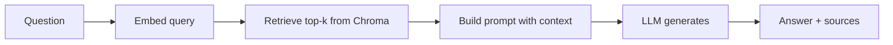

import TOCInline from '@theme/TOCInline';

# Retrieval & Generation

<TOCInline toc={toc} minHeadingLevel={2} maxHeadingLevel={2} />

:::tip[In this guide]
The "read path" of RAG: turn a question into an answer grounded in your data,
with the sources it used — the work behind your `/ask` endpoint.
:::

## What Is It?

The query-time pipeline: **embed query → retrieve top-k → build prompt →
generate → return answer + sources**.

## Why Does It Matter?

This is where grounding happens. Feeding the model relevant context (and asking
it to answer only from that context) is what reduces hallucination.

## The Flow



## 1. Retrieve

Embed the question with the **same model** used for ingestion, then query the
vector store:

```python
class RetrievalService:
    def __init__(self, collection, embedder):
        self._collection = collection
        self._embedder = embedder

    def retrieve(self, question: str, top_k: int = 4) -> list[dict]:
        query_vec = self._embedder.encode(question).tolist()
        res = self._collection.query(query_embeddings=[query_vec], n_results=top_k)
        return [
            {"text": doc, "source": meta["source"], "distance": dist}
            for doc, meta, dist in zip(
                res["documents"][0], res["metadatas"][0], res["distances"][0]
            )
        ]
```

## 2. Build a Grounded Prompt

Give the model the context and clear instructions to use only that context:

```python
PROMPT_TEMPLATE = """You are a helpful assistant. Answer the question using ONLY the context below.
If the answer is not in the context, say "I don't know based on the provided documents."

Context:
{context}

Question: {question}

Answer:"""

def build_prompt(question: str, chunks: list[dict]) -> str:
    context = "\n\n".join(f"[{i+1}] {c['text']}" for i, c in enumerate(chunks))
    return PROMPT_TEMPLATE.format(context=context, question=question)
```

The `[1]`, `[2]` markers let the model (and you) reference sources.

## 3. Generate

Call Ollama with a **low temperature** for factual answers (see
[Ollama API](../03-local-llms-ollama/02-ollama-api-usage.mdx)):

```python
import httpx

async def generate(prompt: str, model: str = "llama3.2") -> str:
    async with httpx.AsyncClient(timeout=120) as client:
        resp = await client.post(
            "http://localhost:11434/api/generate",
            json={"model": model, "prompt": prompt, "stream": False,
                  "options": {"temperature": 0.1}},
        )
        resp.raise_for_status()
        return resp.json()["response"]
```

## 4. Assemble the RAG Service

```python
from dataclasses import dataclass

@dataclass
class RagResult:
    answer: str
    sources: list[dict]

class RagService:
    def __init__(self, retrieval: RetrievalService, model: str = "llama3.2"):
        self._retrieval = retrieval
        self._model = model

    async def answer(self, question: str, top_k: int = 4) -> RagResult:
        chunks = self._retrieval.retrieve(question, top_k=top_k)
        prompt = build_prompt(question, chunks)
        answer = await generate(prompt, self._model)
        return RagResult(answer=answer, sources=chunks)
```

## Returning Sources

Always return which chunks informed the answer. It enables **citations**,
builds trust, and makes debugging bad answers possible ("was the right chunk
even retrieved?").

## Prompting Tips

- Tell the model to answer **only** from context and to admit when it can't.
- Keep context focused — more isn't better; irrelevant chunks distract.
- Low temperature (0–0.2) for factual Q&A.

## Common Mistakes

- Different embedding model for query vs documents (garbage retrieval).
- Stuffing too many chunks into the prompt (dilution + token cost).
- No "say I don't know" instruction → confident hallucinations.
- Dropping sources, so you can't tell why an answer was wrong.

## Interview Questions

- Walk through retrieval + generation step by step.
- Why does grounding reduce hallucination?
- How do you choose top-k?
- Why return sources?

## Things to Remember

- Same embedding model for query and docs.
- Instruct the model to use only the provided context.
- Low temperature; return sources.

## Mini Exercise

Implement `RagService.answer(question, top_k)` that retrieves, builds a grounded
prompt, generates, and returns both the answer and the source chunks.

## Done When

- [ ] You can retrieve top-k chunks for a query.
- [ ] You can build a grounded prompt and generate an answer.
- [ ] You return sources alongside the answer.
