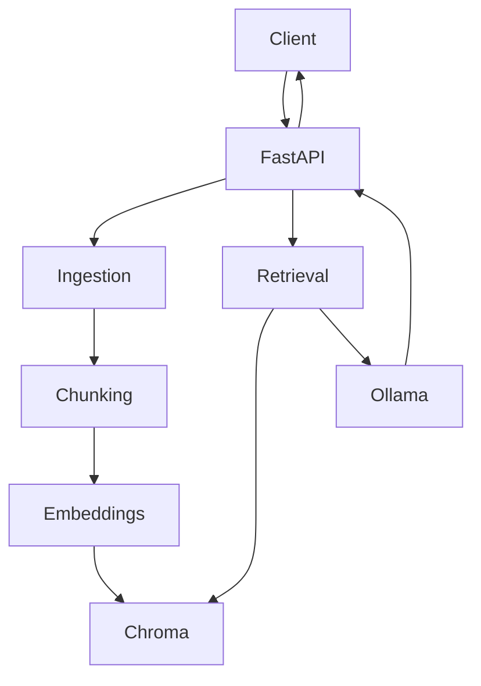

import TOCInline from '@theme/TOCInline';

# First Project — RAG API

<TOCInline toc={toc} minHeadingLevel={2} maxHeadingLevel={2} />

:::tip[In this guide]
Assemble everything into one coherent project you'll keep improving through the
rest of the roadmap: a local-first RAG API.
:::

## What You're Building

A production-style AI API combining **FastAPI + Ollama + embeddings + Chroma +
RAG**, exposing three endpoints:

```text
GET  /health   → liveness
POST /ingest   → add documents
POST /ask      → answer with sources
```

## Architecture



## Project Structure

This is the same layout from [Project Architecture](../02-fastapi/04-project-architecture.mdx) —
later sections extend it rather than starting over:

```text
app/
├── main.py
├── config.py
├── dependencies.py
├── routers/
│   ├── health.py
│   ├── ingest.py
│   └── query.py
├── services/
│   ├── ingestion.py
│   ├── retrieval.py
│   └── llm.py
└── schemas/
    └── rag.py
```

## Dependencies

```text
fastapi
uvicorn[standard]
httpx
chromadb
sentence-transformers
pydantic
pydantic-settings
```

```bash
pip install -r requirements.txt
ollama pull llama3.2
```

## config.py

```python
from pydantic_settings import BaseSettings, SettingsConfigDict

class Settings(BaseSettings):
    model_config = SettingsConfigDict(env_file=".env")
    ollama_url: str = "http://localhost:11434"
    ollama_model: str = "llama3.2"
    chroma_dir: str = "./chroma"
    embed_model: str = "all-MiniLM-L6-v2"

settings = Settings()
```

## schemas/rag.py

```python
from pydantic import BaseModel, Field

class IngestRequest(BaseModel):
    documents: list[str] = Field(min_length=1)

class IngestResponse(BaseModel):
    chunks_added: int

class AskRequest(BaseModel):
    question: str = Field(min_length=1)
    top_k: int = Field(default=4, ge=1, le=20)

class Source(BaseModel):
    text: str
    source: str
    distance: float

class AskResponse(BaseModel):
    answer: str
    sources: list[Source]
```

## services/llm.py

```python
import httpx

class LlmService:
    def __init__(self, base_url: str, model: str):
        self._url = base_url
        self._model = model

    async def generate(self, prompt: str) -> str:
        async with httpx.AsyncClient(timeout=120) as client:
            resp = await client.post(
                f"{self._url}/api/generate",
                json={"model": self._model, "prompt": prompt, "stream": False,
                      "options": {"temperature": 0.1}},
            )
            resp.raise_for_status()
            return resp.json()["response"]
```

## services/ingestion.py

```python
import chromadb
from sentence_transformers import SentenceTransformer

def chunk_text(text: str, size: int = 800, overlap: int = 100) -> list[str]:
    chunks, start = [], 0
    while start < len(text):
        chunks.append(text[start:start + size])
        start += size - overlap
    return chunks

class IngestionService:
    def __init__(self, chroma_dir: str, embed_model: str):
        client = chromadb.PersistentClient(path=chroma_dir)
        self.collection = client.get_or_create_collection(
            "docs", metadata={"hnsw:space": "cosine"}
        )
        self.embedder = SentenceTransformer(embed_model)

    def ingest(self, documents: list[str]) -> int:
        ids, texts, metas, vecs = [], [], [], []
        for d, doc in enumerate(documents):
            for i, chunk in enumerate(chunk_text(doc)):
                ids.append(f"doc{d}-{i}")
                texts.append(chunk)
                metas.append({"source": f"doc{d}", "chunk": i})
                vecs.append(self.embedder.encode(chunk).tolist())
        self.collection.add(ids=ids, documents=texts, metadatas=metas, embeddings=vecs)
        return len(ids)
```

## services/retrieval.py

```python
class RetrievalService:
    def __init__(self, collection, embedder):
        self.collection = collection
        self.embedder = embedder

    def retrieve(self, question: str, top_k: int = 4) -> list[dict]:
        vec = self.embedder.encode(question).tolist()
        res = self.collection.query(query_embeddings=[vec], n_results=top_k)
        return [
            {"text": t, "source": m["source"], "distance": float(d)}
            for t, m, d in zip(res["documents"][0], res["metadatas"][0], res["distances"][0])
        ]

PROMPT = """Answer using ONLY the context. If it's not there, say you don't know.

Context:
{context}

Question: {question}
Answer:"""

def build_prompt(question: str, chunks: list[dict]) -> str:
    context = "\n\n".join(f"[{i+1}] {c['text']}" for i, c in enumerate(chunks))
    return PROMPT.format(context=context, question=question)
```

## dependencies.py

```python
from functools import lru_cache
from app.config import settings
from app.services.ingestion import IngestionService
from app.services.retrieval import RetrievalService
from app.services.llm import LlmService

@lru_cache
def get_ingestion() -> IngestionService:
    return IngestionService(settings.chroma_dir, settings.embed_model)

@lru_cache
def get_retrieval() -> RetrievalService:
    ing = get_ingestion()
    return RetrievalService(ing.collection, ing.embedder)

@lru_cache
def get_llm() -> LlmService:
    return LlmService(settings.ollama_url, settings.ollama_model)
```

`lru_cache` gives us a single shared instance (the embedder/model load once).

## routers

```python
# routers/health.py
from fastapi import APIRouter
router = APIRouter(tags=["health"])

@router.get("/health")
def health():
    return {"status": "ok"}
```

```python
# routers/ingest.py
from fastapi import APIRouter, Depends
from app.schemas.rag import IngestRequest, IngestResponse
from app.dependencies import get_ingestion

router = APIRouter(tags=["rag"])

@router.post("/ingest", response_model=IngestResponse)
def ingest(req: IngestRequest, svc=Depends(get_ingestion)):
    return IngestResponse(chunks_added=svc.ingest(req.documents))
```

```python
# routers/query.py
from fastapi import APIRouter, Depends
from app.schemas.rag import AskRequest, AskResponse, Source
from app.services.retrieval import build_prompt
from app.dependencies import get_retrieval, get_llm

router = APIRouter(tags=["rag"])

@router.post("/ask", response_model=AskResponse)
async def ask(req: AskRequest, retr=Depends(get_retrieval), llm=Depends(get_llm)):
    chunks = retr.retrieve(req.question, top_k=req.top_k)
    answer = await llm.generate(build_prompt(req.question, chunks))
    return AskResponse(answer=answer, sources=[Source(**c) for c in chunks])
```

## main.py

```python
from fastapi import FastAPI
from app.routers import health, ingest, query

app = FastAPI(title="RAG API", version="0.1.0")
app.include_router(health.router)
app.include_router(ingest.router, prefix="/api/v1")
app.include_router(query.router, prefix="/api/v1")
```

## Run It

```bash
uvicorn app.main:app --reload
```

Ingest, then ask:

```bash
curl -X POST http://localhost:8000/api/v1/ingest \
  -H "Content-Type: application/json" \
  -d '{"documents": ["RAG retrieves relevant context before the LLM generates an answer. It reduces hallucination by grounding responses in your data."]}'

curl -X POST http://localhost:8000/api/v1/ask \
  -H "Content-Type: application/json" \
  -d '{"question": "What does RAG do?", "top_k": 3}'
```

You should get a grounded answer plus the source chunks.

## What Comes Next

You'll keep improving **this same project**:

- [Advanced RAG](../06-advanced-rag/index.mdx): better chunking, metadata, hybrid search, reranking, evaluation, citations.
- [Production Patterns](../09-production-patterns/index.mdx): logging, guardrails, caching, deployment.

## Common Mistakes

- Loading the embedder per request instead of once (`lru_cache`).
- Blocking calls in async endpoints (embedding is sync — for heavy loads, offload with `asyncio.to_thread`).
- Not persisting Chroma (data lost on restart).

## Interview Questions

- Describe your RAG project's architecture and endpoints.
- Where does each responsibility live (routers/services)?
- How would you scale ingestion vs querying?

## Things to Remember

- Thin routers, service layer does the work.
- Share heavy objects (embedder, collection) via cached dependencies.
- Persist the vector store.

## Mini Exercise

Run the project end to end: ingest three short documents and ask two questions,
verifying the returned sources match the relevant documents.

## Done When

- [ ] `/health`, `/ingest`, `/ask` all work.
- [ ] Answers are grounded and include sources.
- [ ] The project uses the layered structure.
