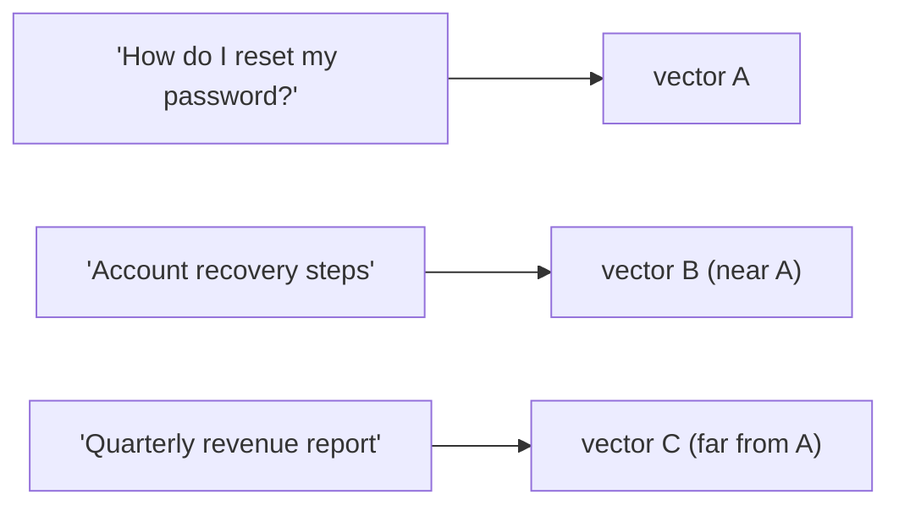

import TOCInline from '@theme/TOCInline';

# Embeddings

<TOCInline toc={toc} minHeadingLevel={2} maxHeadingLevel={2} />

:::tip[In this guide]
Embeddings are the foundation of retrieval. This deep dive covers what a vector
actually captures, how to generate embeddings locally, why dimensions and
normalization matter, and the one rule you must never break: embed documents and
queries with the **same** model. For the standalone primer, see
[04 · Embeddings](../04-embeddings-vector-db/01-embeddings.mdx); here we focus on
their role inside RAG.
:::

## What Is It?

An **embedding** is a fixed-length list of floating-point numbers (a vector) that
represents the *meaning* of a piece of text. An embedding model maps text into a
high-dimensional space where semantically similar texts land close together and
unrelated texts land far apart.

```python
# "cat" and "kitten" produce nearby vectors; "cat" and "invoice" produce distant ones
embedding = model.encode("a small domestic animal")
# -> [0.021, -0.114, 0.087, ...]  (e.g. 384 numbers)
```

## Why Does It Matter?

In RAG, retrieval is **semantic**, not keyword-based. To find chunks relevant to
a question, you compare the question's embedding to each chunk's embedding.
Everything downstream — [similarity search](./07-similarity-search.mdx),
[top-k retrieval](./08-top-k-retrieval.mdx), answer quality — depends on the
embeddings being good and consistent.

---

## What a Vector Captures

Each dimension is a learned feature; no single number is human-interpretable, but
the *geometry* is. Directions and distances encode meaning.



:::info[Theory: meaning as geometry]
Keyword search matches surface tokens; embeddings match meaning. "Reset my
password" and "account recovery steps" share almost no words, yet their vectors
are close because the model learned they mean the same thing. This semantic
recall is exactly why RAG can answer real questions that don't quote your docs
verbatim.
:::

---

## Dimensions

The **dimension** is how many numbers are in each vector (e.g. 384, 768, 1536).
Higher dimensions can capture more nuance but cost more storage and compute.

| Model | Dimensions | Notes |
| --- | --- | --- |
| `all-MiniLM-L6-v2` | 384 | Fast, small, great default for local RAG |
| `all-mpnet-base-v2` | 768 | Higher quality, slower |
| `nomic-embed-text` (Ollama) | 768 | Strong local option |
| OpenAI `text-embedding-3-small` | 1536 | Hosted, high quality |

:::note[Highlight: bigger is not automatically better]
A 1536-dim model is not guaranteed to beat a 384-dim one for your data. More
dimensions mean more storage, slower search, and higher cost. Start with a small,
fast model like `all-MiniLM-L6-v2`, measure with an
[eval set](./14-rag-evaluation.mdx), and only upgrade if the numbers justify it.
:::

---

## Generating Embeddings Locally

The `sentence-transformers` library runs embedding models on your machine — no
API, no cost.

```python
from sentence_transformers import SentenceTransformer

model = SentenceTransformer("all-MiniLM-L6-v2")   # downloads once, caches

# a single string -> one vector
vec = model.encode("Retrieval-augmented generation grounds answers in your data.")
print(vec.shape)          # (384,)

# a batch -> many vectors at once (far faster than one call each)
chunks = ["first chunk", "second chunk", "third chunk"]
vectors = model.encode(chunks, batch_size=32)      # shape (3, 384)
```

### With Ollama

You can also embed through a local Ollama model (see
[Ollama API](../03-local-llms-ollama/02-ollama-api-usage.mdx)):

```python
import httpx

async def embed(text: str, model: str = "nomic-embed-text") -> list[float]:
    async with httpx.AsyncClient() as client:
        resp = await client.post(
            "http://localhost:11434/api/embeddings",
            json={"model": model, "prompt": text},
        )
        return resp.json()["embedding"]
```

:::note[Highlight: batch your encodes]
Calling `model.encode(list_of_chunks)` once is dramatically faster than looping
and encoding one chunk at a time — the model processes the whole batch in
parallel on the GPU/CPU. During [ingestion](./01-ingestion-pipeline.mdx), always
embed chunks in batches.
:::

---

## Normalization

Many models return vectors of varying length (magnitude). If you plan to compare
with **cosine similarity** (the usual choice), normalize vectors to unit length —
then cosine similarity equals a simple dot product, which is faster.

```python
# sentence-transformers can normalize for you
vectors = model.encode(chunks, normalize_embeddings=True)   # each vector has length 1
```

:::info[Theory: cosine vs magnitude]
Cosine similarity measures the **angle** between vectors, ignoring their length —
which is what you want, since a longer chunk shouldn't automatically score
higher. Normalizing to unit length makes cosine similarity equivalent to a dot
product and keeps scores comparable. Match your normalization to your vector
store's distance metric (Chroma's `hnsw:space: cosine`). More in
[similarity search](./07-similarity-search.mdx).
:::

---

## The Golden Rule: Same Model for Docs and Queries

The vectors for your documents and the vector for a query must come from the
**same embedding model**. Different models produce incompatible vector spaces, so
distances become meaningless and retrieval returns garbage.

```python
# INGESTION
embedder = SentenceTransformer("all-MiniLM-L6-v2")
doc_vectors = embedder.encode(chunks)

# QUERY — must be the identical model
query_vector = embedder.encode(question)     # same "all-MiniLM-L6-v2"
```

:::warning[Never mix embedding models]
If you ingest with `all-MiniLM-L6-v2` and query with `all-mpnet-base-v2`, the two
vector spaces don't align — retrieval quality collapses silently (no error, just
bad results). If you change the embedding model, you must **re-embed your entire
corpus**. Store the model name in your config so it can never drift.
:::

---

## Choosing an Embedding Model

Weigh quality against speed, size, and where it runs.

- **Local + fast**: `all-MiniLM-L6-v2` (384-dim) — excellent default.
- **Local + higher quality**: `all-mpnet-base-v2` (768) or `nomic-embed-text`.
- **Hosted**: OpenAI `text-embedding-3-small/large` — high quality, per-token cost.
- **Domain-specific**: some tasks benefit from models fine-tuned on code, legal,
  or biomedical text.

:::note[Highlight: measure, don't guess]
The "best" model is the one that scores highest on *your* questions and *your*
documents. Pick two candidates, run both against an [eval set](./14-rag-evaluation.mdx),
and compare retrieval recall. Intuition about model size is a poor substitute for
a measurement.
:::

---

## Common Mistakes

- Using different models for documents and queries (silent quality collapse).
- Encoding chunks one at a time instead of batching (slow ingestion).
- Forgetting to normalize when the store uses cosine distance.
- Assuming a bigger, higher-dimension model is automatically better.
- Changing the embedding model without re-embedding the whole corpus.

## Interview Questions

- What is an embedding, and what does the distance between two vectors mean?
- Why must documents and queries use the same embedding model?
- What is the embedding dimension, and how does it affect cost and quality?
- When would you normalize embeddings?
- How would you choose between two embedding models?

## Things to Remember

- Embeddings turn text into vectors where nearness equals semantic similarity.
- Same model for docs and queries — always.
- Batch your encodes; normalize for cosine similarity.
- Start small and fast; upgrade only when an eval set says to.

## Mini Exercise

Embed the sentences "how do I reset my password", "account recovery guide", and
"annual revenue figures" with `all-MiniLM-L6-v2` (normalized). Compute cosine
similarity between the first and each of the others, and confirm the recovery
guide scores much higher than the revenue sentence.

## Done When

- [ ] You can generate embeddings locally with `sentence-transformers` or Ollama.
- [ ] You can explain dimensions, normalization, and cosine similarity.
- [ ] You always use one embedding model for both ingestion and querying.

Next: [Chunking Strategies](./05-chunking-strategies.mdx).
