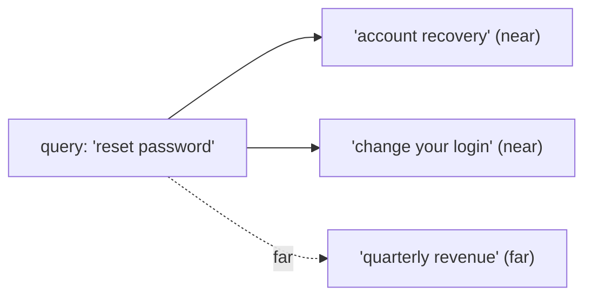

import TOCInline from '@theme/TOCInline';

# Similarity Search

<TOCInline toc={toc} minHeadingLevel={2} maxHeadingLevel={2} />

:::tip[In this guide]
Similarity search is the math that ranks chunks against a query. This guide covers
the three distance metrics in depth, why cosine is the usual default, the exact
vs approximate tradeoff, and how to read and convert the distances Chroma returns.
It builds directly on [embeddings](./04-embeddings.mdx) and the
[vector database](./06-vector-databases.mdx) that stores them.
:::

## What Is It?

**Similarity search** finds the stored vectors nearest to a query vector in
embedding space. "Nearest" means most semantically similar, because
[embeddings](./04-embeddings.mdx) place related meanings close together. It is the
scoring step that turns a query embedding into a ranked list of chunks.

```python
# embed the query, then ask the store for its nearest neighbors
query_vec = embedder.encode("how do I reset my password?").tolist()
res = collection.query(query_embeddings=[query_vec], n_results=4)
# res["distances"][0] -> smaller means closer (more similar) for cosine distance
```

## Why Does It Matter?

Every RAG answer starts from these rankings. If the scoring metric doesn't match
how your embeddings were built, the "nearest" chunks aren't actually the most
relevant ones, and the LLM is grounded in the wrong context. Understanding the
metric is what lets you trust — and debug — retrieval.

---

## Nearest Neighbors in Vector Space

Picture every chunk as a point in a high-dimensional space. A query is another
point. Similarity search returns the points closest to the query.



The only question is how you *measure* closeness — and there are three common
answers.

---

## Distance Metrics In Depth

### Cosine similarity

Cosine similarity measures the **angle** between two vectors, ignoring their
length. It is the dot product divided by the product of the two magnitudes.

```python
import numpy as np

def cosine_similarity(a: np.ndarray, b: np.ndarray) -> float:
    return float(np.dot(a, b) / (np.linalg.norm(a) * np.linalg.norm(b)))
```

- Range: `-1` (opposite) through `0` (unrelated) to `1` (identical direction).
- Ignores magnitude, so a long chunk doesn't score higher just for being long.
- The standard choice for text embeddings.

### Dot product (inner product)

The dot product multiplies matching dimensions and sums them. It accounts for
**both angle and magnitude**.

```python
def dot_product(a: np.ndarray, b: np.ndarray) -> float:
    return float(np.dot(a, b))   # larger = more similar
```

- No fixed range — grows with vector length.
- Fast, and equal to cosine similarity *when both vectors are normalized* to unit
  length.
- Use it when vectors are already normalized, or when magnitude genuinely carries
  meaning.

### Euclidean distance (L2)

Euclidean distance is the straight-line distance between the two points: the
square root of the summed squared differences per dimension.

```python
def euclidean_distance(a: np.ndarray, b: np.ndarray) -> float:
    return float(np.linalg.norm(a - b))   # smaller = closer
```

- Range: `0` (identical) upward — it is a distance, so smaller is better.
- Sensitive to magnitude, so unnormalized text vectors can rank oddly.
- Common for some image and audio embeddings.

:::info[Theory: angle vs distance]
Cosine and dot product ask "do these vectors point the same way?"; Euclidean asks
"how far apart are these points?". For text, *direction* encodes meaning and
*magnitude* is mostly an artifact of length and word count — which is why the
angle-based metrics win. Once vectors are normalized to length one, all three
rank neighbors in the same order, and cosine and dot product become identical.
:::

---

## Normalization and Why Cosine Is the Default

**Normalizing** a vector rescales it to length one without changing its
direction. After normalization, magnitude is gone and only direction remains — so
cosine similarity (an angle) is the natural comparison.

```python
def normalize(v: np.ndarray) -> np.ndarray:
    return v / np.linalg.norm(v)

# sentence-transformers can do it for you at encode time
vectors = embedder.encode(chunks, normalize_embeddings=True)  # each has length 1
```

Two payoffs: scores become comparable across chunks of different lengths, and
cosine similarity reduces to a plain dot product (one multiply-and-sum, no
division) — which is why ANN indexes run it so fast.

:::note[Highlight: normalize once, at ingestion]
If you normalize your document vectors during [ingestion](./01-ingestion-pipeline.mdx)
and your query vector at query time, cosine and dot product agree and everything
stays consistent. Set `normalize_embeddings=True` on both encodes, and use
`hnsw:space: cosine` on the collection so the store measures the same way you do.
:::

---

## Exact vs Approximate Nearest Neighbor

- **Exact (brute force)** compares the query to *every* stored vector and returns
  the true nearest neighbors. Perfect recall, but O(n) per query.
- **Approximate (ANN)** uses an index (HNSW, IVF — see the
  [vector database](./06-vector-databases.mdx) guide) to check only a promising
  subset. Near-perfect recall, dramatically faster.

```text
exact:        score all n vectors     -> guaranteed top-k, slow at scale
approximate:  score a smart subset     -> ~top-k, fast at scale
```

:::info[Theory: the recall-vs-speed tradeoff]
ANN gives up a sliver of *recall* — occasionally it misses a true neighbor — in
exchange for a large speedup. Index parameters (`ef_search` for HNSW, `nprobe`
for IVF) slide the dial: crank them up for higher recall and slower queries, down
for the reverse. For most RAG workloads the default ANN settings return the same
chunks brute force would, at a fraction of the cost.
:::

---

## How Chroma Returns Distances

Chroma returns **distances**, not similarities. For the cosine space,
`hnsw:space: cosine`, the value is **cosine distance**, defined as `1 - cosine
similarity`. So:

- **Smaller distance = closer = more similar.**
- `0.0` means identical direction; around `1.0` means unrelated; up to `2.0` means
  opposite.

```python
res = collection.query(query_embeddings=[query_vec], n_results=3)

for doc, dist in zip(res["documents"][0], res["distances"][0]):
    print(round(dist, 3), doc[:60])
# 0.142  Hold the reset button for ten seconds to restore...
# 0.310  Account recovery begins from the sign-in screen...
# 0.880  Our quarterly revenue rose across all regions...
```

:::warning[Distance is not similarity — don't compare them across metrics]
Chroma's `distances` are ascending (smaller is better), while cosine *similarity*
is descending (larger is better). Mixing them up flips your ranking. Also, the
numeric scale depends on the space you chose (`cosine`, `ip`, `l2`), so a
threshold tuned for one metric is meaningless for another.
:::

### Converting distance to a similarity score

For display or thresholds, it's often nicer to show a `0..1` similarity where
higher is better. From cosine distance:

```python
def distance_to_similarity(cosine_distance: float) -> float:
    # cosine distance = 1 - cosine similarity  ->  similarity = 1 - distance
    similarity = 1.0 - cosine_distance
    return max(0.0, min(1.0, similarity))   # clamp into [0, 1] for display

for doc, dist in zip(res["documents"][0], res["distances"][0]):
    score = distance_to_similarity(dist)
    print(f"{score:.0%}", doc[:50])
# 86%  Hold the reset button for ten seconds...
# 69%  Account recovery begins from the sign-in...
# 12%  Our quarterly revenue rose...
```

These scores are what you threshold in [top-k retrieval](./08-top-k-retrieval.mdx)
to drop weak matches.

---

## Worked Example: Cosine by Hand and via Chroma

Compute cosine similarity directly with numpy, then confirm the same ranking
comes back from a Chroma query.

```python
import numpy as np
from sentence_transformers import SentenceTransformer

embedder = SentenceTransformer("all-MiniLM-L6-v2")

query = "how do I reset my password"
candidates = [
    "steps for account recovery and login help",
    "annual revenue figures by region",
]

q = embedder.encode(query, normalize_embeddings=True)
c = embedder.encode(candidates, normalize_embeddings=True)

# normalized vectors -> dot product IS cosine similarity
for text, vec in zip(candidates, c):
    print(round(float(np.dot(q, vec)), 3), text)
# 0.641  steps for account recovery and login help
# 0.088  annual revenue figures by region
```

Now the same thing through the store — note distances are ascending while the
hand-computed similarities were descending, but the *order* agrees:

```python
import chromadb

client = chromadb.PersistentClient(path="./chroma")
collection = client.get_or_create_collection("sim-demo", metadata={"hnsw:space": "cosine"})
collection.add(
    ids=["c0", "c1"],
    documents=candidates,
    embeddings=[c[0].tolist(), c[1].tolist()],
)

res = collection.query(query_embeddings=[q.tolist()], n_results=2)
for doc, dist in zip(res["documents"][0], res["distances"][0]):
    print(round(dist, 3), "->", round(1 - dist, 3), "similarity", doc)
# 0.359 -> 0.641 similarity  steps for account recovery and login help
# 0.912 -> 0.088 similarity  annual revenue figures by region
```

The recovery chunk wins both ways, and `1 - distance` reproduces the hand-computed
cosine similarity — proof the metric and the store agree.

---

## Common Mistakes

- Treating Chroma's distance as a similarity (forgetting smaller is better).
- Using a metric the embedding model wasn't trained for (L2 on text vectors).
- Comparing unnormalized vectors with cosine expectations.
- Reusing a distance threshold across different metrics or spaces.
- Assuming ANN missed a chunk when the real issue is chunking or the query.

## Interview Questions

- Explain cosine similarity, dot product, and Euclidean distance.
- Why is cosine the default for text embeddings?
- What does normalization do, and why does it make cosine equal a dot product?
- What is the recall-vs-speed tradeoff between exact and approximate search?
- Chroma returns "distances" — how do you turn one into a similarity score?

## Things to Remember

- Similarity search ranks chunks by nearness in vector space.
- Cosine = angle, dot product = angle + magnitude, L2 = straight-line distance.
- Normalize text vectors; cosine then equals a dot product.
- Chroma returns distances where smaller is closer; `similarity = 1 - distance`.
- ANN trades a little recall for a lot of speed.

## Mini Exercise

Embed one query and three candidate sentences with `normalize_embeddings=True`.
Compute cosine similarity by hand with numpy, then add the candidates to a Chroma
collection with `hnsw:space: cosine` and query. Confirm the ranking matches and
that `1 - distance` reproduces your hand-computed similarities.

## Done When

- [ ] You can compute and explain all three distance metrics.
- [ ] You can explain why cosine is the default and what normalization achieves.
- [ ] You can read Chroma distances and convert them to similarity scores.
- [ ] You can describe the exact vs approximate tradeoff.

Next: [Top-K Retrieval](./08-top-k-retrieval.mdx).
