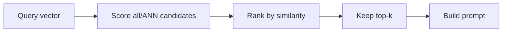

import TOCInline from '@theme/TOCInline';

# Top-K Retrieval

<TOCInline toc={toc} minHeadingLevel={2} maxHeadingLevel={2} />

:::tip[In this guide]
Top-k is the dial that decides how much context reaches the LLM. This guide covers
choosing k, cutting weak matches with thresholds, over-fetching then trimming,
deduplication, and returning sources. It builds on
[similarity search](./07-similarity-search.mdx) and feeds the generation step in
[retrieval & generation](./02-retrieval-generation.mdx).
:::

## What Is It?

**Top-k retrieval** returns the `k` nearest chunks to a query — the top few
results of [similarity search](./07-similarity-search.mdx). `k` is simply how many
chunks you keep to hand to the model.

```python
# n_results IS k — the number of nearest chunks to return
res = collection.query(query_embeddings=[query_vec], n_results=4)
```

## Why Does It Matter?

`k` is a direct lever on answer quality and cost. Too few chunks and the model is
missing the context it needs; too many and you dilute the good chunks with noise
and burn tokens. Getting `k` right — and trimming what comes back — is often the
cheapest retrieval improvement available.

---

## What Top-K Retrieval Is

After scoring the query against the store, you rank by similarity and take the
best `k`. Everything below rank `k` is discarded before the prompt is built.



---

## Choosing K

There is no magic number, only a tradeoff.

| k | Risk | Effect |
| --- | --- | --- |
| Too small (1–2) | Misses supporting context | Confident but incomplete answers |
| Balanced (3–6) | Usually right for focused Q&A | Good grounding, modest token cost |
| Too large (10+) | Dilution and cost | Relevant chunks buried in noise; more tokens |

`k` is bounded by your prompt budget: every retrieved chunk consumes tokens, and
the [context window](./13-context-windows.mdx) is finite. Bigger chunks mean fewer
of them fit, so chunk size and `k` are tuned together.

:::info[Theory: more context is not more signal]
LLMs don't weight every context chunk equally — irrelevant passages can distract
the model and pull the answer off course (the "lost in the middle" effect, where
content buried in a long context gets ignored). Past a point, raising `k` adds
noise faster than signal. Aim for the *fewest* chunks that fully cover the
question, not the most you can fit.
:::

:::note[Highlight: let an eval set pick k]
Don't guess `k` — sweep it. Run your [eval set](./14-rag-evaluation.mdx) at
k = 2, 4, 6, 8 and watch answer quality plateau (or drop). Pick the smallest `k`
at the plateau: same quality, fewer tokens.
:::

---

## The Retrieval Call in Chroma

`n_results` is `k`. Pair it with the same embedding model used at ingestion and,
optionally, a metadata `where` filter (see
[metadata filtering](./09-metadata-filtering.mdx)).

```python
def retrieve(question: str, top_k: int = 4) -> list[dict]:
    query_vec = embedder.encode(question).tolist()
    res = collection.query(query_embeddings=[query_vec], n_results=top_k)
    return [
        {"text": doc, "source": meta["source"], "distance": dist}
        for doc, meta, dist in zip(
            res["documents"][0], res["metadatas"][0], res["distances"][0]
        )
    ]
```

Chroma returns results already ranked nearest-first, so index `0` is the best
match. Remember the values in `distances` are *distances* — smaller is closer.

---

## Distance Thresholds / Score Cutoffs

Top-k always returns `k` chunks even when only one is actually relevant. A
**threshold** drops matches that are too weak, so a vague query doesn't drag in
junk.

```python
def retrieve_with_cutoff(question: str, top_k: int = 6,
                         max_distance: float = 0.6) -> list[dict]:
    query_vec = embedder.encode(question).tolist()
    res = collection.query(query_embeddings=[query_vec], n_results=top_k)
    hits = []
    for doc, meta, dist in zip(
        res["documents"][0], res["metadatas"][0], res["distances"][0]
    ):
        if dist <= max_distance:          # cosine distance: smaller = closer
            hits.append({"text": doc, "source": meta["source"], "distance": dist})
    return hits
```

You can equivalently threshold on a similarity score (`1 - distance`) if that
reads more naturally — see
[converting distance to similarity](./07-similarity-search.mdx).

:::warning[Thresholds are corpus-specific — calibrate them]
A good cutoff depends on your embedding model and data; a value that works for one
corpus may reject everything or nothing in another. Calibrate against real
queries: look at the distances of known-good and known-bad matches, and set the
cutoff between them. A too-tight threshold returns nothing and the model answers
"I don't know" even when the answer exists.
:::

---

## Over-Fetch Then Trim

A powerful pattern: fetch **more** than you need, then narrow down with cheaper
logic — thresholds, dedup, or a reranker. The vector search casts a wide net; the
trimming step keeps only the best.

```python
def retrieve_trimmed(question: str, want: int = 4, fetch: int = 20,
                     max_distance: float = 0.7) -> list[dict]:
    query_vec = embedder.encode(question).tolist()
    res = collection.query(query_embeddings=[query_vec], n_results=fetch)  # over-fetch

    hits = [
        {"text": doc, "source": meta["source"], "distance": dist}
        for doc, meta, dist in zip(
            res["documents"][0], res["metadatas"][0], res["distances"][0]
        )
        if dist <= max_distance                       # cut weak matches
    ]
    return hits[:want]                                # trim to the final count
```

The most impactful trim step is a **reranker**, which re-scores the over-fetched
candidates with a stronger model before you cut to the final `k` — covered in
[reranking](./11-reranking.mdx).

:::info[Theory: cheap recall, then precise ranking]
Vector search is cheap and good at *recall* — pulling in candidates that might be
relevant. Rerankers and thresholds are more precise but costlier per item.
Over-fetching lets each stage do what it's best at: the index widens the pool
cheaply, then a precise stage narrows it. You get better final results than asking
the index alone for a small `k`.
:::

---

## Deduplication of Near-Identical Chunks

Overlapping chunks and repeated boilerplate mean the top results sometimes say the
*same thing twice*. Duplicates waste prompt space and crowd out variety.

```python
def dedupe(hits: list[dict], min_gap: float = 0.05) -> list[dict]:
    kept, seen_texts = [], []
    for hit in hits:
        text = hit["text"].strip()
        # skip exact repeats and chunks whose text is already largely present
        if any(text in s or s in text for s in seen_texts):
            continue
        kept.append(hit)
        seen_texts.append(text)
    return kept
```

For a stricter, vector-based dedup, drop a candidate whose embedding is extremely
close to one you've already kept (cosine similarity above, say, `0.97`). Run dedup
*after* over-fetching and *before* trimming to the final `k`.

:::caution[Overlap makes duplicates likely]
Because chunking uses overlap (see [chunking strategies](./05-chunking-strategies.mdx)),
adjacent chunks share text by design — so near-duplicates in the top results are
common, not rare. Dedup before you fill the prompt, or you'll spend tokens saying
the same thing twice and lose a slot that could have added new context.
:::

---

## Returning Sources for Citations

Always carry each chunk's metadata through retrieval so the answer can cite where
it came from. Sources build trust and make debugging possible — you can check
whether the right chunk was even retrieved.

```python
from dataclasses import dataclass

@dataclass
class Retrieved:
    text: str
    source: str
    chunk: int
    distance: float
    score: float          # 1 - distance, for display

def retrieve_with_sources(question: str, top_k: int = 4) -> list[Retrieved]:
    query_vec = embedder.encode(question).tolist()
    res = collection.query(query_embeddings=[query_vec], n_results=top_k)
    out = []
    for doc, meta, dist in zip(
        res["documents"][0], res["metadatas"][0], res["distances"][0]
    ):
        out.append(Retrieved(
            text=doc,
            source=meta.get("source", "unknown"),
            chunk=meta.get("chunk", -1),
            distance=dist,
            score=round(1 - dist, 3),
        ))
    return out
```

Passing these through to the answer is exactly the sources pattern in
[retrieval & generation](./02-retrieval-generation.mdx).

---

## Common Mistakes

- Leaving `k` at a guessed value instead of sweeping it on an eval set.
- No threshold, so vague queries drag in irrelevant chunks.
- Setting `k` so high that good chunks get buried and tokens are wasted.
- Skipping dedup, so overlapping chunks repeat the same text.
- Applying a threshold tuned for a different corpus or metric.
- Dropping metadata, so answers can't cite sources.

## Interview Questions

- What is top-k retrieval, and what does `k` control?
- How do you choose `k`, and how does it relate to the context window?
- What is a distance threshold and when would you add one?
- Explain over-fetch-then-trim and why it improves results.
- Why deduplicate retrieved chunks, and when do duplicates arise?
- Why return sources with every answer?

## Things to Remember

- `n_results` is `k`; Chroma returns results ranked nearest-first.
- Pick the smallest `k` that fully covers the question.
- Add a calibrated distance/score cutoff to drop weak matches.
- Over-fetch, then threshold, dedup, and (optionally) rerank down to `k`.
- Always carry source metadata through for citations.

## Mini Exercise

Implement `retrieve(question, top_k)` that over-fetches 20 candidates, drops any
with cosine distance above 0.7, deduplicates near-identical chunks, trims to
`top_k`, and returns each result's text, source, and distance. Run it at
top_k = 2, 4, and 8 on one question and compare the results.

## Done When

- [ ] You can retrieve top-k chunks and explain how to choose `k`.
- [ ] You can apply a distance threshold to drop weak matches.
- [ ] You can over-fetch, dedup, and trim to a final set.
- [ ] Your retrieval returns source metadata for citations.

Next: [Metadata Filtering](./09-metadata-filtering.mdx).
