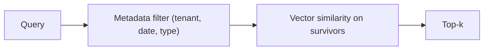

import TOCInline from '@theme/TOCInline';

# Metadata Filtering

<TOCInline toc={toc} minHeadingLevel={2} maxHeadingLevel={2} />

:::tip[In this guide]
Metadata filtering restricts *where* similarity search looks, using structured
fields alongside the vector. This guide covers why it matters (tenant isolation,
freshness, access control), Chroma's `where` operators, pre- vs post-filtering,
and combining filters with top-k. It builds on the
[ingestion pipeline](./01-ingestion-pipeline.mdx) and pairs with
[top-k retrieval](./08-top-k-retrieval.mdx).
:::

## What Is It?

**Metadata filtering** narrows a vector search by structured fields — source,
date, type, tenant — so similarity is only computed over the chunks that qualify.
It combines the *fuzzy* match of embeddings with the *exact* match of a database
`WHERE` clause in one query.

```python
# only search chunks whose source is this manual, then rank by similarity
res = collection.query(
    query_embeddings=[query_vec],
    n_results=4,
    where={"source": "manual.md"},
)
```

## Why Does It Matter?

Pure vector search happily returns a chunk from the *wrong tenant*, an *outdated*
document, or a *restricted* file if it happens to be semantically similar.
Metadata filtering enforces the hard constraints that similarity can't express —
which turns a demo into something safe to run for real users.

---

## Why It Matters (Use Cases)

- **Multi-tenant isolation** — never return tenant A's chunks to tenant B, even
  if the text is a perfect semantic match.
- **Freshness / dates** — restrict to documents newer than a cutoff so stale
  content can't answer.
- **Document type** — search only `policy` docs, or exclude `draft` ones.
- **Access control** — filter to the roles or groups a user is allowed to see.
- **Source** — scope a question to one manual, repo, or knowledge base.



:::warning[Filtering is a security control, not a nicety]
For multi-tenant or access-controlled data, the metadata filter *is* your
isolation boundary. If you forget the `where` clause, similarity search will
cheerfully surface another tenant's or a restricted user's content — a real data
leak with no error to warn you. Treat "always apply the tenant/ACL filter" as a
non-negotiable rule enforced in code, not left to the caller.
:::

---

## Attaching Metadata at Ingestion (Recap)

You can only filter on fields you stored. During
[ingestion](./01-ingestion-pipeline.mdx), attach every field you might filter on
later — it's cheap then and painful to backfill.

```python
import chromadb
from sentence_transformers import SentenceTransformer

client = chromadb.PersistentClient(path="./chroma")
collection = client.get_or_create_collection("docs", metadata={"hnsw:space": "cosine"})
embedder = SentenceTransformer("all-MiniLM-L6-v2")

def ingest(chunks: list[str], *, source: str, tenant: str,
           doc_type: str, updated: int) -> int:
    collection.add(
        ids=[f"{tenant}-{source}-{i}" for i in range(len(chunks))],
        documents=chunks,
        metadatas=[{
            "source": source,
            "tenant": tenant,       # for isolation
            "type": doc_type,       # policy | manual | faq | draft
            "updated": updated,     # unix timestamp for freshness filters
            "chunk": i,
        } for i in range(len(chunks))],
        embeddings=[embedder.encode(c).tolist() for c in chunks],
    )
    return len(chunks)
```

:::note[Highlight: metadata values should be simple, filterable scalars]
Store strings, numbers, and booleans — the types Chroma can filter on. Keep dates
as unix timestamps (integers) so range operators work. Don't stuff nested objects
or long text into metadata; that's what the `documents` field is for.
:::

---

## Chroma `where` Filters

Chroma's `where` argument takes a small query language. Equality is the common
case; operators cover ranges and sets; boolean operators combine clauses.

### Equality

```python
res = collection.query(
    query_embeddings=[query_vec],
    n_results=4,
    where={"tenant": "acme"},          # tenant == "acme"
)
```

### `$in` — match any of a set

```python
res = collection.query(
    query_embeddings=[query_vec],
    n_results=4,
    where={"type": {"$in": ["policy", "faq"]}},   # type is policy OR faq
)
```

### `$gte` / `$lte` — numeric ranges (freshness)

```python
import time

cutoff = int(time.time()) - 90 * 24 * 3600        # 90 days ago

res = collection.query(
    query_embeddings=[query_vec],
    n_results=4,
    where={"updated": {"$gte": cutoff}},           # only docs updated in last 90 days
)
```

### `$and` / `$or` — combine clauses

```python
res = collection.query(
    query_embeddings=[query_vec],
    n_results=4,
    where={
        "$and": [
            {"tenant": "acme"},                    # must be this tenant
            {"type": {"$in": ["policy", "manual"]}},
            {"updated": {"$gte": cutoff}},         # and recent
        ]
    },
)
```

:::caution[Combine multiple conditions explicitly with `$and`]
A `where` dict with several keys is not a reliable way to express "all of these
must hold" — wrap multiple conditions in an explicit `$and` (or `$or`) list so
your intent is unambiguous. This matters most for the tenant clause: make it a
required part of the `$and`, never an afterthought.
:::

---

## Pre-Filter vs Post-Filter

There are two ways to combine filtering with vector search, and the difference is
significant.

- **Pre-filter (what Chroma's `where` does):** restrict the candidate set to
  matching metadata *first*, then run similarity only over survivors. Correct and
  efficient — you always get `k` results that satisfy the filter.
- **Post-filter (a common mistake):** run similarity first, get top-k, *then* drop
  results that fail the filter. You can easily end up with fewer than `k` — or
  zero — because the filter removes chunks after the fact.

```python
# PRE-FILTER (preferred): filter inside the query
res = collection.query(
    query_embeddings=[query_vec], n_results=4, where={"tenant": "acme"}
)

# POST-FILTER (avoid): filter after retrieval -> may return < k, or nothing
res = collection.query(query_embeddings=[query_vec], n_results=4)
survivors = [
    doc for doc, meta in zip(res["documents"][0], res["metadatas"][0])
    if meta["tenant"] == "acme"
]   # if the top-4 were all other tenants, this is empty
```

:::info[Theory: why pre-filtering wins]
Post-filtering asks the index for the globally nearest chunks and *then* throws
some away, so the filter competes with `k` for slots — a strict filter can leave
you with nothing. Pre-filtering scopes the search space up front, so all `k`
returned chunks already satisfy the constraint. It's both more correct (no empty
results from over-filtering) and safer (no wrong-tenant chunk ever scored).
:::

---

## Combining With Top-K

Filtering and [top-k retrieval](./08-top-k-retrieval.mdx) compose naturally: the
filter defines the eligible pool, top-k ranks within it. Over-fetch-then-trim
still applies — just carry the `where` clause through.

```python
from dataclasses import dataclass

@dataclass
class Hit:
    text: str
    source: str
    distance: float

def retrieve(question: str, *, tenant: str, top_k: int = 4,
             fresh_days: int | None = None,
             max_distance: float = 0.7) -> list[Hit]:
    import time
    clauses: list[dict] = [{"tenant": tenant}]        # isolation is always applied
    if fresh_days is not None:
        cutoff = int(time.time()) - fresh_days * 24 * 3600
        clauses.append({"updated": {"$gte": cutoff}})
    where = clauses[0] if len(clauses) == 1 else {"$and": clauses}

    query_vec = embedder.encode(question).tolist()
    res = collection.query(
        query_embeddings=[query_vec],
        n_results=top_k * 4,        # over-fetch within the filtered pool
        where=where,
    )
    hits = [
        Hit(text=doc, source=meta["source"], distance=dist)
        for doc, meta, dist in zip(
            res["documents"][0], res["metadatas"][0], res["distances"][0]
        )
        if dist <= max_distance
    ]
    return hits[:top_k]
```

The `tenant` clause is baked in and non-optional; freshness is opt-in per query.

---

## Common Metadata Fields To Store

- **tenant / org / user** — isolation and access control.
- **source** — file, URL, or repo for scoping and citations.
- **type / category** — `policy`, `manual`, `faq`, `draft`.
- **updated / created** — unix timestamps for freshness ranges.
- **language** — filter to the user's locale.
- **chunk / position** — ordering, dedup, neighbor lookups.
- **visibility / acl** — role or group that may see the chunk.

:::note[Highlight: design the metadata schema before ingesting]
You can only filter on what you stored, and backfilling metadata means re-ingesting
the corpus. Decide the schema up front — tenant, source, type, timestamp at
minimum — and apply it uniformly to every chunk. It's the cheapest insurance in
the whole pipeline.
:::

---

## Common Mistakes

- Forgetting the tenant/ACL filter, leaking data across boundaries.
- Post-filtering after top-k, so strict filters return fewer than `k` or nothing.
- Storing dates as strings, so range operators (`$gte`/`$lte`) don't work.
- Relying on multiple `where` keys instead of an explicit `$and`.
- Trying to filter on a field that was never stored at ingestion.
- Putting large text or nested objects into metadata.

## Interview Questions

- What is metadata filtering, and how does it combine with vector search?
- Give three real use cases (think isolation, freshness, access control).
- Show a Chroma `where` filter using `$in`, `$gte`, and `$and`.
- What's the difference between pre-filtering and post-filtering, and why prefer pre?
- Why is a forgotten filter a security bug in a multi-tenant system?
- Which metadata fields would you store, and why decide the schema before ingest?

## Things to Remember

- Filtering enforces the exact constraints that similarity can't express.
- Pre-filter with Chroma's `where`; don't post-filter after top-k.
- Make tenant/ACL filters mandatory in code — they're a security boundary.
- Store dates as timestamps; use `$in`, `$gte`/`$lte`, `$and`/`$or`.
- You can only filter on fields you attached at ingestion.

## Mini Exercise

Ingest chunks for two tenants with `tenant`, `type`, and `updated` metadata. Write
`retrieve(question, tenant, fresh_days)` that always applies the tenant filter,
optionally restricts to recently updated docs with `$gte`, and returns top-k. Query
as tenant A and confirm no tenant B chunks ever appear, even for identical text.

## Done When

- [ ] You can attach filterable metadata at ingestion time.
- [ ] You can write Chroma `where` filters with equality, `$in`, ranges, and `$and`/`$or`.
- [ ] You can explain pre-filter vs post-filter and why pre wins.
- [ ] You always apply tenant/ACL isolation as a non-optional filter.

Next: [Hybrid Search](./10-hybrid-search.mdx).
