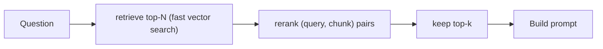

import TOCInline from '@theme/TOCInline';

# Reranking

<TOCInline toc={toc} minHeadingLevel={2} maxHeadingLevel={2} />

:::tip[In this guide]
Fast vector search gets you a rough shortlist; reranking re-scores that shortlist
with a slower, more accurate model so the best chunks land at the top. This guide
covers the over-fetch-then-rerank pattern, cross-encoders vs bi-encoders, a worked
`CrossEncoder` example, and when the extra latency is worth it. Pairs with
[top-k retrieval](./08-top-k-retrieval.mdx), [hybrid search](./10-hybrid-search.mdx),
and the hands-on [Reranking & Hybrid Search](../06-advanced-rag/02-reranking-hybrid-search.mdx).
:::

## What Is It?

**Reranking** is a second-stage scoring step. After an initial retriever returns a
set of candidate chunks, a more powerful model re-scores each candidate against
the query and reorders them, so the truly most relevant chunks rise to the top
before they reach the prompt.

```text
initial retrieval (fast, approximate)  ──▶  candidate set of N chunks
reranker (slow, accurate)              ──▶  re-scored, reordered top-k
```

The first stage optimizes for **recall** (don't miss anything relevant); the
rerank stage optimizes for **precision** (put the best first).

## Why Does It Matter?

Vector search compares a query embedding to chunk embeddings that were computed
**independently, ahead of time**. That is fast but lossy — the model never saw the
query and the chunk together, so subtle relevance signals are missed. A reranker
looks at the query and each chunk **jointly**, which captures much finer relevance
and dramatically improves the ordering of your final `top_k`.

:::info[Theory: cheap recall, expensive precision]
You can't afford to run a heavy model over your entire corpus for every query —
that's why the corpus is indexed with fast approximate search. But you *can*
afford to run a heavy model over 20–50 candidates. Reranking spends compute
exactly where it matters: turning a good-enough shortlist into a well-ordered one.
:::

---

## The Retrieve-Then-Rerank Pattern

The core recipe is **over-fetch, then rerank down**:

1. Retrieve the top-N candidates with fast vector (or hybrid) search, where N is
   larger than you actually need — say 25 or 50.
2. Score every `(query, chunk)` pair with the reranker.
3. Sort by rerank score and keep only the final `top_k` (say 4) for the prompt.



:::note[Highlight: N should be bigger than k]
The whole point is to give the reranker a wider pool than the final answer needs.
If you retrieve only 4 and rerank 4, the reranker can reorder them but can never
rescue a great chunk that vector search ranked 12th. Over-fetch (N ≫ k) so the
reranker has room to promote hidden gems. Tie this to your
[top-k](./08-top-k-retrieval.mdx) choice.
:::

---

## Cross-Encoders vs Bi-Encoders

The retriever and the reranker usually use different model architectures.

- **Bi-encoder** (used for retrieval): encodes the query and each document
  **separately** into vectors, then compares with cosine similarity. Because
  document vectors are precomputed and cached, search is extremely fast — but the
  query and document never interact during encoding.
- **Cross-encoder** (used for reranking): feeds the query and document
  **together** through the model in one pass and outputs a single relevance score.
  The two texts attend to each other, so the score is far more accurate — but you
  must run the model fresh for every pair, so it's slow and can't be precomputed.

| Aspect | Bi-encoder (retrieval) | Cross-encoder (rerank) |
| --- | --- | --- |
| Input | Query and doc encoded separately | Query + doc encoded together |
| Output | A vector per text | One relevance score per pair |
| Precompute docs | Yes — index once | No — must run per query |
| Speed | Very fast (ANN over vectors) | Slow (one forward pass per pair) |
| Accuracy | Good | Higher — captures interaction |
| Scales to | Millions of docs | Tens of candidates |

:::info[Theory: why joint encoding wins]
A bi-encoder must squeeze everything about a document into one fixed vector before
it ever sees the query, so it can't emphasize the parts of the document that the
specific query cares about. A cross-encoder reads both at once and can focus on
the exact overlapping detail — that interaction is what makes it more accurate,
and also what makes it too expensive to run over a whole corpus.
:::

---

## Using a Cross-Encoder

`sentence-transformers` ships a `CrossEncoder` class. A strong, small default for
reranking is `cross-encoder/ms-marco-MiniLM-L-6-v2`, trained on the MS MARCO
passage-ranking dataset.

```python
from sentence_transformers import CrossEncoder

reranker = CrossEncoder("cross-encoder/ms-marco-MiniLM-L-6-v2")

question = "How do I reset my password?"
candidates = [
    "To recover your account, open Settings and choose 'Reset password'.",
    "Our quarterly revenue grew across all product lines.",
    "Password reset links expire after 15 minutes for security.",
    "The cafeteria menu changes every Monday.",
]

# Build (query, doc) pairs and score them in one batch.
pairs = [(question, doc) for doc in candidates]
scores = reranker.predict(pairs)      # higher = more relevant

# Sort candidates by score, best first.
ranked = sorted(zip(candidates, scores), key=lambda pair: pair[1], reverse=True)
for doc, score in ranked:
    print(f"{score:7.3f}  {doc}")
# The two password chunks score highest; revenue and cafeteria sink to the bottom.
```

Wiring it into the pipeline as the second stage:

```python
def retrieve_and_rerank(
    question: str,
    retriever,          # returns a list[dict] with a "text" key
    reranker: CrossEncoder,
    fetch_n: int = 25,  # over-fetch
    top_k: int = 4,     # final count for the prompt
) -> list[dict]:
    candidates = retriever.retrieve(question, top_k=fetch_n)
    pairs = [(question, c["text"]) for c in candidates]
    scores = reranker.predict(pairs)
    for chunk, score in zip(candidates, scores):
        chunk["rerank_score"] = float(score)
    candidates.sort(key=lambda c: c["rerank_score"], reverse=True)
    return candidates[:top_k]
```

:::note[Highlight: batch the pair scoring]
`reranker.predict(pairs)` scores the whole list in one batched forward pass, which
is far faster than calling `predict` per pair in a loop. Build all `(query, chunk)`
pairs first, then score once.
:::

:::caution[Rerank scores are not probabilities]
A `CrossEncoder` returns raw relevance scores whose scale depends on the model —
they are meant for **sorting**, not as calibrated confidence values. Don't
threshold on an absolute number like "keep everything above 0.8" without checking
the model's actual score distribution first.
:::

---

## LLM-Based Reranking

Instead of a dedicated cross-encoder, you can ask a general LLM to judge relevance
— for example, prompt it to score each chunk 0–10 for how well it answers the
question, or to pick the best few. This is flexible and needs no extra model, and
you can run it against local Ollama.

```python
import httpx

RERANK_PROMPT = """Rate how relevant the passage is to the question on a scale of 0 to 10.
Reply with ONLY the number.

Question: {question}
Passage: {passage}

Score:"""

async def llm_score(question: str, passage: str, model: str = "llama3.2") -> float:
    prompt = RERANK_PROMPT.format(question=question, passage=passage)
    async with httpx.AsyncClient(timeout=120) as client:
        resp = await client.post(
            "http://localhost:11434/api/generate",
            json={"model": model, "prompt": prompt, "stream": False,
                  "options": {"temperature": 0.1}},
        )
        resp.raise_for_status()
        text = resp.json()["response"].strip()
    try:
        return float(text.split()[0])
    except (ValueError, IndexError):
        return 0.0
```

:::warning[LLM reranking is expensive and slow]
One LLM call **per candidate** multiplies your latency and token cost by N. If you
over-fetch 25 candidates, that's 25 extra generations before you even answer.
Prefer a cross-encoder for routine reranking; reserve LLM-as-reranker for small
candidate sets or when you need nuanced, instruction-driven judgments a
cross-encoder can't express. A listwise variant (score all candidates in one
prompt) can cut the call count but risks exceeding the
[context window](./13-context-windows.mdx).
:::

---

## When Reranking Is Worth It

Reranking is a **quality vs latency/cost** tradeoff. Every rerank adds work between
retrieval and generation.

Reranking tends to pay off when:

- Retrieval recall is fine but the top result is often *not* the best (good chunks
  sit at ranks 5–15).
- Answers are sensitive to getting the single most relevant chunk first.
- You already over-fetch for [hybrid search](./10-hybrid-search.mdx) and want to
  order the fused pool.

It may not be worth it when:

- Your corpus is small and vector search already nails the ordering.
- Latency budgets are tight (a cross-encoder over 25 candidates adds real time).
- The extra precision doesn't move your [eval](./14-rag-evaluation.mdx) numbers.

:::note[Highlight: measure before you keep it]
Add reranking, then compare retrieval precision and answer quality with and without
it on an eval set. If the metrics don't improve enough to justify the added
latency, drop it. Reranking is a tool, not a default.
:::

---

## Where It Fits in the Pipeline

Reranking sits **after retrieval and before prompt construction**:

```text
embed query ─▶ retrieve top-N ─▶ RERANK ─▶ top-k ─▶ build prompt ─▶ generate
```

It composes naturally with hybrid search (rerank the fused list) and feeds
directly into [prompt construction](./12-prompt-construction.mdx), where the
well-ordered `top_k` becomes your context block.

---

## Common Mistakes

- Reranking the same number you retrieve (no over-fetch), so nothing can be
  promoted.
- Scoring pairs one at a time instead of batching — needlessly slow.
- Treating cross-encoder scores as calibrated probabilities and thresholding on
  raw numbers.
- Reaching for LLM reranking when a cross-encoder would be cheaper and faster.
- Adding reranking without measuring whether it actually helps.

## Interview Questions

- What problem does reranking solve that vector search alone does not?
- Explain the difference between a bi-encoder and a cross-encoder.
- Why can't you use a cross-encoder to search the whole corpus directly?
- Why over-fetch N candidates before reranking down to k?
- What are the tradeoffs of LLM-based reranking vs a cross-encoder?

## Things to Remember

- Retrieve-then-rerank: over-fetch top-N fast, then re-score down to top-k.
- Bi-encoders are fast and precomputable; cross-encoders are accurate but per-pair.
- `CrossEncoder.predict` scores `(query, chunk)` pairs — batch them, sort by score.
- LLM reranking is flexible but costs one call per candidate.
- It's a precision-vs-latency tradeoff — keep it only if evals improve.

## Mini Exercise

Take a query and retrieve the top 15 chunks with vector search. Rerank them with
`cross-encoder/ms-marco-MiniLM-L-6-v2`, keep the top 4, and print the before/after
orderings side by side. Note which chunk the reranker promoted from a low initial
rank into the final set.

## Done When

- [ ] You can explain bi-encoders vs cross-encoders and why reranking helps.
- [ ] You can score and reorder candidates with a `CrossEncoder`.
- [ ] You know where reranking fits and how to decide if it's worth the latency.

Next: [Prompt Construction](./12-prompt-construction.mdx).
