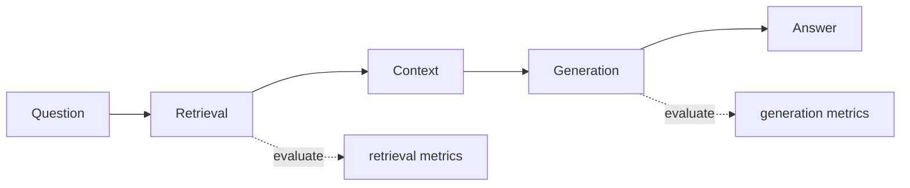

import TOCInline from '@theme/TOCInline';

# RAG Evaluation

<TOCInline toc={toc} minHeadingLevel={2} maxHeadingLevel={2} />

:::tip[In this guide]
You can't improve a RAG system you don't measure. This guide covers the two layers
of evaluation — retrieval and generation — the metrics for each, how to build an
eval set, LLM-as-judge, and running evals in CI so changes are data-driven. For the
deeper, applied treatment, see [Evaluation](../06-advanced-rag/03-evaluation.mdx).
:::

## What Is It?

**RAG evaluation** is measuring, with numbers, how well your pipeline retrieves the
right context and how well it generates correct, grounded answers. It replaces
"this feels better" with "recall@5 went from 0.72 to 0.85."

## Why Does It Matter?

RAG has many tunable knobs — [chunk size](./05-chunking-strategies.mdx),
[top-k](./08-top-k-retrieval.mdx), embedding model, [reranking](./11-reranking.mdx),
[prompt wording](./12-prompt-construction.mdx). Every one of them interacts, and
intuition about which change helped is unreliable. Without measurement you're
tuning by vibes: a change that fixes one query quietly breaks three others. Evals
make improvement **data-driven** and catch regressions before users do.

:::info[Theory: you can't optimize what you don't measure]
Each knob trades off against the others — bigger chunks improve recall but cost
context budget; more top-k adds coverage but also noise. The only way to navigate
these trade-offs is a repeatable metric on a fixed test set. An eval set turns RAG
tuning from guesswork into an experiment you can run.
:::

---

## The Two Layers: Retrieval vs Generation

A RAG answer can be wrong for two very different reasons, so you evaluate two
layers separately:

- **Retrieval quality:** did we fetch the right chunks? If the relevant chunk was
  never retrieved, no prompt can save the answer.
- **Generation quality:** given the retrieved context, did the model produce a
  correct, grounded answer? A perfect answer built on the wrong context is luck; a
  wrong answer built on the right context is a prompting or model problem.



:::note[Highlight: diagnose before you tune]
Always ask "was the right chunk even retrieved?" first. If retrieval missed it,
fixing the prompt or swapping the LLM is wasted effort — you need better chunking,
embeddings, or reranking. Separating the layers tells you *where* the failure is.
:::

---

## Retrieval Metrics

These measure whether the relevant chunks appear in the retrieved set. They need a
labeled set of "which chunk ids are relevant for this question."

- **Recall@k:** of all the relevant chunks, what fraction appeared in the top-k?
  Answers "did we find the right stuff?"
- **Precision@k:** of the top-k chunks returned, what fraction are relevant?
  Answers "how much noise did we include?"
- **Hit rate@k:** what fraction of questions had at least one relevant chunk in the
  top-k? A lenient, easy-to-read metric.
- **MRR (Mean Reciprocal Rank):** averages `1 / rank_of_first_relevant_chunk`
  across questions. Rewards putting a relevant chunk near the top — highly relevant
  to [reranking](./11-reranking.mdx).

In prose (no symbols): recall@k is "relevant retrieved divided by total relevant";
precision@k is "relevant retrieved divided by k"; MRR for one query is "one over
the rank of the first relevant result," averaged over all queries.

```python
def recall_at_k(retrieved_ids: list[str], relevant_ids: set[str], k: int) -> float:
    if not relevant_ids:
        return 0.0
    top = set(retrieved_ids[:k])
    found = len(top & relevant_ids)
    return found / len(relevant_ids)


def precision_at_k(retrieved_ids: list[str], relevant_ids: set[str], k: int) -> float:
    if k == 0:
        return 0.0
    top = retrieved_ids[:k]
    found = sum(1 for doc_id in top if doc_id in relevant_ids)
    return found / k


def reciprocal_rank(retrieved_ids: list[str], relevant_ids: set[str]) -> float:
    for rank, doc_id in enumerate(retrieved_ids, start=1):
        if doc_id in relevant_ids:
            return 1.0 / rank
    return 0.0
```

### Worked recall@k Example

```python
# Question expects chunks {"c2", "c5"} to be relevant.
relevant = {"c2", "c5"}
retrieved = ["c9", "c2", "c7", "c1", "c5"]   # ranked, best first

print(recall_at_k(retrieved, relevant, k=3))   # top-3 = c9,c2,c7 -> found c2 -> 1/2 = 0.5
print(recall_at_k(retrieved, relevant, k=5))   # top-5 includes c2 and c5 -> 2/2 = 1.0
print(reciprocal_rank(retrieved, relevant))    # first relevant (c2) at rank 2 -> 0.5
```

At `k=3` only one of two relevant chunks is present (recall 0.5); widening to
`k=5` captures both (recall 1.0) — a concrete illustration of the
[top-k](./08-top-k-retrieval.mdx) trade-off.

---

## Generation Metrics

These judge the answer itself, given the retrieved context:

- **Faithfulness / groundedness:** is every claim in the answer supported by the
  retrieved context, with no invented facts? This is the anti-hallucination metric.
- **Answer relevance:** does the answer actually address the question, or does it
  wander?
- **Correctness:** does the answer match the known-correct reference answer?

Faithfulness and correctness are distinct: an answer can be faithful to the context
yet wrong (because the context was wrong), or correct yet unfaithful (right by luck,
not grounded in what was retrieved). Track both.

:::caution[Faithful is not the same as correct]
A model can perfectly ground its answer in a retrieved chunk that happens to be
outdated — faithful but incorrect. And it can produce the right answer from prior
knowledge while ignoring the context — correct but ungrounded, which means it will
hallucinate on the next question. Measuring only one metric hides these cases.
:::

---

## Building an Eval Set

An eval set is a fixed collection of test cases you score against repeatedly. Each
entry typically holds:

- the **question**,
- the **expected answer** (reference), and
- the **relevant chunk ids** (ground truth for retrieval).

```python
eval_set = [
    {
        "question": "How long is a password reset link valid?",
        "expected_answer": "15 minutes.",
        "relevant_ids": {"c2"},
    },
    {
        "question": "How do I reset my password?",
        "expected_answer": "Open Settings and choose 'Reset password'.",
        "relevant_ids": {"c5", "c2"},
    },
]
```

:::note[Highlight: start small, grow from real failures]
You don't need thousands of cases to start — 20 to 50 carefully chosen questions
covering your common and tricky queries is enough to catch most regressions. Grow
the set by adding every real question your system got wrong; each becomes a
permanent guard against that failure recurring.
:::

Scoring the whole set for retrieval:

```python
def evaluate_retrieval(eval_set: list[dict], retriever, k: int = 5) -> dict:
    recalls, hits = [], []
    for case in eval_set:
        retrieved = retriever.retrieve_ids(case["question"], top_k=k)
        recalls.append(recall_at_k(retrieved, case["relevant_ids"], k))
        hits.append(1.0 if set(retrieved[:k]) & case["relevant_ids"] else 0.0)
    n = len(eval_set)
    return {
        "mean_recall_at_k": sum(recalls) / n,
        "hit_rate_at_k": sum(hits) / n,
    }
```

---

## LLM-as-Judge

Generation metrics like faithfulness are hard to compute mechanically, so a common
approach is **LLM-as-judge**: prompt a model to score an answer for faithfulness or
relevance given the question, context, and answer.

```python
import httpx

JUDGE_PROMPT = """You are grading an answer for FAITHFULNESS to the context.
Score 1 if every claim is supported by the context, else 0. Reply with ONLY 0 or 1.

Context:
{context}

Answer:
{answer}

Score:"""

async def judge_faithfulness(context: str, answer: str, model: str = "llama3.2") -> int:
    prompt = JUDGE_PROMPT.format(context=context, answer=answer)
    async with httpx.AsyncClient(timeout=120) as client:
        resp = await client.post(
            "http://localhost:11434/api/generate",
            json={"model": model, "prompt": prompt, "stream": False,
                  "options": {"temperature": 0.1}},
        )
        resp.raise_for_status()
    return 1 if resp.json()["response"].strip().startswith("1") else 0
```

:::warning[LLM judges have caveats]
An LLM judge is itself fallible: it can be inconsistent between runs, biased toward
longer or more confident answers, and it costs a call per grade. Use low
temperature, validate the judge against a handful of human-labeled examples before
trusting it, and treat its scores as a strong signal — not ground truth.
:::

---

## Tools

You don't have to build everything by hand. Established libraries package these
metrics:

- **RAGAS** — a framework focused on RAG metrics like faithfulness, answer
  relevance, and context precision/recall, largely via LLM-as-judge.
- **TruLens** — instruments and evaluates LLM apps with feedback functions for
  groundedness and relevance.

They're worth adopting once your eval loop stabilizes; the deeper
[Evaluation](../06-advanced-rag/03-evaluation.mdx) guide goes further.

---

## Running Evals in CI

The payoff comes from running evals **automatically**, not once by hand. Wire your
eval set into CI so every change to chunking, prompts, or models is scored, and a
drop below a threshold fails the build.

```python
def test_retrieval_quality():
    scores = evaluate_retrieval(eval_set, retriever, k=5)
    assert scores["mean_recall_at_k"] >= 0.80, scores   # regression guard
    assert scores["hit_rate_at_k"] >= 0.90, scores
```

```bash
# In CI, run the eval suite like any other test:
pytest tests/test_rag_eval.py -v
```

:::note[Highlight: evals are regression tests for quality]
Treat retrieval and generation scores like unit tests. A committed threshold turns
"I think this prompt is better" into a gate that blocks changes which quietly make
retrieval worse — the same safety net that unit tests give ordinary code.
:::

---

## Iterating: Change One Variable at a Time

When improving the system, change **one** variable, re-run the eval set, and
compare. If you change chunk size, top-k, and the model all at once and the score
moves, you have no idea which change caused it.

```text
baseline           -> recall@5 = 0.72
chunk 500 -> 300   -> recall@5 = 0.81   (keep)
+ top_k 4 -> 6     -> recall@5 = 0.83   (marginal; weigh token cost)
+ add reranking    -> recall@5 = 0.83, MRR 0.61 -> 0.78  (keep for ordering)
```

Isolating variables tells you not just *that* things improved but *why*, so you can
build on what works.

---

## Common Mistakes

- Tuning by vibes with no eval set, so "improvements" silently cause regressions.
- Measuring only generation and never checking whether retrieval found the chunk.
- Conflating faithfulness and correctness — they catch different failures.
- Trusting an LLM judge blindly without validating it against human labels.
- Changing several variables at once, making results impossible to attribute.

## Interview Questions

- Why must RAG changes be data-driven rather than judged by feel?
- What's the difference between retrieval metrics and generation metrics?
- Define recall@k, precision@k, and MRR.
- What is faithfulness, and how does it differ from correctness?
- How would you run RAG evals in CI, and why?

## Things to Remember

- Evaluate two layers: retrieval (did we find it?) and generation (was the answer good?).
- Retrieval metrics: recall@k, precision@k, hit rate, MRR.
- Generation metrics: faithfulness, answer relevance, correctness.
- Build a fixed eval set; grow it from real failures; run it in CI.
- Change one variable at a time and measure.

## Mini Exercise

Build a 5-question eval set with `relevant_ids` for each. Run `evaluate_retrieval`
at `k=3` and `k=5`, record `mean_recall_at_k` and `hit_rate_at_k`, then change your
chunk size and re-run — report which `k` and chunk size gave the best recall.

## Done When

- [ ] You can explain the two evaluation layers and their metrics.
- [ ] You can compute recall@k and MRR over an eval set in code.
- [ ] You can run evals in CI and iterate by changing one variable at a time.

Next: [06 · Advanced RAG](../06-advanced-rag/index.mdx).
