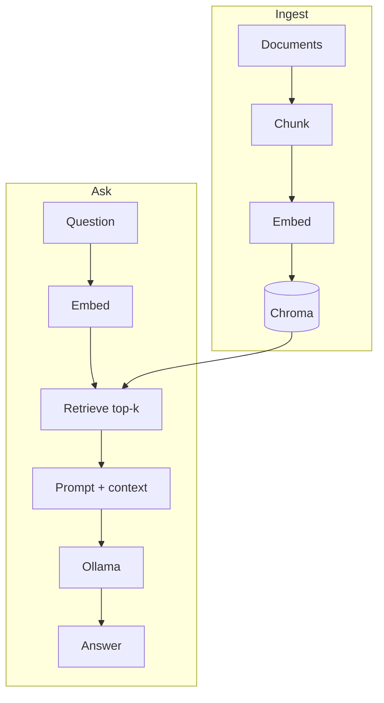

import TOCInline from '@theme/TOCInline';

# 05 · RAG Fundamentals

<ProgressToggle sectionId="05-rag-fundamentals" />

<TOCInline toc={toc} minHeadingLevel={2} maxHeadingLevel={2} />

:::tip[In this guide]
Put it all together: chunk and embed documents, retrieve the best context, and
have the LLM answer using it — then wrap it in a FastAPI service.
:::

## Goal

Build a working RAG pipeline and expose it through `/ingest` and `/ask`.

## Estimated Time

1 week.

## Prerequisites

- [AI Backend with FastAPI](../02-fastapi/22-ai-backend.mdx).
- [Local LLMs / Ollama](../03-local-llms-ollama/index.mdx).
- [Embeddings / Vector DB](../04-embeddings-vector-db/index.mdx).

## What You Will Learn

1. [Ingestion Pipeline](./01-ingestion-pipeline.mdx) — load, chunk, embed, and store documents.
2. [Retrieval & Generation](./02-retrieval-generation.mdx) — retrieve top-k, build a grounded prompt, generate.
3. [First Project](./03-first-project.mdx) — the full FastAPI + Ollama + Chroma RAG API.

### Core Concepts (deep dives)

Reference deep dives on every RAG building block — read them alongside the
project flow above:

4. [Embeddings](./04-embeddings.mdx) — vectors, dimensions, normalization, same-model rule.
5. [Chunking Strategies](./05-chunking-strategies.mdx) — sizes, overlap, recursive and structure-aware splitting.
6. [Vector Databases](./06-vector-databases.mdx) — ANN indexes, distance metrics, Chroma and the options landscape.
7. [Similarity Search](./07-similarity-search.mdx) — cosine vs dot vs L2, exact vs approximate.
8. [Top-K Retrieval](./08-top-k-retrieval.mdx) — choosing k, thresholds, over-fetch and trim.
9. [Metadata Filtering](./09-metadata-filtering.mdx) — `where` filters, tenant isolation, freshness.
10. [Hybrid Search](./10-hybrid-search.mdx) — combine keyword and vector retrieval with rank fusion.
11. [Reranking](./11-reranking.mdx) — cross-encoders and the retrieve-then-rerank pattern.
12. [Prompt Construction](./12-prompt-construction.mdx) — grounding, citations, context ordering, injection defense.
13. [Context Windows](./13-context-windows.mdx) — token budgets, fitting context, lost-in-the-middle.
14. [RAG Evaluation](./14-rag-evaluation.mdx) — retrieval and generation metrics, eval sets, LLM-as-judge.

## The Big Picture

## Interview Relevance

RAG vs fine-tuning, why RAG reduces hallucination, and the ingest/retrieve/
generate flow are staple AI-engineering interview topics.

## Done When

- [ ] You can ingest documents into a vector store.
- [ ] You can retrieve relevant chunks for a question.
- [ ] You can generate a grounded answer with sources.
- [ ] It all runs behind `/ingest` and `/ask`.

Next: [06 · Advanced RAG](../06-advanced-rag/index.mdx).
