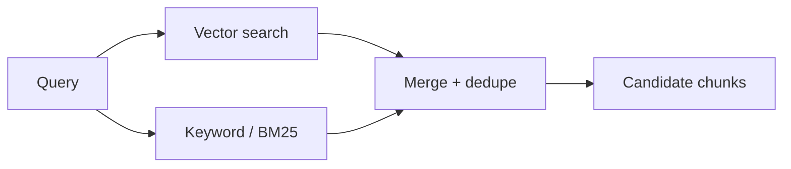
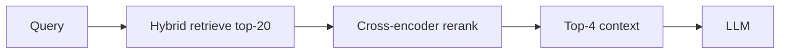

import TOCInline from '@theme/TOCInline';

# Reranking & Hybrid Search

<TOCInline toc={toc} minHeadingLevel={2} maxHeadingLevel={2} />

:::tip[In this guide]
Two techniques that sharply improve retrieval precision: combining keyword and
vector search (hybrid), then reranking the candidates with a stronger model.
:::

## What Is It?

- **Hybrid search**: combine lexical (keyword) and semantic (vector) retrieval.
- **Reranking**: take a larger candidate set and reorder it with a more accurate (but slower) model, keeping only the best.

## Why Does It Matter?

Vector search captures meaning but can miss exact terms (names, IDs, codes).
Keyword search nails exact terms but misses paraphrases. Together, plus a
reranker, you get both recall and precision.

## Hybrid Search

### Why combine



- **Vector** finds semantically similar text ("car" ~ "automobile").
- **BM25** (keyword) finds exact matches ("error code E42").

### Fusion with Reciprocal Rank Fusion (RRF)

Combine two ranked lists without tuning score scales:

```python
def reciprocal_rank_fusion(rankings: list[list[str]], k: int = 60) -> list[str]:
    scores: dict[str, float] = {}
    for ranking in rankings:                 # each is an ordered list of ids
        for rank, doc_id in enumerate(ranking):
            scores[doc_id] = scores.get(doc_id, 0) + 1 / (k + rank + 1)
    return sorted(scores, key=scores.get, reverse=True)

fused = reciprocal_rank_fusion([vector_ids, keyword_ids])
```

BM25 is available via libraries like `rank_bm25`; some vector DBs offer built-in
hybrid search.

## Reranking

Retrieve a **broad** candidate set (e.g. top-20), then rerank with a
**cross-encoder** that scores each (query, chunk) pair directly — more accurate
than the initial vector similarity:

```python
from sentence_transformers import CrossEncoder

reranker = CrossEncoder("cross-encoder/ms-marco-MiniLM-L-6-v2")

def rerank(query: str, candidates: list[dict], top_k: int = 4) -> list[dict]:
    pairs = [(query, c["text"]) for c in candidates]
    scores = reranker.predict(pairs)
    ranked = sorted(zip(candidates, scores), key=lambda x: x[1], reverse=True)
    return [c for c, _ in ranked[:top_k]]
```

### Bi-encoder vs cross-encoder

- **Bi-encoder** (your embedder): encodes query and docs separately → fast, used for the first-stage retrieval.
- **Cross-encoder** (reranker): reads query + doc together → accurate but slower, used on a small candidate set.

## The Improved Pipeline



Retrieve wide (recall), rerank narrow (precision), then generate.

## Improving the Project

In `RetrievalService`: fetch top-20 via vector (and optionally BM25 + RRF),
rerank to top-4, and pass those to the prompt builder.

## Common Mistakes

- Reranking the full corpus (too slow) instead of a candidate set.
- Using only vector search when exact terms matter.
- Mismatched candidate size (rerank needs enough candidates to reorder).
- Forgetting the reranker adds latency — budget for it.

## Interview Questions

- What is hybrid search and why combine methods?
- Bi-encoder vs cross-encoder?
- What does a reranker do and when is it worth the latency?
- What is reciprocal rank fusion?

## Things to Remember

- Retrieve wide, rerank narrow.
- Hybrid = semantic + exact-term coverage.
- Cross-encoders are accurate but slow → small candidate sets only.

## Mini Exercise

Add a cross-encoder rerank step: retrieve top-20 by vector, rerank to top-4,
and compare answers to the baseline on a few questions.

## Done When

- [ ] You can combine keyword and vector results.
- [ ] You can rerank candidates with a cross-encoder.
- [ ] You can explain the recall→precision two-stage design.
