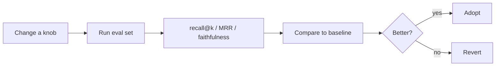

import TOCInline from '@theme/TOCInline';

# Evaluation

<TOCInline toc={toc} minHeadingLevel={2} maxHeadingLevel={2} />

:::tip[In this guide]
You can't improve what you don't measure. Build an eval set and metrics so every
chunking/retrieval change is judged by data, not vibes.
:::

## What Is It?

Systematic measurement of a RAG system on two axes: **retrieval quality** (did
we fetch the right chunks?) and **answer quality** (is the answer correct and
grounded?).

## Why Does It Matter?

RAG has many knobs (chunk size, top-k, reranking). Without evaluation you're
guessing, and "it seems better" doesn't survive contact with real questions.

## Build an Eval Set

A small, curated set of questions with known-relevant sources and/or reference
answers:

```python
eval_set = [
    {
        "question": "What does RAG reduce?",
        "relevant_sources": ["rag.md"],
        "reference_answer": "It reduces hallucinations by grounding answers in retrieved context.",
    },
    # ... 20–50 items covering your real use cases
]
```

Even 20–50 examples make changes measurable.

## Retrieval Metrics

### Recall@k

Fraction of questions where a relevant chunk appears in the top-k:

```python
def recall_at_k(retrieved_sources: list[str], relevant: list[str]) -> float:
    return 1.0 if any(s in relevant for s in retrieved_sources) else 0.0
```

Average across the eval set. Rising recall@k = retrieval is finding the right
material.

### MRR (Mean Reciprocal Rank)

Rewards ranking the relevant chunk higher:

```python
def reciprocal_rank(retrieved: list[str], relevant: list[str]) -> float:
    for i, src in enumerate(retrieved):
        if src in relevant:
            return 1 / (i + 1)
    return 0.0
```

## Answer Metrics

- **Faithfulness / groundedness**: is every claim supported by the retrieved context? (No unsupported additions.)
- **Answer relevance**: does it actually address the question?
- **Correctness**: does it match the reference answer?

### LLM-as-judge

Use an LLM to grade answers against context/reference on a rubric. Fast and
scalable; validate its grades against a few human checks.

```python
JUDGE = """Given the CONTEXT and ANSWER, is every claim in the ANSWER supported by the CONTEXT?
Reply with a score 1-5 and one-line justification.

CONTEXT:
{context}

ANSWER:
{answer}"""
```

Tools like **Ragas** package these metrics if you want a ready-made harness.

## An Eval Loop



Record a baseline, change **one** thing (chunk size, reranker, top-k), re-run,
and keep it only if metrics improve.

## Common Mistakes

- No eval set → changes justified by anecdote.
- Changing several knobs at once (can't attribute the effect).
- Only measuring answers, never retrieval (you won't know where it broke).
- Trusting LLM-as-judge blindly without spot-checks.

## Interview Questions

- How do you evaluate a RAG system?
- Retrieval metrics vs answer metrics?
- What is faithfulness/groundedness?
- What are the pros/cons of LLM-as-judge?

## Things to Remember

- Measure retrieval and answers separately.
- Change one variable at a time against a baseline.
- Even a tiny eval set beats guessing.

## Mini Exercise

Create a 10-question eval set, compute recall@k and MRR for your current
retriever, then re-measure after adding reranking and compare.

## Done When

- [ ] You have an eval set with known-relevant sources.
- [ ] You compute retrieval metrics (recall@k, MRR).
- [ ] You assess answer faithfulness and make data-driven changes.
