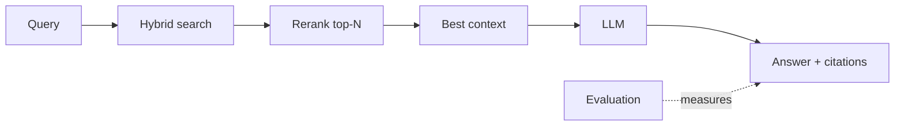

import TOCInline from '@theme/TOCInline';

# 06 · Advanced RAG

<ProgressToggle sectionId="06-advanced-rag" />

<TOCInline toc={toc} minHeadingLevel={2} maxHeadingLevel={2} />

:::tip[In this guide]
Baseline RAG is easy; good RAG is engineering. This section upgrades your
[first project](../05-rag-fundamentals/03-first-project.mdx) with the techniques
that actually move answer quality.
:::

## Goal

Measurably improve your RAG system's answer quality and reliability.

## Estimated Time

1–2 weeks.

## Prerequisites

- A working [RAG project](../05-rag-fundamentals/03-first-project.mdx).

## What You Will Learn

1. [Chunking Experiments](./01-chunking-experiments.mdx) — strategies, sizes, overlap, structure-aware splitting, metadata.
2. [Reranking & Hybrid Search](./02-reranking-hybrid-search.mdx) — combine keyword + vector search, then rerank.
3. [Evaluation](./03-evaluation.mdx) — measure retrieval and answer quality so changes are data-driven.

## How Each Piece Helps

## Interview Relevance

Chunking tradeoffs, hybrid search, reranking, and "how do you evaluate a RAG
system?" separate people who've *built* RAG from those who've only read about
it.

## Done When

- [ ] You can justify a chunking strategy with evidence.
- [ ] You use hybrid search + reranking.
- [ ] You return citations.
- [ ] You measure quality with an eval set.

Next: [07 · LangChain / LCEL](../07-langchain-lcel/index.mdx).
