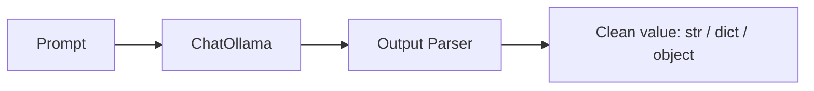

import TOCInline from '@theme/TOCInline';

# Models & Output Parsers

<TOCInline toc={toc} minHeadingLevel={2} maxHeadingLevel={2} />

:::tip[In this guide]
The model step and the parser step — the last two links in most chains. We cover
why chat models won, the `ChatOllama` knobs that matter, the System/Human/AI
message types, and how to turn free text into strings, JSON, and validated
objects. Everything pipes together with the LCEL `|` from
[Prompt Templates](./02-prompt-templates.mdx), and feeds straight into
[Runnables & LCEL](./04-runnables-lcel.mdx).
:::

## What Is It?

A **model** is the component that generates text from your prompt. An **output
parser** is the component that transforms the model's raw reply into a usable
Python value — a clean string, a `dict`, or a typed object — so the rest of your
program can consume it without string-wrangling.

## Why Does It Matter?

Models return unstructured text, but code needs structure. Parsers close that
gap: they let you demand JSON or a schema, validate what comes back, and fail
loudly when the model drifts. Picking the right model interface (chat, not
completion) and the right parser is what makes a chain reliable instead of a
brittle pile of `.split()` calls.

---

## LLMs vs Chat Models

LangChain exposes two model interfaces. **LLMs** take a single string and return
a single string (the old completion API). **Chat models** take a *list of
messages* with roles and return a message. Modern instruction-tuned models are
trained on chat-formatted data, so the chat interface is what you want.

```python
from langchain_ollama import ChatOllama
from langchain_core.messages import HumanMessage

# Chat model: messages in, a message out
model = ChatOllama(model="llama3.2")
response = model.invoke([HumanMessage("Say hello in one word.")])
print(type(response))     # <class 'langchain_core.messages.ai.AIMessage'>
print(response.content)   # 'Hello'
```

:::info[Theory: why chat models dominate]
Instruction-tuned models are fine-tuned on conversations with explicit roles.
The chat interface preserves that structure — a `system` message for standing
rules, `human` turns for input, `ai` turns for prior replies — which is exactly
the shape the model expects. A flat completion string throws that structure away
and generally steers the model worse. Prefer `ChatOllama` (a chat model) over the
legacy `Ollama` LLM class for anything new.
:::

The `.content` attribute holds the text. The returned `AIMessage` also carries
metadata (token usage, model name) in `response.response_metadata`, which is
handy for logging and cost tracking.

---

## ChatOllama Parameters

`ChatOllama` wraps a locally running Ollama model. The parameters you will reach
for most:

| Parameter | Effect |
| --- | --- |
| `model` | Which Ollama model to run, e.g. `"llama3.2"` |
| `temperature` | Randomness. `0` is near-deterministic; higher is more creative |
| `num_ctx` | Context window size in tokens — how much prompt + history fits |
| `seed` | Fixes sampling for reproducible outputs (with low temperature) |

```python
from langchain_ollama import ChatOllama

model = ChatOllama(
    model="llama3.2",
    temperature=0.1,   # low, for grounded/factual answers
    num_ctx=8192,      # widen the context window for long RAG contexts
    seed=42,           # reproducible runs while testing
)

model.invoke("Name three vector databases.").content
```

:::note[Highlight: temperature for RAG]
For retrieval-augmented answers you almost always want a **low** temperature
(0–0.2). You are asking the model to stay faithful to retrieved context, not to
invent. Save higher temperatures for brainstorming or creative copy. Pair a low
temperature with a fixed `seed` when you want repeatable test runs.
:::

:::caution[num_ctx and truncation]
If your prompt plus retrieved context exceeds `num_ctx`, Ollama silently
truncates the *oldest* tokens — which can quietly drop your system instructions
or earlier context. When you stuff many chunks into a RAG prompt, size `num_ctx`
deliberately rather than trusting the default. See
[Ollama API Usage](../03-local-llms-ollama/02-ollama-api-usage.mdx) for how these
options map onto the underlying API.
:::

---

## Message Types

Chat models speak in messages. The three core classes mirror the roles from
[Prompt Templates](./02-prompt-templates.mdx):

| Class | Role | Use |
| --- | --- | --- |
| `SystemMessage` | system | Standing rules, persona, output format |
| `HumanMessage` | human | The user's input this turn |
| `AIMessage` | ai | A prior assistant reply (history or few-shot) |

```python
from langchain_ollama import ChatOllama
from langchain_core.messages import SystemMessage, HumanMessage, AIMessage

model = ChatOllama(model="llama3.2", temperature=0.1)

messages = [
    SystemMessage("You are a terse assistant. Answer in under 10 words."),
    HumanMessage("What is a vector embedding?"),
]
reply = model.invoke(messages)     # returns an AIMessage
print(reply.content)

# To continue the conversation, append the AIMessage and the next HumanMessage
messages.append(reply)
messages.append(HumanMessage("Give an example use."))
model.invoke(messages).content
```

In practice you rarely build these lists by hand — a `ChatPromptTemplate`
produces them for you. But knowing the types matters when you manage history or
inspect what a chain actually sent.

---

## Output Parsers: Why Parse?

A model returns an `AIMessage` whose `.content` is free-form text. That is fine
for display, but code usually needs something structured. An **output parser** is
a Runnable that sits at the end of a chain and converts the model's reply into a
concrete Python value.



Because a parser is a Runnable, it pipes on with `|` just like everything else.

---

## StrOutputParser

The simplest and most common parser. It pulls `.content` out of the `AIMessage`
so your chain returns a plain string instead of a message object.

```python
from langchain_ollama import ChatOllama
from langchain_core.prompts import ChatPromptTemplate
from langchain_core.output_parsers import StrOutputParser

prompt = ChatPromptTemplate.from_template("Explain {topic} in one sentence.")
model = ChatOllama(model="llama3.2", temperature=0.1)

# Without the parser, invoke() returns an AIMessage; with it, a str.
chain = prompt | model | StrOutputParser()
answer = chain.invoke({"topic": "cosine similarity"})
print(answer)          # a plain string, ready to use
```

:::note[Highlight: it also cleans up streaming]
`StrOutputParser` handles streamed chunks transparently — when you call
`chain.stream(...)`, it yields string fragments instead of message chunks. That
is why nearly every text chain ends in `| StrOutputParser()`.
:::

---

## JSON Output

When you want structured data, ask for JSON and parse it with
`JsonOutputParser`. It returns a Python `dict`. Its `get_format_instructions()`
method produces text you inject into the prompt telling the model exactly how to
format its reply.

```python
from langchain_ollama import ChatOllama
from langchain_core.prompts import ChatPromptTemplate
from langchain_core.output_parsers import JsonOutputParser

parser = JsonOutputParser()

prompt = ChatPromptTemplate.from_template(
    "Extract the person's name and age.\n"
    "{format_instructions}\n"
    "Text: {text}"
).partial(format_instructions=parser.get_format_instructions())

model = ChatOllama(model="llama3.2", temperature=0)

chain = prompt | model | parser
result = chain.invoke({"text": "Ada is 36 years old."})
print(result)          # {'name': 'Ada', 'age': 36}
print(result["name"])  # dict access, no string parsing
```

:::warning[JSON alone gives you a dict, not guarantees]
`JsonOutputParser` checks that the text *is* valid JSON, but it does not enforce
which keys exist or their types. The model could return `{"fullname": ...}`
instead of `{"name": ...}` and the parse would still succeed. When you need a
guaranteed shape, use Pydantic (below).
:::

---

## Structured Output with Pydantic

Define a schema as a Pydantic model, and LangChain will both instruct the model
and **validate** the result against your types. There are two ways to do this.

### Approach 1: PydanticOutputParser

This is the parser-based approach. It injects format instructions derived from
your schema and validates the model's JSON into a typed object.

```python
from pydantic import BaseModel, Field
from langchain_ollama import ChatOllama
from langchain_core.prompts import ChatPromptTemplate
from langchain_core.output_parsers import PydanticOutputParser

class Person(BaseModel):
    name: str = Field(description="the person's full name")
    age: int = Field(description="the person's age in years")

parser = PydanticOutputParser(pydantic_object=Person)

prompt = ChatPromptTemplate.from_template(
    "Extract the person.\n{format_instructions}\nText: {text}"
).partial(format_instructions=parser.get_format_instructions())

model = ChatOllama(model="llama3.2", temperature=0)

chain = prompt | model | parser
person = chain.invoke({"text": "Grace Hopper was 85."})
print(person.name, person.age)   # attribute access on a validated object
print(type(person))              # <class '__main__.Person'>
```

The payoff: `person` is a real `Person` instance. If the model returns an `age`
that is not an integer, validation raises instead of handing you bad data.

### Approach 2: with_structured_output (recommended)

Modern models expose a cleaner path: `model.with_structured_output(Schema)`. It
returns a new Runnable that emits your Pydantic object directly — no separate
parser, no manual format instructions in the prompt.

```python
from pydantic import BaseModel, Field
from langchain_ollama import ChatOllama

class Person(BaseModel):
    name: str = Field(description="the person's full name")
    age: int = Field(description="the person's age in years")

model = ChatOllama(model="llama3.2", temperature=0)
structured = model.with_structured_output(Person)

person = structured.invoke("Extract the person from: Grace Hopper was 85.")
print(person.name, person.age)   # -> Grace Hopper 85
```

:::info[Theory: why with_structured_output is preferred]
`with_structured_output` delegates the schema to the model provider's own
structured-output machinery (function/tool calling or a constrained JSON mode)
rather than begging the model in the prompt and hoping. When the backend supports
it, this is more reliable, keeps the prompt clean, and needs no format-instruction
boilerplate. **Recommendation:** reach for `with_structured_output` first; fall
back to `PydanticOutputParser` when a model or backend does not support it.
:::

:::caution[Local model support varies]
Structured output depends on the model supporting tool/function calling or a JSON
mode. Not every Ollama model does, and smaller models are less consistent. If
`with_structured_output` misbehaves, drop to `PydanticOutputParser` with explicit
format instructions and a `temperature=0`, and prefer a capable model.
:::

---

## Handling Parse Failures and Retries

Even with clear instructions, a model can emit malformed JSON — a trailing
comma, a stray sentence before the object, a missing field. Rather than crashing,
you can wrap a parser so a *second* model call repairs the broken output. That is
the idea behind `OutputFixingParser`: it catches the parse error, sends the bad
text plus the error back to a model, and asks it to fix the format.

```python
from langchain_ollama import ChatOllama
from langchain_core.output_parsers import PydanticOutputParser
from langchain.output_parsers import OutputFixingParser
from pydantic import BaseModel

class Person(BaseModel):
    name: str
    age: int

base_parser = PydanticOutputParser(pydantic_object=Person)
model = ChatOllama(model="llama3.2", temperature=0)

# Wrap the base parser: on a parse error, ask the model to repair the text.
fixing_parser = OutputFixingParser.from_llm(parser=base_parser, llm=model)

broken = "Here you go: {'name': 'Ada', 'age': 'thirty-six'}"
person = fixing_parser.parse(broken)   # a fix-up call corrects the format
print(person)
```

:::warning[Retries cost an extra call]
Every repair is another round-trip to the model — more latency and, on hosted
models, more tokens. Treat fixing parsers as a safety net, not the default. Your
first line of defense is a low temperature, crisp format instructions, and
`with_structured_output` where available. LangChain also offers `RetryOutputParser`
for cases where the fix needs the original prompt, not just the broken text.
:::

---

## Piping It All Together

The whole point of LCEL is that prompt, model, and parser are all Runnables that
compose with `|`. Here are the three shapes side by side:

```python
from langchain_ollama import ChatOllama
from langchain_core.prompts import ChatPromptTemplate
from langchain_core.output_parsers import StrOutputParser, JsonOutputParser

model = ChatOllama(model="llama3.2", temperature=0)

# 1) text out
text_chain = (
    ChatPromptTemplate.from_template("Explain {topic}.")
    | model
    | StrOutputParser()
)

# 2) dict out
json_parser = JsonOutputParser()
json_chain = (
    ChatPromptTemplate.from_template(
        "List 3 pros of {topic} as JSON.\n{format_instructions}"
    ).partial(format_instructions=json_parser.get_format_instructions())
    | model
    | json_parser
)

# 3) validated object out (recommended for structure)
from pydantic import BaseModel
class Summary(BaseModel):
    topic: str
    one_liner: str

obj_chain = ChatPromptTemplate.from_template(
    "Summarize {topic}."
) | model.with_structured_output(Summary)

text_chain.invoke({"topic": "LCEL"})
json_chain.invoke({"topic": "local LLMs"})
obj_chain.invoke({"topic": "retrievers"})
```

The mechanics of *how* these Runnables compose — parallel branches, passthroughs,
routing, fallbacks — are the subject of
[Runnables & LCEL](./04-runnables-lcel.mdx).

---

## Common Mistakes

- Using the legacy completion `Ollama` LLM instead of the `ChatOllama` chat model.
- Leaving `temperature` high for RAG, inviting the model to stray from context.
- Treating `JsonOutputParser` as validation — it checks syntax, not your schema.
- Forgetting to inject `get_format_instructions()` into the prompt when a parser needs them.
- Hand-rolling `with_structured_output` for a model that does not support tool calling, then wondering why it fails.
- Overusing `OutputFixingParser` and paying for a repair call on every request.

## Interview Questions

- LLM vs chat model — what is the interface difference and why do chat models win?
- What do `temperature`, `num_ctx`, and `seed` control in `ChatOllama`?
- What problem does an output parser solve?
- `JsonOutputParser` vs `PydanticOutputParser` — what does Pydantic add?
- When would you use `with_structured_output` over `PydanticOutputParser`?
- How would you make a chain resilient to malformed model output?

## Things to Remember

- Prefer chat models (`ChatOllama`); `.content` holds the reply text.
- Low `temperature` (plus a `seed`) for grounded, repeatable RAG answers.
- `StrOutputParser` for text; `JsonOutputParser` for a `dict`; Pydantic for validated objects.
- Reach for `with_structured_output(Schema)` first; fall back to `PydanticOutputParser`.
- Fixing/retry parsers are a safety net that costs an extra model call.

## Mini Exercise

Define a Pydantic `Movie` schema with `title: str`, `year: int`, and
`genres: list[str]`. Build one chain using `PydanticOutputParser` (with format
instructions) and another using `model.with_structured_output(Movie)`. Feed both
the same messy sentence and compare reliability. Then wrap the parser-based chain
with `OutputFixingParser` and feed it deliberately broken JSON to watch it
recover.

## Done When

- [ ] You can explain why chat models beat completion LLMs and call `ChatOllama` with messages.
- [ ] You can set `temperature`, `num_ctx`, and `seed` deliberately.
- [ ] You can return strings, dicts, and validated Pydantic objects from a chain.
- [ ] You can choose between `with_structured_output` and `PydanticOutputParser`.
- [ ] You can make a chain tolerate malformed output with a fixing parser.

Next: [Runnables & LCEL](./04-runnables-lcel.mdx).
