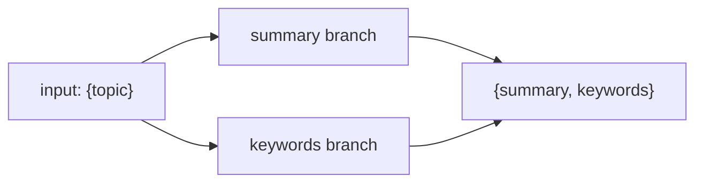

import TOCInline from '@theme/TOCInline';

# Runnables & LCEL (Deep Dive)

<TOCInline toc={toc} minHeadingLevel={2} maxHeadingLevel={2} />

:::tip[In this guide]
The engine under LCEL. Every prompt, model, and parser from
[LangChain Basics](./01-langchain-basics.mdx) is a **Runnable** with one shared
interface. Master the handful of Runnable primitives here and you can wire input
dicts, run branches in parallel, route conditionally, and add fallbacks and
retries — the exact toolkit used to build the RAG chains in
[RAG Chains](./07-rag-chains.mdx).
:::

## What Is It?

A **Runnable** is LangChain's universal unit of computation. Anything that
implements the Runnable interface can be invoked, streamed, batched, composed
with `|`, and run asynchronously — using the same methods regardless of whether
it is a prompt, a model, a parser, or a plain Python function you wrapped.

## Why Does It Matter?

One interface means one mental model. You never learn a bespoke API per
component; you learn `invoke`/`stream`/`batch` once and everything obeys it.
That uniformity is what lets `|` glue arbitrary pieces together and gives you
streaming, async, batching, retries, and fallbacks *for free* on any chain.

---

## What a Runnable Is

Every Runnable exposes the same core methods. Learn these six and you know how to
drive any chain:

| Method | What it does |
| --- | --- |
| `invoke(input)` | Run once on a single input, return the output |
| `stream(input)` | Run once, yield output incrementally (tokens/chunks) |
| `batch(inputs)` | Run on a list of inputs, often with parallelism |
| `ainvoke(input)` | Async `invoke` — `await` it |
| `astream(input)` | Async `stream` — `async for` over it |
| `abatch(inputs)` | Async `batch` |

```python
from langchain_ollama import ChatOllama
from langchain_core.prompts import ChatPromptTemplate
from langchain_core.output_parsers import StrOutputParser

chain = (
    ChatPromptTemplate.from_template("Explain {topic} in one sentence.")
    | ChatOllama(model="llama3.2", temperature=0.1)
    | StrOutputParser()
)

# one input
chain.invoke({"topic": "embeddings"})

# stream tokens
for chunk in chain.stream({"topic": "retrievers"}):
    print(chunk, end="", flush=True)

# many inputs at once
chain.batch([{"topic": "chunking"}, {"topic": "reranking"}])
```

The async variants have identical signatures — you just `await`:

```python
import asyncio

async def main():
    # single async call
    print(await chain.ainvoke({"topic": "LCEL"}))

    # async streaming
    async for chunk in chain.astream({"topic": "vector search"}):
        print(chunk, end="", flush=True)

asyncio.run(main())
```

:::info[Theory: the composite is also a Runnable]
When you pipe `prompt | model | parser`, the *result* is itself a Runnable (a
`RunnableSequence`). That is the closure property that makes LCEL compose without
limit — a chain can be dropped into another chain exactly like a single
component, because both satisfy the same interface. Streaming and async are the
subject of [Streaming & Async](./08-streaming-async.mdx).
:::

---

## The `|` Pipe Recap

The `|` operator connects Runnables left to right: the output of the left
becomes the input of the right. It is syntactic sugar for `RunnableSequence`.

```python
# these two are equivalent
chain = prompt | model | parser

from langchain_core.runnables import RunnableSequence
chain = RunnableSequence(prompt, model, parser)
```

The only rule is type compatibility: each step must accept what the previous
step emits. A prompt emits messages, a model accepts messages; a model emits an
`AIMessage`, `StrOutputParser` accepts one. When you need to reshape data between
steps, the primitives below do the adapting.

---

## RunnablePassthrough

`RunnablePassthrough` forwards its input unchanged. That sounds useless until you
build a dict of inputs where one key should just be the original value.

```python
from langchain_core.runnables import RunnablePassthrough

# passes the input straight through
RunnablePassthrough().invoke("hello")     # 'hello'

# common pattern: build a dict where one field is the raw input
mapping = {"question": RunnablePassthrough()}
```

Its real power is `.assign()`, which **adds** new keys to an incoming dict while
keeping the existing ones. This is how you enrich an input as it flows through a
chain.

```python
from langchain_core.runnables import RunnablePassthrough

# start with {"question": ...}, add a "context" key computed from it
def fake_retrieve(inputs):
    return f"context for: {inputs['question']}"

enrich = RunnablePassthrough.assign(context=fake_retrieve)
enrich.invoke({"question": "What is RAG?"})
# {'question': 'What is RAG?', 'context': 'context for: What is RAG?'}
```

:::note[Highlight: assign is the RAG glue]
`RunnablePassthrough.assign(...)` is how you thread a user question through a
chain and attach retrieved context to it without losing the original question.
You will see this exact move when building the RAG input dict below and in
[RAG Chains](./07-rag-chains.mdx).
:::

---

## RunnableParallel

`RunnableParallel` runs several Runnables on the *same input* at the same time
and collects their outputs into a dict keyed by name. A plain Python dict inside
a chain is automatically coerced into a `RunnableParallel`.

```python
from langchain_ollama import ChatOllama
from langchain_core.prompts import ChatPromptTemplate
from langchain_core.output_parsers import StrOutputParser
from langchain_core.runnables import RunnableParallel

model = ChatOllama(model="llama3.2", temperature=0.3)

summary = ChatPromptTemplate.from_template("Summarize {topic} in one line.") | model | StrOutputParser()
keywords = ChatPromptTemplate.from_template("List 3 keywords for {topic}.") | model | StrOutputParser()

# run both branches concurrently on the same input
parallel = RunnableParallel(summary=summary, keywords=keywords)

result = parallel.invoke({"topic": "vector databases"})
print(result["summary"])
print(result["keywords"])
```

Both branches receive `{"topic": "vector databases"}` and execute at once; the
result is `{"summary": ..., "keywords": ...}`. Here is the shape:



:::info[Theory: where the speedup comes from]
The branches are independent, so LangChain runs them concurrently instead of one
after another. For I/O-bound steps — model calls, retriever lookups — this cuts
wall-clock time roughly to the slowest branch rather than the sum. `batch` uses
the same concurrency across inputs; `RunnableParallel` applies it across branches
of a single input.
:::

---

## RunnableLambda

`RunnableLambda` wraps any plain Python function so it becomes a Runnable and can
sit in a pipe. Anywhere you need custom logic — formatting, filtering, a quick
transform — this is the escape hatch.

```python
from langchain_core.runnables import RunnableLambda

def format_docs(docs):
    return "\n\n".join(d.page_content for d in docs)

# now it composes with |
as_runnable = RunnableLambda(format_docs)

# LangChain also auto-wraps bare functions inside a pipe:
# retriever | format_docs   <-- format_docs becomes a RunnableLambda
```

:::note[Highlight: functions are auto-wrapped]
Inside a `|` chain or a dict, LangChain coerces a bare function into a
`RunnableLambda` for you, so `retriever | format_docs` just works. Wrap it
explicitly with `RunnableLambda(...)` only when you need it standalone or want to
attach config like a run name.
:::

---

## RunnableBranch

`RunnableBranch` implements conditional routing: it evaluates `(condition,
runnable)` pairs in order and runs the first whose condition is true, falling
back to a default. Think of it as `if/elif/else` for chains.

```python
from langchain_ollama import ChatOllama
from langchain_core.prompts import ChatPromptTemplate
from langchain_core.output_parsers import StrOutputParser
from langchain_core.runnables import RunnableBranch

model = ChatOllama(model="llama3.2", temperature=0.1)

code_chain = ChatPromptTemplate.from_template("Answer as a senior engineer: {query}") | model | StrOutputParser()
general_chain = ChatPromptTemplate.from_template("Answer simply: {query}") | model | StrOutputParser()

router = RunnableBranch(
    # (condition, runnable) pairs, checked top to bottom
    (lambda x: "code" in x["query"].lower(), code_chain),
    general_chain,   # default when nothing matched
)

router.invoke({"query": "Show me code for cosine similarity"})  # -> code_chain
router.invoke({"query": "What is a database?"})                 # -> general_chain
```

:::note[Highlight: routing without a framework]
`RunnableBranch` lets you pick a prompt, model, or entire sub-chain based on the
input — small-model for easy questions, larger for hard ones, or different
personas per topic — all while staying a single composable Runnable.
:::

---

## Configurable Fields and with_config

`.with_config(...)` attaches runtime metadata to a Runnable: a **run name**,
**tags**, and **metadata** that flow into tracing and callbacks. This is what
makes traces readable when you inspect them later in
[Callbacks & Tracing](./10-callbacks-tracing-langsmith.mdx).

```python
chain = (prompt | model | StrOutputParser()).with_config(
    run_name="one_liner_explainer",
    tags=["demo", "explainer"],
    metadata={"team": "rag-academy"},
)

chain.invoke({"topic": "LCEL"})   # runs identically, but is now labeled in traces
```

You can also pass config per call as a second argument, which is handy for
setting concurrency or a run name on a single invocation:

```python
chain.batch(
    [{"topic": "a"}, {"topic": "b"}],
    config={"max_concurrency": 2},
)
```

---

## Fallbacks

`.with_fallbacks([...])` gives a Runnable a backup. If the primary raises, the
first fallback runs on the same input; if that fails too, the next one, and so
on. Perfect for tolerating a flaky or occasionally overloaded model.

```python
from langchain_ollama import ChatOllama

primary = ChatOllama(model="llama3.2", temperature=0)
backup = ChatOllama(model="llama3.2", temperature=0.5)   # e.g. a different config/model

resilient = primary.with_fallbacks([backup])
resilient.invoke("Summarize LCEL in one line.")   # tries primary, then backup on error
```

:::caution[Fallbacks trigger on exceptions, not bad answers]
A fallback fires when the primary *raises* — a timeout, a connection error, a
crash. It does not fire because you dislike the content of a successful reply.
For quality control you need evaluation or validation logic, not a fallback.
:::

---

## Retries

`.with_retry()` re-runs a Runnable when it raises a transient error, with
exponential backoff. Use it for intermittent failures like a momentarily
unavailable server.

```python
from langchain_ollama import ChatOllama

model = ChatOllama(model="llama3.2")

robust = model.with_retry(
    stop_after_attempt=3,          # try up to 3 times total
    wait_exponential_jitter=True,  # back off with jitter between tries
)
robust.invoke("Hello")
```

:::warning[Retries vs fallbacks]
Retries repeat the **same** Runnable hoping a transient error clears. Fallbacks
switch to a **different** Runnable. They compose: retry the primary a few times,
and if it still fails, fall back. Do not retry errors that are deterministic
(a malformed request will fail identically every time) — you just waste calls.
:::

---

## Binding Arguments

`model.bind(...)` pre-sets keyword arguments on a Runnable so they are applied on
every call, without changing the chain's input shape. Use it to fix
model-specific options like `stop` sequences or a format flag.

```python
from langchain_ollama import ChatOllama

model = ChatOllama(model="llama3.2", temperature=0)

# always stop generating at "\n\n", every invocation
bound = model.bind(stop=["\n\n"])
bound.invoke("List two colors, one per line.")
```

`bind` returns a new Runnable, so you can slot it into a pipe exactly where the
unbound model went: `prompt | model.bind(stop=["\n\n"]) | StrOutputParser()`.

---

## Building a RAG Input Dict

Here is the passthrough-plus-parallel pattern that assembles a RAG input,
combining several primitives from this page. The retriever and the raw question
run in parallel to produce the dict the prompt expects.

```python
from langchain_ollama import ChatOllama, OllamaEmbeddings
from langchain_chroma import Chroma
from langchain_core.prompts import ChatPromptTemplate
from langchain_core.output_parsers import StrOutputParser
from langchain_core.runnables import RunnablePassthrough

embeddings = OllamaEmbeddings(model="nomic-embed-text")
vectorstore = Chroma(persist_directory="./chroma", embedding_function=embeddings)
retriever = vectorstore.as_retriever(search_kwargs={"k": 4})

def format_docs(docs):
    return "\n\n".join(d.page_content for d in docs)

prompt = ChatPromptTemplate.from_template(
    "Answer using ONLY the context.\n\nContext:\n{context}\n\nQuestion: {question}"
)
model = ChatOllama(model="llama3.2", temperature=0.1)

# {context, question} is a RunnableParallel; question passes through untouched
rag_chain = (
    {"context": retriever | format_docs, "question": RunnablePassthrough()}
    | prompt
    | model
    | StrOutputParser()
)

rag_chain.invoke("What does RAG reduce?")
```

The full retrieval-augmented patterns — including `assign`-based variants that
also return sources — are built out in [RAG Chains](./07-rag-chains.mdx).

---

## Common Mistakes

- Forgetting that a bare dict in a chain becomes a `RunnableParallel` (and receives the whole upstream input).
- Reaching for a class when a `RunnableLambda` (or an auto-wrapped function) is enough.
- Expecting fallbacks to trigger on low-quality answers rather than exceptions.
- Retrying deterministic errors, wasting calls and time.
- Sequencing independent branches instead of running them with `RunnableParallel`.
- Skipping `run_name`/`tags`, leaving traces unreadable later.

## Interview Questions

- What is a Runnable and what methods define its interface?
- How does `|` relate to `RunnableSequence`?
- `RunnablePassthrough.assign()` — what problem does it solve in RAG?
- When would you use `RunnableParallel`, and where does the speedup come from?
- Retries vs fallbacks — how do they differ and how do they compose?
- What does `model.bind(...)` do that changing the input dict cannot?

## Things to Remember

- One interface: `invoke`/`stream`/`batch` plus async `ainvoke`/`astream`/`abatch`.
- Dicts become `RunnableParallel`; bare functions become `RunnableLambda`.
- `RunnablePassthrough.assign()` enriches an input dict in flight.
- `RunnableBranch` routes conditionally; `with_config` labels runs for tracing.
- `with_fallbacks` swaps on error; `with_retry` repeats on transient error; `bind` fixes call-time args.

## Mini Exercise

Build a `RunnableParallel` that, for a single `{topic}`, returns both a one-line
summary and a list of three keywords. Then add a `RunnablePassthrough.assign()`
step that appends the original topic to the result dict. Finally, wrap the model
with `.with_retry()` and `.with_fallbacks([...])` and confirm the chain still
runs end to end.

## Done When

- [ ] You can drive any chain with `invoke`, `stream`, `batch`, and their async forms.
- [ ] You can use `RunnablePassthrough`, `.assign()`, `RunnableParallel`, and `RunnableLambda`.
- [ ] You can route with `RunnableBranch` and label runs with `with_config`.
- [ ] You can add fallbacks, retries, and bound arguments to a Runnable.
- [ ] You can assemble a RAG input dict from these primitives.

Next: [Document Loaders & Text Splitters](./05-document-loaders-splitters.mdx).
