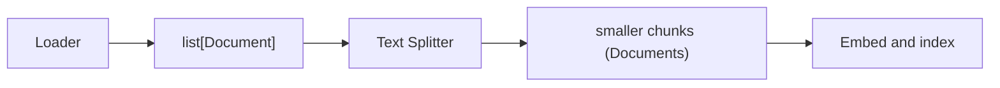

import TOCInline from '@theme/TOCInline';

# Document Loaders & Text Splitters

<TOCInline toc={toc} minHeadingLevel={2} maxHeadingLevel={2} />

:::tip[In this guide]
The front of the RAG pipeline: getting raw data into LangChain's `Document`
shape and cutting it into retrievable chunks. This is the LangChain-native
version of the chunking theory from
[Chunking Strategies](../05-rag-fundamentals/05-chunking-strategies.mdx), and it
feeds directly into [Retrievers](./06-retrievers.mdx).
:::

## What Is It?

A **document loader** reads a source (a file, a folder, a PDF, a web page) and
returns a list of `Document` objects. A **text splitter** takes those documents
and breaks them into smaller chunks sized for embedding and retrieval. Together
they are the ingestion half of RAG.

## Why Does It Matter?

Retrieval quality is capped by chunk quality. Load poorly and you carry junk
(headers, footers, broken encodings) into your index; split poorly and you tear
sentences apart or bury the answer in an oversized blob. Getting loading and
splitting right is the cheapest, highest-leverage thing you can do for a RAG
system.

---

## The Document Object

Everything downstream speaks in `Document` objects. A `Document` has just two
important attributes: `page_content` (the text) and `metadata` (a `dict` of
arbitrary key/value pairs like source path, page number, or section title).

```python
from langchain_core.documents import Document

doc = Document(
    page_content="RAG grounds answers in retrieved context.",
    metadata={"source": "notes.md", "section": "intro"},
)

print(doc.page_content)          # the text the model/embedder sees
print(doc.metadata["source"])    # provenance you can filter and cite on
```

:::note[Highlight: metadata is not optional plumbing]
`metadata` is how you cite sources, filter retrieval (`where` clauses), and debug
"why did this chunk come back?". Treat it as first-class: every loader populates
it, and every splitter should preserve it. Losing metadata during ingestion means
you can never tell the user *where* an answer came from.
:::

---

## Document Loaders

LangChain ships loaders for dozens of sources. Four cover most day-to-day work.
Note that many loaders live in `langchain-community` and often need an extra
library for the underlying format.

:::info[Theory: where loaders live]
Core abstractions (`Document`, the base loader interface) are in
`langchain-core`. Concrete integrations — file formats, web, SaaS connectors —
live in `langchain-community` (`pip install langchain-community`). Some also need
a backend package, e.g. `pypdf` for PDFs or `beautifulsoup4` for web pages. If an
import fails, the missing piece is usually one of these extras.
:::

### TextLoader

Loads a single plain-text file into one `Document`.

```python
from langchain_community.document_loaders import TextLoader

docs = TextLoader("notes.md", encoding="utf-8").load()
print(len(docs))                 # 1
print(docs[0].metadata)          # {'source': 'notes.md'}
```

### DirectoryLoader

Loads many files matching a glob, delegating each to a per-file loader. Great for
ingesting a whole folder of notes or docs.

```python
from langchain_community.document_loaders import DirectoryLoader, TextLoader

loader = DirectoryLoader(
    "./knowledge",
    glob="**/*.md",              # recurse, only markdown files
    loader_cls=TextLoader,       # how to load each matched file
    loader_kwargs={"encoding": "utf-8"},
)
docs = loader.load()
print(len(docs))                 # one Document per file
```

### PyPDFLoader

Loads a PDF, returning **one `Document` per page** with the page number in
metadata (needs `pip install pypdf`).

```python
from langchain_community.document_loaders import PyPDFLoader

docs = PyPDFLoader("paper.pdf").load()
print(len(docs))                 # number of pages
print(docs[0].metadata)          # {'source': 'paper.pdf', 'page': 0}
```

### WebBaseLoader

Fetches one or more URLs and extracts their text (needs `beautifulsoup4`).

```python
from langchain_community.document_loaders import WebBaseLoader

docs = WebBaseLoader(["https://example.com/article"]).load()
print(docs[0].metadata["source"])
print(docs[0].page_content[:200])
```

:::caution[Loaded text is rarely clean]
Web and PDF extraction drag in navigation bars, footers, page numbers, and
broken line breaks. Inspect a sample before indexing and strip boilerplate —
otherwise every chunk is polluted and retrieval degrades. A quick
`len(doc.page_content)` and eyeball of `doc.page_content[:500]` per source saves
hours later.
:::

---

## Why Split

Loaders often hand you large documents — a whole page, article, or file. You
cannot embed those effectively: an embedding of a 5,000-word page is a blurry
average that matches nothing well, and it blows past the context budget when
retrieved. Splitting into focused chunks makes each embedding *specific* and lets
you retrieve only the relevant slice.

This is the LangChain implementation of the tradeoffs covered in
[Chunking Strategies](../05-rag-fundamentals/05-chunking-strategies.mdx): small
chunks are precise but lose context; large chunks keep context but dilute
relevance. Overlap buys back some of the context lost at boundaries.



---

## RecursiveCharacterTextSplitter

The default, and the one to reach for first. It tries to split on a *prioritized*
list of separators — paragraph breaks first, then lines, then sentences, then
words — so it keeps semantically related text together as long as it can before
falling back to finer cuts.

```python
from langchain_text_splitters import RecursiveCharacterTextSplitter

splitter = RecursiveCharacterTextSplitter(
    chunk_size=1000,        # target max characters per chunk
    chunk_overlap=150,      # characters shared between neighbors
)

text = "Long document text...\n\nSecond paragraph..."
chunks = splitter.split_text(text)          # -> list[str]

# or operate on Documents, preserving/attaching metadata
from langchain_core.documents import Document
docs = [Document(page_content=text, metadata={"source": "notes.md"})]
chunked_docs = splitter.split_documents(docs)   # -> list[Document]
```

:::info[Theory: why "recursive" wins by default]
It walks its separator list in order. Given `["\n\n", "\n", " ", ""]`, it first
tries to break on blank lines (paragraphs). If a piece is still over `chunk_size`,
it recurses into that piece with the next separator, and so on. The effect: cuts
land at natural boundaries whenever possible and only fall to mid-word splits as a
last resort — which is exactly what you want for prose.
:::

:::note[Highlight: sizing chunk_size and chunk_overlap]
Start around `chunk_size=1000` with `chunk_overlap=100–200` for general prose,
then tune against your data. Overlap prevents an answer that straddles a boundary
from being split across two chunks such that neither retrieves well. Keep chunk
sizes comfortably inside your embedding model's input limit.
:::

---

## CharacterTextSplitter

A simpler splitter that cuts on a **single** separator (default `"\n\n"`) and
then merges pieces up to `chunk_size`. It is more predictable but less smart —
if a section has no occurrence of the separator, it will not split it well.

```python
from langchain_text_splitters import CharacterTextSplitter

splitter = CharacterTextSplitter(
    separator="\n\n",
    chunk_size=1000,
    chunk_overlap=100,
)
chunks = splitter.split_text(text)
```

:::warning[Prefer recursive unless you have a reason]
`CharacterTextSplitter` can produce wildly uneven chunks when your chosen
separator is rare in the text. For most documents `RecursiveCharacterTextSplitter`
gives better, more even cuts with the same settings. Reach for the plain
character splitter only when you truly want a single, known delimiter.
:::

---

## Token-Based Splitting

`chunk_size` in the character splitters counts **characters**, but models count
**tokens**. When you must respect a token budget precisely, split by tokens. Use
`TokenTextSplitter`, or build a recursive splitter that measures length in tokens
via `from_tiktoken_encoder`.

```python
from langchain_text_splitters import (
    TokenTextSplitter, RecursiveCharacterTextSplitter,
)

# split purely by token count
token_splitter = TokenTextSplitter(chunk_size=256, chunk_overlap=20)
token_chunks = token_splitter.split_text(text)

# best of both: recursive boundaries, but sizes measured in tokens
tok_recursive = RecursiveCharacterTextSplitter.from_tiktoken_encoder(
    chunk_size=256,     # now counted in tokens, not characters
    chunk_overlap=20,
)
chunks = tok_recursive.split_text(text)
```

:::note[Highlight: character vs token sizing]
Characters are a rough proxy — English averages about 4 characters per token, but
code and other languages differ a lot. If you are packing chunks tightly against a
model's context limit, size in tokens so you do not overshoot. For casual prose,
character sizing is usually close enough.
:::

---

## Structure-Aware Splitting

Generic splitters ignore document structure. Two specialized splitters respect
it, producing far more coherent chunks for structured content.

### MarkdownHeaderTextSplitter

Splits on markdown headings and records the heading hierarchy **into metadata**,
so each chunk knows which section it came from.

```python
from langchain_text_splitters import MarkdownHeaderTextSplitter

md = "# Guide\n\n## Setup\nInstall steps...\n\n## Usage\nHow to run..."

splitter = MarkdownHeaderTextSplitter(
    headers_to_split_on=[("#", "h1"), ("##", "h2")],
)
chunks = splitter.split_text(md)
print(chunks[0].metadata)        # e.g. {'h1': 'Guide', 'h2': 'Setup'}
```

### Language-Aware Splitting for Code

Source code should not be cut mid-function. `RecursiveCharacterTextSplitter`
offers language-specific separator sets that break on class and function
boundaries.

```python
from langchain_text_splitters import (
    RecursiveCharacterTextSplitter, Language,
)

code_splitter = RecursiveCharacterTextSplitter.from_language(
    language=Language.PYTHON,
    chunk_size=500,
    chunk_overlap=0,
)
code_chunks = code_splitter.split_text(source_code)
```

:::info[Theory: structure carries meaning]
A markdown heading or a function boundary is a signal the author already gave you
about where one idea ends and another begins. Splitting on those boundaries keeps
each chunk about one coherent thing, which sharpens both the embedding and the
retrieved context. Generic character splitting throws that free signal away.
:::

---

## Preserving and Enriching Metadata

`split_documents` copies each source document's metadata onto every chunk it
produces, so provenance survives splitting. You can also enrich chunks with extra
fields — a chunk index, a title, a timestamp — for citation and filtering later.

```python
from langchain_text_splitters import RecursiveCharacterTextSplitter
from langchain_core.documents import Document

docs = [Document(page_content=long_text, metadata={"source": "guide.md"})]
splitter = RecursiveCharacterTextSplitter(chunk_size=800, chunk_overlap=100)
chunks = splitter.split_documents(docs)   # each chunk keeps {'source': 'guide.md'}

# enrich: add a stable per-chunk index for citation
for i, chunk in enumerate(chunks):
    chunk.metadata["chunk_id"] = i

print(chunks[0].metadata)        # {'source': 'guide.md', 'chunk_id': 0}
```

:::warning[Do not let metadata leak into the embedding]
Metadata lives in `.metadata`, not in `page_content`. Only `page_content` gets
embedded. If you paste titles or tags into the text itself to "help" retrieval,
you pollute the embedding — keep structured facts in metadata and filter on them
instead.
:::

---

## From Ingestion to a Vector Store

Load, split, then index. The chunked `Document` list drops straight into a vector
store, which embeds each chunk and stores it with its metadata — the handoff to
retrieval.

```python
from langchain_community.document_loaders import DirectoryLoader, TextLoader
from langchain_text_splitters import RecursiveCharacterTextSplitter
from langchain_ollama import OllamaEmbeddings
from langchain_chroma import Chroma

# 1) load
docs = DirectoryLoader("./knowledge", glob="**/*.md", loader_cls=TextLoader).load()

# 2) split
splitter = RecursiveCharacterTextSplitter(chunk_size=1000, chunk_overlap=150)
chunks = splitter.split_documents(docs)

# 3) embed + index (metadata comes along automatically)
embeddings = OllamaEmbeddings(model="nomic-embed-text")
vectorstore = Chroma.from_documents(
    chunks, embedding=embeddings, persist_directory="./chroma",
)
```

From here you turn the store into a retriever and query it — the subject of
[Retrievers](./06-retrievers.mdx). For the storage side, see
[Vector Databases](../05-rag-fundamentals/06-vector-databases.mdx).

---

## Common Mistakes

- Indexing raw loaded text without stripping web/PDF boilerplate.
- Not splitting at all, so huge chunks produce blurry embeddings.
- Using `CharacterTextSplitter` with a separator that is rare in the text.
- Sizing chunks in characters when you need to respect a token budget.
- Dropping metadata during splitting, losing all provenance and citations.
- Stuffing titles/tags into `page_content` instead of `metadata`.

## Interview Questions

- What are the two key attributes of a `Document` and why does metadata matter?
- Which package holds most loaders, and what extras might they require?
- How does `RecursiveCharacterTextSplitter` decide where to cut?
- What does `chunk_overlap` buy you, and how do you size it?
- Character-based vs token-based splitting — when does the difference matter?
- When would you use `MarkdownHeaderTextSplitter` or language-aware splitting?

## Things to Remember

- A `Document` is `page_content` + `metadata`; only `page_content` is embedded.
- Most loaders live in `langchain-community` and may need a backend library.
- `RecursiveCharacterTextSplitter` is the sensible default; tune `chunk_size`/`chunk_overlap`.
- Split by tokens when you must respect a model's token budget precisely.
- Structure-aware splitters (markdown, code) produce more coherent chunks.
- `split_documents` preserves metadata; enrich it for citation and filtering.

## Mini Exercise

Load a folder of markdown files with `DirectoryLoader`, split them with a
`RecursiveCharacterTextSplitter(chunk_size=800, chunk_overlap=100)`, and add a
`chunk_id` to each chunk's metadata. Then re-split the same text with
`MarkdownHeaderTextSplitter` and compare how the chunk boundaries and metadata
differ. Finally, index either set into a persistent `Chroma` store.

## Done When

- [ ] You can explain the `Document` object and why metadata is first-class.
- [ ] You can load text, folders, PDFs, and web pages, and note where loaders live.
- [ ] You can split with recursive, character, token, and structure-aware splitters.
- [ ] You can preserve and enrich metadata through splitting.
- [ ] You can go from loaded documents to a persisted vector store.

Next: [Retrievers](./06-retrievers.mdx).
