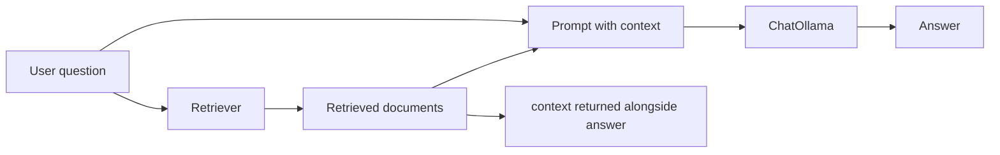

import TOCInline from '@theme/TOCInline';

# RAG Chains

<TOCInline toc={toc} minHeadingLevel={2} maxHeadingLevel={2} />

:::tip[In this guide]
This is where retriever, prompt, and model come together. We cover the two ways
to build a RAG chain — hand-built LCEL and the built-in helpers — then add
conversational history, source citations, and the "stuff vs map-reduce vs
refine" strategies, building on
[Runnables & LCEL](./04-runnables-lcel.mdx).
:::

## What Is It?

A RAG chain is the full pipeline that takes a question, retrieves relevant
documents, injects them into a prompt, and generates a grounded answer. In
LangChain you can assemble it yourself with LCEL pipes, or use purpose-built
constructor functions that wire the common shape for you.

## Why Does It Matter?

RAG is the dominant pattern for grounding LLMs in your own data, and the chain is
its backbone. Knowing both the hand-built and the helper approach lets you
prototype fast with the helpers while retaining the ability to drop down to raw
LCEL when you need custom routing, extra steps, or full control over what the
model sees. This is applied retrieval-augmented generation from
[Retrieval & Generation](../05-rag-fundamentals/02-retrieval-generation.mdx).

---

## The Two Ways

There are two routes to a RAG chain, and they trade control for convenience.

| Approach | What you write | Best for |
| --- | --- | --- |
| Hand-built LCEL | Compose retriever, prompt, model, parser with `|` | Custom steps, full transparency |
| Built-in helpers | `create_stuff_documents_chain` + `create_retrieval_chain` | Standard RAG, fast, returns sources |

The helpers are not magic — they build LCEL chains internally. Use them for the
common case; reach for hand-built LCEL when you need something they do not do.

```python
# hand-built LCEL RAG chain (the pattern from LangChain Basics)
from langchain_core.runnables import RunnablePassthrough
from langchain_core.output_parsers import StrOutputParser

def format_docs(docs):
    return "\n\n".join(d.page_content for d in docs)

rag_chain = (
    {"context": retriever | format_docs, "question": RunnablePassthrough()}
    | prompt
    | model
    | StrOutputParser()
)
rag_chain.invoke("What does RAG reduce?")
```

The hand-built version returns just the answer string. The helpers below also
hand back the retrieved context, which you need for citations.

---

## create_stuff_documents_chain

This helper builds the "combine documents into a prompt and answer" half of RAG.
"Stuff" means it stuffs all retrieved documents into a single prompt variable
(by convention named `context`).

```python
from langchain.chains.combine_documents import create_stuff_documents_chain
from langchain_core.prompts import ChatPromptTemplate
from langchain_ollama import ChatOllama

prompt = ChatPromptTemplate.from_messages([
    ("system", "Answer using ONLY the context. If unknown, say you don't know.\n\n{context}"),
    ("human", "{input}"),
])
model = ChatOllama(model="llama3.2", temperature=0.1)

document_chain = create_stuff_documents_chain(model, prompt)

# you can call it directly with documents you already have
document_chain.invoke({
    "input": "What embedding model is used?",
    "context": docs,   # a list[Document]
})
```

:::note[Highlight: the prompt must have a context variable]
`create_stuff_documents_chain` formats your documents into the `{context}`
placeholder. Your prompt **must** include `{context}` (and typically `{input}`
for the question), or the helper has nowhere to put the retrieved text.
:::

---

## create_retrieval_chain

This helper wires a retriever to a document chain, giving you the complete RAG
pipeline. It retrieves for the `input`, passes the docs to the document chain,
and returns a dict containing both the `answer` and the `context` used.

```python
from langchain.chains import create_retrieval_chain
from langchain.chains.combine_documents import create_stuff_documents_chain
from langchain_core.prompts import ChatPromptTemplate
from langchain_ollama import ChatOllama, OllamaEmbeddings
from langchain_chroma import Chroma

# 1. retriever over an existing Chroma store
embeddings = OllamaEmbeddings(model="nomic-embed-text")
vectorstore = Chroma(persist_directory="./chroma", embedding_function=embeddings)
retriever = vectorstore.as_retriever(search_kwargs={"k": 4})

# 2. the answer-generation (document) chain
prompt = ChatPromptTemplate.from_messages([
    ("system", "Answer using ONLY the context below. If it is not there, say you don't know.\n\n{context}"),
    ("human", "{input}"),
])
model = ChatOllama(model="llama3.2", temperature=0.1)
document_chain = create_stuff_documents_chain(model, prompt)

# 3. retriever + document chain = full RAG chain
rag_chain = create_retrieval_chain(retriever, document_chain)

result = rag_chain.invoke({"input": "What does RAG reduce?"})
print(result["answer"])       # the generated answer
print(result["context"])      # the list[Document] that were retrieved
```

:::info[Theory: why it returns context]
Unlike the hand-built chain that emits a bare string, `create_retrieval_chain`
returns a dict with `input`, `context`, and `answer`. Handing back the retrieved
documents is what makes **citations, evaluation, and debugging** possible — you
can show users where an answer came from and check whether retrieval actually
surfaced the right passages.
:::

Here is the flow the helper builds:



---

## create_history_aware_retriever

Follow-up questions are often incomplete: "What about its latency?" only makes
sense given the previous turn. A plain retriever would embed that vague query
and retrieve poorly. `create_history_aware_retriever` first uses the LLM to
rewrite the follow-up into a **standalone** question using the chat history, then
retrieves with that.

```python
from langchain.chains import create_history_aware_retriever, create_retrieval_chain
from langchain.chains.combine_documents import create_stuff_documents_chain
from langchain_core.prompts import ChatPromptTemplate, MessagesPlaceholder
from langchain_ollama import ChatOllama

model = ChatOllama(model="llama3.2", temperature=0.1)

# 1. prompt that rewrites a follow-up into a standalone query
rewrite_prompt = ChatPromptTemplate.from_messages([
    ("system", "Given the chat history and the latest question, rewrite it as a standalone question. Do NOT answer it."),
    MessagesPlaceholder("chat_history"),
    ("human", "{input}"),
])
history_aware_retriever = create_history_aware_retriever(model, retriever, rewrite_prompt)

# 2. answer prompt (also aware of history)
answer_prompt = ChatPromptTemplate.from_messages([
    ("system", "Answer using ONLY the context.\n\n{context}"),
    MessagesPlaceholder("chat_history"),
    ("human", "{input}"),
])
document_chain = create_stuff_documents_chain(model, answer_prompt)

# 3. combine into a conversational RAG chain
conversational_rag = create_retrieval_chain(history_aware_retriever, document_chain)

from langchain_core.messages import HumanMessage, AIMessage
history = [
    HumanMessage("What is ChatOllama?"),
    AIMessage("It is LangChain's chat model wrapper for Ollama."),
]
result = conversational_rag.invoke({
    "input": "What temperature does it default to?",  # vague on its own
    "chat_history": history,
})
print(result["answer"])
```

:::note[Highlight: this is conversational RAG]
The rewrite step is what turns single-shot RAG into a chatbot that follows a
thread. It resolves pronouns and implicit references *before* retrieval, so the
vector search sees a self-contained question. Where the history itself comes
from — session stores, windowing, summarization — is covered in
[Memory & Agents](./09-memory-agents.mdx).
:::

:::caution[The rewrite prompt must not answer]
A common bug is a rewrite prompt that answers the question instead of just
restating it. Be explicit ("Do NOT answer it, only rephrase") — otherwise the
retriever receives an answer as its query and retrieval degrades.
:::

---

## Returning Sources and Citations

Because `create_retrieval_chain` returns `context`, you can surface citations
directly. Attach identifying metadata at ingestion time, then read it back off
the returned documents.

```python
result = rag_chain.invoke({"input": "What does RAG reduce?"})

print(result["answer"])
print("\nSources:")
for doc in result["context"]:
    source = doc.metadata.get("source", "unknown")
    page = doc.metadata.get("page", "?")
    print(f"- {source} (page {page})")
```

:::info[Theory: grounded answers need traceable sources]
Citations do two jobs: they let users verify the answer, and they let you
**evaluate** retrieval quality by checking whether the cited passages actually
support the claim. This traceability is a core input to
[RAG evaluation](../05-rag-fundamentals/14-rag-evaluation.mdx). Without returned
context, you cannot tell a well-retrieved answer from a lucky guess.
:::

---

## Document Strategies: Stuff vs Map-Reduce vs Refine

"Stuff" puts every retrieved document into one prompt. That is simplest and
fastest, but it breaks when the combined documents exceed the model's context
window. Two alternatives trade calls for capacity.

| Strategy | How it works | Tradeoff |
| --- | --- | --- |
| Stuff | All docs in one prompt, one call | Simple, fast; limited by context window |
| Map-reduce | Summarize each doc, then combine the summaries | Handles many docs; more calls, parallelizable |
| Refine | Answer from doc 1, then iteratively update with each next doc | Good for long sequences; many sequential calls, slow |

:::note[Highlight: default to stuff]
For typical RAG with `k` around 4-8 chunks, **stuff** is the right choice —
one call, all context, lowest latency. Only move to map-reduce or refine when
you must feed the model more documents than fit in its context window, such as
summarizing an entire large corpus.
:::

---

## Common Mistakes

- Writing a prompt without a `{context}` variable for `create_stuff_documents_chain`.
- Expecting a bare string from `create_retrieval_chain` — it returns a dict (`answer`, `context`).
- Retrieving on a raw follow-up question instead of a history-aware rewrite.
- Letting the rewrite prompt answer the question instead of just rephrasing.
- Reaching for map-reduce or refine when stuff would fit and be far faster.
- Losing citations by ingesting documents without useful `source` metadata.

## Interview Questions

- What are the two ways to build a RAG chain in LangChain?
- What does `create_stuff_documents_chain` expect in its prompt?
- What does `create_retrieval_chain` return, and why does that matter?
- How does `create_history_aware_retriever` enable conversational RAG?
- Compare stuff, map-reduce, and refine document strategies.
- How would you return source citations from a RAG chain?

## Things to Remember

- Hand-built LCEL gives control; the helpers give speed and return context.
- `create_stuff_documents_chain` needs `{context}` in the prompt.
- `create_retrieval_chain` returns `answer` **and** `context`.
- History-aware retrieval rewrites follow-ups into standalone queries first.
- Returned context powers citations and evaluation.
- Default to stuff; use map-reduce or refine only for context-window limits.

## Mini Exercise

Build a `create_retrieval_chain` over your Chroma store with `ChatOllama`, print
both the answer and a list of source files from `result["context"]`. Then wrap
its retriever with `create_history_aware_retriever`, feed a two-message history,
and confirm a vague follow-up ("what about its latency?") retrieves correctly.

## Done When

- [ ] You can build a RAG chain both by hand with LCEL and with the helpers.
- [ ] You can return and display source citations from the chain.
- [ ] You can build a conversational, history-aware RAG chain.
- [ ] You can explain stuff vs map-reduce vs refine and when each applies.

Next: [Streaming, Async & Batch](./08-streaming-async.mdx).
