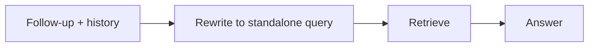
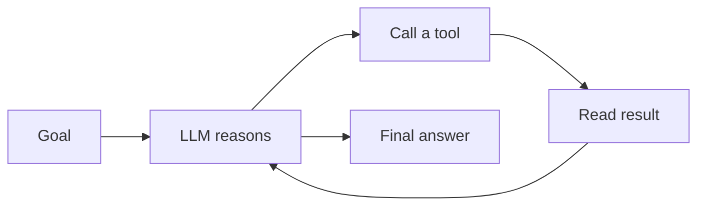

import TOCInline from '@theme/TOCInline';

# Memory & Agents

<TOCInline toc={toc} minHeadingLevel={2} maxHeadingLevel={2} />

:::tip[In this guide]
Give chains memory across turns, then meet agents — LLMs that choose and call
tools — and learn when that power is worth its unpredictability.
:::

## What Is It?

- **Memory**: carrying conversation history so follow-up questions have context.
- **Agents**: an LLM that decides which **tools** to call, in what order, to accomplish a task.

## Why Does It Matter?

Chat needs memory. Some tasks need dynamic tool use (search, calculator, your
own APIs). But agents trade reliability for flexibility — knowing when to use
them is a senior-level judgment.

## Conversational Memory

Keep prior turns and include them in the prompt:

```python
from langchain_core.prompts import ChatPromptTemplate, MessagesPlaceholder
from langchain_core.messages import HumanMessage, AIMessage
from langchain_ollama import ChatOllama

prompt = ChatPromptTemplate.from_messages([
    ("system", "You are a concise assistant."),
    MessagesPlaceholder("history"),
    ("human", "{input}"),
])
model = ChatOllama(model="llama3.2")
chain = prompt | model

history = []
def chat(user_input: str) -> str:
    reply = chain.invoke({"history": history, "input": user_input})
    history.extend([HumanMessage(user_input), AIMessage(reply.content)])
    return reply.content

chat("My name is Ada.")
chat("What's my name?")        # uses history → "Ada"
```

### Managing context length

History grows and eats the [context window](../00-prerequisites/02-core-ai-concepts.mdx).
Strategies:

- **Windowing**: keep only the last N turns.
- **Summarization**: compress old turns into a running summary.
- Persist history per session id in a store (Redis, DB) for real apps.

## Conversational RAG

Combine memory with retrieval: rephrase the follow-up into a standalone query
(using history), retrieve, then answer. This fixes "it/that" references in
follow-ups.



## Tools and Agents

A **tool** is a function the LLM can call:

```python
from langchain_core.tools import tool

@tool
def search_docs(query: str) -> str:
    """Search the knowledge base and return the top chunk."""
    results = retriever.invoke(query)
    return results[0].page_content if results else "no results"
```

An **agent** decides *whether* and *how* to use tools, often via the **ReAct**
loop (Reason → Act → Observe → repeat):



## When to Use Agents (and When Not)

| Use an agent | Prefer a fixed chain |
| --- | --- |
| Task needs dynamic tool selection | Steps are known in advance |
| Multi-step reasoning over tools | Single retrieve→answer flow |
| Exploratory / open-ended | Latency, cost, predictability matter |

Agents can loop, call the wrong tool, or run up latency/cost. For most RAG Q&A,
a **deterministic chain is better**. Add tools only when the task genuinely
requires decisions at runtime — and add guardrails (step limits, allowed tools).

## Common Mistakes

- Unbounded history overflowing the context window.
- Using an agent where a simple chain suffices.
- No max-step limit → runaway loops and cost.
- Giving agents powerful tools without guardrails.

## Interview Questions

- How do you add memory to a chat app? How manage context length?
- What is an agent and what is the ReAct loop?
- Agents vs fixed chains — tradeoffs?
- How do you keep agents safe and bounded?

## Things to Remember

- Memory = history in the prompt; window or summarize it.
- Agents = LLM chooses tools; powerful but less predictable.
- Default to deterministic chains; reach for agents deliberately.

## Mini Exercise

Add windowed memory (last 4 turns) to your RAG chain and confirm a follow-up
question ("what about its downsides?") retrieves sensibly using the rewritten
query.

## Done When

- [ ] You can maintain and bound conversation memory.
- [ ] You can define a tool and describe the agent loop.
- [ ] You can decide agent vs chain for a given task.

Next: [Callbacks, Tracing & LangSmith](./10-callbacks-tracing-langsmith.mdx).
