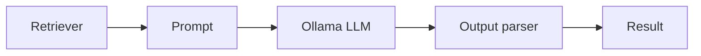

import TOCInline from '@theme/TOCInline';

# 07 · LangChain / LCEL

<ProgressToggle sectionId="07-langchain-lcel" />

<TOCInline toc={toc} minHeadingLevel={2} maxHeadingLevel={2} />

:::tip[In this guide]
LangChain gives you composable building blocks for LLM apps. You'll rebuild your
RAG chain with LCEL and learn where memory and agents fit — and when plain code
is better.
:::

## Goal

Compose prompts, models, retrievers, and parsers into pipelines with LCEL, and
understand memory and agents.

## Estimated Time

1 week.

## Prerequisites

- A working [RAG project](../05-rag-fundamentals/03-first-project.mdx).
- [Local LLMs / Ollama](../03-local-llms-ollama/index.mdx).

## What You Will Learn

1. [LangChain Basics](./01-langchain-basics.mdx) — components, LCEL, a RAG chain with Ollama.
2. [Memory & Agents](./02-memory-agents.mdx) — conversational memory, tools, agents, and their tradeoffs.

## Where This Fits

LCEL pipes these components together with a clean `|` syntax.

## A Balanced View

LangChain accelerates prototyping and standardizes integrations, but adds
abstraction. For simple flows, the hand-written chain from your
[first project](../05-rag-fundamentals/03-first-project.mdx) is often clearer.
Learn both; choose deliberately.

## Interview Relevance

Expect "what is LCEL?", "when would you use an agent?", and "LangChain vs
rolling your own?" — know the tradeoffs.

## Done When

- [ ] You can build a RAG chain with LCEL + Ollama.
- [ ] You can add conversational memory.
- [ ] You can explain when agents help and when they hurt.

Next: [08 · Agents & Agentic AI](../08-agentic-ai/index.mdx).
