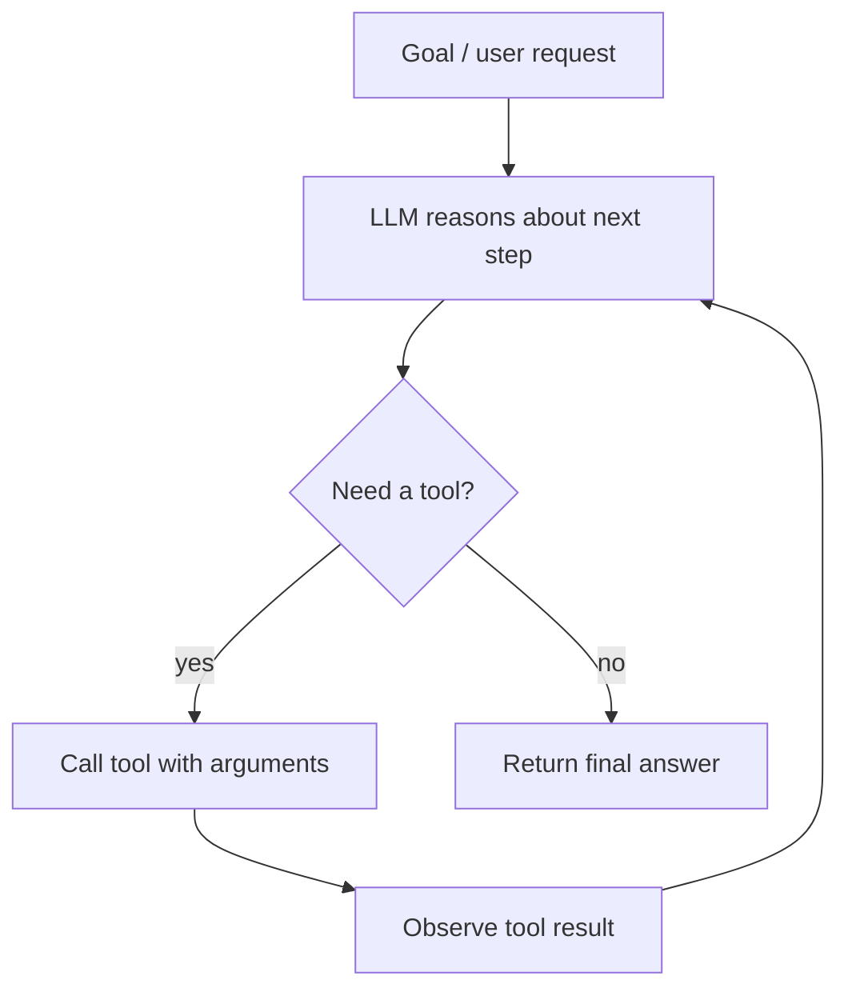

import TOCInline from '@theme/TOCInline';

# Agent Fundamentals

<TOCInline toc={toc} minHeadingLevel={2} maxHeadingLevel={2} />

:::tip[In this guide]
The mental model for every agent you'll build: the loop, tools, planning,
and how much autonomy to grant.
:::

## What Is an Agent?

An **agent** is an LLM given a goal, a set of **tools**, and the ability to
decide — in a loop — which tool to use next until the goal is met. Unlike a
fixed chain, the sequence of steps is chosen at runtime by the model.

## Why Does It Matter?

Many real tasks aren't a straight line: answering "what changed in this repo and
is the build passing?" needs the system to *decide* to read files, search, and
check CI — in an order it works out on the fly. Assistants like Kiro and Amazon
Q are agents.

## The Core Loop (ReAct)

**ReAct** = Reason + Act. The agent reasons about what to do, acts (calls a
tool), observes the result, and repeats:



## Tools

A **tool** is a function the model can call, described by a name, a
description, and a typed schema of arguments. The LLM emits a structured
"call this tool with these args"; your code runs it and returns the result.

```python
from pydantic import BaseModel

class SearchArgs(BaseModel):
    query: str
    top_k: int = 4

def search_docs(args: SearchArgs) -> str:
    """Search the knowledge base and return relevant chunks."""
    ...
```

Good tool design (clear names, precise descriptions, small argument sets) is
what makes an agent reliable — the description *is* the prompt the model uses to
decide.

## Tool Calling (Function Calling)

Modern LLMs support **structured tool calls**: given the tools' schemas, the
model outputs JSON naming a tool and its arguments instead of prose. Your
runtime executes it and feeds the result back. This is the backbone of agents.

## Planning

For complex goals, agents may **plan** first (decompose into subtasks) then
execute, re-planning as they learn. Simpler agents skip explicit planning and
just loop. Start simple; add planning only when tasks need it.

## Levels of Autonomy

| Level | Description | Example |
| --- | --- | --- |
| 0 · Fixed chain | No decisions | Your baseline RAG `/ask` |
| 1 · Router | Picks one path | "Is this a search or a chat question?" |
| 2 · Tool-using agent | Loops over tools | ReAct agent with search + calculator |
| 3 · Multi-agent | Agents coordinate | Planner + workers |
| 4 · Autonomous | Long-running, self-directed | Rare; high risk |

Higher autonomy = more capability **and** more ways to fail. Most production
systems live at levels 1–2 with tight guardrails.

## When NOT to Use an Agent

- The steps are known in advance → use a [chain](../07-langchain-lcel/01-langchain-basics.mdx).
- Latency/cost/predictability are critical → a deterministic pipeline wins.
- A single retrieval answers it → plain [RAG](../05-rag-fundamentals/index.mdx).

Reach for an agent only when the path genuinely must be decided at runtime.

## Common Mistakes

- Using an agent where a chain would do (slower, flakier, pricier).
- Vague tool descriptions → the model picks the wrong tool.
- No step limit → infinite loops and runaway cost.
- Giving powerful tools (shell, write) without confirmation/guardrails.

## Interview Questions

- What is an agent, and how does it differ from a chain?
- Explain the ReAct loop.
- What is tool/function calling?
- When would you avoid an agent?
- How do you keep an agent from looping forever?

## Things to Remember

- Agent = LLM + tools + a decision loop.
- Tool descriptions are prompts — write them carefully.
- Prefer the lowest autonomy that solves the task; add guardrails.

## Mini Exercise

Design (on paper) a "research assistant" agent: list its goal, 3 tools (with
one-line descriptions), and the stop condition. Mark which autonomy level it is.

## Done When

- [ ] You can draw and explain the ReAct loop.
- [ ] You can describe a tool and why its description matters.
- [ ] You can decide agent vs chain for a task.
