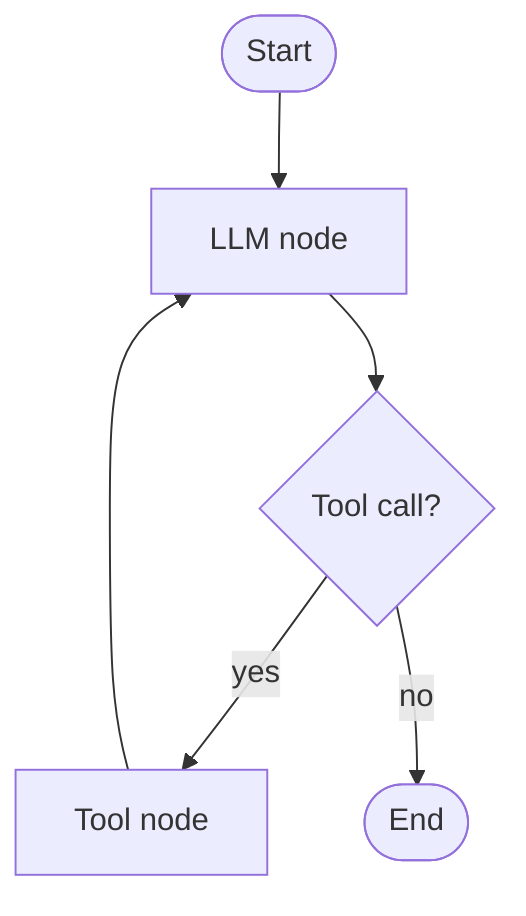

import TOCInline from '@theme/TOCInline';

# LangGraph Basics

<TOCInline toc={toc} minHeadingLevel={2} maxHeadingLevel={2} />

:::tip[In this guide]
LangGraph models an agent as a **state graph**: nodes do work, edges decide
where to go next, and cycles let the agent loop. This is the backbone for
reliable, inspectable agents.
:::

## What Is It?

**LangGraph** (from the LangChain team) lets you build agents as **stateful
graphs**. You define a shared state, nodes that transform it, and edges
(including conditional and looping edges) that route between nodes.

## Why Does It Matter?

Plain [LCEL chains](../07-langchain-lcel/01-langchain-basics.mdx) are linear.
Agents need loops, branching, and memory of intermediate state. A graph makes
that explicit, debuggable, and resumable — instead of a tangle of `if`
statements around an LLM call.

## Install

```bash
pip install langgraph langchain-ollama
```

## The Building Blocks

| Concept | Role |
| --- | --- |
| **State** | Typed data passed between nodes (messages, results, counters) |
| **Node** | A function that reads state and returns updates |
| **Edge** | A fixed transition from one node to the next |
| **Conditional edge** | Chooses the next node based on state |
| **Cycle** | An edge back to a previous node (the agent loop) |



## Defining State

State is a typed dict; LangGraph merges node outputs into it. A common pattern
appends to a message list:

```python
from typing import Annotated, TypedDict
from langgraph.graph import StateGraph, START, END
from langgraph.graph.message import add_messages

class State(TypedDict):
    # add_messages appends new messages instead of overwriting
    messages: Annotated[list, add_messages]
```

## A Minimal Graph

```python
from langchain_ollama import ChatOllama

llm = ChatOllama(model="llama3.2", temperature=0.1)

def chatbot(state: State) -> dict:
    return {"messages": [llm.invoke(state["messages"])]}

builder = StateGraph(State)
builder.add_node("chatbot", chatbot)
builder.add_edge(START, "chatbot")
builder.add_edge("chatbot", END)

graph = builder.compile()

result = graph.invoke({"messages": [("user", "What is LangGraph?")]})
print(result["messages"][-1].content)
```

## Adding a Conditional Edge (the loop)

Route back to tools when the model asks for one, otherwise finish:

```python
def should_continue(state: State) -> str:
    last = state["messages"][-1]
    return "tools" if getattr(last, "tool_calls", None) else END

builder.add_conditional_edges("chatbot", should_continue, {"tools": "tools", END: END})
builder.add_edge("tools", "chatbot")   # cycle: after tools, reason again
```

This cycle *is* the [ReAct loop](./01-agents-fundamentals.mdx) expressed as a
graph.

## Why Graphs Help in Production

- **Inspectable**: you can see exactly which node ran and the state at each step.
- **Controllable**: add a step counter to the state and stop at a limit.
- **Persistent**: LangGraph supports checkpointing, so runs can pause/resume (useful for human-in-the-loop).
- **Streamable**: stream state updates to a UI.

## Common Mistakes

- Overwriting state instead of appending (use reducers like `add_messages`).
- Forgetting the cycle edge (tools → back to the model), so the agent stops after one tool call.
- No termination condition → infinite loop.
- Cramming everything into one node instead of small, testable nodes.

## Interview Questions

- Why use a graph instead of a linear chain for agents?
- What are nodes, edges, and conditional edges?
- How does a cycle implement the agent loop?
- How would you cap the number of steps?

## Things to Remember

- State + nodes + (conditional) edges + cycles = an agent.
- Reducers control how state merges.
- Graphs make agents inspectable, resumable, and safe to bound.

## Mini Exercise

Build the minimal graph above with Ollama, then add a step counter to the state
and a conditional edge that routes to `END` after 5 steps.

## Done When

- [ ] You can define typed state with a reducer.
- [ ] You can build and run a compiled graph.
- [ ] You can add a conditional edge and a cycle.
