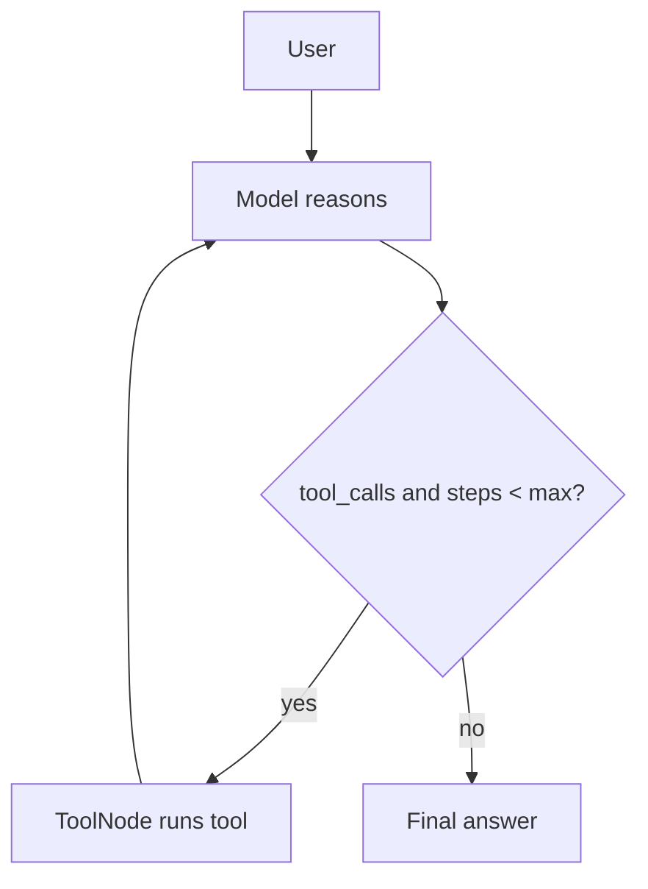

import TOCInline from '@theme/TOCInline';

# Building Agents

<TOCInline toc={toc} minHeadingLevel={2} maxHeadingLevel={2} />

:::tip[In this guide]
Turn the concepts into a working agent: define tools, bind them to the model,
run the reason→act loop with LangGraph, and add the guardrails that keep it
safe.
:::

## What You're Building

A tool-calling agent that can answer questions and, when useful, call your
existing [RAG retriever](../05-rag-fundamentals/02-retrieval-generation.mdx) as
a tool — with a hard step limit.

## Step 1 — Define Tools

Tools are plain functions with clear docstrings (the model reads them):

```python
from langchain_core.tools import tool

@tool
def search_docs(query: str) -> str:
    """Search the knowledge base for information relevant to the query."""
    chunks = retriever.retrieve(query, top_k=4)      # your RetrievalService
    return "\n\n".join(c["text"] for c in chunks)

@tool
def calculator(expression: str) -> str:
    """Evaluate a simple arithmetic expression, e.g. '3 * (4 + 2)'."""
    import ast, operator as op
    # safe eval omitted for brevity — validate in real code
    return str(eval(expression, {"__builtins__": {}}))

tools = [search_docs, calculator]
```

## Step 2 — Bind Tools to the Model

`bind_tools` gives the model the tool schemas so it can emit tool calls:

```python
from langchain_ollama import ChatOllama

llm = ChatOllama(model="llama3.2", temperature=0).bind_tools(tools)
```

:::note[Model support]
Tool-calling quality varies by model. Use a recent instruct model that
advertises tool/function calling (e.g. a current Llama or Mistral). Smaller
models may need more explicit prompting.
:::

## Step 3 — Build the Graph

```python
from typing import Annotated, TypedDict
from langgraph.graph import StateGraph, START, END
from langgraph.graph.message import add_messages
from langgraph.prebuilt import ToolNode

class State(TypedDict):
    messages: Annotated[list, add_messages]
    steps: int

def call_model(state: State) -> dict:
    return {"messages": [llm.invoke(state["messages"])], "steps": state.get("steps", 0) + 1}

def route(state: State) -> str:
    last = state["messages"][-1]
    if state.get("steps", 0) >= 6:          # guardrail: max steps
        return END
    return "tools" if getattr(last, "tool_calls", None) else END

builder = StateGraph(State)
builder.add_node("model", call_model)
builder.add_node("tools", ToolNode(tools))    # runs whatever tool the model chose
builder.add_edge(START, "model")
builder.add_conditional_edges("model", route, {"tools": "tools", END: END})
builder.add_edge("tools", "model")            # loop back to reason again

agent = builder.compile()
```

`ToolNode` is a prebuilt node that executes the tool calls in the last message
and returns their results as messages.

## Step 4 — Run It

```python
result = agent.invoke({
    "messages": [("system", "You are a helpful assistant. Use tools when needed."),
                 ("user", "What does our handbook say about refunds, and what is 15% of 240?")],
    "steps": 0,
})
print(result["messages"][-1].content)
```

The agent may call `search_docs` for the handbook and `calculator` for the math,
then combine both into one answer.

## Step 5 — Guardrails

Agents need limits (see [production guardrails](../09-production-patterns/02-logging-monitoring-guardrails.mdx)):

- **Max steps** (shown above) to prevent infinite loops.
- **Allowed tools only** — never expose destructive tools without checks.
- **Timeouts** per tool call.
- **Input/output validation** — validate tool arguments before executing.
- **Logging** — record each reasoning step and tool call with a request id.



## Prebuilt Shortcut

For a standard ReAct agent, LangGraph ships a prebuilt:

```python
from langgraph.prebuilt import create_react_agent

agent = create_react_agent(llm, tools)
```

Build it by hand first (to understand it), then use the prebuilt for speed.

## Common Mistakes

- Missing the `tools → model` edge, so the agent never uses tool results.
- No step cap → loops.
- Unsafe tools (`eval`, shell) without validation.
- Overloading one agent with 20 tools — accuracy drops; split responsibilities ([multi-agent](./04-multi-agent-systems.mdx)).

## Interview Questions

- Walk through building a tool-calling agent.
- What does `bind_tools` do? What does a tool node do?
- How do you prevent infinite loops?
- How do you make tool execution safe?

## Things to Remember

- Bind tools → model emits tool calls → tool node runs them → loop.
- Always cap steps and validate tool inputs.
- Start hand-built, then use `create_react_agent`.

## Mini Exercise

Wrap your RAG retriever as a `search_docs` tool and build the agent above. Ask a
question that needs both search and a calculation, and confirm it uses both
tools within the step limit.

## Done When

- [ ] You can define tools and bind them to a model.
- [ ] You can build the agent graph with a tool node and loop.
- [ ] Your agent respects a max-step guardrail.
