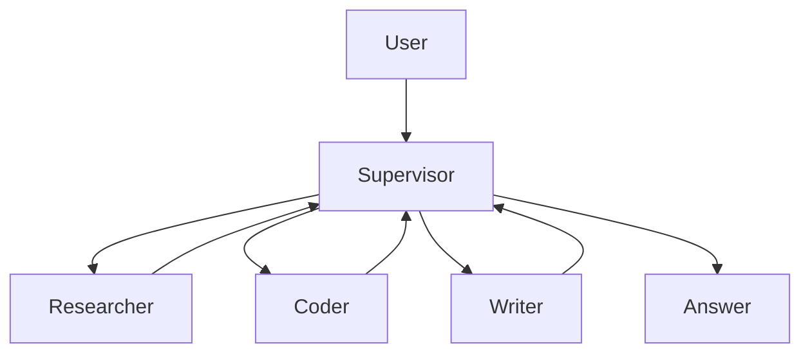
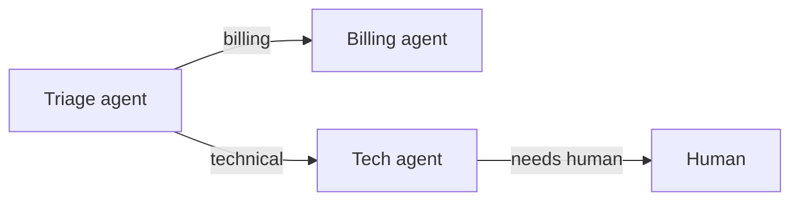

import TOCInline from '@theme/TOCInline';

# Multi-Agent Systems

<TOCInline toc={toc} minHeadingLevel={2} maxHeadingLevel={2} />

:::tip[In this guide]
When one agent isn't enough: coordinate several specialized agents with a
supervisor, hierarchy, or handoffs — and the honest tradeoffs of doing so.
:::

## What Is It?

A **multi-agent system** splits a problem across several agents, each with a
focused role and toolset, coordinated by an orchestration pattern.

## Why Does It Matter?

A single agent with 20 tools gets confused. Splitting into focused agents (a
"researcher", a "coder", a "reviewer") improves reliability — at the cost of
more complexity, latency, and tokens.

## Pattern 1 — Supervisor (Router)

A supervisor agent decides which worker handles each step and routes to it:



The supervisor is itself an agent whose "tools" are the worker agents. This is
the most common and controllable pattern.

## Pattern 2 — Hierarchical (Teams)

Supervisors of supervisors: a top orchestrator delegates to team leads, each
managing their own workers. Use only for genuinely large tasks — complexity
grows fast.

## Pattern 3 — Handoffs

One agent transfers control (and context) to another, like a support tier
escalating a ticket. Each agent decides whether to resolve or hand off.



## Sharing State

Agents coordinate through **shared state** (a common message list / scratchpad)
or **explicit messages** passed on handoff. In LangGraph, model each agent as a
node (or a subgraph) and route between them with conditional edges — the same
[graph mechanics](./02-langgraph-basics.mdx) you already know.

```python
# Sketch: supervisor routes to a worker node by name
def supervisor(state):
    decision = llm.invoke(route_prompt(state))   # -> "researcher" | "coder" | "FINISH"
    return {"next": decision}

builder.add_conditional_edges("supervisor", lambda s: s["next"],
                              {"researcher": "researcher", "coder": "coder", "FINISH": END})
```

## When Multi-Agent Helps (and When It Doesn't)

| Prefer multi-agent | Prefer single agent |
| --- | --- |
| Distinct skills/toolsets | One coherent task |
| Long tasks needing division | Latency/cost sensitive |
| Parallelizable subtasks | Simpler is safer |

Start with **one** well-scoped agent. Add agents only when a single one
measurably struggles — each extra agent multiplies latency, cost, and failure
modes.

## Common Mistakes

- Reaching for multi-agent before a single agent is even tuned.
- Unbounded chatter between agents (loops, exploding token cost).
- No global step/turn budget across the whole system.
- Losing context on handoff (the receiving agent lacks what it needs).

## Interview Questions

- What multi-agent patterns do you know? (supervisor, hierarchical, handoff)
- How do agents share state or hand off?
- What are the downsides of multi-agent systems?
- When would you keep it single-agent?

## Things to Remember

- Supervisor pattern is the default: one router, focused workers.
- Coordinate via shared state or explicit handoffs.
- More agents = more power **and** more cost/latency/failure — justify it.

## Mini Exercise

Design a two-worker supervisor system for "answer a question about our docs and
draft a summary email": define the supervisor, a `researcher` (uses RAG), and a
`writer`, plus the global step budget.

## Done When

- [ ] You can explain supervisor, hierarchical, and handoff patterns.
- [ ] You can describe how agents share state / hand off.
- [ ] You can justify single vs multi-agent for a task.
