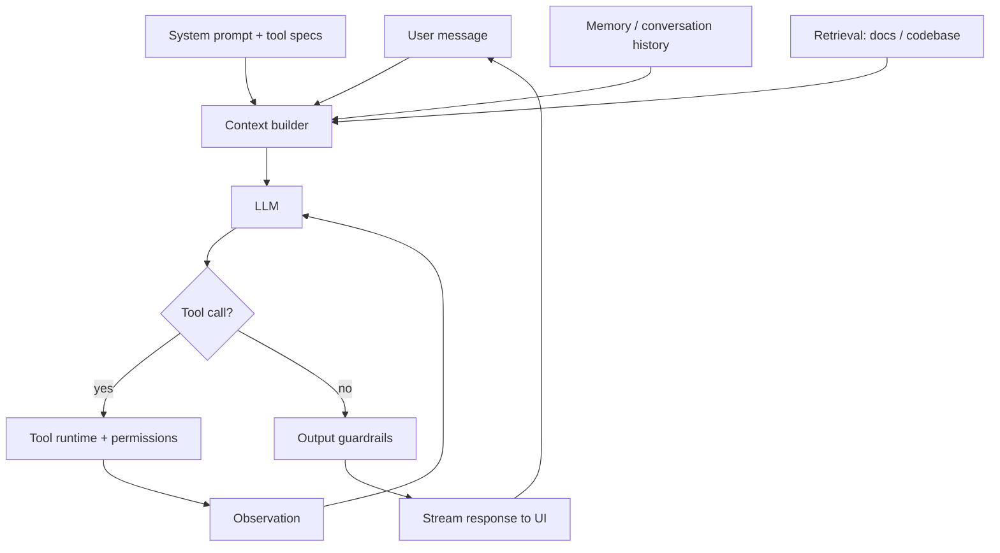
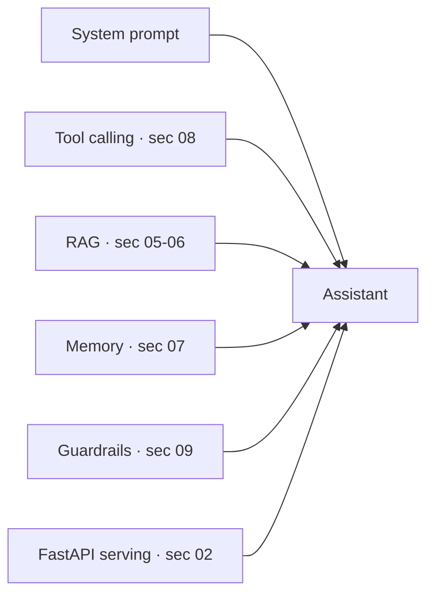

import TOCInline from '@theme/TOCInline';

# How Assistants Work

<TOCInline toc={toc} minHeadingLevel={2} maxHeadingLevel={2} />

:::tip[In this guide]
Reverse-engineer the common architecture behind modern AI assistants — Kiro,
Amazon Q Developer, ChatGPT, Gemini — so the mini assistant you build next
mirrors how real ones are structured.
:::

:::note[About this page]
Vendors don't publish their exact internals. This describes the **common,
well-understood architecture** these assistants share, based on public docs and
standard agent design — not proprietary details.
:::

## What Are They?

Products like **Kiro** and **Amazon Q Developer** (coding assistants), and
**ChatGPT** and **Gemini** (general assistants), are all **agents**: an LLM in a
tool-using loop, wrapped with context management, memory, retrieval, and
guardrails, exposed through a chat UI.

## Why Does It Matter?

Once you see the shared skeleton, "build an AI assistant" stops being magic. You
already know every box — you built most of them in earlier sections.

## The Shared Architecture

## The Building Blocks

### 1. System Prompt

A carefully engineered instruction set defining the assistant's role, rules,
tone, and how/when to use tools. This is the single biggest lever on behavior.

### 2. Tools

The assistant's hands. For **coding assistants** (Kiro, Amazon Q) these include:
read/list files, search the codebase, edit/apply diffs, run commands/tests, and
call external services. Each tool has a typed schema — exactly the
[tool-calling](./01-agents-fundamentals.mdx) you learned.

### 3. The Tool Loop

The same [ReAct loop](./03-building-agents.mdx): reason → call tool → observe →
repeat, until the task is done or a limit is hit. This is the heart of every
agentic assistant.

### 4. Context Management

The [context window](../00-prerequisites/02-core-ai-concepts.mdx) is finite, so
assistants constantly decide **what to include**: the system prompt, recent
turns, relevant files/snippets, and tool results. Techniques:

- **Retrieval** of only relevant code/docs (not the whole repo).
- **Summarization / compaction** of old turns.
- **Truncation** and prioritization when space runs out.

### 5. Memory

- **Short-term**: the current conversation (windowed or summarized).
- **Long-term**: persisted facts/preferences, often stored and retrieved via embeddings.

### 6. Retrieval (RAG over your data/code)

Coding assistants index your repository (embeddings + vector search, plus
symbol/keyword search) so the model sees the *relevant* files — this is
[RAG](../05-rag-fundamentals/index.mdx) applied to code, often with
[hybrid search + reranking](../06-advanced-rag/02-reranking-hybrid-search.mdx).

### 7. Permissions & Guardrails

Because these tools can change files or run commands, assistants add:

- **User confirmation** for risky actions (apply edit, run command).
- **Sandboxing / scoping** to the workspace.
- **Allow-lists** of tools and **step limits**.
- **Prompt-injection defenses** (treat file/web content as data, not instructions) — see [guardrails](../09-production-patterns/02-logging-monitoring-guardrails.mdx).

### 8. Streaming UI

Tokens (and tool-call status) stream to the interface so users see progress —
essential for perceived speed on long agent runs.

## Coding Assistants vs Chat Assistants

| | Coding (Kiro, Amazon Q) | Chat (ChatGPT, Gemini) |
| --- | --- | --- |
| Primary tools | Files, search, run, edit | Web, code interpreter, images |
| Retrieval over | Your codebase | General + uploaded files |
| Risk surface | Edits & commands → strong guardrails | Lower, but still injection-aware |
| Context | Repo-aware | Conversation + attachments |

The **skeleton is identical**; the tools, retrieval sources, and guardrails
differ.

## Mapping to What You've Built

You already have every piece. The next page assembles them into a mini
assistant.

## Common Mistakes

- Believing there's secret magic — it's an LLM + tools + context + guardrails.
- Dumping the whole repo into context instead of retrieving relevant parts.
- Skipping confirmation on destructive tools.
- Ignoring prompt injection from files/web the assistant reads.

## Interview Questions

- Sketch the architecture of a coding assistant like Kiro or Amazon Q.
- How does it decide which files to show the model? (retrieval + context management)
- How does the tool loop work, and how is it kept safe?
- How do coding assistants differ from chat assistants architecturally?
- How would you defend such an assistant against prompt injection?

## Things to Remember

- Assistant = system prompt + tools + tool loop + context/memory + retrieval + guardrails + streaming UI.
- Context management and retrieval decide quality; guardrails decide safety.
- Coding vs chat assistants share the skeleton; tools/retrieval differ.

## Mini Exercise

Take an assistant you use (Kiro, Q, ChatGPT, or Gemini) and map a single request
onto the architecture diagram: what system prompt role, which tools, what
retrieval, and which guardrails likely fired.

## Done When

- [ ] You can draw the shared assistant architecture from memory.
- [ ] You can explain context management and repo retrieval.
- [ ] You can list the guardrails a tool-using assistant needs.

Next: [build a coding assistant](./06-build-coding-assistant.mdx).
